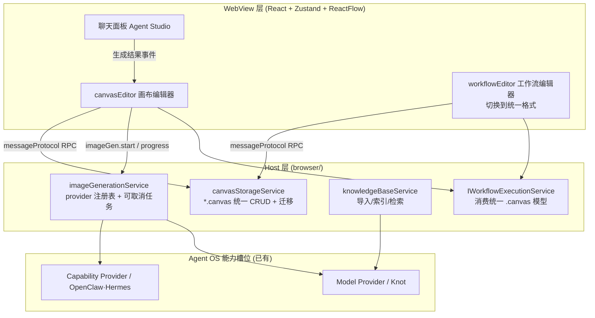

# Saros Canvas 画布功能设计方案（v2）

> 目标：在 sarosis-agents-client（VS Code 二开）中引入统一画布，支持**知识库、工作流、图像生成**三大能力。
> v2 关键决策：**工作流 `workflow.json` 统一改造为 `.canvas` 文件**（一种格式承载画布与工作流）；画布支持 **jaaz 式交互图像生成**（选区生成 / 对话驱动插入 / 图生图）。
> 参考对象：json-canvas（格式规范）、json-canvas-viewer（渲染库，MIT）、jaaz（产品形态，双许可禁二开仅参考思路）、本项目现有工作流面板。

---

## 0. 四方对比速览

| 维度 | json-canvas | json-canvas-viewer | jaaz | 本项目工作流面板 |
|---|---|---|---|---|
| 本质 | 开放文件格式（MIT） | .canvas 只读渲染库（MIT） | AI 无限画布应用（**双许可，禁二开**） | Agent 编排执行器 |
| 画布技术 | — | Canvas2D + DOM overlay 混合 | Excalidraw（主画布）+ ReactFlow（Agent Studio 原型） | ReactFlow |
| 节点类型 | text/file/link/group | 同 spec + 6 内容槽位自定义 | image/video/embeddable/文本 | start/end/prompt/agent/skill/tool/ifElse/switch/askUser/group |
| 边模型 | fromNode/toNode/side/label | 同 spec | Excalidraw 箭头 | from/to/**fromPort**/toPort/condition |
| 存储 | 单文件 `.canvas` | — | SQLite 存 Excalidraw JSON | `workflows/{id}/workflow.json` |
| 交互生成 | — | — | **选区/对话生成 → 画布自动插图**（本方案要对标的能力） | 无 |
| 可复用性 | **统一格式的底座** | 类型定义 + 几何算法 | **仅设计思路** | 执行引擎 + 存储模式 |

---

## 1. 总体架构（统一格式版）



**核心思想：工作流就是"节点可执行的画布"。** 一种 `.canvas` 文件格式、一个存储服务、一套几何模型；画布编辑器与工作流编辑器是同一份数据的两个入口（节点面板不同），`metadata.role` 区分用途。

---

## 2. 统一 `.canvas` 格式设计（核心变更）

### 2.1 文件结构（JSON Canvas 1.0 几何超集）

```jsonc
{
  "nodes": [
    // —— spec 标准节点 ——
    { "id": "n1", "type": "text",  "x": 80, "y": 100, "width": 260, "height": 120, "text": "# 目标\n生成赛博朋克猫", "color": "4" },
    { "id": "n2", "type": "file",  "x": 80, "y": 260, "width": 240, "height": 180, "file": "assets/ref-cat.png" },
    // —— Saros 执行节点（工作流）——
    { "id": "n3", "type": "prompt", "x": 420, "y": 100, "width": 280, "height": 140,
      "data": { "prompt": "{{n1.text}}", "agentConfig": { "providerId": "knot", "modelId": "" } } },
    { "id": "n4", "type": "ifElse", "x": 780, "y": 100, "width": 240, "height": 120,
      "data": { "branches": [{ "id": "b1", "label": "True", "condition": "..." }] } },
    // —— Saros 画布节点 ——
    { "id": "n5", "type": "imageGen", "x": 420, "y": 320, "width": 280, "height": 160,
      "data": { "prompt": "{{n1.text}}", "providerId": "volces-seedream", "size": "1024x1024",
                "referenceNodeIds": ["n2"], "status": "done" } },
    { "id": "n6", "type": "image", "x": 780, "y": 320, "width": 320, "height": 320,
      "data": { "assetPath": "assets/img-9f2.png", "sourceGenNodeId": "n5" } }
  ],
  "edges": [
    // spec 字段 + saros 端口扩展（第三方忽略，我方读写）
    { "id": "e1", "fromNode": "n1", "toNode": "n3", "fromSide": "right", "toSide": "left" },
    { "id": "e2", "fromNode": "n4", "toNode": "n5", "fromPort": "branch-0", "toPort": "input",
      "label": "score > 0.8", "condition": "score > 0.8" }
  ],
  "metadata": {
    "name": "赛博猫生成流",
    "role": "canvas",            // 'canvas' | 'workflow' —— 决定默认编辑器与节点面板
    "formatVersion": 2,
    "viewport": { "x": 0, "y": 0, "zoom": 1 }
  }
}
```

### 2.2 类型定义（`common/canvasStorage.ts`，取代 workflowStorage.ts 成为规范模型）

```typescript
export const enum SarosNodeType {
  // JSON Canvas spec 标准
  Text = 'text', File = 'file', Link = 'link', Group = 'group',
  // 工作流执行节点（原 WorkflowNodeType 平移）
  Start = 'start', End = 'end', Task = 'task', Prompt = 'prompt',
  Agent = 'agent', Skill = 'skill', Tool = 'tool',
  IfElse = 'ifElse', Switch = 'switch', AskUser = 'askUser',
  // 画布扩展节点
  Knowledge = 'kb', Workflow = 'workflow', ImageGen = 'imageGen', Image = 'image',
}

export interface SarosCanvasNode {
  id: string; type: SarosNodeType;           // type 为开放字符串，未知类型第三方跳过
  x: number; y: number; width?: number; height?: number; color?: string;
  // spec 节点载荷（直挂顶层，保证 Obsidian 可读）
  text?: string; file?: string; subpath?: string; url?: string;
  label?: string; background?: string; backgroundStyle?: 'cover'|'ratio'|'repeat';
  // Saros 扩展载荷（原 WorkflowNodeData 全量 + 画布节点字段）
  data?: SarosNodeData;                       // prompt/agentConfig/branches/options/kbId/workflowRef/assetPath/status...
}

export interface SarosCanvasEdge {
  id: string; fromNode: string; toNode: string;
  fromSide?: 'top'|'right'|'bottom'|'left'; toSide?: 'top'|'right'|'bottom'|'left';
  fromEnd?: 'none'|'arrow'; toEnd?: 'none'|'arrow';
  color?: string; label?: string;
  // Saros 执行扩展
  fromPort?: string; toPort?: string;         // branch-N / option-N / input
  condition?: string;
  kind?: 'layout' | 'dataflow';
}
```

**与现有模型的映射（零语义损失）**：
- `position.{x,y}` + `style.{width,height}` → 顶层 `x/y/width/height`
- `connections[].from/to` → `edges[].fromNode/toNode`；`fromPort/toPort/condition` 原样保留为扩展字段
- `WorkflowNodeData` → `node.data` 原样保留
- 节点 `name` → `label`

### 2.3 与 Obsidian 的互通行为

| 场景 | 行为 |
|---|---|
| Obsidian 打开 saros `.canvas` | 正常渲染 text/file/link/group 与边；**跳过未知节点类型**（执行节点不可见但布局文件不损坏） |
| saros 打开 Obsidian `.canvas` | 4 类节点 + 边完整导入（超集） |
| 第三方 round-trip | 扩展字段（data/fromPort/condition）**可能被剥离**——定位是"布局分享"，执行配置以我方读写为准，不做跨应用往返保证 |

### 2.4 执行引擎改造（`browser/workflowExecutionService.ts`）

- `executeWorkflow(workflowId)` → 改为经 `canvasStorageService` 加载 `.canvas`，校验 `metadata.role`（workflow 角色才允许 execute，canvas 角色走 M5 轻编排）。
- 邻接表构建字段替换：`conn.from/to/fromPort` → `edge.fromNode/toNode/fromPort`，其余执行逻辑（分支路由 `branch-N`、AskUser `option-N`、`{{nodeId.output}}` 两轮替换、cancel 链路）**完全不变**。
- 节点执行完后 `nodeState.output` 契约不变（对齐关键约定 13）。

### 2.5 存储与迁移（`browser/canvasStorageService.ts`）

```
{userDataPath}/canvases/{canvasId}/
  canvas.canvas        # 统一格式（工作流与画布同目录，role 区分）
  assets/              # 生成图片、导入附件
```

**迁移器（`browser/canvasMigrationService.ts`）**：
1. 启动时扫描旧 `workflows/{id}/workflow.json`；
2. 按 §2.2 映射转为统一模型，`metadata.role='workflow'`、`formatVersion=2`；
3. 写入 `canvases/{id}/canvas.canvas`，原文件重命名 `workflow.json.bak`（不删除，可回滚）；
4. 旧 RPC `workflow.*` 保留为兼容门面，内部转调 `canvas.*`，webview workflowEditor 无感切换；
5. `metadata.formatVersion` 驱动后续迁移链（对齐 jaaz migrations 思路，TS 重写）。

---

## 3. 交互式图像生成（对标 jaaz）

### 3.1 三种交互模式

**模式 A：选区魔法生成（画布内）**
```
选中节点（text / image / 任意组合）
  → 右键或工具栏「✨ 生成图像」
  → 自动创建 imageGen 节点：
      prompt ← 选中 text 节点内容拼接（可在弹出框编辑）
      referenceNodeIds ← 选中 image 节点
  → 调 IImageGenerationService.startGeneration(canvasId, nodeId, req)
  → 完成后在选区包围盒右侧插入 image 节点 + dataflow 边（sourceGenNodeId 溯源）
```

**模式 B：对话驱动插入（jaaz 主链路）**
```
聊天面板 agent 调用图像生成工具
  → Host imageGenerationService 执行任务
  → 完成事件 'canvas.imageGen.completed' 携带 {canvasId, assetPath, sourcePrompt}
  → 若存在活动画布 → webview 自动 addNode(Image)（位置算法见 §3.2）
  → 无活动画布 → 仅在聊天内展示（现状不变）
```

**模式 C：图生图**
```
选中单个 image 节点 → 「生成变体」→ 输入 prompt
  → 新建 imageGen 节点（referenceNodeIds=[选中节点]）
  → 结果图插入右侧，dataflow 边连接形成演化链
```

### 3.2 结果落位算法（借鉴 jaaz `LastImagePosition`，自研）

```typescript
// canvasEditor/store.ts
function nextImagePosition(state): {x, y} {
  if (state.lastImagePos)                       // 同画布连续生成：向右排开
    return { x: state.lastImagePos.x + IMG_W + GAP, y: state.lastImagePos.y };
  if (state.selectionBounds)                    // 有选区：贴选区右缘
    return { x: state.selectionBounds.maxX + GAP, y: state.selectionBounds.minY };
  return viewportCenter(state.viewport);        // 兜底：视口中心
}
```

### 3.3 服务层（`browser/imageGenerationService.ts`）

```typescript
export interface IImageGenProvider {
  readonly id: string;              // 'openai-gpt-image' | 'volces-seedream' | 'comfyui-local'
  readonly displayName: string;
  generate(req: IImageGenRequest, onProgress: (p: IGenProgress) => void,
           token: CancellationToken): Promise<IImageGenResult>;
}

export interface IImageGenerationService {
  registerProvider(p: IImageGenProvider): IDisposable;   // 挂 Agent OS Capability Provider 槽位
  listProviders(): IImageGenProviderMeta[];
  startGeneration(canvasId: string, nodeId: string, req: IImageGenRequest): Promise<string /*taskId*/>;
  cancelGeneration(taskId: string): Promise<void>;
  readonly onDidProgress: Event<IGenProgressEvent>;      // {taskId, canvasId, nodeId, status, assetPath?}
}
```

硬性要求（对齐项目约定）：
- 任务注册 `Map<taskId, CancellationTokenSource>` + try/finally + cancel 区分（约定 5）；硬性 timeout cap（约定 9）。
- 图片落盘 `canvases/{id}/assets/`，节点只存**相对路径**（多工作区隔离，v2.2）。
- imageGen 节点执行完必须写 `nodeState.output = assetPath`（约定 13），供下游 `{{nodeId.output}}` 引用。
- 首批 provider：`openai-gpt-image`、`volces-seedream`；`comfyui-local` 放 M6。

---

## 4. 知识库与工作流联动

### 4.1 知识库（`browser/knowledgeBaseService.ts`，jaaz 缺失需自建）

```
{userDataPath}/knowledge/{kbId}/
  meta.json            # {id, name, embeddingModel}
  docs/{docId}.md      # 导入统一转 markdown/纯文本
  index.sqlite         # FTS5 全文索引（M6 加 sqlite-vec 向量表）
```

- `kb` 节点 `data.kbId` 绑定知识库 + `queryHint`；检索结果可拖为画布子节点。
- **RAG 注入**：kb 节点经 dataflow 边连到 prompt/agent/imageGen 节点时，执行前检索拼接文本写入 `nodeState.output`，下游用 `{{nodeId.output}}` 引用（复用约定 6 两轮替换）。
- 分期：M4 上 FTS5 全文检索；M6 上向量（embedding 走 Model Provider 槽位）。

### 4.2 工作流联动（统一格式后天然成立）

- **嵌套引用**：`workflow` 节点 `data.workflowRef = 另一个 .canvas 的 id`（role=workflow）——对齐 Obsidian 嵌套 canvas，实现"画布套工作流"。
- **触发执行**：节点按钮 → `IWorkflowExecutionService.executeWorkflow(workflowRef)`，状态回显节点（订阅 `onDidExecutionTrace`）。
- **轻编排（M5 可选）**：画布内多个可执行节点用 dataflow 边组成 DAG，`canvasExecutionService` 拓扑排序驱动，节点内部执行委托专项服务。

---

## 5. WebView 层改造

```
webview/src/features/
  canvasEditor/                 # 新建：画布编辑器
    CanvasEditorPanel.tsx / CanvasCanvas.tsx / store.ts
    nodes/ (Text File Link Group Knowledge Workflow ImageGen Image)
    canvasJsonCanvasAdapter.ts  # 与原生 .canvas 互转（纯函数）
  workflowEditor/               # 改造：存储切换到统一 .canvas 格式
    store.ts                    # loadWorkflow/toWorkflowData 字段映射改为新模型
```

- **类型镜像**：`webview/src/types/canvasStorage.ts` 镜像宿主模型，文件头注明"以宿主 `common/canvasStorage.ts` 为准"（吸取 workflowStorage 双镜像漂移教训）。
- **RPC 消息**：`canvas.list/load/save/delete/import/export/imageGen.start/imageGen.cancel/kb.*`；旧 `workflow.*` 保留门面。
- **性能**：ReactFlow `onlyRenderVisibleElements` + 节点 memo + Image 节点缩略图。
- **原生 .canvas 只读预览**（可选）：嵌 `@json-canvas-viewer/react`（MIT、可 tree-shake、React 组件可挂节点）。

---

## 6. 分期落地路线（v2）

| 阶段 | 内容 | 验收标准 | 预估 |
|---|---|---|---|
| **M1 统一格式+迁移** | canvasStorage.ts 规范模型、canvasStorageService、迁移器（workflow.json→.canvas）、执行引擎改消费统一模型、旧 RPC 门面 | 旧工作流自动迁移且可执行；新保存均为 .canvas | 2 周 |
| **M2 画布编辑器基座** | canvasEditor + 4 类 spec 节点 + CRUD + 自动保存 + 原生 .canvas 导入导出 | 与 Obsidian 互开不丢布局 | 1.5 周 |
| **M3 交互式图像生成** | IImageGenProvider + openai/volces provider + imageGen/image 节点 + 三种交互模式 + 落位算法 | 选区生成/对话插图/图生图全通，可取消 | 2 周 |
| **M4 知识库** | KB 服务（FTS5）+ kb 节点 + RAG 注入执行上下文 | 导入文档可检索，注入 `{{nodeId.output}}` 生效 | 1.5 周 |
| **M5 工作流嵌套+轻编排** | workflow 节点嵌套执行 + 状态回显 + dataflow DAG 拓扑执行 | 画布内触发子工作流并看状态 | 1.5 周 |
| **M6 增强（可选）** | sqlite-vec 向量 RAG、ComfyUI 本地 provider、视频生成 | — | 按需 |

---

## 7. 风险与注意事项

1. **jaaz 许可证红线**：双许可禁止衍生作品与复制代码——仅借鉴 provider 注册表/任务回传/落位算法三个**思路**，全部 TS 重写，UI 不复刻。
2. **统一格式回归风险**：M1 迁移器必须保留 `.bak` 备份 + 双跑校验（迁移后新旧模型执行结果一致）才可切流。
3. **扩展字段第三方剥离**：saros 扩展字段（data/fromPort/condition）不保证跨应用往返；对外分享定位是"布局可见"，执行以我方为准。
4. **类型镜像漂移**：canvasStorage 双镜像以宿主 `common/` 为准，评审 checklist 固化。
5. **取消链路**：生成任务对齐约定 5（注册流+finally+cancel 区分）与约定 9（硬性 timeout）。
6. **类型枚举冲突**：`group` 同时是 spec 节点与工作流旧节点类型，语义一致（容器），合并无碍；`parentId` 在统一格式中废弃，改为坐标包含（与 spec 一致），迁移时按几何重算归属。

---

## 附：关键参考文件

- 本项目现有模型：`src/vs/sessions/contrib/agentStudio/common/workflowStorage.ts`（将被 canvasStorage.ts 取代为规范模型）
- 执行引擎：`src/vs/sessions/contrib/agentStudio/browser/workflowExecutionService.ts`
- 持久化模式：`src/vs/sessions/contrib/agentStudio/browser/workflowStorageService.ts`
- webview 编辑器模板：`src/vs/sessions/contrib/agentStudio/webview/src/features/workflowEditor/`
- json-canvas-viewer 类型与几何：`G:\CustomWorkspaces\AIProjects\json-canvas-viewer\packages\shared\src\index.ts`、`packages\core\src\kernel\Renderer.ts`
- jaaz 设计参考（**仅思路**）：`server/tools/image_providers/`、`server/tools/utils/image_canvas_utils.py`（结果插图链路）、`server/services/migrations/`
