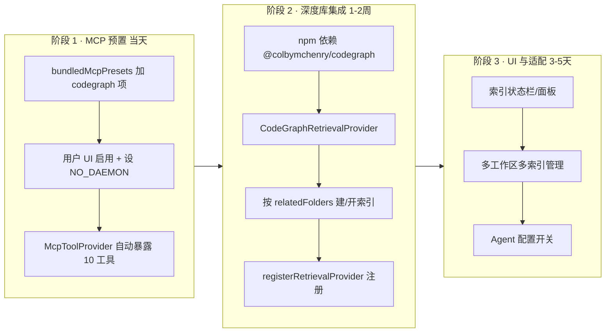
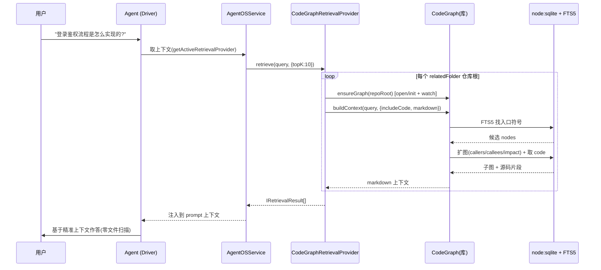

# CodeGraph 接入设计方案 v2

> 本文档基于对 `G:\CustomWorkspaces\AIProjects\codegraph`（`@colbymchenry/codegraph` v0.9.8）**真实源码**的核查，
> 以及对本项目（`sarosis-agents-client`）Agent Studio 集成点的实测编写。
>
> **它取代了旧版 `doc/CODEGRAPH_INTEGRATION_ANALYSIS.md`**（2026-05-26）。旧版基于 `better-sqlite3` 假设，
> 而 CodeGraph 在 0.9.x 已改用 Node 内置 `node:sqlite`，且引入了 daemon/proxy 常驻架构——这两点直接改变了集成结论。
> 文末「附录 C」列出与旧版的逐条差异。
>
> - 编写日期：2026-06-02
> - 适用版本：CodeGraph v0.9.8 / 本项目 Electron 39.8.7（内嵌 Node 22.x）

---

## 1. 目标与结论速览

### 1.1 我们要解决什么

Agent Studio 的 Agent 在探索代码库时，会反复用 `read_file` / `grep_search` / `list_dir` 扫描文件，
消耗大量 token 和工具调用轮次。CodeGraph 用 **预建的语义知识图谱**（符号、调用关系、影响范围）
替代盲目扫描，官方基准在 VS Code 这种万级文件仓库上达到 **80% 更少工具调用、70% 更少 token、33% 更省成本**。

把它接入本项目，能让 Agent 在「这个功能在哪实现 / 改这个函数会影响谁 / 调用链是怎样」这类问题上
直接查图谱，而不是烧 token 读文件。

### 1.2 一句话结论

> **采用「混合方案」：阶段 1 用 MCP 预置（零核心改动、当天可用），阶段 2 落地 `CodeGraphRetrievalProvider`
> 深度库集成（最佳性能与体验），阶段 3 补 UI 与多工作区适配。**

与旧版最大的不同：**深度库集成的最大障碍（原生 SQLite 模块）已消失**——CodeGraph 现在用 Node 内置
`node:sqlite`，而本项目 Electron 39 内嵌的 Node 已是 22.x，天然满足 ≥22.5 的要求。因此阶段 2 的优先级应**上调**。

---

## 2. CodeGraph 真实架构（核查版）

### 2.1 分层数据流

```
源文件
  │
  ▼
ExtractionOrchestrator  ── web-tree-sitter (WASM, 纯跨平台, 无原生编译)
  │   解析 AST → 符号(nodes) + 关系(edges)
  ▼
node:sqlite (DatabaseSync)  ── nodes / edges / files / nodes_fts(FTS5) / unresolved_refs
  │
  ▼
ReferenceResolver  ── 导入解析、名称匹配、框架路由(React/Express/Laravel/NestJS/Rails…)
  │
  ▼
GraphQueryManager / GraphTraverser  ── callers/callees/impact/trace/path
  │
  ▼
ContextBuilder  ── buildContext(): FTS 找入口 → 扩图 → 取代码 → markdown/json
  │
  ├──► 公共库 API（CodeGraph 类）          —— 供「深度库集成」
  └──► MCP Server（stdio + daemon/proxy）   —— 供「MCP 集成」
```

### 2.2 关键事实（决定集成方案的三点）⭐

| 维度 | 真实实现 | 对集成的影响 |
|------|----------|--------------|
| **SQLite 后端** | Node 内置 `node:sqlite`（`DatabaseSync`），**无 better-sqlite3、无 wasm fallback**。失败直接抛错要求 Node ≥22.5。后端已抽象为 `SqliteDatabase` 接口（`src/db/sqlite-adapter.ts`），替换只需新增一个 adapter 类。 | 本项目 Electron 39 → Node 22.x，**天然满足**。深度库集成的最大风险点消失。仅需确认 Electron 主/工具进程未禁用该实验模块。 |
| **解析器** | `web-tree-sitter@0.25.3` WASM + `tree-sitter-wasms@0.1.11`。约 21 种语言 WASM 语法 + 自定义 extractor（vue/svelte/liquid 等）。**懒加载**，只加载项目中实际出现的语言。 | 纯 WASM、无原生编译，Electron 友好。但需把 `*.wasm` 资产正确复制到产物目录，并注意 V8 `--liftoff-only` flag（见 §6.2）。 |
| **MCP 运行架构** | `codegraph serve --mcp` 走 **stdio**，但默认会拉起**分离的 daemon 后台进程** + **proxy 薄管道**（多 host 共享一个图谱/watcher/DB 句柄）。可用 `CODEGRAPH_NO_DAEMON=1` 强制 direct（一进程一客户端）。 | MCP 集成时**务必设 `CODEGRAPH_NO_DAEMON=1`**，避免在 Electron 进程外游离一个分离后台进程，行为更可控、便于回收。 |

### 2.3 公共库 API（`src/index.ts`，按真实签名）

默认导出 `CodeGraph` 类。集成时会用到的核心方法：

```ts
// 生命周期
static init(projectRoot, { index?, onProgress? }): Promise<CodeGraph>   // 创建 .codegraph/ + DB
static open(projectRoot, { sync?, readOnly? }): Promise<CodeGraph>      // 打开已有索引
static isInitialized(projectRoot): boolean

// 索引 / 同步
indexAll({ onProgress?, signal?, verbose? }): Promise<IndexResult>      // 全量（进程内 Mutex + 跨进程 FileLock）
indexFiles(filePaths[]): Promise<IndexResult>
sync({ onProgress? }): Promise<SyncResult>                              // 增量
isIndexing(): boolean

// 文件监听（chokidar，原生 OS 事件 + debounce）
watch(opts?): boolean ; unwatch(): void ; isWatching(): boolean

// 图查询（核心能力）
searchNodes(query, options?): SearchResult[]            // 走 FTS5
getNode(id) ; getNodesInFile(path) ; getNodesByKind(kind)
getCallers(nodeId, maxDepth=1) ; getCallees(nodeId, maxDepth=1)
getImpactRadius(nodeId, maxDepth=3): Subgraph
traverse(startId, options?) ; findPath(fromId, toId, edgeKinds?)
findRelevantContext(query, options?): Promise<Subgraph>

// 上下文构建（最有价值的一个）
buildContext(input, options?): Promise<TaskContext | string>  // FTS→扩图→取码→markdown/json
getCode(nodeId): Promise<string | null>

// 管理
getStats() ; getBackend() // 'node-sqlite'
clear() ; close() ; uninitialize() // 删 .codegraph/
```

> ⚠️ 命名校正：旧文档写的 `callers()/callees()` 实际是 `getCallers()/getCallees()`；`sync()` 存在且为增量同步。

### 2.4 MCP 工具清单（`src/mcp/tools.ts`，共 10 个）

| 工具名 | 作用 | 何时用 |
|--------|------|--------|
| `codegraph_context` | **首选**。一次返回入口点+相关符号+关键代码 | 架构/"X 如何工作"/bug 定位 |
| `codegraph_search` | 按名快速符号搜索（仅位置，无代码） | 找符号在哪 |
| `codegraph_callers` | 谁调用了 `<symbol>` | 反向追踪 |
| `codegraph_callees` | `<symbol>` 调用了谁 | 正向追踪 |
| `codegraph_impact` | 改 `<symbol>` 会波及哪些符号 | 重构前评估 |
| `codegraph_node` | 单符号位置/签名/调用链（`includeCode=true` 含原文） | 看某个符号细节 |
| `codegraph_explore` | 一次返回多个相关符号按文件分组的源码（带预算上限） | 批量取码 |
| `codegraph_trace` | 两符号间调用路径，内联每跳 body | 跟踪一条链路 |
| `codegraph_files` | 索引文件树 + 语言/符号计数 | 看仓库结构 |
| `codegraph_status` | 索引健康检查（files/nodes/edges） | 确认索引就绪 |

> 工具输出上限 `MAX_OUTPUT_LENGTH=15000` 字符，输入 `MAX_INPUT_LENGTH=10000`。

### 2.5 CLI 子命令

`init` / `index` / `sync` / `status` / `query` / `files` / `context` / `callers` / `callees` /
`impact` / `affected` / `serve --mcp` / `uninit` / `unlock` / `install` / `uninstall`。

安装器向各 agent 写入的统一 MCP 配置形状（`src/installer/shared.ts`）：

```jsonc
{ "type": "stdio", "command": "codegraph", "args": ["serve", "--mcp"] }
```

---

## 3. 本项目集成点盘点（实测接口）

### 3.1 MCP 桥接已就绪 —— `McpToolProvider`

文件：`src/vs/sessions/contrib/agentStudio/browser/providers/tool/mcpToolProvider.ts`

- 观察上游 `IMcpService.servers`，把每台 server 的工具平铺成 `<serverPrefix>__<toolName>`（分隔符 `__`，`SEPARATOR` 常量）。
- 当 server 启动并暴露工具，自动建立路由表；`executeTool` 透明转发到对应 `IMcpServer` 的 tool 调用。
- **结论：只要把 CodeGraph 注册为 MCP server，工具会自动以 `codegraph__codegraph_context` 等形式出现在 Agent 工具列表，无需改 Provider 代码。**

### 3.2 MCP 预置入口 —— `bundledMcpPresets.ts`

文件：`src/vs/sessions/contrib/agentStudio/common/bundled-tools/bundledMcpPresets.ts`

`IMcpServerPreset` 字段：`id / name / description / transportType('stdio'|'http') / command? / args? / url? / envKeys? / headers? / icon?`。
`BUNDLED_MCP_PRESETS` 数组已有 filesystem/github/sqlite 等 16 个预置。**加 CodeGraph 只需 append 一项。**

### 3.3 Retrieval 槽位（深度集成落点）—— `IRetrievalProvider`

文件：`src/vs/sessions/contrib/agentStudio/common/providers.ts:718`

```ts
export interface IRetrievalProvider {
  readonly id: string;
  readonly name: string;
  retrieve(query: string, options?: IRetrievalOptions): Promise<IRetrievalResult[]>;
  indexDocument(doc: IDocumentToIndex): Promise<void>;
}
export interface IRetrievalOptions { topK?: number; scoreThreshold?: number; filters?: Record<string, unknown>; }
export interface IRetrievalResult { documentId: string; content: string; score: number; metadata?: Record<string, unknown>; }
export interface IDocumentToIndex { id: string; content: string; metadata?: Record<string, unknown>; }
```

注册入口（`agentOSService.ts:180`）：

```ts
registerRetrievalProvider(provider: IRetrievalProvider, priority = 0): IDisposable
// 取用：getActiveRetrievalProvider(): IRetrievalProvider | undefined
```

> ✅ 当前没有任何已实现的 `RetrievalProvider`，CodeGraph 正好填补这个空槽，且不与现有实现冲突。

### 3.4 ⚠️ 多工作区根路径约定（本项目特有，必须遵守）

`Workspace` 有两类根（`sessions/common/agentStudioTypes.ts`）：

- `workspace.path` → **home / 元数据目录**（存 `.sarosisworkspace`、worktrees、artifacts），**不含代码**
- `workspace.relatedFolders[].path` → **真正的代码仓库**（git root，源码所在）

> **任何「对代码做索引 / grep / 图谱构建」的功能，根路径必须取 `relatedFolders[].path`，绝不能用 `workspace.path`。**
> CodeGraph 的 `.codegraph/` 索引目录应建在每个 `relatedFolder` 仓库根下（多仓库 = 多个独立索引）。这是阶段 2 实现里最容易踩的坑。

---

## 4. 三种方案对比

| 维度 | 方案 A：MCP 预置 | 方案 B：库 → RetrievalProvider | 方案 C：库 → ToolProvider |
|------|------------------|-------------------------------|---------------------------|
| 改动量 | 极小（+1 预置项） | 中（新建 Provider + 注册 + 路径适配） | 中大（自实现 10 个工具 schema） |
| 性能 | 有 IPC/序列化开销 | 进程内直调，最快 | 进程内直调 |
| 用户操作 | 需手动在 UI 添加 MCP + 装 codegraph CLI | 自动，零配置 | 自动 |
| 上下文注入 | Agent 主动调工具 | **可自动注入**（RAG 钩子） | Agent 主动调工具 |
| 风险 | daemon 进程游离（可用 env 规避）、需外部 CLI | 需确认 Electron `node:sqlite`、WASM 资产、多工作区路径 | 同 B + 工具语义需自己维护 |
| 上手速度 | 当天 | 1–2 周 | 1–2 周 |

**取舍**：A 先交付价值、兜底；B 是终态最佳（填补空 Retrieval 槽 + 可自动注入上下文）；
C 仅在「希望 Agent 像调内置工具一样精细控制」时才需要，初期不做。

---

## 5. 推荐方案：混合分阶段



---

## 6. 详细实施

### 6.1 阶段 1 — MCP 预置（代码对齐真实接口）

**改 1 个文件**：`bundledMcpPresets.ts`，向 `BUNDLED_MCP_PRESETS` 追加：

```ts
{
  id: "codegraph",
  name: "CodeGraph",
  description: "Semantic code intelligence — knowledge graph for code search, call graph & impact analysis. 100% local.",
  transportType: "stdio",
  command: "codegraph",
  args: ["serve", "--mcp"],
  // 关键：禁用分离 daemon，走 direct stdio，避免 Electron 进程外游离后台进程
  envKeys: ["CODEGRAPH_NO_DAEMON"],
},
```

> 若预置 UI 支持默认 env 值，应默认注入 `CODEGRAPH_NO_DAEMON=1`；否则在文档里提示用户设置该环境变量。

**前置条件**（用户侧或随包分发）：
- 安装 CLI：`npm i -g @colbymchenry/codegraph` 或 `npx @colbymchenry/codegraph`
- 在目标代码仓库根（即 `relatedFolders[].path`）执行一次 `codegraph init`（首次建索引）

**验证**：启用后，Agent 工具列表应出现 `codegraph__codegraph_context`、`codegraph__codegraph_search` 等 10 个工具；
调用 `codegraph__codegraph_status` 返回 files/nodes/edges 即成功。

### 6.2 阶段 2 — `CodeGraphRetrievalProvider`（深度库集成）

新建：`src/vs/sessions/contrib/agentStudio/browser/providers/retrieval/codeGraphRetrievalProvider.ts`

```ts
/*---------------------------------------------------------------------------------------------
 *  CodeGraphRetrievalProvider —— 把 @colbymchenry/codegraph 公共库桥接为 IRetrievalProvider。
 *  关键约定：索引根取自当前 workspace 的 relatedFolders[].path（代码仓库根），而非 workspace.path。
 *--------------------------------------------------------------------------------------------*/
import { Disposable } from '../../../../../../base/common/lifecycle.js';
import { ILogService } from '../../../../../../platform/log/common/log.js';
import {
  IRetrievalProvider, IRetrievalOptions, IRetrievalResult, IDocumentToIndex,
} from '../../../common/providers.js';

// 动态 import，避免在不支持 node:sqlite 的环境里 eager 加载导致整个模块崩溃
type CodeGraphMod = typeof import('@colbymchenry/codegraph');
type CodeGraphInstance = Awaited<ReturnType<CodeGraphMod['default']['open']>>;

export class CodeGraphRetrievalProvider extends Disposable implements IRetrievalProvider {
  readonly id = 'codegraph';
  readonly name = 'CodeGraph';

  // 多仓库：每个 repo root 一个 CodeGraph 实例（对应一个 .codegraph/ 索引）
  private readonly _graphs = new Map<string /*repoRoot*/, CodeGraphInstance>();
  private _mod: CodeGraphMod | null = null;

  constructor(
    private readonly _getRepoRoots: () => string[],   // 注入：返回当前 workspace.relatedFolders[].path
    @ILogService private readonly _log: ILogService,
  ) { super(); }

  async retrieve(query: string, options?: IRetrievalOptions): Promise<IRetrievalResult[]> {
    const results: IRetrievalResult[] = [];
    for (const root of this._getRepoRoots()) {
      try {
        const cg = await this._ensureGraph(root);
        // buildContext 是最有价值的入口：FTS 找入口 → 扩图 → 取代码 → markdown
        const ctx = await cg.buildContext(query, {
          maxNodes: options?.topK ?? 10,
          includeCode: true,
          format: 'markdown',
        });
        results.push({
          documentId: `codegraph:${root}`,
          content: typeof ctx === 'string' ? ctx : JSON.stringify(ctx),
          score: 1.0,
          metadata: { source: 'codegraph', repoRoot: root, query },
        });
      } catch (err) {
        this._log.warn(`[CodeGraph] retrieve failed for ${root}:`, err);
      }
    }
    return results;
  }

  async indexDocument(_doc: IDocumentToIndex): Promise<void> {
    // CodeGraph 通过 watch() 自动增量索引；此处对每个 repo 触发一次 sync 兜底
    for (const root of this._getRepoRoots()) {
      const cg = this._graphs.get(root);
      if (cg) { try { await cg.sync(); } catch (e) { this._log.warn('[CodeGraph] sync failed', e); } }
    }
  }

  private async _ensureGraph(repoRoot: string): Promise<CodeGraphInstance> {
    const existing = this._graphs.get(repoRoot);
    if (existing) { return existing; }

    if (!this._mod) { this._mod = await import('@colbymchenry/codegraph'); }
    const CodeGraph = this._mod.default;

    let cg: CodeGraphInstance;
    if (CodeGraph.isInitialized(repoRoot)) {
      cg = await CodeGraph.open(repoRoot, { sync: true });
    } else {
      cg = await CodeGraph.init(repoRoot, {
        index: true,
        onProgress: (p: any) => this._log.info(`[CodeGraph] index ${repoRoot}: ${p.phase} ${p.current}/${p.total}`),
      });
    }
    cg.watch();                       // 原生 OS 事件增量同步
    this._graphs.set(repoRoot, cg);
    this._register({ dispose: () => { try { cg.unwatch(); cg.close(); } catch { /* noop */ } } });
    return cg;
  }
}
```

**注册**（在 agentStudio 的 contribution / AgentOS 初始化处）：

```ts
const provider = instantiationService.createInstance(
  CodeGraphRetrievalProvider,
  () => agentStudioService.getActiveWorkspace()?.relatedFolders.map(f => f.path) ?? [], // ⚠️ 取代码仓库根
);
this._register(agentOSService.registerRetrievalProvider(provider, /*priority*/ 100));
```

**依赖**（`package.json`）：

```jsonc
"dependencies": { "@colbymchenry/codegraph": "^0.9.8" }
```

**WASM 资产**：确保打包时把 `node_modules/@colbymchenry/codegraph/dist/extraction/wasm/*.wasm`
与 `tree-sitter-wasms/out/*.wasm` 复制进产物（参考 codegraph 自身 `copy-assets` 脚本），否则解析会失败。

### 6.3 阶段 3 — UI 与多工作区适配

- **索引状态栏**：显示当前激活工作区各 `relatedFolder` 的索引状态（未索引/索引中/已就绪 + files/nodes/edges）。
- **管理面板**：每个仓库一行，提供「重建索引 / 增量同步 / 清除索引」（映射 `indexAll` / `sync` / `clear`）。
- **多工作区联动**：`setActiveWorkspace` 切换时，`CodeGraphRetrievalProvider` 的 `_getRepoRoots()` 自动指向新工作区的 `relatedFolders`，无需重启 Provider。
- **Agent 配置开关**：在 Agent 编辑器加「Code Intelligence」开关，决定是否启用 Retrieval 自动注入。

---

## 7. 关键技术风险与决策

| 风险 | 等级 | 决策 / 缓解 |
|------|------|-------------|
| Electron 主/工具进程禁用 `node:sqlite` 实验模块 | 中 | 先在目标进程做一次 `require('node:sqlite')` 探针；若不可用，给 `sqlite-adapter.ts` 写一个 better-sqlite3 adapter（接口已抽象，改动局限单文件）。**库集成代码全程动态 import，探针失败则自动降级到方案 A（MCP）**。 |
| WASM 资产未打进产物 | 中 | 构建脚本显式复制 `dist/extraction/wasm/*.wasm` + `tree-sitter-wasms/out/*.wasm`；启动自检。 |
| V8 编译大 WASM 语法 OOM | 低 | CodeGraph CLI 会重 exec 带 `--liftoff-only`；库内嵌时若遇到，在 Electron 启动参数补 `--liftoff-only`。 |
| MCP daemon 进程游离 | 中 | 方案 A 统一设 `CODEGRAPH_NO_DAEMON=1` 走 direct stdio。 |
| 多工作区路径取错（用了 `workspace.path`） | 高 | 强制取 `relatedFolders[].path`（§3.4）；code review 检查点。 |
| 大仓库首次索引慢 | 中 | 后台索引 + 进度上报；`open({sync:true})` 复用已有索引；增量 `watch()`。 |
| MCP 与库集成同时启用冲突 | 低 | 库集成（RetrievalProvider）优先；启用库集成时在 UI 提示可关闭 MCP 预置避免重复。 |

---

## 8. 端到端时序（库集成 + 自动注入）



---

## 9. 验收与测试

**阶段 1**
- [ ] 预置出现在 MCP 添加列表；启用后 `codegraph__*` 10 工具进入 Agent 工具表
- [ ] `codegraph__codegraph_status` 返回正确 files/nodes/edges
- [ ] 设 `CODEGRAPH_NO_DAEMON=1` 后无游离后台进程

**阶段 2**
- [ ] `node:sqlite` 探针在 Electron 目标进程返回可用
- [ ] WASM 资产正确加载，多语言解析无报错
- [ ] `CodeGraphRetrievalProvider.retrieve()` 对多 `relatedFolder` 各返回一条上下文
- [ ] 索引建在每个 repo root 的 `.codegraph/`，**未**误建在 `workspace.path`
- [ ] 单测：retrieve / indexDocument / 多仓库聚合 / 降级路径

**阶段 3**
- [ ] 状态栏与面板正确反映各仓库索引状态
- [ ] `setActiveWorkspace` 切换后 repoRoots 自动跟随
- [ ] 重建/同步/清除按钮映射正确

---

## 附录 A — 需新增/修改的文件清单

| 阶段 | 文件 | 操作 |
|------|------|------|
| 1 | `src/vs/sessions/contrib/agentStudio/common/bundled-tools/bundledMcpPresets.ts` | 追加 codegraph 预置 |
| 2 | `.../browser/providers/retrieval/codeGraphRetrievalProvider.ts` | 新建 |
| 2 | `.../browser/agentStudio.contribution.ts`（或 AgentOS 初始化处） | 注册 Provider |
| 2 | `package.json` | 加依赖 + WASM 复制脚本 |
| 3 | `.../browser/views/codeGraphStatusView.ts` | 新建（状态栏） |
| 3 | `.../browser/views/codeGraphPanel.ts` | 新建（管理面板） |

## 附录 B — CodeGraph 关键源码索引

- 库入口：`src/index.ts`（导出 `CodeGraph` 类 + `MCPServer`）
- DB 适配：`src/db/sqlite-adapter.ts`（`node:sqlite` 单后端 + `SqliteDatabase` 抽象）
- Schema：`src/db/schema.sql`（nodes/edges/files/nodes_fts/unresolved_refs）
- 解析：`src/extraction/grammars.ts`（web-tree-sitter WASM 加载）
- MCP：`src/mcp/index.ts`(server) / `tools.ts`(10 工具) / `transport.ts`(stdio+socket) / `daemon.ts` / `proxy.ts`
- CLI：`src/bin/codegraph.ts`
- 安装器：`src/installer/shared.ts` + `targets/*.ts`

## 附录 C — 与旧版（CODEGRAPH_INTEGRATION_ANALYSIS.md）的差异

| 项 | 旧版（2026-05-26） | 本版（核查后） |
|----|--------------------|----------------|
| SQLite 后端 | 假设 `better-sqlite3`（原生模块），担心 Electron 不兼容，提 `node-sqlite3-wasm` fallback | 实为 Node 内置 `node:sqlite`，**无原生模块、无 wasm fallback**；Electron 39/Node22 天然满足 |
| 深度库集成可行性 | 视为高风险、放阶段 2 | 最大障碍消失，**可行性上调**，仍放阶段 2 但优先级提升 |
| MCP 运行架构 | 仅 stdio | stdio + **daemon/proxy 常驻**；需 `CODEGRAPH_NO_DAEMON=1` |
| 多工作区路径 | 未提及 | **新增强约束**：索引根必须取 `relatedFolders[].path` |
| API 命名 | `callers()/callees()` | 校正为 `getCallers()/getCallees()`，`buildContext` 为核心入口 |
| 库代码加载 | 静态 import | 改为**动态 import + 探针降级**，避免环境不支持时整体崩溃 |

---

*本方案可作为后续 PR 的实施依据。建议先合入阶段 1（低风险、即时收益），并行做阶段 2 的 `node:sqlite` 探针验证。*
