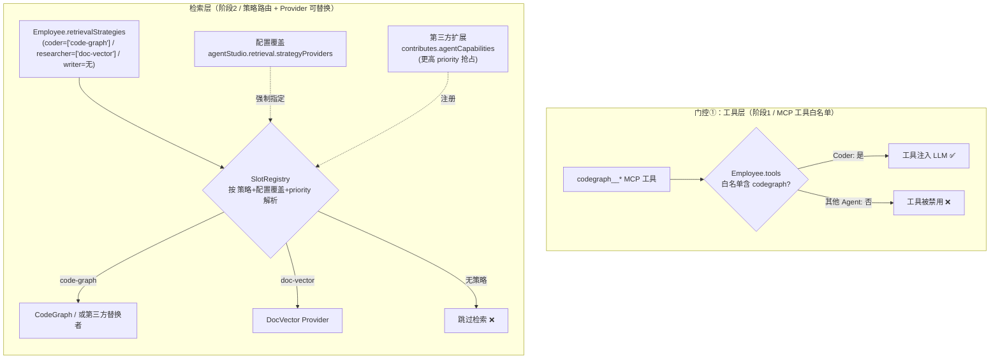
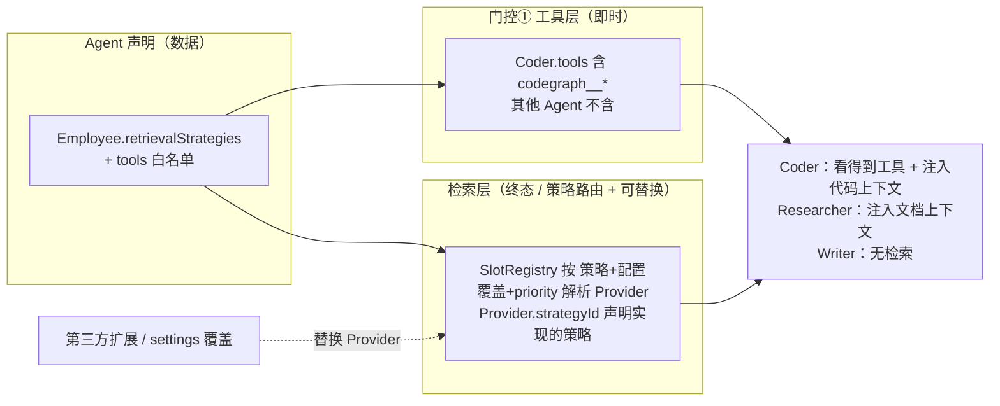

# CodeGraph 接入设计 —— 弹性检索能力组合（按 Agent 策略路由 + Provider 可替换）

> 配套文档：本文是 `CodeGraph-Integration-Design-v2.md` 的**组合/门控补充篇**。
> v2 解决「怎么接入」，本文解决「**不同 Agent 用不同检索策略，且检索 Provider 可被第三方配置替换**」。
> 核查日期：2026-06-02 ｜ 对齐真实接口（agentStudioTypes / agentOSService / presetAgentView / slotRegistry / agentCapabilitiesExtensionPoint）

---

## 1. 需求

本方案要同时满足两条**弹性兼容**目标（而不只是"仅 Coder 启用 codegraph"这一特例）：

1. **灵活可扩展 —— 不同 Agent 可用不同检索策略**
   - Coder/Architect → 代码图谱（`code-graph`，调用链/影响面）；Researcher/Writer → 文档向量库（`doc-vector`）；QA → 知识库（`kb`）；纯对话 Agent → 不检索。
   - 新增编码型 Agent 自动继承代码检索能力；新增一种检索能力（如知识图谱）只需加一个 Provider，不动既有 Agent。
   - 「仅 Coder 用 codegraph」只是本能力的一个**默认配置实例**（Coder 声明 `code-graph` 策略、其他 Agent 不声明）。

2. **Provider 可替换 —— 出现第三方检索 Provider 时，配置即可替换**
   - 当有更强的第三方实现（向量库 SaaS、企业内 RAG 服务）出现，可**通过配置**把某策略（如 `code-graph`）背后的 Provider 从内置 CodeGraph 换成第三方，**不改业务代码、不改 Agent 定义**。
   - 支持两条替换路径：扩展声明 + priority 自动抢占；用户设置里显式指定强制覆盖。

> 仍保留的副作用收益（与目标1天然一致）：非编码 Agent 不被塞入代码上下文 → **降噪 + 省 token + 职责边界清晰**。

---

## 2. 本项目「逐 Agent 门控」真实机制（核查结论）

接入方式不同，门控的挂载点也不同。两条接入路径（MCP 工具 / Retrieval 槽）现状差异很大：

| 能力载体 | 是否已支持逐 Agent 门控 | 真实依据 |
|----------|------------------------|----------|
| **工具**（含 MCP 工具，阶段1/方案C） | ✅ **原生支持**，无需改框架 | `Employee.tools: string[]` 白名单 + `_getEnabledTools(agentId)` 过滤 |
| **Retrieval 槽**（阶段2/方案B） | ❌ **当前是全局单例，不带 agentId** | `getActiveRetrievalProvider()` 无参；`retrieve(query, options)` 无 agentId |

### 2.1 工具白名单：天然按 Agent 隔离 ✅

`Employee.tools`（`agentStudioTypes.ts:333-352`）的官方语义：

```ts
/**
 * Only declared tools are injected into the LLM; all others are disabled for this agent.
 * If undefined or empty, all tools are allowed (no restriction).
 */
tools?: string[];
```

运行时链路（实测）：

```
agentOSService._getEnabledTools(agentId)
  → listAllToolsWithState(agentId)            // 含 BuiltinToolProvider + McpToolProvider
  → filter(t => t.enabled)                     // enabled 由该 agent 的 tools 白名单决定
  → 仅这些工具进入 modelProvider.chat({ tools })
```

> 结论：**MCP 工具（codegraph__*）天然受 `Employee.tools` 白名单约束**。
> 只要不把 codegraph 工具写进非 Coder 的 `tools` 列表，它们就不会出现在那些 Agent 的工具集中。
> `McpToolProvider` 同样通过 `listTools(agentId)` 暴露工具，与内置工具走同一过滤管道。

### 2.2 Retrieval 槽：当前是全局单例，需补门控 ⚠️

```ts
// agentOSService.ts:258 —— 不带 agentId
getActiveRetrievalProvider(): IRetrievalProvider | undefined {
  return this._slotRegistry.getActiveRetrievalProvider();
}

// providers.ts:719 —— retrieve 签名也不带 agentId
retrieve(query: string, options?: IRetrievalOptions): Promise<IRetrievalResult[]>;
```

> 结论：阶段 2 若把 CodeGraph 注册为**全局 RetrievalProvider 并自动注入上下文**，
> 会对**所有 Agent** 生效，且**写死单一实现**。**这是本设计的核心改造点。**
>
> **本方案的选择**：在 Provider 与 Agent 之间引入 **「检索策略（RetrievalStrategy）」间接层**——
> Agent 声明「要哪个**策略**」（`Employee.retrievalStrategies`），Provider 声明「实现哪个**策略**」（`strategyId`），
> `SlotRegistry` 按「策略 + 配置覆盖 + priority」解析。既支持**不同 Agent 不同策略**，又支持**第三方 Provider 配置替换**（详见 §6）。
>
> 此外，项目**已有第三方 Provider 扩展点** `contributes.agentCapabilities`（`capability:'retrieval'`，见 `agentCapabilitiesExtensionPoint.ts`），
> 第三方贡献/替换检索 Provider 的地基已就绪，本方案在其上补「按策略路由 + 配置覆盖」即可。

---

## 3. 组合方案总览（工具层门控 + 检索层策略路由）



**核心原则**：
- **工具层**：用 `Employee.tools` 白名单天然隔离（零框架改动）。
- **检索层**：用 **「Agent→策略→Provider」两段解耦** 替代写死的单 Provider——
  「谁用」由 `Employee.retrievalStrategies` 决定（灵活可扩展），
  「用什么实现」由「策略→Provider 映射 + 配置覆盖」决定（Provider 可替换）。
- 「仅 Coder 用 codegraph」= Coder 声明 `code-graph`、其他不声明的**默认实例**。

---

## 4. Agent→策略的映射，及便捷封装 `isCodeAgent`

检索层主路径是 `Employee.retrievalStrategies`（§6.1）。但工具层门控（§5）和一些便捷判断仍需要
一个「该 Agent 是否属于编码类」的语义封装 `isCodeAgent`——它本质等价于「该 Agent 是否声明了 `code-graph` 策略」。
按优先级三选一（推荐 4.1），并给出与 `retrievalStrategies` 的对齐方式：

### 4.1【推荐】基于策略声明（与检索层同源，最干净）

Agent 直接声明检索策略；`isCodeAgent` 只是「是否含 code-graph 策略」的便捷封装：

```ts
// presetAgentView.ts —— Agent 声明检索策略 + 工具白名单
{
  id: 'coder', name: 'Coder',
  skills: ['code-gen', 'code-review', 'refactor'],   // 已存在
  retrievalStrategies: ['code-graph'],               // ★ 检索层路由依据（§6.1）
  tools: [...existing, 'codegraph__codegraph_context', /* … */],  // 工具层门控依据（§5）
}
```

```ts
// agentStudio/common/agentCapabilities.ts
export function getRetrievalStrategies(e: Employee | undefined): string[] {
  if (!e) { return []; }
  if (e.retrievalStrategies?.length) { return e.retrievalStrategies; }
  // 兜底：从 skills/presetId 推导默认策略（旧 Agent 无 retrievalStrategies 时仍可用）
  const skills = e.skills ?? [];
  const out: string[] = [];
  if (skills.some(s => CODE_INTELLIGENCE_SKILLS.has(s)) || /^(coder|code-)/.test(e.presetId ?? '')) {
    out.push('code-graph');
  }
  return out;
}
/** 便捷封装：是否编码类 Agent == 是否含 code-graph 策略 */
export const isCodeAgent = (e?: Employee) => getRetrievalStrategies(e).includes('code-graph');

const CODE_INTELLIGENCE_SKILLS = new Set(['code-gen', 'code-review', 'refactor', 'explore']);
```

### 4.2 基于 presetId 硬名单（最简单，够用）

```ts
const CODE_AGENT_PRESET_IDS = new Set([
  'coder', 'code-architect', 'code-reviewer', 'code-explorer',
]);
export const isCodeAgent = (e?: Employee) => !!e && CODE_AGENT_PRESET_IDS.has(e.presetId ?? '');
```

### 4.3 基于工具白名单反推（零新增字段）

```ts
// 若该 agent 的 tools 白名单里本就含 codegraph，则视为 code agent
export const isCodeAgent = (e?: Employee) =>
  !!e?.tools?.some(t => t === 'codegraph' || t.startsWith('codegraph__'));
```

> 取舍：**4.1 最具扩展性**（策略驱动，与检索层同源，新增编码型 Agent 自动继承）；
> 4.2 最直观；4.3 零字段但语义偶合。推荐 4.1，4.2 兜底。

---

## 5. 门控① 工具层实现（阶段 1，零框架改动）

**完全复用现有 `Employee.tools` 白名单机制，不改任何框架代码。**

### 5.1 给 Coder 加 codegraph，其他 Agent 不加

```ts
// presetAgentView.ts —— 仅 Coder（及 code-* 系）的 tools 列表追加 codegraph 工具
// Coder:
tools: [
  'write_to_file', 'read_file', 'terminal', 'list_dir',
  'search_files', 'grep_search', 'replace_in_file',
  // ↓ 新增：CodeGraph 10 个 MCP 工具（serverPrefix 为 codegraph）
  'codegraph__codegraph_context',
  'codegraph__codegraph_search',
  'codegraph__codegraph_callers',
  'codegraph__codegraph_callees',
  'codegraph__codegraph_impact',
  'codegraph__codegraph_status',
  // …（其余 4 个按需）
],

// Researcher / Planner / Writer / DevOps:
tools: [ /* 不含任何 codegraph__* */ ],
```

### 5.2 效果

- Coder 的 `_getEnabledTools('coder-id')` → 含 codegraph 工具 → 注入 LLM。
- Researcher 的 `_getEnabledTools('researcher-id')` → 不含 → LLM 根本看不到，无法调用。
- **无需改 `McpToolProvider`、`agentOSService`、`slotRegistry`** —— 现有过滤管道已覆盖。

> ⚠️ 注意：MCP server 本身仍是全局连接的（codegraph daemon 起一次），
> 门控只发生在「**该 agent 能否看到/调用这些工具**」层面，符合预期。

---

## 6. 门控② 检索层实现 —— 弹性「按 Agent 检索策略路由 + Provider 可插拔替换」（阶段 2，**主方案**）

> **设计目标升级**（本次重写）：不止「只让 Coder 用 codegraph」，而是要做到两条更通用的能力：
> 1. **灵活可扩展**：不同 Agent 可绑定**不同检索策略**（Coder→代码图谱、Researcher→文档向量库、QA→知识库…），新增 Agent / 新增策略零侵入扩展。
> 2. **Provider 可替换**：当出现第三方检索 Provider（如向量库 SaaS、企业内 RAG 服务）时，**通过配置即可替换**某个策略背后的实现，不改业务代码、不改 Agent 定义。
>
> 实现思路：在 Provider 与 Agent 之间引入一层 **「检索策略（RetrievalStrategy）」间接层**——
> Agent 只声明「我要用哪个**策略**」（稳定的语义 ID），Provider 声明「我**实现**哪个策略」，
> 中间由 `SlotRegistry` + 一张**可被配置覆盖的策略→Provider 映射**完成解析。
> 这样「换 Provider」只是改映射、「加 Agent 策略」只是加标签，二者解耦。

### 6.0 现状与可复用地基（核查结论）

**地基 1 — Slot 选择当前不带 agent 维度**（需改造）：

```ts
// slotRegistry.ts:204 —— 当前选 Provider 只取优先级最高的那一个，与 agent 无关
getActiveRetrievalProvider(): IRetrievalProvider | undefined {
  return this._retrievalProviders.length > 0 ? this._retrievalProviders[0].provider : undefined;
}
// _retrievalProviders: { provider, priority }[] 已按 priority 降序（registerRetrievalProvider 内 sort）
```

**地基 2 — 第三方 Provider 扩展点已存在**（直接复用，**这是"配置替换"的关键**）：

项目已实现 `contributes.agentCapabilities` 扩展点（`agentCapabilitiesExtensionPoint.ts`），
**任何已安装扩展（含 marketplace 第三方）都能声明检索 Provider**：

```jsonc
// 第三方扩展的 package.json —— 无需改宿主代码即可贡献/替换检索 Provider
"contributes": {
  "agentCapabilities": [
    { "capability": "retrieval", "provider": "acme-vector-rag", "priority": 200 }
  ]
}
```

> 扩展点已支持 `capability:'retrieval'` + `provider` + `priority`，且 `priority` 高者优先。
> 即「第三方 Provider 用更高 priority 抢占同一策略」**天然可行**——本方案只需把 priority 竞争
> 升级为「**按策略分组**的 priority 竞争 + 配置显式覆盖」。

### 6.1 引入「检索策略」间接层（核心抽象）

给 `IRetrievalProvider` 增加**两个可选声明**：它实现哪个策略、它适用于哪些 Agent。
全部可选 → 旧 Provider 不受影响（向后兼容）。

```ts
// common/providers.ts  —— 需 import { Employee } from '../../../common/agentStudioTypes.js'

/** 检索策略 ID —— Agent 与 Provider 之间的稳定契约（语义 ID，不绑实现） */
export type RetrievalStrategyId = string;   // 约定：'code-graph' | 'doc-vector' | 'kb' | ...

export interface IRetrievalProvider {
  readonly id: string;
  readonly name: string;
  retrieve(query: string, options?: IRetrievalOptions): Promise<IRetrievalResult[]>;
  indexDocument(doc: IDocumentToIndex): Promise<void>;

  /**
   * 可选：本 Provider 实现的检索策略 ID。
   * 省略 = 'default' 通用策略。第三方 Provider 通过声明相同 strategyId 即可参与该策略的竞争/替换。
   */
  readonly strategyId?: RetrievalStrategyId;

  /**
   * 可选：声明该 Provider 适用于哪些 Agent（细粒度兜底；通常用策略路由即可，不必实现此方法）。
   * 返回 false 则对该 Agent 不可见；省略 = 适用所有 Agent（向后兼容）。
   */
  appliesToAgent?(employee: Employee | undefined): boolean;
}
```

```ts
// Employee（agentStudioTypes.ts）—— 新增可选字段：本 Agent 需要的检索策略
/**
 * 该 Agent 启用的检索策略 ID 列表（按偏好顺序）。
 * - 省略/为空 → 不启用任何检索（纯对话 Agent，零开销）。
 * - 例：Coder=['code-graph']，Researcher=['doc-vector']，全能 Agent=['code-graph','doc-vector']。
 * 与 isCodeAgent 的关系：isCodeAgent 是「是否含 code-graph 策略」的语义封装（见 §4）。
 */
retrievalStrategies?: RetrievalStrategyId[];
```

> **解耦点**：Agent 说「我要 `code-graph` 策略」，**不关心**它背后是 CodeGraph 还是某第三方实现；
> Provider 说「我实现 `code-graph`」，**不关心**是哪个 Agent 在用。换实现只改映射，不动两端。

### 6.2 `SlotRegistry` 按「策略 + Agent + 配置覆盖」解析 Provider

```ts
// common/providers.ts  ISlotRegistry —— 重载/扩展签名（旧无参调用保留，向后兼容）
getActiveRetrievalProvider(employee?: Employee): IRetrievalProvider | undefined;
/** 按指定策略取 Provider（供按策略路由） */
getRetrievalProviderForStrategy(strategyId: RetrievalStrategyId): IRetrievalProvider | undefined;
/** 列出某策略下所有候选 Provider（按 priority 降序，供 UI 选择/诊断） */
listRetrievalProviders(strategyId?: RetrievalStrategyId): IRetrievalProvider[];
```

```ts
// browser/slotRegistry.ts —— 策略路由 + 配置覆盖
// 可被配置覆盖的「策略 → 指定 providerId」映射（见 §6.4 配置层），优先级高于 priority 竞争
private _strategyOverride = new Map<RetrievalStrategyId, string /* providerId */>();
setRetrievalStrategyOverride(map: Record<string, string>): void {
  this._strategyOverride = new Map(Object.entries(map));
}

/** 按策略选 Provider：先看配置覆盖，再按 priority 取该策略下最高者 */
getRetrievalProviderForStrategy(strategyId: RetrievalStrategyId): IRetrievalProvider | undefined {
  // 1) 配置显式覆盖（第三方替换的关键）：strategyId → 指定 providerId
  const forcedId = this._strategyOverride.get(strategyId);
  if (forcedId) {
    const hit = this._retrievalProviders.find(p => p.provider.id === forcedId);
    if (hit) { return hit.provider; }
    this._logService.warn(`[SlotRegistry] strategy override '${strategyId}'→'${forcedId}' not found, fallback to priority`);
  }
  // 2) 默认：该策略下按 priority 最高者（_retrievalProviders 已降序）
  const match = this._retrievalProviders.find(p => (p.provider.strategyId ?? 'default') === strategyId);
  return match?.provider;
}

/** 按 Agent 解析：取该 Agent 首个「有匹配 Provider」的策略 */
getActiveRetrievalProvider(employee?: Employee): IRetrievalProvider | undefined {
  // 无 employee 上下文 → 退化为旧行为（优先级最高者），向后兼容
  if (!employee) { return this._retrievalProviders[0]?.provider; }
  const strategies = employee.retrievalStrategies ?? [];
  for (const sid of strategies) {                       // 按 Agent 偏好顺序
    const p = this.getRetrievalProviderForStrategy(sid);
    // 二级兜底：Provider 若额外声明 appliesToAgent，仍尊重它
    if (p && (!p.appliesToAgent || p.appliesToAgent(employee))) { return p; }
  }
  return undefined;   // 该 Agent 未声明策略 / 无匹配 Provider → 无检索能力（纯对话 Agent）
}

listRetrievalProviders(strategyId?: RetrievalStrategyId): IRetrievalProvider[] {
  return this._retrievalProviders
    .filter(p => !strategyId || (p.provider.strategyId ?? 'default') === strategyId)
    .map(p => p.provider);
}
```

> 解析优先级：**配置覆盖 > strategy 内 priority 竞争**。第三方 Provider 既可「用更高 priority 自动胜出」，
> 也可被用户「在设置里显式指定」强制替换——两种替换路径都支持。

### 6.3 三个内置 Provider 各实现一种策略（示范多策略并存）

```ts
// CodeGraph：实现 code-graph 策略（阶段2新增）
class CodeGraphRetrievalProvider implements IRetrievalProvider {
  readonly id = 'codegraph';
  readonly name = 'CodeGraph';
  readonly strategyId = 'code-graph';                       // ★ 声明实现的策略
  async retrieve(query: string): Promise<IRetrievalResult[]> {
    const ctx = await this._codegraph.buildContext(query, { maxTokens: 4000 });
    return mapToRetrievalResults(ctx);                      // 多仓库聚合见 v2 §6.2
  }
  async indexDocument(_doc: IDocumentToIndex) { /* 由 watch/sync 自建索引，可空实现 */ }
}

// 文档向量库：实现 doc-vector 策略（Researcher/Writer 用）
class DocVectorRetrievalProvider implements IRetrievalProvider {
  readonly id = 'doc-vector';
  readonly name = 'Document Vector RAG';
  readonly strategyId = 'doc-vector';
  /* ... */
}
```

注册时按策略并存（priority 仅在**同策略内**竞争）：

```ts
// 阶段2 初始化
agentOS.registerRetrievalProvider(new CodeGraphRetrievalProvider(...), /* priority */ 100);
agentOS.registerRetrievalProvider(new DocVectorRetrievalProvider(...), /* priority */ 100);
```

Agent 侧只声明策略，自动路由到对应 Provider：

```ts
// presetAgentView.ts
{ id: 'coder',      retrievalStrategies: ['code-graph'] }
{ id: 'researcher', retrievalStrategies: ['doc-vector'] }
{ id: 'architect',  retrievalStrategies: ['code-graph', 'doc-vector'] }  // 多策略，按序兜底
{ id: 'writer'   /* 无 retrievalStrategies → 不检索 */ }
```

### 6.4 配置层：第三方 Provider 通过配置替换（不改代码）

两条替换路径，**都不改业务代码、不改 Agent 定义**：

**路径 A — 第三方扩展声明 + priority 抢占（零配置，自动生效）**：

```jsonc
// 第三方扩展 package.json（复用现成扩展点 §6.0 地基2）
"contributes": { "agentCapabilities": [
  { "capability": "retrieval", "provider": "acme-code-rag", "priority": 200 }  // >100，抢占 code-graph
]}
```
第三方 Provider 在其激活函数里 `registerRetrievalProvider(provider, 200)` 且 `provider.strategyId='code-graph'`，
即在 `code-graph` 策略内以更高 priority 胜出，所有 Coder 自动改用它——**CodeGraph 被无缝替换**。

**路径 B — 用户在设置里显式指定（强制覆盖，优先级最高）**：

```jsonc
// VS Code settings.json（新增配置项 agentStudio.retrieval.strategyProviders）
"agentStudio.retrieval.strategyProviders": {
  "code-graph": "acme-code-rag",     // 强制 code-graph 策略用第三方 Provider
  "doc-vector": "doc-vector"          // doc-vector 仍用内置
}
```

```ts
// browser/agentStudio.contribution.ts —— 监听配置，灌入 SlotRegistry（约 10 行）
const apply = () => slotRegistry.setRetrievalStrategyOverride(
  configurationService.getValue('agentStudio.retrieval.strategyProviders') ?? {}
);
apply();
configurationService.onDidChangeConfiguration(e => {
  if (e.affectsConfiguration('agentStudio.retrieval.strategyProviders')) { apply(); }
});
```

> 配置项需在 `package.json` 的 `contributes.configuration` 注册（标准 VS Code 配置声明）。

### 6.5 调用点：只透传 Agent 身份，**不含任何门控/路由逻辑**

```ts
// browser/agentOSService.ts —— RAG 自动注入钩子（阶段2新增）
private async _maybeInjectRetrievalContext(agentId: string, query: string): Promise<string | undefined> {
  const employee = await this.studioService.getEmployee(agentId);
  // 策略路由 + 配置覆盖 + 适用性 全部下沉到 slot；此处零判定
  const provider = this.getActiveRetrievalProvider(employee);
  if (!provider) { return undefined; }   // 未声明策略 / 无匹配 → 跳过，纯对话 Agent 零开销
  const results = await provider.retrieve(query, { topK: 8 });
  return formatAsContext(results);
}
```

### 6.6 改造面汇总（全部向后兼容）

| # | 文件 | 改动 |
|---|------|------|
| ① | `common/providers.ts` | `IRetrievalProvider` 加可选 `strategyId?` / `appliesToAgent?()`；`ISlotRegistry` 加 `getRetrievalProviderForStrategy` / `listRetrievalProviders`，`getActiveRetrievalProvider` 加可选 `employee` 参 |
| ② | `common/agentStudioTypes.ts` | `Employee` 加可选 `retrievalStrategies?: string[]` |
| ③ | `common/agentOS.ts` | `IAgentOSService.getActiveRetrievalProvider` 加可选 `employee` 参（透传） |
| ④ | `browser/slotRegistry.ts` | 实现策略路由 + 配置覆盖 + 适用性过滤（§6.2） |
| ⑤ | `browser/agentOSService.ts` | 透传 `employee`；调用点零路由逻辑（§6.5） |
| ⑥ | `browser/agentStudio.contribution.ts` | 监听 `agentStudio.retrieval.strategyProviders` 配置，灌入 SlotRegistry（§6.4 路径B） |
| ⑦ | `package.json` | 注册配置项 `contributes.configuration`（路径B 所需） |

> ①②③ 是接口/类型新增可选成员；④⑤ 是实现；⑥⑦ 仅在需要「设置里显式替换」时才做（路径A 不需要）。

### 6.7 设计权衡（为何用策略间接层，而非直接 if / 直接 Provider）

| 维度 | 策略路由（本方案） | 直接 `appliesToAgent` 二元开关（上一版） | 调用点 `if(isCodeAgent)` |
|------|-------------------|------------------------------------|------------------------|
| 不同 Agent 不同策略 | ✅ 一等支持（`retrievalStrategies` 多策略按序） | ⚠️ 仅"用/不用"二元，难表达"用哪种" | ❌ |
| 第三方 Provider 替换 | ✅ priority 抢占 + 配置覆盖双路径 | ⚠️ 仅 priority，且无 agent 维度区分 | ❌ |
| 新增 Agent | 加 `retrievalStrategies` 标签即可 | 改 Provider 的 `appliesToAgent` 逻辑 | 改 `isCodeAgent` |
| 新增检索能力 | 加一个 Provider + 新 strategyId | 改 `appliesToAgent` 判断 | 改调用点 |
| 调用点 | 零逻辑 | 零逻辑 | 每处重复判定 |
| 向后兼容 | ✅ 全可选成员 | ✅ | ✅ |

> 策略间接层把"**谁用**（Agent→策略）"与"**用什么**（策略→Provider）"彻底解耦，
> 正好对应需求的两条：①不同 Agent 不同策略 ②Provider 可配置替换。

---

## 7. 最终推荐组合



| 层 | 手段 | 改动 | 是否改框架 |
|----|------|------|-----------|
| 工具层（阶段1） | `Employee.tools` 白名单只给 Coder 加 codegraph | 改 `presetAgentView.ts` 数据 | ❌ 否 |
| 检索层（阶段2） | **策略路由**：`Employee.retrievalStrategies` + `Provider.strategyId` + `SlotRegistry` 按策略/配置/priority 解析 | 新增 `agentCapabilities.ts`；`IRetrievalProvider`/`ISlotRegistry`/`IAgentOSService`/`Employee` 各加可选成员；`slotRegistry` 实现策略路由+覆盖 | 轻微（接口全可选，向后兼容） |
| 替换层（按需） | 第三方扩展 `agentCapabilities` priority 抢占 / `settings` 显式覆盖 | 复用现成扩展点；+1 配置项 | 复用现成机制 |

**一句话**：工具层靠现成白名单（零改动）；检索层用「**Agent→策略→Provider** 两段解耦」——
Agent 声明要哪个策略（灵活），策略背后的 Provider 可被 priority 或配置替换（可插拔）。

---

## 8. 验收清单

**灵活可扩展（目标1）**：
- [ ] Coder 工具列表出现 `codegraph__*`；Researcher / Planner / Writer 工具列表**不出现**。
- [ ] Coder（`retrievalStrategies:['code-graph']`）提问 → 命中 CodeGraph 并注入代码上下文。
- [ ] Researcher（`retrievalStrategies:['doc-vector']`）同样提问 → 命中 DocVector，**不触发** CodeGraph。
- [ ] Writer（无 `retrievalStrategies`）提问 → `getActiveRetrievalProvider` 返回 undefined，跳过检索、零开销。
- [ ] Architect（`retrievalStrategies:['code-graph','doc-vector']`）→ 按序解析，code-graph 无结果时兜底 doc-vector。
- [ ] 新增编码型 preset（含 code-* 或 code-graph 策略）→ **自动**获得代码检索（无需改框架）。

**Provider 可替换（目标2）**：
- [ ] 第三方扩展声明 `agentCapabilities:[{capability:'retrieval',provider:'acme',priority:200}]` 且 `strategyId='code-graph'` → Coder **自动改用** acme，CodeGraph 被无缝替换。
- [ ] settings `agentStudio.retrieval.strategyProviders={"code-graph":"acme"}` → 强制 code-graph 用 acme（优先级高于 priority）；删除配置后回落内置。
- [ ] 配置指向不存在的 providerId → 告警并回落 priority 选择（不崩溃）。

**向后兼容**：
- [ ] `getActiveRetrievalProvider()` **无参调用**仍返回优先级最高 Provider（旧调用不破坏）。
- [ ] 旧 Provider（无 `strategyId`）归入 `'default'` 策略；旧 Agent（无 `retrievalStrategies`）由 §4.1 兜底推导。
- [ ] codegraph daemon 仍只启动一次（路由/替换不影响底层连接）。

---

## 9. 与 v2 文档的衔接

| v2 章节 | 本文对应设计 |
|---------|-------------|
| §6.1 阶段1 MCP 预置 | §5 工具层门控：预置照常全局注册，但只写进 Coder 的 `tools` |
| §6.2 阶段2 RetrievalProvider | §6 检索层：**策略路由 + Provider 可替换**——`Employee.retrievalStrategies` × `Provider.strategyId` × 配置覆盖 |
| §3.3 Retrieval 槽位 | §2.2/§6.0 指出该槽位当前 `getActiveRetrievalProvider` 只看 priority、不带 agent/策略，是核心改造点 |
| §3.4 多工作区根路径约定 | 不变：仍取 `relatedFolders[].path`，与检索路由正交 |
| （新）第三方能力插件 | §6.0/§6.4 复用现成 `contributes.agentCapabilities` 扩展点实现 Provider 可替换 |

> 落地顺序：先做 §5（改数据即生效、零风险）→ 再随阶段2 做 §6.1–6.3（策略路由，接口全可选、向后兼容）→ 最后按需做 §6.4 路径B（settings 显式替换）。
