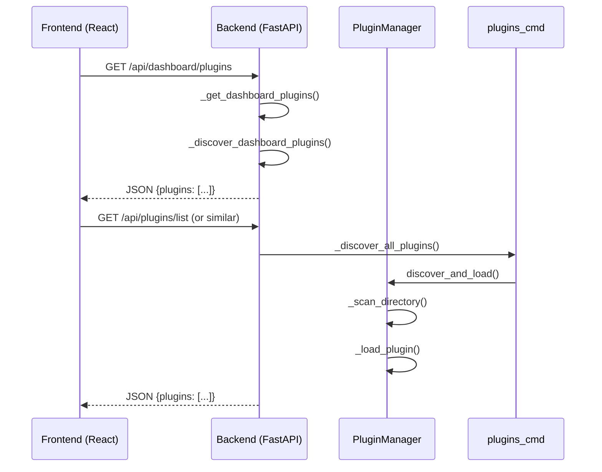

# Hermes Agent 插件系统分析文档

## 1. 概述

Hermes Agent 采用可扩展的插件架构，允许通过插件系统增强核心功能。插件可以：
- 注册新的工具（tools）
- 注册生命周期钩子（hooks）
- 添加 CLI 和 Slash 命令
- 提供上下文引擎
- 提供图像生成后端
- 适配消息平台（gateway platforms）

---

## 2. 插件发现机制

### 2.1 插件来源

插件从以下四个来源发现（`hermes_cli/plugins.py`）：

| 来源 | 路径 | 说明 |
|------|------|------|
| **Bundled 插件** | `<repo>/plugins/<name>/` | 随仓库发布的内置插件 |
| **User 插件** | `~/.hermes/plugins/<name>/` | 用户安装的插件 |
| **Project 插件** | `./.hermes/plugins/<name>/` | 项目级插件（需设置 `HERMES_ENABLE_PROJECT_PLUGINS`） |
| **Pip 插件** | entry-points | 通过 pip 安装，暴露 `hermes_agent.plugins` entry-point |

**优先级**：后面的来源覆盖前面的同名插件。

### 2.2 插件目录结构

插件支持两种布局：

```
# 扁平布局
plugins/
  └── disk-cleanup/
        ├── plugin.yaml
        └── __init__.py

# 分类布局（用于 backend 插件）
plugins/
  └── image_gen/
        └── openai/
              ├── plugin.yaml
              └── __init__.py
```

### 2.3 插件清单（plugin.yaml）

每个插件必须包含 `plugin.yaml` 清单文件：

```yaml
name: openai
version: 1.0.0
description: "OpenAI image generation backend (gpt-image-2)."
author: NousResearch
kind: backend
requires_env:
  - OPENAI_API_KEY
```

**插件类型（kind）**：

| 类型 | 说明 | 加载方式 |
|------|------|----------|
| `standalone` | 独立插件，提供自己的工具和钩子 | 需要 `plugins.enabled` 启用 |
| `backend` | 可插拔后端（如 image_gen） | Bundled 自动加载 |
| `exclusive` | 独占类别（如 memory） | 通过 `<category>.provider` 配置选择 |
| `platform` | 消息平台适配器 | Bundled 自动加载 |

---

## 3. 插件加载流程

### 3.1 核心类：PluginManager

位置：`hermes_cli/plugins.py`

```python
class PluginManager:
    """中央管理器，负责发现、加载和调用插件。"""

    def __init__(self) -> None:
        self._plugins: Dict[str, LoadedPlugin] = {}
        self._hooks: Dict[str, List[Callable]] = {}
        self._plugin_tool_names: Set[str] = set()
        self._plugin_platform_names: Set[str] = set()
        self._cli_commands: Dict[str, dict] = {}
        self._context_engine = None
        self._plugin_commands: Dict[str, dict] = {}
        self._discovered: bool = False
```

### 3.2 发现与加载流程

```python
def discover_and_load(self, force: bool = False) -> None:
    """扫描所有插件来源并加载找到的插件。"""

    # 1. 扫描 Bundled 插件（跳过 memory/ 和 context_engine/）
    repo_plugins = get_bundled_plugins_dir()
    manifests.extend(self._scan_directory(repo_plugins, source="bundled", skip_names={"memory", "context_engine"}))

    # 2. 扫描 User 插件（~/.hermes/plugins/）
    user_dir = get_hermes_home() / "plugins"
    manifests.extend(self._scan_directory(user_dir, source="user"))

    # 3. 扫描 Project 插件（需要环境变量启用）
    if _env_enabled("HERMES_ENABLE_PROJECT_PLUGINS"):
        project_dir = Path.cwd() / ".hermes" / "plugins"
        manifests.extend(self._scan_directory(project_dir, source="project"))

    # 4. 扫描 Pip 插件（entry-points）
    manifests.extend(self._scan_entry_points())

    # 5. 去重（同名插件，后发现的覆盖先发现的）
    winners: Dict[str, PluginManifest] = {}
    for manifest in manifests:
        winners[manifest.key or manifest.name] = manifest

    # 6. 加载每个清单
    for manifest in winners.values():
        # 检查是否被禁用
        if lookup_key in disabled:
            continue

        # 根据插件类型决定是否加载
        if manifest.kind == "exclusive":
            # 独占插件由专属发现系统处理
            continue

        if manifest.source == "bundled" and manifest.kind in ("backend", "platform"):
            # Bundled 的 backend/platform 自动加载
            self._load_plugin(manifest)
            continue

        # 其他插件需要显式启用
        if not is_enabled:
            continue

        self._load_plugin(manifest)
```

### 3.3 插件加载

```python
def _load_plugin(self, manifest: PluginManifest) -> None:
    """导入插件模块并调用其 register(ctx) 函数。"""

    # 1. 导入模块
    if manifest.source in ("user", "project", "bundled"):
        module = self._load_directory_module(manifest)
    else:
        module = self._load_entrypoint_module(manifest)

    # 2. 调用 register(ctx)
    register_fn = getattr(module, "register", None)
    if register_fn is None:
        loaded.error = "no register() function"
    else:
        ctx = PluginContext(manifest, self)
        register_fn(ctx)
        loaded.enabled = True
```

---

## 4. 插件上下文（PluginContext）

插件通过 `PluginContext` 注册各种功能：

### 4.1 注册工具

```python
def register_tool(
    self,
    name: str,
    toolset: str,
    schema: dict,
    handler: Callable,
    check_fn: Callable | None = None,
    requires_env: list | None = None,
    is_async: bool = False,
    description: str = "",
    emoji: str = "",
) -> None:
    """注册工具到全局注册表。"""
    from tools.registry import registry

    registry.register(
        name=name,
        toolset=toolset,
        schema=schema,
        handler=handler,
        check_fn=check_fn,
        requires_env=requires_env,
        is_async=is_async,
        description=description,
        emoji=emoji,
    )
```

### 4.2 注册生命周期钩子

```python
def register_hook(self, hook_name: str, callback: Callable) -> None:
    """注册生命周期钩子回调。"""
    self._manager._hooks.setdefault(hook_name, []).append(callback)
```

**有效的钩子名称**（`VALID_HOOKS`）：

| 钩子名称 | 触发时机 | 用途 |
|----------|----------|------|
| `pre_tool_call` | 工具调用前 | 可以阻止工具执行 |
| `post_tool_call` | 工具调用后 | 处理工具结果 |
| `pre_llm_call` | LLM 调用前 | 注入上下文 |
| `post_llm_call` | LLM 调用后 | 处理 LLM 响应 |
| `on_session_start` | 会话开始 | 初始化 |
| `on_session_end` | 会话结束 | 清理 |
| `pre_gateway_dispatch` | 网关消息分发前 | 消息过滤/改写 |
| `pre_approval_request` | 审批请求前 | 记录 |
| `post_approval_response` | 审批响应后 | 记录 |

### 4.3 注册命令

```python
def register_command(
    self,
    name: str,
    handler: Callable,
    description: str = "",
    args_hint: str = "",
) -> None:
    """注册 Slash 命令（如 /lcm）。"""
    # 注册到 _plugin_commands 字典
    self._manager._plugin_commands[clean] = {
        "handler": handler,
        "description": description,
        "plugin": self.manifest.name,
        "args_hint": args_hint,
    }
```

### 4.4 注册其他组件

```python
# 注册上下文引擎
ctx.register_context_engine(engine)

# 注册图像生成提供者
ctx.register_image_gen_provider(provider)

# 注册平台适配器
ctx.register_platform(
    name="irc",
    label="IRC",
    adapter_factory=lambda cfg: IRCAdapter(cfg),
    check_fn=lambda: True,
)
```

---

## 5. 插件配置管理

### 5.1 配置文件

位置：`~/.hermes/config.yaml`

```yaml
plugins:
  enabled:
    - image_gen/openai
    - memory/honcho
  disabled:
    - some-old-plugin
```

- `plugins.enabled`：**白名单**，只有列出的插件才会加载
- `plugins.disabled`：**黑名单**，列出的插件永远不会加载（优先级更高）

### 5.2 配置管理函数

位置：`hermes_cli/plugins_cmd.py`

| 函数 | 说明 |
|------|------|
| `_get_enabled_set()` | 读取启用的插件集合 |
| `_save_enabled_set(set)` | 保存启用的插件集合 |
| `_get_disabled_set()` | 读取禁用的插件集合 |
| `_save_disabled_set(set)` | 保存禁用的插件集合 |

---

## 6. CLI 插件命令

位置：`hermes_cli/plugins_cmd.py`

### 6.1 可用命令

| 命令 | 说明 |
|------|------|
| `hermes plugins install <url>` | 从 Git URL 安装插件 |
| `hermes plugins update <name>` | 更新已安装的插件 |
| `hermes plugins remove <name>` | 删除插件 |
| `hermes plugins enable <name>` | 启用插件 |
| `hermes plugins disable <name>` | 禁用插件 |
| `hermes plugins list` | 列出所有插件 |
| `hermes plugins` | 交互式切换界面 |

### 6.2 安装流程

```python
def cmd_install(identifier: str, force: bool = False, enable: Optional[bool] = None) -> None:
    """从 Git URL 或 owner/repo 简写安装插件。"""

    # 1. 解析 Git URL（支持 owner/repo 简写）
    git_url = _resolve_git_url(identifier)

    # 2. 克隆到临时目录
    subprocess.run(["git", "clone", "--depth", "1", git_url, str(tmp_target)])

    # 3. 读取 manifest，确定插件名称
    manifest = _read_manifest(tmp_target)
    plugin_name = manifest.get("name") or _repo_name_from_url(git_url)

    # 4. 移动到 ~/.hermes/plugins/<name>/
    shutil.move(str(tmp_target), str(target))

    # 5. 复制 .example 文件
    _copy_example_files(target, console)

    # 6. 提示输入 required_env 变量
    _prompt_plugin_env_vars(installed_manifest, console)

    # 7. 显示 after-install.md（如果存在）
    _display_after_install(target, identifier)

    # 8. 启用插件（如果指定）
    if should_enable:
        enabled.add(installed_name)
        _save_enabled_set(enabled)
```

---

## 7. Web UI 插件页面

### 7.1 Dashboard 插件发现

位置：`hermes_cli/web_server.py`

Dashboard 插件需要额外的 `dashboard/manifest.json` 文件：

```json
{
  "label": "My Plugin",
  "description": "Does something useful",
  "tab": {
    "path": "/my-plugin",
    "position": "right"
  },
  "slots": ["header", "sidebar"]
}
```

**发现函数**：

```python
def _discover_dashboard_plugins() -> list:
    """扫描 plugins/*/dashboard/manifest.json。"""

    search_dirs = [
        (get_hermes_home() / "plugins", "user"),
        (bundled_root / "memory", "bundled"),
        (bundled_root, "bundled"),
    ]

    for plugins_root, source in search_dirs:
        for child in sorted(plugins_root.iterdir()):
            manifest_file = child / "dashboard" / "manifest.json"
            if manifest_file.exists():
                # 读取 manifest
                data = json.loads(manifest_file.read_text())
                # 添加到插件列表
                plugins.append({
                    "name": name,
                    "label": data.get("label", name),
                    "description": data.get("description", ""),
                    "tab": tab_info,
                    "slots": slots,
                    "_api_file": data.get("api"),
                })
```

### 7.2 API 端点

| 端点 | 方法 | 说明 |
|------|------|------|
| `/api/dashboard/plugins` | GET | 获取 Dashboard 插件列表 |
| `/api/dashboard/plugins/rescan` | GET | 强制重新扫描插件 |
| `/api/plugins/install` | POST | 安装插件（Dashboard） |
| `/api/plugins/<name>/enable` | POST | 启用插件 |
| `/api/plugins/<name>/disable` | POST | 禁用插件 |
| `/api/plugins/<name>/update` | POST | 更新插件 |
| `/api/plugins/<name>/remove` | DELETE | 删除插件 |

### 7.3 获取可用插件列表

**前端调用流程**：

```javascript
// 1. 获取 Dashboard 插件
fetch('/api/dashboard/plugins')
  .then(res => res.json())
  .then(plugins => {
    // plugins: [{name, label, description, tab, slots}]
  });

// 2. 获取 Agent 插件（合并后的列表）
fetch('/api/plugins/list')  // 假设存在此端点
  .then(res => res.json())
  .then(plugins => {
    // plugins: [{name, version, description, source, enabled, ...}]
  });
```

**后端实现**（`_merged_plugins_hub()`）：

```python
def _merged_plugins_hub() -> Dict[str, Any]:
    """合并 Agent 插件发现和 Dashboard 清单。"""

    # 1. 获取 Dashboard 插件
    dashboard_list = _get_dashboard_plugins()
    dash_by_name = {str(p["name"]): p for p in dashboard_list}

    # 2. 获取所有插件（来自 plugins_cmd._discover_all_plugins()）
    disabled_set = _get_disabled_set()
    enabled_set = _get_enabled_set()

    for name, version, description, source, dir_str in _discover_all_plugins():
        # 判断运行时状态
        if name in disabled_set:
            runtime_status = "disabled"
        elif name in enabled_set:
            runtime_status = "enabled"
        else:
            runtime_status = "not_enabled"

        # 构建插件信息
        rows.append({
            "name": name,
            "version": version,
            "description": description,
            "source": source,
            "status": runtime_status,
            "dashboard": dash_by_name.get(name),  # Dashboard 插件信息
            "can_update_git": (Path(dir_str) / ".git").exists(),
            "auth_required": auth_required,
            "user_hidden": name in hidden_plugins,
        })

    return {"plugins": rows}
```

---

## 8. 插件示例分析

### 8.1 Image Gen OpenAI 插件

**目录结构**：

```
plugins/image_gen/openai/
  ├── plugin.yaml       # 插件清单
  └── __init__.py      # 插件入口
```

**plugin.yaml**：

```yaml
name: openai
version: 1.0.0
description: "OpenAI image generation backend (gpt-image-2)."
author: NousResearch
kind: backend
requires_env:
  - OPENAI_API_KEY
```

**__init__.py**：

```python
from agent.image_gen_provider import ImageGenProvider

class OpenAIImageGenProvider(ImageGenProvider):
    """OpenAI images.generate 后端。"""

    @property
    def name(self) -> str:
        return "openai"

    def is_available(self) -> bool:
        return bool(os.environ.get("OPENAI_API_KEY"))

    def list_models(self) -> List[Dict[str, Any]]:
        return [
            {"id": "gpt-image-2-low", "display": "GPT Image 2 (Low)"},
            {"id": "gpt-image-2-medium", "display": "GPT Image 2 (Medium)"},
            {"id": "gpt-image-2-high", "display": "GPT Image 2 (High)"},
        ]

    def generate(self, prompt: str, **kwargs) -> Dict[str, Any]:
        # 实现图像生成逻辑
        client = openai.OpenAI()
        response = client.images.generate(model="dall-e-3", prompt=prompt)
        return {"image": response.data[0].url}

def register(ctx) -> None:
    """插件入口点 —— 注册图像生成提供者。"""
    ctx.register_image_gen_provider(OpenAIImageGenProvider())
```

---

## 9. 总结

### 9.1 插件系统特点

1. **多来源发现**：支持 Bundled、User、Project、Pip 四种来源
2. **类型化插件**：通过 `kind` 字段区分插件类型，不同类

型有不同的加载策略
3. **显式启用**：默认采用白名单机制，`plugins.enabled` 控制哪些插件加载
4. **生命周期钩子**：提供丰富的钩子点，允许插件在 Agent 运行的关键节点介入
5. **Dashboard 集成**：支持 Dashboard 插件，可以提供前端界面

### 9.2 插件页面获取可用插件的流程



### 9.3 关键文件索引

| 文件 | 说明 |
|------|------|
| `hermes_cli/plugins.py` | 插件管理器核心实现 |
| `hermes_cli/plugins_cmd.py` | 插件 CLI 命令和 Dashboard API |
| `hermes_cli/web_server.py` | Web UI 服务器，提供插件 API |
| `plugins/<name>/plugin.yaml` | 插件清单文件 |
| `plugins/<name>/__init__.py` | 插件入口，包含 `register(ctx)` |
| `~/.hermes/config.yaml` | 插件配置文件 |
