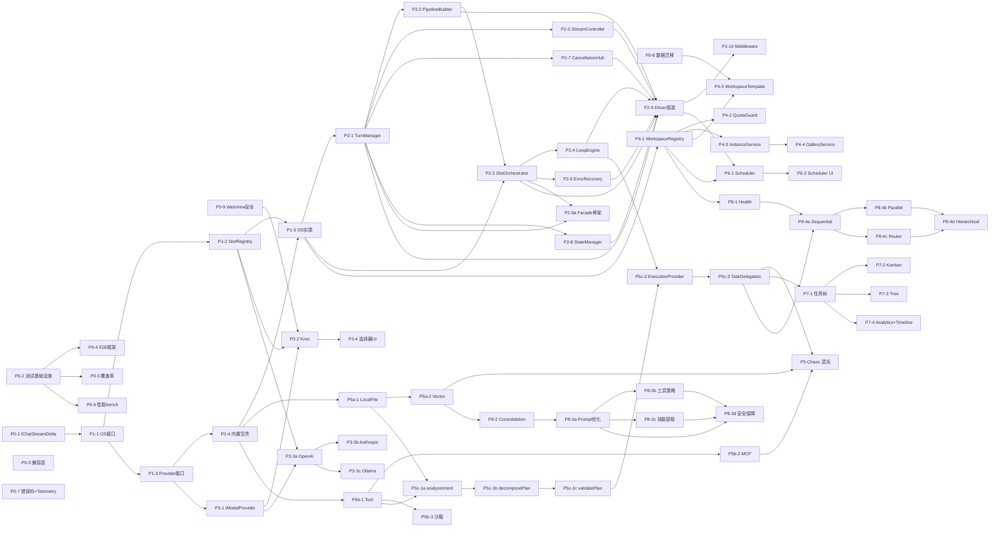

# Saros Agents Client — 分阶段实现与测试任务文档

> **版本**: v2.0（全面增强版）
> **日期**: 2026-05-11
> **基于**: Four-Layer-Architecture-Framework.md v1.1
> **目标**: 将四层架构设计拆分为可独立实现、独立测试、独立合并的原子任务
> **变更摘要 (vs v1.0)**: 工时修订 +24%（93d→115d）；Phase 0 扩充 5 个基础任务；P8-3/P8-4/P5c-1 拆细；新增风险矩阵、横向任务、安全/可观测/i18n/混沌测试；依赖图改为 Mermaid；解锁 P4 与 P2 并行。

---

## 目录

1. [总体原则](#总体原则)
2. [任务模板](#任务模板)
3. [横向任务（贯穿所有 Phase）](#横向任务)
4. [Phase 0: 基础整理与基础设施（2 周）](#phase-0)
5. [Phase 1: OS 层骨架（2 周）](#phase-1)
6. [Phase 2: Driver 层实现（3 周）](#phase-2)
7. [Phase 3: Model 插件化（2 周，∥ Phase 2）](#phase-3)
8. [Phase 4: 工作区+实例管理（3 周，∥ Phase 2 后段）](#phase-4)
9. [Phase 5a: Memory Provider（2 周）](#phase-5a)
10. [Phase 5b: Tool Provider（2 周）](#phase-5b)
11. [Phase 5c: Planning + Execution（3 周）](#phase-5c)
12. [Phase 6: Scheduler（2 周）](#phase-6)
13. [Phase 7: TaskBoard（3 周）](#phase-7)
14. [Phase 8: 高阶能力（5 周）](#phase-8)
15. [任务依赖总图（Mermaid）](#任务依赖总图)
16. [风险矩阵](#风险矩阵)
17. [测试策略总览](#测试策略总览)
18. [PR Review 检查清单](#pr-review-检查清单)
19. [版本兼容矩阵](#版本兼容矩阵)
20. [工时估算总览](#工时估算总览)
21. [快速开始路径](#快速开始路径)

---

## 总体原则

### 实施策略
1. **每个任务可独立 PR** — 任意任务完成后代码可编译、可合并、可发布
2. **测试前置** — 接口定义完成时即编写测试桩，实现时补全断言
3. **渐进增强** — 先实现最小可用版本(L1)，再逐步提升到生产级(L3)
4. **并行友好** — 无依赖任务可同时推进，依赖图最小化
5. **回滚安全** — 重大重构需提供数据/配置回滚方案
6. **可观测优先** — 关键路径埋日志/Trace/Metrics，问题可追溯
7. **安全默认** — 凭据加密、工具沙箱、WebView CSP 在 P0 落地

### Level 定义
| Level | 含义 | 标准 |
|-------|------|------|
| L0 | 接口定义 | `.ts` 文件存在，类型完整，编译通过 |
| L1 | 空壳实现 | DI 可注入，方法返回空/默认值，dispose 安全 |
| L2 | 功能实现 | 核心路径可用，含基本 edge case，单测覆盖 ≥ 70% |
| L3 | 生产就绪 | 错误处理/日志/超时/重试/指标完备，单测 ≥ 85%，含混沌测试 |

### 通用验收检查表（每个任务均适用）
- [ ] TypeScript 编译通过 (`npm run compile`)
- [ ] ESLint 无错误 (`npm run lint`)
- [ ] 无循环依赖 (`madge --circular src/vs/sessions`)
- [ ] 新增公共接口有 JSDoc 注释（含 `@example`）
- [ ] DI 注册/绑定正确（contribution 文件更新）
- [ ] 现有功能不退化（冒烟测试通过）
- [ ] 单元测试覆盖率达成对应 Level 标准
- [ ] 有错误码定义（如有新增错误场景）
- [ ] 有 Telemetry 事件埋点（如属关键路径）
- [ ] CHANGELOG.md 已更新

---

## 任务模板

每个任务条目使用统一字段，便于自动化生成报表与跟踪进度。

```yaml
id: PX-Y
title: <动词开头的简短描述>
priority: P0 | P1 | P2 | P3
estimate: <工作日，0.5 步进>
dependencies: [PA-B, PC-D]
unblocks: [PE-F]            # 反向依赖（可选，由依赖图自动推导）
outputs:
  - <文件1>
  - <文件2>
level: L0 → L2 | L1 → L2 | L2 → L3
risk: low | medium | high   # 见风险矩阵
owner: <可选>
steps:                      # 实施步骤
  - <步骤1>
acceptance:                 # 验收标准（可量化）
  - <可验证的标准>
testStrategy:               # 测试策略
  unit: [...]
  integration: [...]
  e2e: [...]
observability:              # 可观测性要求（可选）
  logs: [...]
  metrics: [...]
  traces: [...]
rollback: <回滚方案>         # 仅高风险任务必填
```

---

## 横向任务

> 横向任务**不属于单一 Phase**，而是贯穿全周期的工程基线。建议在 P0/P1 完成后立即建立，并在每个 Phase PR 中验证其约束。

| ID | 横向任务 | 触发时机 | 主要负责 Phase |
|----|---------|---------|---------------|
| **X-1** | DI 注册顺序与优先级规范 | P1 起 | P1 |
| **X-2** | 公共 API barrel 导出策略 | P0 起 | P0 |
| **X-3** | 错误码与 Telemetry 上报骨架 | P0 起 | P0-7 |
| **X-4** | 日志 / Trace / Metrics 统一接入点 | P0 起 | P0-7 |
| **X-5** | 安全基线（SecretStorage + CSP + Sandbox） | P0/P3/P5b | P0-9, P3-2, P5b-3 |
| **X-6** | i18n / a11y 基础（en/zh + axe-core 审计） | P3 起 | P3-4, P7-* |
| **X-7** | 混沌测试基础设施（Provider crash / 断网 / 限流） | P5 起 | P5-Chaos |
| **X-8** | 文档自动生成（typedoc + API 兼容报告） | 贯穿 | 各 Phase |
| **X-9** | 性能基线 bench 框架与 SLO 监控 | P0 起 | P0-6 |

---

<a id="phase-0"></a>
## Phase 0: 基础整理与基础设施（2 周）

> v2 新增：将测试/可观测/安全/迁移基础设施前置到 P0，避免后续阶段返工。

### P0-1: 统一 IChatStreamDelta 定义
| 字段 | 值 |
|---|---|
| 优先级 | P0 |
| 工时 | 0.5d |
| 依赖 | 无 |
| 产出 | `common/protocol.ts`（新建） |
| Level | L0 → L2 |
| 风险 | low |

**步骤**:
1. 创建 `common/protocol.ts`，统一所有流事件类型
2. 将 `IChatStreamDelta`、`StreamDeltaType`、`ITurnState` 等移入
3. 原位置改为 re-export（保持向后兼容）
4. 更新所有 import 路径

**验收**:
- [ ] `common/protocol.ts` 为唯一定义源
- [ ] `grep -r "interface IChatStreamDelta" src/vs/sessions` 仅 1 处命中
- [ ] 编译通过，无 breaking change

**测试**:
- 编译验证 + grep 确认无重复定义

---

### P0-2: 创建测试基础设施
| 字段 | 值 |
|---|---|
| 优先级 | P0 |
| 工时 | 1d |
| 依赖 | 无 |
| 产出 | `test/sessions/contrib/agentStudio/` 目录结构 |
| Level | L2 |
| 风险 | low |

**步骤**:
1. 创建测试目录 `test/sessions/contrib/agentStudio/{common,browser,fixtures}/`
2. 编写 `mockProviders.ts` — 7 个 Slot 的 Mock 工厂
3. 编写 `mockAgentOS.ts` — 可注入的 OS 服务桩
4. 编写 `testUtils.ts`（DI container builder, fake clock, deterministic random）
5. 编写测试夹具数据（fixtures/）：示例 agent.yaml、Knot mock 响应

**验收**:
- [ ] Mock 工厂可创建任意 Provider 类型实例
- [ ] `npm run test -- --grep "agentStudio"` 可执行
- [ ] 元测试通过：Mock 工厂自身正确性

**测试**:
- 元测试：Mock 工厂自身正确性

---

### P0-3: 清理 AgentChatService 兼容层
| 字段 | 值 |
|---|---|
| 优先级 | P0 |
| 工时 | 0.5d |
| 依赖 | 无 |
| 产出 | `browser/agentChatService.ts`（修改） |
| Level | L2 |
| 风险 | low |

**步骤**:
1. 为 `IAgentChatService` 添加 `@deprecated` JSDoc 标记
2. 内部调用全部委托到 `IAgentDriverService`
3. 添加迁移注释指引新代码使用 Driver

**验收**:
- [ ] 所有方法调用链转到 Driver
- [ ] 编译器显示 deprecated 警告（IDE 划线）

---

### P0-4: E2E 测试框架搭建（新增）
| 字段 | 值 |
|---|---|
| 优先级 | P0 |
| 工时 | 2d |
| 依赖 | P0-2 |
| 产出 | `test/e2e/` + `playwright.config.ts` |
| Level | L2 |
| 风险 | medium |

**步骤**:
1. 集成 Playwright + VSCode 测试启动器（`@vscode/test-electron`）
2. 编写 WebView 启动 helper（注入 messageProtocol mock）
3. 编写首个冒烟用例：启动 → 打开 Agent Studio → 发消息 → 收到流式回复
4. 配置 CI workflow（headless 运行，失败截图）

**验收**:
- [ ] 本地 `npm run test:e2e` 可成功运行冒烟用例
- [ ] CI 上 Linux/macOS 双平台通过

**测试**:
- 元测试：框架自身能正确启动并截图

---

### P0-5: 覆盖率工具配置（新增）
| 字段 | 值 |
|---|---|
| 优先级 | P0 |
| 工时 | 0.5d |
| 依赖 | P0-2 |
| 产出 | `.c8rc.json` + CI 报告 |
| Level | L2 |
| 风险 | low |

**步骤**:
1. 集成 c8（Mocha 测试覆盖率）
2. 仅统计 `src/vs/sessions/contrib/agentStudio/**`
3. CI 输出 lcov + HTML 报告，阈值默认 70%
4. PR 失败时自动评论覆盖率变化

**验收**:
- [ ] 覆盖率报告可在本地与 CI 生成
- [ ] PR 中显示覆盖率 diff

---

### P0-6: 性能基线 bench 框架（新增）
| 字段 | 值 |
|---|---|
| 优先级 | P0 |
| 工时 | 1d |
| 依赖 | P0-2 |
| 产出 | `test/bench/` + `npm run bench` |
| Level | L2 |
| 风险 | low |

**步骤**:
1. 集成 mitata（轻量基准测试库）
2. 编写 3 个基线 bench：
   - LLM 调用延迟（mock provider，纯传输开销）
   - 流式吞吐（每秒 token 处理量）
   - SlotRegistry 注册/查询 QPS
3. 输出 baseline.json，每周对比

**验收**:
- [ ] 3 个 bench 可执行并输出稳定结果
- [ ] 基线值写入 `test/bench/baseline.json`

---

### P0-7: 错误码体系 + Telemetry 骨架（新增）
| 字段 | 值 |
|---|---|
| 优先级 | P0 |
| 工时 | 1.5d |
| 依赖 | 无 |
| 产出 | `common/errors.ts` + `browser/telemetry.ts` |
| Level | L2 |
| 风险 | medium |

**步骤**:
1. 定义 `AgentStudioError` 基类，包含 `code`、`category`、`retryable`、`userMessage`
2. 定义错误码命名空间：`AS-OS-xxx`、`AS-DRIVER-xxx`、`AS-PROVIDER-xxx`、`AS-UI-xxx`
3. 集成 VSCode Telemetry Reporter
4. 关键事件目录：`turn.start/end`、`provider.call`、`error.report`、`feature.used`
5. 提供 `TelemetryService` DI 接口（默认 noop，避免开发期噪音）

**验收**:
- [ ] 错误码 ≥ 20 个预置
- [ ] Telemetry 接入点 ≥ 5 个关键路径
- [ ] 用户禁用 Telemetry 时静默不发

**Observability**:
- 日志: 所有 error 自动写入 outputChannel "Agent Studio"
- Metrics: error counter by code

---

### P0-8: 数据迁移工具与回滚机制（新增）
| 字段 | 值 |
|---|---|
| 优先级 | P0 |
| 工时 | 2d |
| 依赖 | 无 |
| 产出 | `browser/migration/` + `tools/migrate-legacy.ts` |
| Level | L2 |
| 风险 | high |

**步骤**:
1. 定义 schema 版本字段（在所有持久化文件第一行 `# version: 2`）
2. 实现 `migrationRunner.ts` — 启动时自动执行 pending 迁移
3. 编写 v1→v2 迁移脚本（旧 JSON config → 新 YAML/分目录结构）
4. 实现 dry-run 模式 + 备份机制（迁移前 zip 旧数据到 `.saros/backup/<timestamp>/`）
5. 实现 `rollback` 命令（恢复指定备份）

**验收**:
- [ ] dry-run 输出迁移计划但不修改文件
- [ ] 实际迁移前自动创建备份
- [ ] rollback 命令可恢复任意备份点
- [ ] 迁移失败时自动回滚 + 错误报告

**Rollback**: 备份目录可手动复制回原位置，或通过 `saros.rollbackMigration` 命令

---

### P0-9: WebView 安全基线（新增）
| 字段 | 值 |
|---|---|
| 优先级 | P0 |
| 工时 | 1d |
| 依赖 | 无 |
| 产出 | `browser/webview/security.ts` + CSP meta |
| Level | L2 |
| 风险 | high |

**步骤**:
1. 制定 CSP：`default-src 'none'; script-src 'nonce-XXX'; style-src 'unsafe-inline'; connect-src vscode-resource:`
2. messageProtocol 严格类型校验（zod schema），拒绝未知字段
3. postMessage origin 校验
4. 禁止 `eval`、`new Function`、内联 onclick
5. 增加 XSS 模糊测试（注入恶意 markdown / 工具结果）

**验收**:
- [ ] DevTools Security 面板 CSP 无违规
- [ ] 异常 message 被拒绝并记录
- [ ] XSS 模糊测试 100 用例全通过

---

### Phase 0 验收里程碑
- ✅ 测试三件套（单测/E2E/bench）就位
- ✅ 安全/可观测基线建立
- ✅ 数据迁移可行 + 回滚验证
- ✅ Phase 0 完成后任何 PR 都可挂载到这套基础设施上

---

<a id="phase-1"></a>
## Phase 1: OS 层骨架（2 周）

### P1-1: 重构 IAgentOSService 接口
| 字段 | 值 |
|---|---|
| 优先级 | P1 | 工时 | 1d |
| 依赖 | P0-1 | Level | L0 |
| 产出 | `common/agentOS.ts` | 风险 | low |

**步骤**:
1. 审查接口，仅保留注册/查询方法
2. 标记 `executeAgentTurn()` 为内部方法（迁移到 Driver）
3. 补充 JSDoc + 每方法 `@example`

**验收**:
- [ ] 接口中无 `execute*` 方法
- [ ] 100% JSDoc 覆盖

---

### P1-2: SlotRegistry 增强
| 字段 | 值 |
|---|---|
| 优先级 | P1 | 工时 | 1.5d |
| 依赖 | P1-1 | Level | L1 → L2 |
| 产出 | `browser/slotRegistry.ts` | 风险 | low |

**步骤**:
1. 7 个槽位（Model/Memory/Tool/Planning/Execution/Retrieval/Kanban）注册
2. 优先级排序 + fallback 链
3. 注册顺序规范（横向 X-1）：Memory < Tool < Planning < Execution
4. `onDidChangeSlot` 事件
5. `getProviderChain(slot)` 返回 fallback 序列

**验收（量化）**:
- [ ] 7 个槽位均有注册/查询/卸载方法
- [ ] 注册 100 个 Provider QPS ≥ 10000（bench 验证）
- [ ] 卸载最高优先级 → 30ms 内自动切换

**测试用例组**:
1. 注册单个 → getActive 返回它
2. 注册多个 → 按优先级排序
3. 卸载最高优先级 → 自动切换
4. 全部卸载 → undefined
5. 事件通知正确触发
6. 并发注册 100 个 → 顺序稳定

---

### P1-3: Provider 接口标准化（7 个 Slot）
| 字段 | 值 |
|---|---|
| 优先级 | P1 | 工时 | 2d |
| 依赖 | P1-1 | Level | L0 |
| 产出 | `common/providers.ts` | 风险 | low |

**步骤**:
1. 所有 Provider 继承 `IBaseProvider`（id + displayName + dispose + healthCheck）
2. 补全 IKanbanProvider
3. JSDoc + IProviderMetadata（version, capabilities, healthCheck）
4. 类型测试（dtslint）确保接口可正确 implement

**验收**:
- [ ] 7 接口均继承 IBaseProvider
- [ ] dtslint 通过

---

### P1-4: 内置 Provider 空壳（L1）
| 字段 | 值 |
|---|---|
| 优先级 | P1 | 工时 | 2d |
| 依赖 | P1-3 | Level | L1 |
| 产出 | `browser/providers/` 各文件 | 风险 | low |

**步骤**: 7 个空壳 + DI 注册 + 启动自动加载

**验收**:
- [ ] DI 解析所有 Provider 服务
- [ ] 默认值返回不抛异常
- [ ] `dispose()` 幂等

---

### P1-5: AgentOSService 实现层重构
| 字段 | 值 |
|---|---|
| 优先级 | P1 | 工时 | 2d |
| 依赖 | P1-2, P1-4 | Level | L2 |
| 产出 | `browser/agentOSService.ts` | 风险 | medium |

**步骤**:
1. 将 `executeAgentTurn()` / `_executeWithFallback()` 迁移到 Driver
2. OS 仅保留 register/unregister/getActive
3. 添加 `onDidChangeCapabilities` 事件
4. 提供 OS 与 Driver 的并行兼容期：feature flag `saros.driver.enabled`

**验收**:
- [ ] OS 无 LLM 调用
- [ ] Feature flag 可切换新旧路径
- [ ] 现有 E2E 通过

**Rollback**: 关闭 feature flag 回退到旧逻辑

---

<a id="phase-2"></a>
## Phase 2: Driver 层实现（3 周）

> v2 关键变更：增加 P2-9a（早期 Facade）解锁下游并行。

### P2-1: TurnManager
| 优先级 | P2 | 工时 | 1.5d | 依赖 | P1-5 | Level | L2 | 风险 | low |
|---|---|---|---|---|---|---|---|---|---|

**步骤**: 状态机 Pending→Running→Completed/Failed/Cancelled + 事件

**测试用例（8 项）**: 见 v1 完整保留

---

### P2-2: PipelineBuilder
| 优先级 | P2 | 工时 | **3d**（v1: 2d）| 依赖 | P2-1 | Level | L2 | 风险 | medium |
|---|---|---|---|---|---|---|---|---|---|

**v2 工时上调理由**: 包含 3 种预置管线 + 自动选择策略 + 运行时覆盖 + 降级逻辑。

**步骤**: SIMPLE_CHAT / FULL_AGENT / RAG + 自动选择 + setPipelineConfig

---

### P2-3: SlotOrchestrator
| 优先级 | P2 | 工时 | 2d | 依赖 | P2-2, P1-5 | Level | L2 | 风险 | medium |

---

### P2-4: LoopEngine
| 优先级 | P2 | 工时 | 2.5d | 依赖 | P2-3 | Level | L2 | 风险 | high |

**Observability**: iteration counter, tool call counter, budget remaining gauge

---

### P2-5: StreamController
| 优先级 | P2 | 工时 | 1.5d | 依赖 | P2-1 | Level | L2 | 风险 | medium |

**验收（量化新增）**:
- [ ] 1000 token/s 输入 / 帧间隔 16±2ms / 丢帧率 < 1%
- [ ] 背压触发延迟 ≤ 50ms

---

### P2-6: ErrorRecovery
| 优先级 | P2 | 工时 | 1.5d | 依赖 | P2-3 | Level | L2 | 风险 | medium |

**验收（量化新增）**:
- [ ] 退避时间 100/200/400ms ±10%
- [ ] 总超时 ≤ 1.5s（3 次重试上限）

---

### P2-7: CancellationHub
| 优先级 | P2 | 工时 | 1d | 依赖 | P2-1 | Level | L2 | 风险 | low |

---

### P2-8: StateManager
| 优先级 | P2 | 工时 | 1d | 依赖 | P2-1 | Level | L2 | 风险 | low |

---

### P2-9a: AgentDriverService Facade 骨架（新增，解锁并行）
| 优先级 | P2 | 工时 | 1d | 依赖 | P2-1, P2-3 | Level | L1 → L2 | 风险 | low |

**目的**: 提早暴露 Driver Facade 接口，让 P3/P4/P5 等下游任务可基于稳定接口开发，无需等到 P2 全部完成。

**步骤**:
1. 创建空 Facade，仅注入 TurnManager + SlotOrchestrator
2. `executeTurn()` 走最小路径：SIMPLE_CHAT 管线
3. 标注 TODO 待 P2-2/4/5/6/7/8 完成后增强

---

### P2-9: Driver 完整组装
| 优先级 | P2 | 工时 | 2d | 依赖 | P2-1~P2-8 全部 | Level | L2 | 风险 | high |

**步骤**:
1. Facade 完整注入 9 组件
2. 执行序列：TurnManager → PipelineBuilder → SlotOrchestrator → StreamController
3. 注册 Middleware 扩展点
4. 接入 ErrorRecovery + CancellationHub

**Rollback**: feature flag 切回 P2-9a 最小路径

---

### P2-10: Middleware 预置
| 优先级 | P2 | 工时 | 1.5d | 依赖 | P2-9 | Level | L2 | 风险 | low |

**预置**: Logging / RateLimit / Metrics / Validation

---

<a id="phase-3"></a>
## Phase 3: Model 插件化（2 周，∥ Phase 2）

### P3-1: IModelProvider 完善
| 优先级 | P3 | 工时 | 1d | 依赖 | P1-3 | Level | L0 | 风险 | low |

---

### P3-2: Knot ModelProvider 抽取
| 优先级 | P3 | 工时 | 3d | 依赖 | P3-1, P1-2, P0-9 | Level | L2 | 风险 | high |

**新增依赖 P0-9**: API Key 走 SecretStorage，禁止明文落盘。

**Rollback**: 抽取过程中保留旧调用路径（feature flag），出问题立即切回

---

### P3-3a: DirectLLM — OpenAI 兼容（新增拆分）
| 优先级 | P3 | 工时 | 1.5d | 依赖 | P3-1, P1-2 | Level | L2 | 风险 | medium |

**步骤**: SSE 流解析 + tools function calling + tokenizer

---

### P3-3b: DirectLLM — Anthropic（新增拆分）
| 优先级 | P3 | 工时 | 2d | 依赖 | P3-3a | Level | L2 | 风险 | medium |

**步骤**: Messages API + event stream + tool_use 块解析

---

### P3-3c: DirectLLM — Ollama（新增拆分）
| 优先级 | P3 | 工时 | 1.5d | 依赖 | P3-3a | Level | L2 | 风险 | low |

**步骤**: 本地 NDJSON 流 + 模型管理（pull/list）

---

### P3-4: 模型选择器 UI
| 优先级 | P3 | 工时 | 2.5d（v1: 2d）| 依赖 | P3-2, X-6 | Level | L2 | 风险 | low |

**v2 工时上调**: 包含 i18n 与 a11y 适配。

---

<a id="phase-4"></a>
## Phase 4: 工作区+实例管理（3 周）

> v2 关键变更：P4-1 改为依赖 P1-5（OS 接口稳定即可），与 Phase 2 真正并行。

### P4-1: IWorkspaceRegistry
| 优先级 | P4 | 工时 | 2d | 依赖 | **P1-5**（v1: P2-9） | Level | L2 | 风险 | medium |

**v2 解锁说明**: P4-1 仅依赖 OS 接口稳定，不依赖 Driver 内部实现 → 可与 P2 并行节省 1.5w。

---

### P4-2: IQuotaGuard
| 优先级 | P4 | 工时 | 2d（v1: 1.5d）| 依赖 | P4-1 | Level | L2 | 风险 | medium |

**验收（量化）**: TPS 限速精度 ±5%，超限拒绝延迟 ≤ 10ms

---

### P4-3: AgentInstanceService 增强
| 优先级 | P4 | 工时 | 2d | 依赖 | P4-1 | Level | L2 → L3 | 风险 | medium |

---

### P4-4: AgentGalleryService
| 优先级 | P4 | 工时 | 2d | 依赖 | P4-3 | Level | L2 | 风险 | low |

---

### P4-5: WorkspaceTemplate
| 优先级 | P4 | 工时 | 3.5d（v1: 3d）| 依赖 | P4-1, P0-8 | Level | L2 | 风险 | high |

**v2 新增依赖 P0-8**: 利用迁移框架处理模板版本兼容。

---

<a id="phase-5a"></a>
## Phase 5a: Memory Provider（2 周）

### P5a-1: LocalFileMemory 增强
| 优先级 | P5a | 工时 | 2d | 依赖 | P1-4 | Level | L2 → L3 | 风险 | low |

**验收（量化精确化）**:
- [ ] 1k 条记忆 / 100 keyword query / **P95 < 100ms**
- [ ] 并发读写 100 操作 / 数据完整性 100%

---

### P5a-2: VectorMemory
| 优先级 | P5a | 工时 | **5d**（v1: 3d）| 依赖 | P5a-1 | Level | L2 | 风险 | high |

**v2 工时上调理由**: embedding API 集成 + 向量索引 + 混合搜索 + 调优至少需 5d。

**验收（量化）**:
- [ ] 10k 向量 / 100 query / P95 < 500ms / Recall@5 ≥ 0.85
- [ ] embedding API 失败时优雅降级到关键词

---

<a id="phase-5b"></a>
## Phase 5b: Tool Provider（2 周 + 0.5w 沙箱）

### P5b-1: ToolProvider 增强
| 优先级 | P5b | 工时 | 2d | 依赖 | P1-4 | Level | L2 | 风险 | medium |

---

### P5b-2: MCP Gateway 对接
| 优先级 | P5b | 工时 | 3d | 依赖 | P5b-1 | Level | L2 | 风险 | high |

---

### P5b-3: 工具沙箱（新增，安全 X-5）
| 优先级 | P5b | 工时 | 2.5d | 依赖 | P5b-1 | Level | L2 | 风险 | high |

**步骤**:
1. 路径白名单（默认仅工作区目录可读写）
2. 资源限制（CPU、内存、超时、子进程数）
3. 危险工具二次确认（删除、网络、系统命令）
4. 审计日志（所有工具调用记录到 `.saros/audit.log`）

**验收**:
- [ ] 越界路径访问被拒绝
- [ ] 资源超限自动 kill 子进程
- [ ] 危险工具未确认时阻止执行

---

<a id="phase-5c"></a>
## Phase 5c: Planning + Execution（3 周）

> v2 关键变更：P5c-1 拆为 3 个子任务，工时翻倍。

### P5c-1a: PlanningProvider — analyzeIntent
| 优先级 | P5c | 工时 | 1.5d | 依赖 | P5a-1, P5b-1 | Level | L2 | 风险 | medium |

---

### P5c-1b: PlanningProvider — decomposePlan
| 优先级 | P5c | 工时 | 2d | 依赖 | P5c-1a | Level | L2 | 风险 | high |

---

### P5c-1c: PlanningProvider — validatePlan
| 优先级 | P5c | 工时 | 1d | 依赖 | P5c-1b | Level | L2 | 风险 | medium |

---

### P5c-2: ExecutionProvider 增强
| 优先级 | P5c | 工时 | **5d**（v1: 3d）| 依赖 | P5c-1c, P2-4 | Level | L2 | 风险 | high |

**v2 工时上调**: Loop + Context + SubAgent + pause/resume + 流事件。

---

### P5c-3: ITaskDelegationService
| 优先级 | P5c | 工时 | 2d | 依赖 | P5c-2 | Level | L2 | 风险 | medium |

---

### P5-Chaos: 混沌测试套件（新增，X-7）
| 优先级 | P5 | 工时 | 2d | 依赖 | P5a-2, P5b-2, P5c-3 | Level | L2 | 风险 | low |

**步骤**:
1. Provider crash 注入（随机 Provider 抛异常）
2. 网络故障模拟（延迟、丢包、断连）
3. 限流压力测试（QuotaGuard 触发场景）
4. 磁盘满模拟（Memory 持久化路径）

**验收**:
- [ ] 4 类故障下系统不崩溃，错误正确分类
- [ ] 恢复后状态一致

---

<a id="phase-6"></a>
## Phase 6: Scheduler（2 周，∥ Phase 5）

### P6-1: AgentSchedulerService 生产化
| 优先级 | P6 | 工时 | 2.5d（v1: 2d）| 依赖 | P2-9, P4-1 | Level | L2 → L3 | 风险 | medium |

---

### P6-2: Scheduler UI
| 优先级 | P6 | 工时 | 2.5d（v1: 2d）| 依赖 | P6-1, X-6 | Level | L2 | 风险 | low |

---

<a id="phase-7"></a>
## Phase 7: TaskBoard（3 周，∥ Phase 8）

### P7-1: 层级任务树数据模型
| 优先级 | P7 | 工时 | 2d | 依赖 | P5c-3 | Level | L2 | 风险 | medium |

---

### P7-2: Kanban View
| 优先级 | P7 | 工时 | 2.5d | 依赖 | P7-1, X-6 | Level | L2 | 风险 | low |

**v2 增加 a11y**: 拖拽支持键盘操作，axe-core 无 critical issue

---

### P7-3: Activity Tree View
| 优先级 | P7 | 工时 | 2d | 依赖 | P7-1 | Level | L2 | 风险 | low |

---

### P7-4: Analytics + Timeline View
| 优先级 | P7 | 工时 | 3d | 依赖 | P7-1 | Level | L2 | 风险 | low |

---

<a id="phase-8"></a>
## Phase 8: 高阶能力（5 周）

> v2 关键变更：P8-3 拆为 4 子任务，P8-4 拆为 4 子任务。

### P8-1: HealthMonitorService
| 优先级 | P8 | 工时 | 2d | 依赖 | P4-1 | Level | L2 | 风险 | low |

---

### P8-2: MemoryConsolidationService
| 优先级 | P8 | 工时 | 4d | 依赖 | P5a-2 | Level | L2 | 风险 | high |

**5 阶段**: 压缩 / 提升 / 去重 / 衰减 / 知识图谱

---

### P8-3a: SelfUpgrade — Prompt 优化引擎（新增拆分）
| 优先级 | P8 | 工时 | 2d | 依赖 | P8-2 | Level | L2 | 风险 | high |

**步骤**:
1. A/B 实验框架（流量分组）
2. 成功/失败率统计
3. Prompt 变体生成与切换

---

### P8-3b: SelfUpgrade — 工具策略学习（新增拆分）
| 优先级 | P8 | 工时 | 2d | 依赖 | P8-3a | Level | L2 | 风险 | medium |

---

### P8-3c: SelfUpgrade — 技能提取（PrefixSpan）（新增拆分）
| 优先级 | P8 | 工时 | 2.5d | 依赖 | P8-3a | Level | L2 | 风险 | high |

---

### P8-3d: SelfUpgrade — 安全保障（新增拆分）
| 优先级 | P8 | 工时 | 1.5d | 依赖 | P8-3a, P8-3b, P8-3c | Level | L2 | 风险 | high |

**步骤**: constraints 不可改 + 退化自动回滚 + 每日上限 + 审计日志

**验收**:
- [ ] 优化后退化（成功率下降 >5%）→ 24h 内自动回滚
- [ ] 每日最多 3 个自动升级
- [ ] constraints 段修改尝试被拒绝

---

### P8-4a: AgentCrew — Sequential 模式 + 通信总线（新增拆分）
| 优先级 | P8 | 工时 | 2d | 依赖 | P5c-3, P8-1 | Level | L2 | 风险 | medium |

---

### P8-4b: AgentCrew — Parallel 模式（新增拆分）
| 优先级 | P8 | 工时 | 2d | 依赖 | P8-4a | Level | L2 | 风险 | medium |

---

### P8-4c: AgentCrew — Router 模式（新增拆分）
| 优先级 | P8 | 工时 | 2d | 依赖 | P8-4a | Level | L2 | 风险 | high |

---

### P8-4d: AgentCrew — Hierarchical 模式（新增拆分）
| 优先级 | P8 | 工时 | 2.5d | 依赖 | P8-4a, P8-4b, P8-4c | Level | L2 | 风险 | high |

---

<a id="任务依赖总图"></a>
## 任务依赖总图（Mermaid）



---

<a id="风险矩阵"></a>
## 风险矩阵

| ID | 风险描述 | 可能性 | 影响 | 缓解措施 | 拥有者 |
|----|---------|--------|------|---------|--------|
| R-1 | Knot AG-UI 协议不稳定 | 高 | 高 | DirectLLM 作为备选；feature flag 灰度；P3-2 Mock 测试 ≥ 90% | Backend |
| R-2 | LLM 调用成本超预算 | 中 | 高 | QuotaGuard + Mock 测试 + 默认低成本模型 | All |
| R-3 | VectorMemory 性能不达标 | 中 | 中 | 索引调优 + 混合搜索回退 + 性能 bench 周对比 | P5a |
| R-4 | 多 Agent 协作死锁 | 中 | 高 | 超时强制终止 + 死锁检测 + 限制层级深度 | P8-4 |
| R-5 | 自升级引入退化 | 中 | 高 | A/B 验证 + 自动回滚 + 每日上限 + 人工审核 | P8-3 |
| R-6 | 工具沙箱被绕过 | 低 | 高 | 双重路径校验 + 审计日志 + 安全测试 | P5b-3 |
| R-7 | WebView XSS | 低 | 高 | CSP + zod 校验 + XSS 模糊测试 | P0-9 |
| R-8 | 数据迁移失败损坏用户数据 | 低 | 致命 | dry-run + 自动备份 + 一键回滚 | P0-8 |
| R-9 | 关键路径 P2-9 单点串行 | 高 | 中 | P2-9a 早期 Facade 解锁下游 | P2 |
| R-10 | DI 循环依赖 | 中 | 中 | madge CI 检查 + X-1 注册顺序规范 | All |
| R-11 | Provider crash 影响主流程 | 中 | 中 | 隔离调用 + ErrorRecovery + 健康检查 | P2-6 |
| R-12 | i18n 后期返工 | 中 | 低 | X-6 在 P3 前落地 + 字符串外置 | P3+ |

---

<a id="测试策略总览"></a>
## 测试策略总览

### 测试层次
| 层次 | 范围 | 工具 | 触发 | 阈值 |
|------|------|------|------|------|
| 单元 | 单类/方法 | Mocha + c8 | 每次 commit | 覆盖率 ≥ 70% (L2) / 85% (L3) |
| 集成 | 多服务 | Mocha + Mock Provider | 每次 PR | 关键路径 100% |
| E2E | 用户流程 | Playwright | 每日 + PR 触发 | 核心场景 100% 通过 |
| 性能 | 吞吐/延迟 | mitata bench | 每周 | 对比 baseline 不退化 > 10% |
| 混沌 | 故障注入 | 自定义注入 | 每周 | 无崩溃 + 错误正确分类 |
| 安全 | XSS/沙箱越界 | 模糊测试 + axe-core | 每次 PR | 无 critical issue |

### 每 Phase 测试里程碑
| Phase | 里程碑 | 通过标准 |
|-------|-------|---------|
| P0 | 基础设施就位 | 6 件套（单测/E2E/bench/覆盖率/Telemetry/迁移）可用 |
| P1 | OS 单测 | SlotRegistry + Provider 注册/查询 ≥ 90% 覆盖 |
| P2 | Driver 集成 | 9 组件单测 + executeTurn 集成 + 性能基线达标 |
| P3 | Model 端到端 | 4 个 Provider（Knot/OpenAI/Anthropic/Ollama）E2E 通过 |
| P4 | 工作区生命周期 | 创建/销毁/隔离 + 多工作区压力测试 |
| P5 | 能力层 | Memory/Tool/Planning 各自独立可用 + 混沌测试 |
| P6 | Scheduler 24h 稳定 | 无泄漏/无错过触发/重试正确 |
| P7 | TaskBoard 可用性 | 4 视图渲染正确 + a11y 审计通过 |
| P8 | 高阶能力 | Consolidation/SelfUpgrade/Crew 基本流程 + 安全验证 |

### 回归测试清单（每次 PR 必跑）
1. `npm run compile`
2. `npm run lint`
3. `npm run test`（单测 + 集成）
4. `npm run test:e2e -- --grep smoke`（冒烟）
5. 覆盖率不低于上次 commit
6. madge 无循环依赖

### 每周必跑
- 性能 bench 全量
- E2E 全量
- 混沌测试套件

---

<a id="pr-review-检查清单"></a>
## PR Review 检查清单

> 与"通用验收检查表"区分：前者是流程门禁，后者是结果标准。

**功能层**
- [ ] PR 描述清晰说明改动目的与影响范围
- [ ] 关联 task ID（如 P2-1）
- [ ] 改动范围与任务定义一致，无 scope creep

**代码层**
- [ ] 命名清晰、注释充分（公共 API 必须 JSDoc）
- [ ] 无注释掉的代码、无 TODO 不带 issue 链接
- [ ] 错误处理完整，无 silent catch
- [ ] 使用统一日志/Telemetry，避免直接 console.log

**测试层**
- [ ] 新功能有对应测试
- [ ] 修复 bug 的 PR 必须含回归测试
- [ ] 关键路径有集成/E2E 测试

**安全层**
- [ ] 无明文密钥/Token
- [ ] 用户输入有校验
- [ ] WebView 改动经过 CSP 验证

**文档层**
- [ ] CHANGELOG.md 已更新
- [ ] 公共 API 改动有迁移说明
- [ ] README/架构文档同步

---

<a id="版本兼容矩阵"></a>
## 版本兼容矩阵

| OS Service | Driver | ModelProvider | 状态 | 说明 |
|------------|--------|---------------|------|------|
| v1.0 | n/a | inline (legacy) | ⚠️ Deprecated | P1-5 之前 |
| v2.0 | v1.0 (P2-9a) | Knot v1 | ✅ Beta | P2-9a 完成后可用 |
| v2.0 | v1.1 (P2-9) | Knot v1 + DirectLLM | ✅ Stable | Phase 2/3 完成 |
| v2.1 | v1.1 | + MCP | ✅ Stable | Phase 5b 完成 |
| v2.2 | v1.2 | + multi | ✅ Stable | Phase 8 完成 |

**兼容承诺**:
- 公共接口（`I*Provider`、`IAgent*Service`）破坏性变更需 ≥ 1 个 minor 版本 deprecation
- Provider 协议（messageProtocol）变更走版本协商
- 旧版本配置自动迁移（P0-8）

---

<a id="工时估算总览"></a>
## 工时估算总览（v2 修订）

| Phase | 任务数 | v1 工时 | v2 工时 | 差异 | 关键路径 |
|-------|--------|---------|---------|------|---------|
| P0 | **9**（v1: 3） | 2d | **10d** | +8d | 2w |
| P1 | 5 | 8.5d | 8.5d | 0 | 2w |
| P2 | **11**（v1: 10） | 16.5d | 19.5d | +3d | 3w |
| P3 | **6**（v1: 4） | 9d | **11.5d** | +2.5d | ∥ |
| P4 | 5 | 10.5d | 11.5d | +1d | ∥ P2 后段 |
| P5a | 2 | 5d | 7d | +2d | ∥ |
| P5b | **3**（v1: 2） | 5d | **7.5d** | +2.5d | ∥ |
| P5c | **5**（v1: 3） | 8d | **11.5d** | +3.5d | 3w |
| P5-Chaos | **1**（新增） | 0 | 2d | +2d | ∥ |
| P6 | 2 | 4d | 5d | +1d | ∥ |
| P7 | 4 | 9d | 9.5d | +0.5d | ∥ |
| P8 | **10**（v1: 4） | 15d | **22.5d** | +7.5d | 5w |
| **合计** | **63**（v1: 44） | **93d** | **125.5d** | **+32.5d** | **关键路径 14w** |

> **关键路径变更**: v1 12w → v2 **14w**（≈ 3.5 月，按单人估算；3 人并行约 10w）

---

<a id="快速开始路径"></a>
## 快速开始路径

### 第 1 周（基础设施冲刺）
1. **P0-1**: 统一 IChatStreamDelta（0.5d）
2. **P0-2**: 测试基础设施（1d）
3. **P0-3**: 兼容层清理（0.5d）
4. **P0-7**: 错误码 + Telemetry（1.5d）
5. **P0-9**: WebView 安全（1d）

### 第 2 周（基础设施收尾 + Phase 1 启动）
6. **P0-4**: E2E 框架（2d）
7. **P0-5**: 覆盖率（0.5d）
8. **P0-6**: 性能 bench（1d）
9. **P0-8**: 数据迁移（2d）
10. **P1-1**: OS 接口规范化（1d，可与 P0-7~P0-8 并行）

### 第 3 周（Phase 1 推进）
11. **P1-3**: Provider 接口标准化（2d）
12. **P1-2**: SlotRegistry 增强（1.5d）
13. **P1-4**: 内置空壳（2d）
14. **P1-5**: OS 实现重构（2d）

完成上述 **14 项任务**（≈ 18.5d）后，项目进入：
- ✅ 全套测试/可观测/安全基础设施就绪
- ✅ OS 层 L2 完成
- ✅ Phase 2（Driver）+ Phase 3（Model）+ Phase 4（Workspace）可三线并行启动

### 推荐编队（3 人并行）
- **Lane A**（架构主导）: P2 Driver 9 组件 + P5c Planning/Execution
- **Lane B**（Provider 专项）: P3 Model + P5a Memory + P5b Tool
- **Lane C**（产品/UI）: P4 Workspace + P6 Scheduler + P7 TaskBoard

P8 高阶能力建议主架构稳定后由 1-2 人专项推进。

---

## 维护说明

- **任务状态标注**: 完成后在标题旁加 ✅ 和完成日期
- **工时实际值**: 完成后用 `(实际: Xd)` 备注，便于回顾估算偏差
- **风险升级**: 实际遇到的风险及时更新风险矩阵
- **版本演进**: 文档版本与代码版本同步，重大变更走 RFC

> 本文档为 **可执行规范**，不是设计文档。设计请参考 `Four-Layer-Architecture-Framework.md`。

---

## 配套执行路线

> **2026-05-11 新增**：基于"功能优先"策略的三阶段执行路线见
> [`Implementation-Roadmap-FunctionFirst.md`](./Implementation-Roadmap-FunctionFirst.md)
>
> - **Stage 1 · MVP 闭环** 34d / 8–9 周（30 任务）
> - **Stage 2 · 测试补全** 12d / 2–3 周
> - **Stage 3 · 鲁棒性加固** 16d / 3–4 周（按风险优先级）
>
> 本文档定义"做什么"，路线图定义"何时做、按什么顺序做"。
