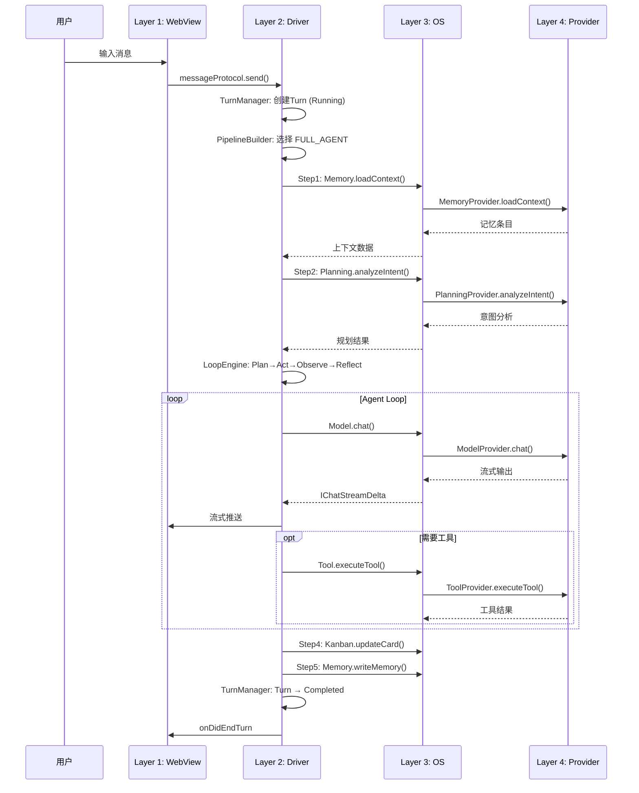

# Sarosis Agents Client — 项目框架全景分析

> **版本**: v2.0  
> **更新日期**: 2026-05-26  
> **基于源码**: `src/`, `extensions/`, `package.json`, `.github/copilot-instructions.md`  
> **关联文档**: [Four-Layer-Architecture-Framework.md](./Four-Layer-Architecture-Framework.md) · [SESSIONS_PROVIDER.md](../src/vs/sessions/SESSIONS_PROVIDER.md) · [LAYOUT.md](../src/vs/sessions/LAYOUT.md)

---

## 目录

- [一、项目概述](#一项目概述)
- [二、架构分层](#二架构分层)
- [三、源码结构详解](#三源码结构详解)
- [四、核心系统分析](#四核心系统分析)
- [五、Sessions 层 — Sarosis 核心创新](#五sessions-层--saros-核心创新)
- [六、Agent Studio 四层子架构](#六agent-studio-四层子架构)
- [七、Workbench Chat 系统](#七workbench-chat-系统)
- [八、扩展系统](#八扩展系统)
- [九、技术栈详解](#九技术栈详解)
- [十、构建与开发工作流](#十构建与开发工作流)
- [十一、数据流与交互时序](#十一数据流与交互时序)
- [十二、与原始 VS Code 的差异](#十二与原始-vs-code-的差异)
- [十三、设计模式与编码规范](#十三设计模式与编码规范)
- [十四、实现状态总览](#十四实现状态总览)
- [十五、性能与安全](#十五性能与安全)
- [十六、未来方向](#十六未来方向)

---

## 一、项目概述

### 1.1 项目标识

| 属性 | 值 |
|------|-----|
| **项目名称** | Sarosis Agents Client |
| **基础框架** | VS Code Code-OSS v1.120.0 |
| **许可证** | MIT |
| **模块系统** | ES Modules (`"type": "module"`) |
| **主要语言** | TypeScript |
| **运行时** | Electron 39.x + Node.js |
| **定位** | AI Agents 驱动的智能开发环境客户端 |

### 1.2 项目定位

Sarosis Agents Client 是基于 VS Code 开源核心 (Code-OSS) 深度定制的 **AI 代理客户端平台**，核心定位：

1. **AI-First 开发环境** — 将 AI Agent 能力作为一等公民集成到 IDE 中
2. **多代理编排平台** — 支持多模型、多工具、多技能的代理编排
3. **会话驱动工作流** — 以 Agent Session 为核心的交互范式
4. **可扩展能力架构** — Provider 插件化，所有 AI 能力均可安装/卸载

### 1.3 核心能力矩阵

```
┌──────────────────────────────────────────────────────────────┐
│                    Sarosis 核心能力                          │
├─────────────┬─────────────┬──────────────┬─────────────────┤
│  多模型接入  │  代理编排    │  会话管理     │  上下文增强     │
│  Knot AG-UI │  任务规划    │  多会话并行   │  文件上下文     │
│  OpenAI     │  工具调用    │  会话隔离     │  代码上下文     │
│  Anthropic  │  循环执行    │  状态持久化   │  对话历史压缩   │
│  Ollama     │  委派子Agent │  跨会话共享   │  知识检索(RAG)  │
├─────────────┼─────────────┼──────────────┼─────────────────┤
│  技能系统    │  插件生态    │  调度系统     │  任务看板       │
│  内置技能    │  Agent插件   │  Cron定时     │  Kanban视图     │
│  自定义技能  │  工具插件    │  文件监控     │  树形视图       │
│  技能市场    │  MCP Gateway │ 事件触发     │  分析视图       │
│  从操作提炼  │  自定义适配  │  一次性任务   │  时间线视图     │
└─────────────┴─────────────┴──────────────┴─────────────────┘
```

---

## 二、架构分层

### 2.1 VS Code 原始分层

VS Code 采用严格的分层架构，依赖方向单向向下：

```
┌─────────────────────────────────────────────────┐
│  vs/workbench  — 主工作台 (UI + 业务逻辑)       │
│    contrib/ services/ browser/ api/              │
├─────────────────────────────────────────────────┤
│  vs/editor     — Monaco 编辑器核心              │
│    common/ browser/ contrib/                     │
├─────────────────────────────────────────────────┤
│  vs/platform   — 平台服务层 (DI + 80+ 服务)     │
│    chat/ agentHost/ contextManagement/ ...       │
├─────────────────────────────────────────────────┤
│  vs/base       — 基础工具库                     │
│    common/ browser/ node/ test/                  │
└─────────────────────────────────────────────────┘
        依赖方向: workbench → editor → platform → base
```

### 2.2 Sarosis 扩展分层

Sarosis 在 VS Code 分层之上增加了 **Sessions 层**，与 workbench 同级：

```
┌─────────────────────────────────────────────────────────────┐
│  vs/sessions  — Agent Sessions 窗口层 (Sarosis 核心扩展)    │
│    browser/ common/ contrib/ services/                       │
├─────────────────────────────────────────────────────────────┤
│  vs/workbench — 标准工作台                                   │
├─────────────────────────────────────────────────────────────┤
│  vs/editor    — 编辑器核心                                   │
├─────────────────────────────────────────────────────────────┤
│  vs/platform  — 平台服务                                     │
├─────────────────────────────────────────────────────────────┤
│  vs/base      — 基础工具                                     │
└─────────────────────────────────────────────────────────────┘

关键约束:
  ✅ sessions 可 import workbench (及其下层所有模块)
  ❌ workbench 不可 import sessions (反向禁止)
```

### 2.3 完整依赖关系图

```
                    ┌──────────────┐
                    │  Extensions  │ ← 外部插件 (copilot, knot-agui, hermes...)
                    └──────┬───────┘
                           │ Extension API
                    ┌──────▼───────┐
                    │  vs/sessions │ ← Agent Sessions 窗口
                    └──────┬───────┘
                           │
            ┌──────────────┼──────────────┐
            │              │              │
     ┌──────▼──────┐ ┌────▼────┐ ┌───────▼───────┐
     │ vs/workbench│ │vs/editor│ │ vs/platform   │
     │  (Chat等)   │ │(Monaco) │ │(80+ services) │
     └──────┬──────┘ └────┬────┘ └───────┬───────┘
            │              │              │
            └──────────────┼──────────────┘
                           │
                    ┌──────▼──────┐
                    │   vs/base   │ ← 基础工具 (URI, Event, Lifecycle...)
                    └─────────────┘
```

---

## 三、源码结构详解

### 3.1 顶层目录

```
saros-agents-client/
├── src/                     # 主 TypeScript 源码
│   ├── vs/                 # VS Code 核心源码
│   ├── typings/            # 类型定义
│   ├── vscode-dts/         # VS Code API 类型定义 (含 proposed APIs)
│   ├── bootstrap-*.ts      # 启动引导文件
│   ├── main.ts             # Electron 主入口
│   └── server-main.ts      # 服务器入口
├── extensions/              # 内置扩展 (含 Sarosis 专有扩展)
├── build/                   # 构建脚本和 CI/CD 工具
├── test/                    # 集成测试和测试基础设施
├── scripts/                 # 开发和构建脚本
├── resources/               # 静态资源 (图标、主题等)
├── out/                     # 编译输出 (构建生成)
├── doc/                     # 项目文档
├── .github/                 # GitHub 配置 (copilot-instructions 等)
├── AGENTS.md               # AI 代理指令文件
└── package.json             # 项目配置
```

### 3.2 `src/vs/` 核心目录

```
src/vs/
├── base/                    # 基础工具和跨平台抽象
│   ├── common/             # 通用工具 (URI, Event, Lifecycle, CancellationToken...)
│   ├── browser/            # 浏览器相关 (DOM, Keyboard, Worker...)
│   ├── node/               # Node.js 相关 (FS, Process, CP...)
│   └── test/               # 基础测试工具
│
├── platform/               # 平台服务 (约 80+ 服务模块)
│   ├── agentHost/          # 代理宿主服务 ← Sarosis 新增
│   ├── chat/               # 聊天服务
│   ├── contextManagement/  # 上下文管理 ← Sarosis 新增
│   ├── sessions/           # 会话服务 ← Sarosis 新增
│   ├── aiRouter/           # AI 路由服务 ← Sarosis 新增
│   ├── languageModel/      # 语言模型服务
│   ├── workspace/          # 工作区服务
│   ├── instantiation/      # 依赖注入框架
│   ├── storage/            # 存储服务
│   ├── telemetry/          # 遥测服务
│   └── ...                 # (约 80+ 其他服务)
│
├── editor/                 # Monaco 编辑器
│   ├── common/             # 编辑器通用 (Model, Modes, Tokens...)
│   ├── browser/            # 编辑器浏览器 (View, Widgets...)
│   └── contrib/            # 编辑器贡献 (Find, Hover, Suggest...)
│
├── workbench/              # 标准工作台
│   ├── browser/            # 核心 UI 组件 (Parts, Layout, Actions)
│   ├── services/           # 服务实现
│   ├── contrib/            # 功能贡献 (git, debug, search, terminal, chat...)
│   └── api/                # Extension Host + VS Code API
│
├── sessions/               # Agent Sessions 窗口 ← Sarosis 核心扩展
│   ├── browser/            # Sessions 工作台实现
│   ├── common/             # 共享类型和上下文
│   ├── contrib/            # 30+ 功能贡献模块
│   ├── services/           # Sessions 专属服务
│   ├── electron-browser/   # 桌面端入口
│   └── test/               # 测试
│
├── code/                   # Electron 主进程实现
└── server/                 # 服务器端实现
```

### 3.3 `src/vs/platform/` Sarosis 新增服务

Sarosis 在平台层新增了多个关键服务：

| 服务目录 | 功能 | 说明 |
|----------|------|------|
| `agentHost/` | 代理宿主 | 管理本地/远程代理实例生命周期 |
| `chat/` | 聊天核心 | 聊天请求/响应、流式输出 |
| `contextManagement/` | 上下文管理 | 智能上下文收集、过滤、增强 |
| `sessions/` | 会话核心 | 会话状态管理、持久化 |
| `aiRouter/` | AI 路由 | 模型选择、请求路由 |
| `languageModel/` | 语言模型 | 模型注册、配置、认证 |

---

## 四、核心系统分析

### 4.1 代理系统 (Agents System)

```
Agents System
│
├── Agent Host Service (platform/agentHost)
│   ├── Agent Registration — 代理注册与发现
│   ├── Agent Lifecycle — 创建、运行、暂停、终止
│   └── Agent Communication — 代理间消息传递
│
├── Agent Types (代理类型)
│   ├── Chat Agent — 对话代理 (聊天交互)
│   ├── Code Agent — 代码代理 (编辑/创建文件)
│   ├── Task Agent — 任务代理 (执行特定任务)
│   └── Custom Agents — 自定义代理 (用户/插件定义)
│
├── Agent Orchestration (代理编排)
│   ├── Task Planning — 意图分析、任务分解
│   ├── Tool Invocation — MCP 工具调用
│   ├── Agent Loop — Plan→Act→Observe→Reflect 循环
│   ├── Sub-Agent Delegation — 子代理委派
│   └── Result Synthesis — 结果综合
│
└── Agent Instance Management
    ├── Gallery — Agent 模板库 (内置/市场/自定义)
    ├── Instance — 从模板创建的运行实例
    ├── Config — agent.yaml / JSON 配置
    └── State — 运行时状态持久化
```

### 4.2 会话管理系统

```
Session Management
│
├── Session Provider Architecture
│   ├── ISessionsProvider — 会话提供者接口
│   ├── CopilotChatSessionsProvider — CLI/Cloud 会话
│   ├── RemoteAgentHostSessionsProvider — 远程代理会话
│   └── Custom Providers — 可扩展的第三方提供者
│
├── Session Data Model (ISessionData)
│   ├── Reactive Properties — 可观察属性 (title, status, changes...)
│   ├── Session Workspace — 工作区信息 (label, repositories)
│   └── Session Status — InProgress | NeedsInput | Completed | ...
│
├── Session Services
│   ├── ISessionsManagementService — 活跃会话、路由
│   ├── ISessionsProvidersService — 提供者注册/查询
│   └── Agent Sessions Service — 代理会话管理
│
└── Session UI
    ├── SessionsViewPane — 会话列表视图
    ├── SessionsTitleBarWidget — 标题栏会话选择器
    └── ChangesView — 文件变更视图
```

### 4.3 上下文管理系统

```
Context Management
│
├── Context Collectors (收集器)
│   ├── Workspace Collector — 项目结构、配置文件
│   ├── Editor Collector — 当前文件、选中代码、光标位置
│   ├── Terminal Collector — 终端输出、命令历史
│   └── Git Collector — 变更状态、分支信息
│
├── Context Processors (处理器)
│   ├── Relevance Filter — 相关性过滤与排序
│   ├── ContextManager — 对话历史压缩 (超50%阈值自动摘要)
│   └── Summarizer — 长上下文摘要生成
│
├── Context Providers (提供者)
│   ├── API Context — VS Code Extension API 上下文
│   ├── UI Context — 用户操作上下文
│   └── Agent Context — 代理运行时上下文
│
└── Context Enhancement
    ├── Implicit Context — 隐式上下文 (自动推断)
    ├── Explicit Context — 显式上下文 (用户指定)
    └── Dynamic Variables — 动态上下文变量
```

### 4.4 任务编排系统

```
Task Orchestration
│
├── Planning Phase
│   ├── Intent Analysis — 用户意图分析
│   ├── Task Decomposition — 任务分解
│   └── Dependency Resolution — 依赖关系解析
│
├── Execution Phase
│   ├── Pipeline Execution — 管线执行 (Memory→Planning→Execute→Memory)
│   ├── Agent Loop — Plan→Act→Observe→Reflect 循环
│   ├── Tool Execution — 工具调用 (MCP/内置)
│   ├── Parallel Execution — 并行工具执行 (ParallelToolExecutor)
│   └── Sub-Agent — 子代理委派 (SubAgentManager)
│
├── Control Mechanisms
│   ├── IterationBudget — 迭代预算 (默认90次上限)
│   ├── CancellationHub — 取消协调 (AbortController)
│   ├── ErrorRecovery — 异常恢复 (5策略)
│   └── ToolArgumentRepairer — JSON 参数修复
│
└── Synthesis Phase
    ├── Result Aggregation — 结果聚合
    ├── Memory Write — 记忆写入
    └── Kanban Update — 任务看板更新
```

---

## 五、Sessions 层 — Sarosis 核心创新

### 5.1 定位与设计理念

Sessions 层是 Sarosis 最核心的架构创新，它是一个 **独立的 Agent Sessions 窗口**，与标准 VS Code 工作台平行：

| 特性 | 标准工作台 (workbench) | Sessions 窗口 |
|------|----------------------|---------------|
| 布局 | 可自由配置 | 固定布局，不可调 |
| 活动栏 | 有 | 无 |
| 状态栏 | 有 | 无 |
| 核心交互 | 编辑器驱动 | 聊天驱动 (Chat-First) |
| 编辑器 | 主网格区域 | 模态叠加层 |
| 标题栏 | 标准标题 | 会话感知 (显示活跃会话) |
| 设计目标 | 通用编辑 | Agent 工作流优化 |

### 5.2 Sessions 层目录结构

```
src/vs/sessions/
├── README.md                    # 架构规范文档
├── LAYOUT.md                    # 布局规范
├── AI_CUSTOMIZATIONS.md         # AI 定制化设计
├── SESSIONS_PROVIDER.md         # Sessions Provider 架构
├── sessions.common.main.ts      # 通用入口 (25KB)
├── sessions.desktop.main.ts     # 桌面端入口
├── sessions.web.main.ts         # Web端入口
│
├── browser/                     # 核心 Workbench 实现
│   ├── workbench.ts             # 主 Workbench 类 (86KB)
│   ├── layoutActions.ts         # 布局切换操作
│   ├── paneCompositePartService.ts  # 面板服务
│   ├── employeeChat/            # 员工聊天面板
│   ├── parts/                   # UI Part 实现
│   │   ├── titlebarPart.ts      # 简化标题栏
│   │   ├── sidebarPart.ts       # 侧边栏 (含 footer)
│   │   ├── auxiliaryBarPart.ts  # 辅助栏 (含运行脚本下拉)
│   │   ├── panelPart.ts         # 底部面板
│   │   ├── chatBarPart.ts       # 聊天栏 (主要交互区)
│   │   ├── projectBarPart.ts    # 项目栏 (文件夹入口)
│   │   └── editorPart.ts        # 编辑器 (模态叠加)
│   ├── widget/                  # 代理聊天 Widget
│   └── media/                   # 样式和资源
│
├── common/                      # 共享类型
│   ├── agentHostSessionWorkspace.ts  # 代理宿主会话工作区
│   ├── agentHostSessionsProvider.ts  # 代理宿主提供者
│   ├── agentStudioService.ts    # Agent Studio 服务类型
│   ├── agentStudioTypes.ts      # Agent Studio 类型 (36KB)
│   ├── contextkeys.ts           # 上下文键
│   └── sessionsTelemetry.ts     # 遥测
│
├── contrib/                     # 功能贡献 (30+ 模块)
│   ├── agentHost/               # 代理宿主
│   ├── agentStudio/             # Agent Studio (四层架构)
│   ├── chat/                    # 聊天相关
│   ├── sessions/                # 会话管理
│   ├── codeReview/              # 代码审查
│   ├── changes/                 # 文件变更
│   ├── sourceControl/           # 源码管理
│   ├── terminal/                # 终端
│   ├── search/                  # 搜索
│   ├── editor/                  # 编辑器增强
│   ├── welcome/                 # 欢迎页
│   ├── configuration/           # 配置
│   ├── github/                  # GitHub 集成
│   ├── worktree/                # 工作树
│   ├── browserView/             # 浏览器视图
│   ├── aquarium/                # Aquarium 功能
│   └── ...                      # (30+ 总计)
│
├── services/                    # Sessions 专属服务
│   ├── configuration/           # 配置服务
│   ├── sessions/                # 会话服务
│   ├── title/                   # 标题服务
│   ├── vscode/                  # VS Code 集成
│   └── workspace/               # 工作区服务
│
├── electron-browser/            # 桌面端专用
│   ├── sessions.main.ts         # 主进程
│   ├── sessions.html            # HTML 入口
│   └── parts/                   # 桌面端 Part
│
└── test/                        # 测试
    ├── browser/
    ├── common/
    └── e2e/
```

### 5.3 Sessions 布局结构

```
┌──────────────────────────────────────────────────────────────────┐
│ TitleBar (会话感知) [Session Picker] [Account] [Open in VSCode] │
├──────────┬─────────────────────────────────┬────────────────────┤
│          │                                 │                    │
│ Sidebar  │      Editor Area               │  AuxiliaryBar      │
│          │  ┌───────────────────────────┐  │  ┌──────────────┐  │
│ Sessions │  │   模态编辑器叠加层        │  │  │ Chat         │  │
│ Workspaces│  │   (非模态时显示聊天)      │  │  │ Delegation   │  │
│ Gallery  │  │                           │  │  │              │  │
│ Agents   │  │                           │  │  └──────────────┘  │
│ Skills   │  └───────────────────────────┘  │                    │
│          ├─────────────────────────────────┤                    │
│          │      Panel (底部)               │                    │
│          │  Terminal · Output · TaskBoard  │                    │
├──────────┴─────────────────────────────────┴────────────────────┤
│ ProjectBar (底部项目栏)                                          │
└──────────────────────────────────────────────────────────────────┘
```

### 5.4 Sessions Provider 架构

Sessions 层采用可扩展的 Provider 模型管理会话：

```
┌──────────────────────────────────────────────────────┐
│                    UI Components                      │
│  SessionsViewPane · TitleBarWidget · ChangesView     │
└─────────────────────┬────────────────────────────────┘
                      │ reads ISessionData observables
┌─────────────────────▼────────────────────────────────┐
│       ISessionsManagementService                     │
│  activeSession · getSessions() · openSession()       │
│  sendRequest() · setSessionType()                    │
└─────────────────────┬────────────────────────────────┘
┌─────────────────────▼────────────────────────────────┐
│       ISessionsProvidersService                      │
│  registerProvider() · getProviders() · getSessions() │
└───────┬─────────────┬──────────────┬────────────────┘
        │             │              │
  ┌─────▼─────┐ ┌─────▼──────┐ ┌────▼───────┐
  │ Copilot   │ │ Remote     │ │ Custom     │
  │ Chat      │ │ Agent Host │ │ Provider   │
  │ Provider  │ │ Provider   │ │ (future)   │
  └───────────┘ └────────────┘ └────────────┘
```

---

## 六、Agent Studio 四层子架构

Agent Studio 是 Sessions 层中最核心的功能贡献模块，内部实现了独立的四层架构。详见 [Four-Layer-Architecture-Framework.md](./Four-Layer-Architecture-Framework.md)。

### 6.1 四层模型

```
┌───────────────────────────────────────────────────────────────┐
│  Layer 1: UI 层 (Presentation)                                │
│  WebView: React + Zustand + ReactFlow + TailwindCSS           │
│  ChatBar · Canvas · TaskBoard · Gallery · ModelSelector       │
├───────────────────────────────────────────────────────────────┤
│                  ↕ messageProtocol (Host ↔ WebView RPC)       │
├───────────────────────────────────────────────────────────────┤
│  Layer 2: Driver 层 (Orchestration)                           │
│  IAgentDriverService — 执行编排引擎                            │
│  TurnManager · SlotOrchestrator · LoopEngine · PipelineBuilder │
├───────────────────────────────────────────────────────────────┤
│                  ↕ Slot API (getActiveXxxProvider())           │
├───────────────────────────────────────────────────────────────┤
│  Layer 3: OS 层 (Capability Abstraction)                      │
│  IAgentOSService — 无状态能力仓库 + 注册中心                    │
│  7 Slots: Model · Memory · Tool · Planning · Execution        │
│          · Retrieval · Kanban                                  │
├───────────────────────────────────────────────────────────────┤
│                  ↕ Provider Interface (registerXxxProvider())  │
├───────────────────────────────────────────────────────────────┤
│  Layer 4: Provider 层 (Plugin Implementation)                 │
│  Knot AG-UI · DirectLLM · OpenClaw · Hermes · MCP Gateway    │
└───────────────────────────────────────────────────────────────┘
```

### 6.2 核心设计原则

| 原则 | 描述 |
|------|------|
| **单向依赖** | UI → Driver → OS → Provider，反向禁止 |
| **接口隔离** | 每层仅暴露接口 (`I`前缀)，实现细节封装 |
| **工作区隔离** | 每个工作区独立持有完整的 Driver + OS + Provider 实例栈 |
| **能力可组合** | 一次对话可混合来自不同 Provider 的能力 |
| **优雅降级** | Slot 无 Provider 时 Driver 自动跳过，退化为直通模式 |
| **插件化一切** | 所有 Provider 均为可安装/卸载的插件 |

### 6.3 源码位置

```
src/vs/sessions/contrib/agentStudio/
├── common/                          # 接口层 (跨进程共享)
│   ├── agentOS.ts                   # IAgentOSService ✅
│   ├── agentDriver.ts               # IAgentDriverService ✅
│   ├── providers.ts                 # 7个 Provider 接口 ✅
│   ├── agentStudio.ts               # Studio + Chat + Delegation ✅
│   ├── agentInstance.ts             # Instance + Gallery ✅
│   ├── agentScheduler.ts            # 5种触发模式 ✅
│   ├── crewTeam.ts                  # Crew/Team 编排 ✅
│   ├── healthMonitor.ts             # 健康监控 ✅
│   ├── eventBridge.ts               # 事件总线 (含实现) ✅
│   ├── workspaceTemplate.ts         # 模板/快照 ✅
│   ├── contextManager.ts            # 上下文压缩 ✅
│   ├── parallelToolExecutor.ts      # 并行工具执行 ✅
│   ├── iterationBudget.ts           # 迭代预算 ✅
│   ├── subAgentManager.ts           # 子Agent管理 ✅
│   └── toolRepair.ts               # JSON参数修复 ✅
│
├── browser/                         # 实现层 (Renderer 进程)
│   ├── agentOSService.ts            # OS 服务实现 ✅
│   ├── slotRegistry.ts              # 能力槽注册表 ✅
│   ├── agentDriverService.ts        # Driver 服务实现 ✅
│   ├── agentStudioService.ts        # Studio CRUD ✅
│   ├── agentChatService.ts          # Chat 兼容层 ⚠️
│   ├── agentInstanceService.ts      # Instance 实现 ✅
│   ├── agentGalleryService.ts       # Gallery 实现 ✅
│   ├── agentSchedulerService.ts     # Scheduler 实现 ✅
│   ├── providers/                   # 内置 Provider
│   │   ├── execution/               # IExecutionProvider
│   │   ├── memory/                  # IMemoryProvider (本地文件 + 向量)
│   │   ├── planning/                # IPlanningProvider
│   │   └── tool/                    # IToolProvider
│   └── views/                       # UI 视图
│
├── webview/                         # WebView 源码 (React)
│   └── src/
│       ├── features/                # chat, canvas, taskBoard...
│       ├── shared/                  # protocol, components, stores
│       └── app.tsx
│
└── test/                            # 测试
```

---

## 七、Workbench Chat 系统

标准工作台的 `workbench/contrib/chat/` 是 VS Code 原生聊天系统的实现，Sarosis 对其进行了深度扩展。

### 7.1 核心模块

```
workbench/contrib/chat/
├── browser/
│   ├── chat.contribution.ts         # 核心贡献注册 (128KB, 最大的贡献文件)
│   ├── chat.ts                      # Chat 核心逻辑
│   ├── agentSessions/               # 代理会话 (Viewer, Model, Control...)
│   ├── aiCustomization/             # AI 定制化管理 (编辑器, 列表...)
│   ├── agentPluginEditor/           # Agent 插件编辑器
│   ├── chatEditing/                 # 聊天编辑
│   ├── chatManagement/              # 聊天管理
│   ├── chatSessions/                # 聊天会话
│   ├── chatDebug/                   # 调试面板
│   ├── chatSetup/                   # 设置向导
│   ├── chatStatus/                  # 状态管理
│   ├── contextContrib/              # 上下文贡献
│   ├── promptSyntax/                # Prompt 语法
│   ├── attachments/                 # 附件系统 (Widget, Model, Resolve)
│   ├── tools/                       # 工具系统
│   ├── widget/                      # Chat Widget
│   ├── widgetHosts/                 # Widget 宿主
│   ├── actions/                     # 30+ 操作处理 (Execute, Context, Codeblock...)
│   ├── accessibility/               # 无障碍
│   ├── telemetry/                   # 遥测
│   └── viewsWelcome/                # 欢迎视图
│
├── common/
│   ├── languageModels.ts            # 语言模型核心 (73KB, 最大类型文件)
│   ├── chatModes.ts                 # 聊天模式
│   ├── chatService/                 # 聊天服务
│   ├── chatSessionsService.ts       # 会话服务
│   ├── customizationHarnessService.ts  # 定制化挂接
│   ├── participants/                # 聊天参与者
│   ├── plugins/                     # 插件系统
│   ├── tools/                       # 工具定义
│   ├── model/                       # 数据模型
│   └── requestParser/              # 请求解析
│
└── electron-browser/
    ├── chat.contribution.ts         # 桌面端贡献
    └── builtInTools/               # 内置工具
```

### 7.2 Sarosis 扩展的关键文件

| 文件 | 大小 | 功能 |
|------|------|------|
| `chat.contribution.ts` | 128KB | 核心贡献注册，含大量 Sarosis 定制 |
| `agentSessionsViewer.ts` | 62KB | 代理会话查看器 |
| `aiCustomizationManagementEditor.ts` | 99KB | AI 定制化管理编辑器 |
| `pluginListWidget.ts` | 48KB | 插件列表组件 |
| `chatActions.ts` | 67KB | 聊天操作处理 |
| `chatExecuteActions.ts` | 44KB | 执行操作处理 |
| `agentSessionsControl.ts` | 33KB | 代理会话控制 |

---

## 八、扩展系统

### 8.1 内置扩展概览

`extensions/` 目录包含约 60+ 内置扩展，分为以下类别：

### 8.2 Sarosis 专有扩展

| 扩展 | 功能 | 状态 |
|------|------|------|
| `agent-studio/` | Agent Studio 核心 — Agent 创建/管理/编排 | 活跃开发 |
| `hermes-agent/` | Hermes Agent — 多能力 Provider (Memory+Tool+Planning+Execution) | 规划中 |
| `hermes-agent-provider/` | Hermes Agent Provider — Agent 托管服务 | 规划中 |
| `knot-agui/` | Knot AG-UI — Model Provider (Knot 平台集成) | 活跃开发 |
| `mermaid-chat-features/` | Mermaid 聊天特性 — 图表渲染支持 | 实现中 |
| `planning-example/` | Planning 示例 — 任务规划参考实现 | 示例 |
| `execution-example/` | Execution 示例 — 执行引擎参考实现 | 示例 |
| `retrieval-example/` | Retrieval 示例 — RAG 检索参考实现 | 示例 |
| `kanban-example/` | Kanban 示例 — 看板参考实现 | 示例 |
| `tool-example/` | Tool 示例 — 工具参考实现 | 示例 |
| `memory-example/` | Memory 示例 — 记忆参考实现 | 示例 |

### 8.3 Copilot 扩展

`copilot/` 是最大的内置扩展 (227KB package.json)，提供：
- GitHub Copilot 集成
- 聊天参与者
- 代码补全
- Agent 能力

### 8.4 标准 VS Code 扩展

包含语言支持 (typescript, python, java, cpp, go, rust 等 30+ 语言)、核心功能 (git, emmet, debug 等)、主题 (10+ 内置主题) 等。

### 8.5 扩展注册机制

Sarosis 扩展了标准 VS Code 扩展 manifest，新增了 `agentCapabilities` 贡献点：

```jsonc
// extensions/knot-agui/package.json (示例)
{
  "contributes": {
    "agentCapabilities": [
      { "slot": "model", "id": "knot-agui", "displayName": "Knot AG-UI" }
    ],
    "configuration": {
      "properties": {
        "saros.knot.token": { "type": "string" },
        "saros.knot.endpoint": { "type": "string" }
      }
    }
  }
}
```

---

## 九、技术栈详解

### 9.1 前端技术

| 技术 | 版本/规格 | 用途 |
|------|----------|------|
| **Electron** | 39.x | 桌面应用框架 |
| **TypeScript** | 6.0-dev | 主开发语言 |
| **Monaco Editor** | 内置 | 代码编辑器 |
| **React** | 18 | WebView UI 框架 (Agent Studio) |
| **Zustand** | — | WebView 状态管理 |
| **ReactFlow** | — | 画布/节点图 |
| **TailwindCSS** | — | WebView 样式系统 |
| **esbuild** | 0.28 | WebView 打包 |
| **xterm** | 6.1-beta | 终端模拟器 |

### 9.2 后端技术

| 技术 | 用途 |
|------|------|
| **Node.js** | 运行时 |
| **ES Modules** | 模块系统 (`"type": "module"`) |
| **SQLite3** | 本地存储 (@vscode/sqlite3) |
| **undici** | HTTP 客户端 |
| **ws** | WebSocket 通信 |
| **ssh2** | SSH 连接 |
| **node-pty** | 伪终端 |

### 9.3 AI/ML 集成

| SDK/协议 | 用途 |
|----------|------|
| `@anthropic-ai/sdk` (0.82+) | Anthropic Claude 集成 |
| `@github/copilot-sdk` (0.3+) | GitHub Copilot 集成 |
| `@anthropic-ai/claude-agent-sdk` (0.2.128) | Claude Agent SDK |
| `@vscode/copilot-api` (0.3+) | Copilot API |
| **MCP** (Model Context Protocol) | 工具集成协议 |
| **AG-UI** | Agent UI 协议 (Knot) |

### 9.4 构建工具链

| 工具 | 用途 |
|------|------|
| **Gulp** | 主构建编排 |
| **Rspack** | 快速打包 (serve-out) |
| **Vite** | WebView 开发服务器 |
| **esbuild** | 扩展和 WebView 编译 |
| **tsgo** | TypeScript 原生类型检查 |
| **TSEC** | 安全编译检查 |
| **Playwright** | E2E 测试 |

### 9.5 代码质量工具

| 工具 | 用途 |
|------|------|
| **ESLint** | 代码质量检查 |
| **Stylelint** | 样式检查 |
| **Hygiene** | 代码卫生检查 (precommit) |
| **Layer Checker** | 分层依赖检查 |
| **Cyclic Dependency Check** | 循环依赖检测 |
| **Define Class Fields Check** | 类字段定义检查 |

---

## 十、构建与开发工作流

### 10.1 常用构建命令

```bash
# ─── 开发模式 ───
npm run watch                  # 全量监听 (client + extensions + copilot)
npm run watch-client           # 仅监听客户端
npm run watch-web              # Web 版本监听
npm run watch-extensions       # 扩展监听
npm run watch-copilot          # Copilot 扩展监听

# ─── 编译 ───
npm run compile                # 标准编译 (Gulp)
npm run compile-build          # 生产编译 (含混淆)
npm run compile-check-ts-native # TypeScript 类型检查 (tsgo)

# ─── 生产构建 ───
npm run minify-vscode          # 压缩 VS Code 代码
npm run compile-extensions-build # 扩展生产编译

# ─── 测试 ───
npm run test-browser           # 浏览器测试 (Playwright)
npm run test-node              # Node.js 测试 (Mocha)
npm run smoketest              # 冒烟测试

# ─── 代码质量 ───
npm run eslint                 # ESLint 检查
npm run stylelint              # Stylelint 检查
npm run hygiene                # 代码卫生检查
npm run valid-layers-check     # 层依赖检查
npm run check-cyclic-dependencies # 循环依赖检查
npm run define-class-fields-check  # 类字段检查
npm run tsec-compile-check     # 安全编译检查
```

### 10.2 架构验证机制

项目包含多层架构验证，确保代码分层正确：

```
1. valid-layers-check — 检查模块间的分层依赖是否合规
   ├── tsconfig.browser.json
   ├── tsconfig.worker.json
   ├── tsconfig.node.json
   ├── tsconfig.electron-browser.json
   ├── tsconfig.electron-main.json
   └── tsconfig.electron-utility.json

2. check-cyclic-dependencies — 检测循环依赖

3. compile-check-ts-native — TypeScript 原生类型检查 (tsgo)

4. define-class-fields-check — 类字段初始化顺序检查

5. tsec-compile-check — 安全编译检查 (TSEC)
```

### 10.3 开发环境设置

1. **依赖安装**: `npm install`
2. **编译**: `npm run compile`
3. **运行桌面版**: `./scripts/code-server` 或 `./scripts/code-web`
4. **调试**: 使用 VS Code 调试配置

---

## 十一、数据流与交互时序

### 11.1 标准对话流 (FULL_AGENT Pipeline)



### 11.2 会话创建流

```
User picks workspace → SessionsManagementService.createNewSession()
  → Provider.createNewSession(workspace) → ISessionData 创建
  → 设置为 activeSession → UI 更新
```

### 11.3 IChatStreamDelta 事件类型

| 事件类型 | 数据 | 说明 |
|----------|------|------|
| `text` | content: string | 文本流式输出 |
| `thinking` | content: string | 思考过程 |
| `tool_start` | toolName, callId | 工具调用开始 |
| `tool_args` | callId, argsChunk | 工具参数流 |
| `tool_end` | callId, result | 工具调用结束 |
| `plan_start/step/end` | planId, step | 规划流程 |
| `memory_write` | entryId, summary | 记忆写入 |
| `kanban_update` | cardId, status | 看板更新 |
| `error` | code, message | 错误 |
| `done` | usage | 完成 (含 Token 用量) |

---

## 十二、与原始 VS Code 的差异

### 12.1 新增顶层模块

| 模块 | 位置 | 说明 |
|------|------|------|
| `vs/sessions/` | 顶层 | Agent Sessions 窗口 (与 workbench 同级) |
| `vs/platform/agentHost/` | 平台层 | 代理宿主服务 |
| `vs/platform/contextManagement/` | 平台层 | 上下文管理服务 |
| `vs/platform/sessions/` | 平台层 | 会话核心服务 |
| `vs/platform/aiRouter/` | 平台层 | AI 路由服务 |

### 12.2 扩展的核心模块

| 模块 | 扩展内容 |
|------|----------|
| `workbench/contrib/chat/` | 新增 agentSessions, aiCustomization, pluginEditor 等子系统 |
| `workbench/contrib/chat/common/languageModels.ts` | 73KB 类型文件，深度扩展模型定义 |
| `workbench/contrib/chat/browser/chat.contribution.ts` | 128KB，Sarosis 大量定制注册 |

### 12.3 新增扩展

| 扩展 | 说明 |
|------|------|
| `agent-studio/` | Agent Studio 核心 |
| `hermes-agent/` | Hermes Agent |
| `hermes-agent-provider/` | Hermes Agent Provider |
| `knot-agui/` | Knot AG-UI |
| `mermaid-chat-features/` | Mermaid 聊天 |

### 12.4 API 扩展 (Proposed APIs)

在 `vscode-dts/` 中定义的 Sarosis 专有提案 API：

| API 文件 | 功能 |
|----------|------|
| `chatParticipantAdditions.d.ts` | 聊天参与者扩展 |
| `chatSessionsProvider.d.ts` | 聊天会话提供者 |
| `agentSessionsWorkspace.d.ts` | 代理会话工作区 |
| `languageModelToolSets.d.ts` | 语言模型工具集 |

---

## 十三、设计模式与编码规范

### 13.1 核心设计模式

| 模式 | 应用场景 | 示例 |
|------|----------|------|
| **依赖注入 (DI)** | 所有服务通过构造函数注入 | `IInstantiationService` |
| **贡献模型** | 功能通过注册贡献到扩展点 | `contrib/` 目录 |
| **Provider/Adapter** | 能力抽象与具体实现分离 | Agent Studio 7 Slots |
| **观察者模式** | 响应式数据绑定 | `IObservable<T>`, `Event<T>` |
| **Middleware** | 请求管道拦截 | Driver 层洋葱模型 |
| **策略模式** | 错误恢复、管线构建 | ErrorRecovery 5策略 |
| **工厂模式** | 服务实例创建 | `IInstantiationService.createInstance()` |
| **单例服务** | 全局服务唯一实例 | `registerSingleton()` |

### 13.2 编码规范 (摘要)

| 规范 | 说明 |
|------|------|
| 缩进 | 使用 Tab，不用空格 |
| 命名 | PascalCase (type/enum), camelCase (function/property/variable) |
| 字符串 | 用户可见用双引号 + nls, 内部用单引号 |
| 箭头函数 | 优先于匿名函数 |
| 异步 | 优先 `async/await`，不用 `.then()` |
| Disposable | 必须立即注册，使用 `DisposableStore`/`MutableDisposable` |
| 注释 | JSDoc 风格 |
| 类型 | 禁止 `any`/`unknown` (除非绝对必要) |
| 服务依赖 | 必须在构造函数声明，禁止运行时通过 `IInstantiationService` 访问 |
| 事件 | 避免用事件驱动控制流，优先直接方法调用 |

---

## 十四、实现状态总览

### 14.1 服务实现状态

| 服务 | 接口 | 实现 | 状态 |
|------|------|------|------|
| **IAgentOSService** | `common/agentOS.ts` | `browser/agentOSService.ts` | ✅ 已实现 (含 Fallback) |
| **IAgentDriverService** | `common/agentDriver.ts` | `browser/agentDriverService.ts` | ✅ 已实现 (4步编排) |
| **SlotRegistry** | `common/providers.ts` | `browser/slotRegistry.ts` | ✅ 已实现 |
| **IAgentStudioService** | `common/agentStudio.ts` | `browser/agentStudioService.ts` | ✅ 已实现 |
| **IAgentChatService** | `common/agentStudio.ts` | `browser/agentChatService.ts` | ⚠️ 兼容层 |
| **IAgentDelegationService** | `common/agentStudio.ts` | `browser/agentDelegationService.ts` | ✅ 已实现 |
| **IAgentInstanceService** | `common/agentInstance.ts` | `browser/agentInstanceService.ts` | ✅ 已实现 |
| **IAgentGalleryService** | `common/agentInstance.ts` | `browser/agentGalleryService.ts` | ✅ 已实现 |
| **IAgentSchedulerService** | `common/agentScheduler.ts` | `browser/agentSchedulerService.ts` | ✅ 已实现 (5种触发) |
| **IEventBridgeService** | `common/eventBridge.ts` | 同文件 | ✅ 已实现 |

### 14.2 内置 Provider 状态

| Provider | 位置 | 状态 |
|----------|------|------|
| **ExecutionProvider** | `browser/providers/execution/` | ✅ 已实现 |
| **MemoryProvider** | `browser/providers/memory/` | ✅ 已实现 (文件 + 向量) |
| **PlanningProvider** | `browser/providers/planning/` | ✅ 已实现 |
| **ToolProvider** | `browser/providers/tool/` | ✅ 已实现 |

### 14.3 运行时工具集状态

| 组件 | 文件 | 状态 |
|------|------|------|
| **ContextManager** | `common/contextManager.ts` | ✅ 已实现 |
| **ParallelToolExecutor** | `common/parallelToolExecutor.ts` | ✅ 已实现 |
| **IterationBudget** | `common/iterationBudget.ts` | ✅ 已实现 |
| **SubAgentManager** | `common/subAgentManager.ts` | ✅ 已实现 |
| **ToolArgumentRepairer** | `common/toolRepair.ts` | ✅ 已实现 |
| **CronParser** | `common/cronParser.ts` | ✅ 已实现 |

### 14.4 待实现

| 服务/组件 | 状态 | 规划 Phase |
|-----------|------|-----------|
| **IWorkspaceRegistry** | 🔲 接口未创建 | P4 |
| **IWorkspaceTemplateService** | 🔲 接口已定义 | P4.2 |
| **IHealthMonitorService** | 🔲 接口已定义 | P4 |
| **ICrewTeamService** | 🔲 接口已定义 | P4.5 |
| **IMemoryConsolidationService** | 🔲 未创建 | P5 |
| **IAgentSelfUpgradeService** | 🔲 未创建 | P6 |
| **ITaskDelegationService** (增强) | 🔲 未创建 | P5c |
| **PipelineBuilder** (动态) | 🔲 当前固定4步 | P2 |
| **Driver 9组件拆分** | 🔲 当前内联 | P2 |

---

## 十五、性能与安全

### 15.1 性能优化策略

| 维度 | 策略 | 实现 |
|------|------|------|
| **启动** | 延迟加载 + 缓存 | 按需加载模块、积极缓存编译结果 |
| **运行时** | Web Workers + 增量更新 | 后台任务处理、只更新变更部分 |
| **构建** | Rspack + 并行 + 增量 | 更快的打包、多核CPU利用、增量编译 |
| **流式** | 16ms帧节流 + 背压控制 | StreamController |
| **迭代** | IterationBudget (默认90次) | 防止 Agent 无限循环 |
| **并行** | ParallelToolExecutor | 智能判断并行/串行工具执行 |
| **上下文** | ContextManager | 对话历史超50%自动压缩摘要 |

### 15.2 安全措施

| 维度 | 措施 | 说明 |
|------|------|------|
| **CSP** | Content Security Policy | 严格的内容安全策略 |
| **Sandbox** | 扩展沙箱 | 扩展在隔离环境中运行 |
| **权限** | 细粒度权限控制 | 需确认的操作 (file-delete, git-push 等) |
| **约束** | constraints 段不可修改 | Self-Upgrade 无法修改安全约束 |
| **隔离** | 会话间数据隔离 | 多工作区独立实例栈 |
| **加密** | 通信加密 | 所有网络通信加密 |
| **TSEC** | 安全编译检查 | 运行时强制检查 |
| **参数修复** | ToolArgumentRepairer | 修复 LLM 输出的 JSON 安全问题 |

---

## 十六、未来方向

### 16.1 短期 (Phase 2-4)

1. **Driver 层重构** — 9大组件拆分为独立文件
2. **Pipeline 动态构建** — 实现 PipelineBuilder，支持 3 种预置管线
3. **工作区隔离** — 实现 IWorkspaceRegistry
4. **Agent 实例管理** — 完善 Instance 生命周期

### 16.2 中期 (Phase 5-6)

1. **Memory Provider 增强** — 向量记忆、记忆沉淀
2. **Tool Provider 增强** — MCP Gateway 对接
3. **Planning+Execution** — 意图分析、执行引擎
4. **Agent Scheduler** — 5 种触发模式全部上线

### 16.3 长期愿景

1. **多代理协作 (Crew/Team)** — 支持 sequential/parallel/router/hierarchical 编排
2. **Agent 自升级** — Prompt优化、技能提取、配置调优
3. **记忆沉淀** — 5阶段后台流程 (压缩→提升→去重→衰减→知识图谱)
4. **生态建设** — 丰富的 Provider 插件生态
5. **云端集成** — 深度集成云服务

---

## 附录: 术语表

| 术语 | 定义 |
|------|------|
| **Session** | 一次完整的 Agent 交互上下文，从创建到归档 |
| **Turn** | 一次用户输入到模型输出的完整执行周期 |
| **Driver** | 驱动层，执行编排引擎，统一执行入口 |
| **OS** | 操作系统层，无状态能力仓库与注册中心 |
| **Provider** | 能力提供者插件，实现具体 Slot 接口 |
| **Slot** | 能力槽位，OS 层的抽象能力接口 (7个) |
| **Pipeline** | 可配置的执行步骤序列 |
| **Adapter** | 适配器，桥接标准接口与原生 API |
| **Instance** | Agent 实例，从 Gallery 模板创建 |
| **Gallery** | Agent 模板库 |
| **Crew** | Agent 团队，多 Agent 协作编排 |
| **MCP** | Model Context Protocol，工具集成协议 |
| **AG-UI** | Agent UI 协议，Knot 平台通信协议 |
| **Knot** | 内部 AI Agent 平台 |

---

**文档版本**: v2.0  
**更新日期**: 2026-05-26  
**基于源码审查**: `src/vs/`, `extensions/`, `package.json`  
**关联文档**: [Four-Layer-Architecture-Framework.md](./Four-Layer-Architecture-Framework.md)
