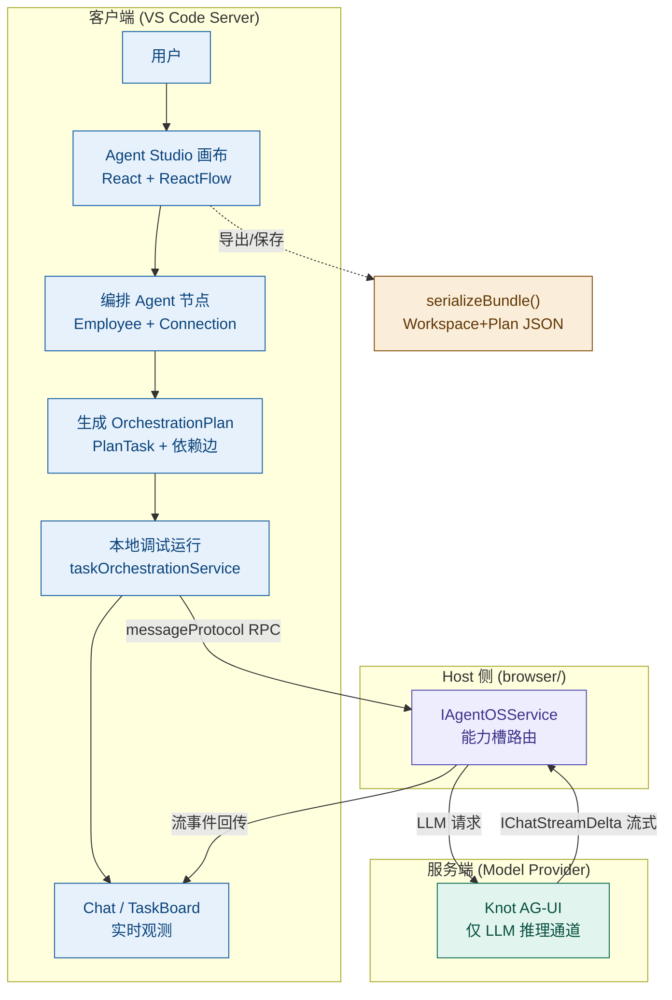
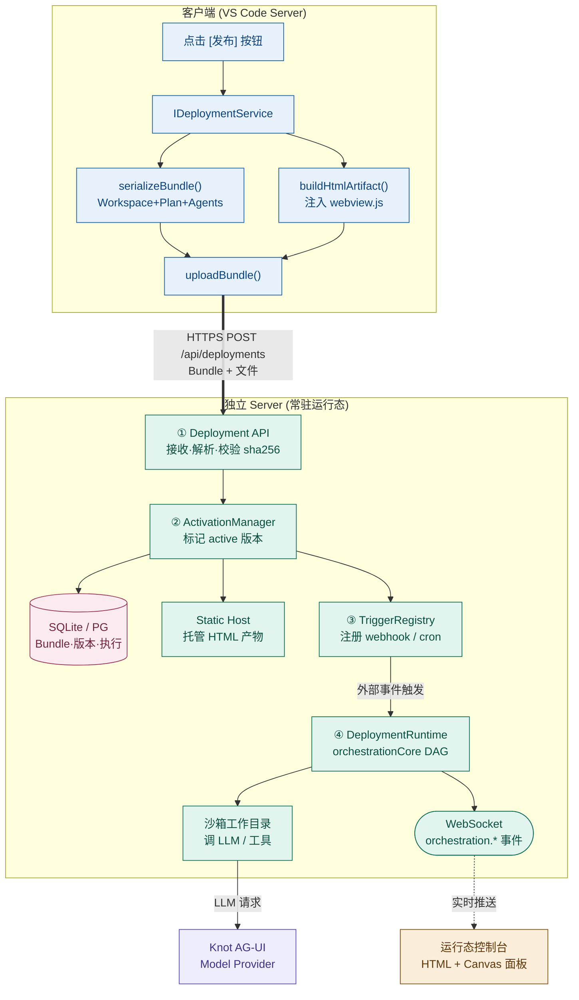

# 发布部署框架设计（Publish & Deploy Framework）

> **版本**: v1.4
> **创建时间**: 2026-06-01
> **更新时间**: 2026-06-01（v1.4 新增 §3.1 开发态/发布态 Mermaid 框架图——含客户端+服务端；v1.3 新增 §6.6 服务端运行态控制台 UI——左列表+过滤 / 右 HTML+Canvas+面板切换；v1.2 新增 §6.1 为什么必须独立 Server、§6.2 三种部署形态选型；v1.1 新增 §7 文件处理、§8 SQLite 数据库兼容方案）
> **参考项目**: n8n（工作流引擎 + 激活/发布模型 + SQLite 默认存储）
> **目标**: 用户在画布上编排好 Agent 工作流后，点击"发布"，系统将 **前端 HTML 产物** 和 **工作流定义** 部署到服务器运行。

---

## 1. 目标与场景

### 1.1 核心需求

用户在 Agent Studio 画布中编排好 Agent 工作流（节点 + 连线 + 任务编排计划），点击「发布」按钮后：

1. **序列化工作流** → 将画布定义 + 编排计划打包成可移植的 JSON（`DeploymentBundle`）。
2. **生成前端产物** → 产出一个可独立运行的 HTML 页面（嵌入 React WebView 产物），用于在服务器端展示工作流运行状态。
3. **部署到服务器** → 上传 Bundle 到服务端，服务端**激活**工作流，使其进入"运行态"，可被 Webhook / 定时器 / 手动触发。
4. **运行态可观测** → 已部署的 HTML 页面通过 WebSocket 实时接收执行事件，展示运行进度。

### 1.2 两类部署产物

| 产物 | 内容 | 运行位置 |
|------|------|---------|
| **HTML 前端** | 静态 HTML + React WebView JS（`webview.js`）+ 运行态只读画布 | 服务器静态托管 / CDN |
| **工作流定义** | `Workspace` + `OrchestrationPlan` + Agent 配置 的 JSON Bundle | 服务端编排引擎 |

---

## 2. 借鉴 n8n 的核心模式

n8n 是成熟的工作流自动化平台，其"激活/发布"模型可直接借鉴。下表对比 n8n 与本项目的概念映射：

| n8n 概念 | n8n 实现 | 本项目对应 | 说明 |
|----------|----------|-----------|------|
| **Workflow JSON** | `{ nodes: INode[], connections: IConnections }` | `WorkspaceLayout { nodes, edges }` + `Connection[]` | 数据结构高度相似，可直接借鉴格式 |
| **节点 Node** | `INode { id, name, type, position, parameters }` | `WorkspaceNode { id, type, position, data }` / `Employee` | Agent 即节点 |
| **连接 Connection** | `IConnection { node, type, index }` | `WorkspaceEdge { source, target }` / `Connection { sourceId, targetId, type }` | 连线即依赖边 |
| **激活 Activation** | `activeVersionId != null` | 新增 `Deployment.status = 'active'` | 发布 = 设置活跃版本 |
| **版本化发布** | `WorkflowHistory` + `publishVersion()` | 新增 `DeploymentVersion` | 每次发布生成不可变快照 |
| **发布历史** | `WorkflowPublishHistory { event, versionId, userId }` | 新增 `DeploymentHistory` | 追踪 activated/deactivated |
| **执行引擎** | `WorkflowExecute`（树形递归） | 已有 `taskOrchestrationService`（Kahn 拓扑 + DAG） | **本项目已具备**，无需重写 |
| **触发器/Webhook** | `ITriggerFunctions.emit()` + HTTP 路由注册 | 新增 `IDeploymentTrigger` | 激活时注册触发入口 |
| **队列模式 Queue Mode** | Bull + Redis（多 Worker 扩展） | 可选：服务端横向扩展时引入 | MVP 阶段可省略 |
| **持久化** | DB 表 `workflow` / `execution` | 服务端 DB（SQLite/PG） | 存储 Bundle + 执行记录 |

### 2.1 关键洞察

> **本项目的优势**：`taskOrchestrationService` 已实现了 n8n `WorkflowExecute` 等价的 DAG 执行引擎（Kahn 拓扑排序 + DFS 循环检测 + 自动依赖解锁 + 重试/超时），因此**执行层无需从零构建**。发布部署的核心工作集中在：① 工作流**序列化打包**，② **激活/版本管理**，③ **服务端运行时**。

n8n 关键参考文件（供查阅）：
- 数据模型：`packages/workflow/src/interfaces.ts`（`INode` / `IConnections`）
- 工作流实体：`packages/@n8n/db/src/entities/workflow-entity.ts`
- 激活管理：`packages/cli/src/active-workflow-manager.ts`
- 发布历史：`packages/@n8n/db/src/entities/workflow-publish-history.ts`
- 执行引擎：`packages/core/src/execution-engine/workflow-execute.ts`
- 队列配置：`packages/@n8n/config/src/configs/scaling-mode.config.ts`

---

## 3. 整体架构

```
┌──────────────────────── 客户端 (VS Code Server) ────────────────────────┐
│                                                                          │
│  Agent Studio WebView (React + @xyflow/react)                            │
│   ┌──────────────┐                                                       │
│   │ [发布] 按钮  │ ──► messageProtocol: "deploy.publish"                 │
│   └──────────────┘                                                       │
│           │                                                              │
│           ▼  (Host 侧)                                                   │
│   ┌─────────────────────────────────────────────────────────┐          │
│   │ IDeploymentService (新增, browser/)                       │          │
│   │  1. serializeBundle()   ← 序列化 Workspace + Plan         │          │
│   │  2. buildHtmlArtifact() ← 生成 HTML 产物                  │          │
│   │  3. uploadBundle()      ← 上传到服务端                    │          │
│   └─────────────────────────────────────────────────────────┘          │
└──────────────────────────────┬───────────────────────────────────────────┘
                               │ HTTPS POST /api/deployments
                               ▼
┌──────────────────────── 服务端 (Deployment Server) ─────────────────────┐
│                                                                          │
│  ┌────────────────────┐   ┌────────────────────┐   ┌────────────────┐   │
│  │ Deployment API     │   │ Activation Manager │   │ Static Host     │   │
│  │ (接收 Bundle)      │──►│ (激活工作流)       │   │ (托管 HTML)     │   │
│  └────────────────────┘   └─────────┬──────────┘   └────────────────┘   │
│                                     │                                    │
│                                     ▼                                    │
│  ┌─────────────────────────────────────────────────────────┐            │
│  │ Server-side Orchestration Runtime                        │            │
│  │  (复用 taskOrchestrationService 的 DAG 引擎逻辑)         │            │
│  │  Trigger ──► Plan 调度 ──► Agent 执行 ──► 事件推送        │            │
│  └────────────────────────────┬────────────────────────────┘            │
│                               │ WebSocket (orchestration.* 事件)         │
│  ┌────────────┐   ┌───────────▼──────────┐   ┌──────────────────┐        │
│  │ Trigger    │   │ Deployment DB        │   │ Knot AG-UI       │        │
│  │ (webhook/  │   │ (Bundle/版本/执行)   │   │ (Model Provider) │        │
│  │  cron)     │   └──────────────────────┘   └──────────────────┘        │
│  └────────────┘                                                          │
└──────────────────────────────────────────────────────────────────────────┘
```

### 3.1 开发态 vs 发布态框架图（Mermaid）

工作流有两个生命周期阶段，分别对应不同的客户端/服务端职责分工：

- **开发态（Develop Workflow）**：用户在客户端画布编排、调试，服务端只作为 **Model Provider** 提供 LLM 推理，工作流是临时的、随客户端关闭而消失。
- **发布态（Publish Workflow）**：点击发布后，工作流被序列化打包上传到 **独立 Server**，由 Server 激活、持久化、托管 HTML 并常驻等待触发执行。

#### 3.1.1 开发态框架图



> **开发态要点**：编排、调试、观测全部在客户端进程内完成；服务端仅承担 LLM 推理（Knot AG-UI 作为 Model Provider）。`serializeBundle()` 是连接开发态与发布态的桥梁——它把画布定义产出为可移植的 `DeploymentBundle`。

#### 3.1.2 发布态框架图



> **发布态要点**：客户端只负责「序列化 + 生成 HTML + 上传」三步，随后责任完全转移到独立 Server。Server 的四步流水线——**① 接收解析 → ② 激活持久化 → ③ 触发监听 → ④ 执行运行时**（详见 §6.1）——是常驻、公网可触发、状态持久的，这正是客户端进程做不到、必须有独立 Server 的根本原因。执行时 `DeploymentRuntime` 复用与客户端同源的 `orchestrationCore`，保证开发态调试行为与发布态运行行为一致。

---

## 4. 数据模型设计

### 4.1 DeploymentBundle（部署包，客户端序列化产物）

新增类型，建议置于 `src/vs/sessions/common/agentStudioTypes.ts`：

```typescript
/** 部署包：发布时序列化的完整工作流定义 */
export interface DeploymentBundle {
    /** Bundle 格式版本 */
    readonly version: 1;
    /** 部署唯一 ID */
    readonly deploymentId: string;
    /** 发布时间 */
    readonly publishedAt: string;
    /** 发布者 */
    readonly publishedBy?: string;

    /** ── 工作流定义 ── */
    /** 工作区快照（含画布 layout 和连线） */
    readonly workspace: WorkspaceSnapshot;
    /** 编排计划（DAG 任务定义，可选——纯展示型工作流可为空） */
    readonly orchestrationPlan?: OrchestrationPlan;
    /** 工作区内所有 Agent 的导出数据 */
    readonly agents: AgentExportData[];

    /** ── 触发器配置 ── */
    readonly triggers: DeploymentTrigger[];

    /** ── 运行时设置 ── */
    readonly settings: DeploymentSettings;
}

/** 工作区快照（不含运行时易变字段） */
export interface WorkspaceSnapshot {
    readonly id: string;
    readonly name: string;
    readonly description?: string;
    readonly layout: WorkspaceLayout;       // nodes + edges + viewport
    readonly connections: Connection[];     // 高级连接（subagent/collaboration/data-flow）
}

/** 触发器定义（借鉴 n8n trigger 概念） */
export interface DeploymentTrigger {
    readonly id: string;
    readonly type: 'webhook' | 'cron' | 'manual';
    /** webhook: 路径；cron: rrule 表达式 */
    readonly config: Record<string, unknown>;
}

/** 部署运行时设置 */
export interface DeploymentSettings {
    /** 最大并行任务数（沿用 OrchestrationPlan.maxConcurrency） */
    readonly maxConcurrency: number;
    /** 执行超时（毫秒） */
    readonly executionTimeout: number;
    /** 失败重试次数 */
    readonly retryCount: number;
    /** 模型 Provider 配置（Knot AG-UI endpoint 等） */
    readonly modelProvider?: Record<string, unknown>;
}
```

### 4.2 服务端实体（借鉴 n8n 三表模型）

```typescript
/** 部署实体（对应 n8n workflow 表） */
interface Deployment {
    id: string;
    name: string;
    /** 当前活跃版本 ID（null = 未激活，借鉴 n8n activeVersionId） */
    activeVersionId: string | null;
    /** 最新编辑版本 ID */
    latestVersionId: string;
    status: 'draft' | 'active' | 'inactive' | 'error';
    createdAt: Date;
    updatedAt: Date;
}

/** 部署版本（对应 n8n WorkflowHistory，不可变快照） */
interface DeploymentVersion {
    id: string;
    deploymentId: string;
    versionNumber: number;
    /** 完整 Bundle JSON */
    bundle: DeploymentBundle;
    /** HTML 产物存储路径/URL */
    htmlArtifactUrl: string;
    createdAt: Date;
}

/** 发布历史（对应 n8n WorkflowPublishHistory） */
interface DeploymentHistory {
    id: string;
    deploymentId: string;
    versionId: string;
    event: 'activated' | 'deactivated' | 'redeployed';
    userId: string;
    createdAt: Date;
}

/** 执行记录（对应 n8n execution 表） */
interface DeploymentExecution {
    id: string;
    deploymentId: string;
    versionId: string;
    mode: 'webhook' | 'cron' | 'manual';
    status: 'running' | 'success' | 'failed' | 'waiting';
    /** 各 PlanTask 的执行状态快照 */
    taskStates: Record<string, unknown>;
    startedAt: Date;
    finishedAt?: Date;
}
```

---

## 5. 发布流程（客户端侧）

### 5.1 时序

```
用户         WebView         Host(IDeploymentService)      服务端
 │             │                      │                       │
 │ 点击发布     │                      │                       │
 │────────────►│                      │                       │
 │             │ deploy.publish       │                       │
 │             │─────────────────────►│                       │
 │             │                      │ 1. serializeBundle()  │
 │             │                      │   收集 Workspace      │
 │             │                      │   + Plan + Agents     │
 │             │                      │                       │
 │             │                      │ 2. buildHtmlArtifact()│
 │             │                      │   注入 webview.js     │
 │             │                      │   + Bundle 到 HTML    │
 │             │                      │                       │
 │             │                      │ 3. POST /deployments  │
 │             │                      │──────────────────────►│
 │             │                      │                       │ 激活 + 存储
 │             │                      │◄──────────────────────│ { url, deploymentId }
 │             │ deploy.published     │                       │
 │             │◄─────────────────────│                       │
 │ 显示部署 URL │                      │                       │
 │◄────────────│                      │                       │
```

### 5.2 IDeploymentService 接口（新增）

建议置于 `src/vs/sessions/contrib/agentStudio/common/agentDeployment.ts`：

```typescript
export const IDeploymentService = createDecorator<IDeploymentService>('deploymentService');

export interface IDeploymentService {
    readonly _serviceBrand: undefined;

    /** 序列化当前工作区为部署包 */
    serializeBundle(workspaceId: string, triggers: DeploymentTrigger[]): Promise<DeploymentBundle>;

    /** 生成可独立运行的 HTML 产物（返回 HTML 字符串或临时文件路径） */
    buildHtmlArtifact(bundle: DeploymentBundle): Promise<string>;

    /** 发布部署到服务器 */
    publish(workspaceId: string, options: PublishOptions): Promise<DeploymentResult>;

    /** 停用已部署的工作流 */
    deactivate(deploymentId: string): Promise<void>;

    /** 查询部署状态 */
    getStatus(deploymentId: string): Promise<DeploymentStatus>;

    readonly onDidChangeDeployment: Event<DeploymentStatusChangeEvent>;
}

export interface PublishOptions {
    serverEndpoint: string;
    triggers: DeploymentTrigger[];
    settings: DeploymentSettings;
}

export interface DeploymentResult {
    deploymentId: string;
    versionNumber: number;
    /** 部署后的访问 URL */
    htmlUrl: string;
    /** webhook 触发地址（如有） */
    webhookUrls?: string[];
}
```

### 5.3 HTML 产物生成策略

复用现有 WebView 产物（`out/vs/sessions/contrib/agentStudio/webview/media/webview.js`），生成自包含 HTML：

```html
<!DOCTYPE html>
<html>
<head>
  <meta charset="utf-8">
  <title>{{workspace.name}} - Deployed Workflow</title>
  <style>/* 内联 webview 样式 */</style>
</head>
<body>
  <div id="root"></div>
  <script>
    // 注入运行态配置（只读模式 + WebSocket 端点）
    window.__DEPLOYMENT__ = {
      bundle: {{ DeploymentBundle JSON }},
      mode: 'runtime-readonly',       // 运行态只读画布
      wsEndpoint: '{{server}}/ws/{{deploymentId}}'
    };
  </script>
  <script src="webview.js"></script>  <!-- 复用现有 React 产物 -->
</body>
</html>
```

> **关键复用点**：WebView 已支持多面板模式（canvas/chat/taskboard），运行态只需新增 `runtime-readonly` 模式——画布锁定（参考已有 Fork 模式的只读画布逻辑），通过 WebSocket 接收 `orchestration.*` 事件刷新节点状态。

---

## 6. 服务端运行时设计

### 6.1 为什么必须有一个独立的 Server（架构定性）

**结论：是的，必须有一个独立的、脱离客户端常驻运行的 Server 端。** 这不是可选项，而是「发布后持续运行」这一需求的物理前提。

核心矛盾是**生命周期不匹配**：客户端是 VS Code 进程，*临时的、随用户关闭而消失*；而「发布后运行 + webhook 触发 + 持续激活」要求一个*脱离客户端、常驻不下线*的执行环境。下表说明客户端为何在物理上做不到：

| 运行态要求 | 客户端（VS Code 进程） | 独立 Server |
|-----------|----------------------|------------|
| **常驻不下线** | ❌ 用户关窗口/关机就没了 | ✅ 7×24 运行 |
| **公网可被触发** | ❌ 在用户本机，无固定地址 | ✅ 有稳定 webhook URL |
| **多人/无人访问** | ❌ 绑定单个用户会话 | ✅ 任意浏览器访问运行态 HTML |
| **状态持久** | ❌ 内存态随进程销毁 | ✅ 落库（§8） |

因此「**发布**」的语义本质就是：**把工作流从「客户端的临时编辑态」搬到「Server 的常驻运行态」**——这正对应 n8n 中 `activate` 一个 workflow 的含义，它同样必须有 n8n server 进程托着。

**Server 收到文件后做的四件事**（详见 §6.4/§6.5 时序）：

```
1. 接收与解析  收下 DeploymentBundle + 文件 → 落盘 → 校验 sha256 → 反序列化为内存工作流对象
2. 激活与持久化 ActivationManager 标记版本 active → 写 SQLite（§8） → HTML 产物挂静态托管目录
3. 触发监听    TriggerRegistry 注册 webhook/cron → 常驻等待外部事件
4. 执行运行时  触发后 DeploymentRuntime 复用 orchestrationCore 跑 DAG → 沙箱目录调 LLM/工具 → WebSocket 推回运行态画布
```

### 6.2 三种部署形态选型（独立 ≠ 另起新项目）

「独立 Server」指**独立进程/独立生命周期**，但**不一定要从零写一个新项目**。VS Code 源码本身自带 server 形态，按复用度与运维成本给出三种形态：

| 形态 | 实现方式 | 优点 | 缺点 | 适用阶段 |
|------|---------|------|------|---------|
| **A. 复用 VS Code Server** | 基于 VS Code Remote Server / code-server，把 `server/` 模块作为贡献点挂入；`orchestrationCore` 客户端/服务端共用同一份代码 | 复用度最高、行为零差异、与 VS Code 生态融合 | 背 VS Code 打包包袱、较重 | 长期生态融合 |
| **B. 独立 Node 服务** | 单独 Express/Fastify + better-sqlite3，仅 `import common/orchestrationCore.ts` | 部署最轻、验证最快、无 VS Code 包袱 | 拿不到 VS Code `IFileService` 等 DI，需自实现 §7.5 的 `IDeploymentFileSystem` | **MVP 首选** |
| **C. Gateway + Worker 分离** | Server 拆为 Gateway（接收+激活+触发）与 Worker（执行），中间 Bull 队列 | 可水平扩展、执行隔离 | 架构复杂、需 Redis | 规模化（对应 §9） |

**演进取舍一句话**：

```
MVP 快速验证 ──► 方案 B（独立 Node 服务，最轻）
长期生态融合 ──► 方案 A（复用 VS Code Server）
量级上来    ──► 方案 C（Gateway + Worker + Bull）
```

> **关键前提**：无论选哪种形态，`common/orchestrationCore.ts`（§6.3 下沉的纯算法）和 `common/deploymentStore.ts`、`common/deploymentFileSystem.ts` 三个 `common/` 抽象都是**形态无关**的——这保证了三种形态间切换时，核心调度/存储/文件逻辑零改动。这也是为什么 §3/§6.3 坚持把核心算法下沉到 `common/` 的根本原因。

### 6.3 复用客户端编排引擎

服务端运行时的核心是**复用 `taskOrchestrationService` 的 DAG 调度逻辑**。由于该逻辑位于 `browser/` 层依赖 VS Code DI，需做一次**逻辑下沉**：

**建议方案**：将 DAG 核心算法（Kahn 拓扑排序、循环检测、依赖解锁、调度评分）抽取到 `common/` 层的纯函数模块 `orchestrationCore.ts`，使其**同时被客户端和服务端引用**：

```
src/vs/sessions/contrib/agentStudio/
├── common/
│   ├── orchestrationCore.ts      ← 新增：纯算法（无 DI 依赖）
│   │     · topologicalSort()
│   │     · detectCycle()
│   │     · selectNextTasks(plan, maxConcurrency)
│   │     · scoreAgent(task, agents)
│   └── agentDeployment.ts        ← 新增：IDeploymentService 接口
├── browser/
│   ├── taskOrchestrationService.ts  ← 重构：调用 orchestrationCore
│   └── deploymentService.ts         ← 新增：发布服务实现
└── server/                          ← 新增：服务端运行时（可独立打包）
    ├── deploymentRuntime.ts         ← 复用 orchestrationCore
    ├── activationManager.ts         ← 借鉴 n8n active-workflow-manager
    └── triggerRegistry.ts           ← webhook/cron 注册
```

### 6.4 激活管理器（借鉴 n8n ActiveWorkflowManager）

```typescript
class ActivationManager {
    /** 激活部署：注册触发器，进入运行态 */
    async activate(deploymentId: string): Promise<void> {
        const deployment = await this.db.getDeployment(deploymentId);
        const version = await this.db.getVersion(deployment.activeVersionId);

        // 1. 注册触发器（webhook 路由 / cron 定时）
        for (const trigger of version.bundle.triggers) {
            this.triggerRegistry.register(deploymentId, trigger);
        }
        // 2. 标记活跃
        await this.db.updateStatus(deploymentId, 'active');
        await this.db.addHistory(deploymentId, version.id, 'activated');
    }

    /** 停用：注销触发器 */
    async deactivate(deploymentId: string): Promise<void> {
        this.triggerRegistry.unregisterAll(deploymentId);
        await this.db.updateStatus(deploymentId, 'inactive');
        await this.db.addHistory(deploymentId, /*...*/, 'deactivated');
    }
}
```

### 6.5 触发 → 执行流程

```
外部请求 (webhook POST /hook/{path})
    │
    ▼
TriggerRegistry 匹配 deploymentId
    │
    ▼
DeploymentRuntime.execute(deploymentId, triggerData)
    │  · 加载 activeVersion 的 Bundle
    │  · 用 orchestrationCore 调度 DAG
    │  · 各 PlanTask → 调用 Knot AG-UI 执行 Agent
    │  · maxConcurrency 控制并行度
    ▼
WebSocket 推送 orchestration.taskUpdated 事件
    │
    ▼
已部署 HTML 页面实时刷新节点状态
```

### 6.6 服务端运行态控制台 UI（Deployment Console）

Server 不仅托管单个工作流的 HTML 产物，还需要一个**统一的运行态控制台**——用户上传/发布多个工作流后，在此集中查看、过滤、切换和观测所有已部署工作流。整体采用 **左列表 + 右详情** 的双栏布局：

```
┌──────────────────────────── Deployment Console ─────────────────────────────┐
│  顶栏: Logo · [5 active] · user@org                                          │
├────────────────────┬─────────────────────────────────────────────────────────┤
│  左侧工具栏(210px)  │  右侧详情区(自适应)                                       │
│ ┌────────────────┐ │ ┌──[HTML][Canvas][Chat][TaskBoard][日志]──Tab 切换──┐    │
│ │ 🔍 搜索/过滤    │ │ │                                                    │    │
│ ├────────────────┤ │ │   ▶ 当前 Tab 内容区                                │    │
│ │[全部][运行中]   │ │ │     · HTML  : iframe 嵌入静态产物                  │    │
│ │     [停用]      │ │ │     · Canvas: ReactFlow 只读画布 + 实时节点状态    │    │
│ ├────────────────┤ │ │     · Chat  : 运行态对话流                         │    │
│ │ ● 数据分析流水线│ │ │     · TaskBoard: 任务看板                          │    │
│ │   webhook·v3·运行│ │ │     · 日志   : 执行日志/事件流                     │    │
│ │ ● 日报生成 Agent│ │ │                                                    │    │
│ │ ○ 客服分流·停用 │ │ ├────────────────────────────────────────────────┤    │
│ │ ✕ 爬虫汇总·错误 │ │ │  执行进度条 + 触发信息 + 最近执行记录             │    │
│ └────────────────┘ │ └────────────────────────────────────────────────┘    │
└────────────────────┴─────────────────────────────────────────────────────────┘
```

#### 6.6.1 左侧工具栏：工作流列表 + 过滤

| 区域 | 内容 | 数据来源 |
|------|------|---------|
| **搜索框** | 按工作流名称模糊匹配（前端即时过滤） | `listDeployments()` 结果本地过滤 |
| **状态筛选** | 快捷筛选 Chip：全部 / 运行中(active) / 停用(inactive) / 错误(error) | `Deployment.status` |
| **类型筛选** | 可选二级过滤：webhook / cron / manual 触发类型 | `DeploymentTrigger.type` |
| **工作流卡片** | 每项显示：状态圆点 + 名称 + `触发类型 · 版本号 · 状态` 副标题 | `Deployment` + `activeVersion` |

**状态圆点颜色约定**（与本项目 UI 体系一致）：

| 状态 | 圆点 | 含义 |
|------|------|------|
| `active` 运行中 | 🟢 绿 | 已激活，触发器在线 |
| `inactive` 停用 | ⚪ 灰 | 已停用，触发器注销 |
| `error` 错误 | 🔴 红 | 激活失败 / 最近执行异常 |
| `draft` 草稿 | 🟡 黄 | 已上传未激活 |

**过滤逻辑**（纯前端，无需后端往返）：

```typescript
const filtered = deployments
    .filter(d => statusFilter === 'all' || d.status === statusFilter)
    .filter(d => typeFilter === 'all' || d.triggers.some(t => t.type === typeFilter))
    .filter(d => !keyword || d.name.toLowerCase().includes(keyword.toLowerCase()));
```

#### 6.6.2 右侧详情区：多面板 Tab 切换

选中左侧某个工作流后，右侧展示该工作流的多视图，通过顶部 Tab 切换——**这套多面板能力直接复用现有 WebView 的 canvas/chat/taskboard 多面板架构**，运行态新增 HTML 与日志两个 Tab：

| Tab | 内容 | 实现方式 |
|-----|------|---------|
| **HTML** | 发布时生成的自包含 HTML 产物 | `<iframe src="{htmlArtifactUrl}">` 嵌入静态托管页面（§5.3） |
| **Canvas** | 工作流的只读画布 + 实时节点状态 | 复用 ReactFlow，`runtime-readonly` 模式（§5.3），WebSocket 驱动节点高亮 |
| **Chat** | 运行态对话流（Agent 间消息 / LLM 输出） | 复用现有 Chat 面板，订阅 `orchestration.*` 事件 |
| **TaskBoard** | 任务看板（各 PlanTask 状态） | 复用现有 TaskBoard 面板 |
| **日志** | 执行日志 / 事件流 / 错误堆栈 | 新增，渲染 `DeploymentExecution` 事件流 |

底部固定区展示**实时执行态**：执行进度条（WebSocket 推送百分比）+ 触发信息（webhook URL / cron 表达式）+ 最近执行记录（时间 + 成功/失败）。

#### 6.6.3 HTML 与 Canvas 的关系（关键澄清）

需求里「HTML 和 Canvas」是**两个并列的视图 Tab**，对应同一工作流的两种呈现：

- **HTML Tab** = 发布时 `buildHtmlArtifact()` 生成的**自包含静态产物**（§5.3），通过 iframe 隔离嵌入。它是「成品页面」，可被任意浏览器独立打开。
- **Canvas Tab** = 用 ReactFlow 渲染的**只读编排画布**，实时反映 DAG 节点的执行状态（运行中/完成/失败高亮）。它是「运行态可视化」，依赖 WebSocket 事件流。

两者共享同一份 `DeploymentBundle` 数据，但渲染目标不同：HTML 给「最终用户看结果」，Canvas 给「运维者看执行过程」。iframe 隔离保证用户发布的 HTML（可能含任意脚本）不污染控制台主框架（沙箱 `sandbox` 属性 + CSP）。

#### 6.6.4 控制台数据接口（Server 新增 REST）

| 接口 | 方法 | 说明 |
|------|------|------|
| `/api/deployments` | GET | 列出所有部署（左列表数据源，支持 `?status=&type=&q=` 服务端过滤兜底） |
| `/api/deployments/{id}` | GET | 单个部署详情（含 activeVersion + 触发信息） |
| `/api/deployments/{id}/executions` | GET | 执行历史（日志 Tab 数据源） |
| `/api/deployments/{id}/html` | GET | HTML 产物（HTML Tab 的 iframe src，静态托管） |
| `/ws/{id}` | WS | 实时执行事件流（Canvas/Chat/TaskBoard/进度条订阅） |

> **复用提示**：控制台本身也是一个 React 应用，可与运行态 WebView **共用同一套组件库与构建产物**——左侧列表是新增的轻量组件，右侧详情区的四个 Tab（Canvas/Chat/TaskBoard + 只读逻辑）几乎完全复用现有 Agent Studio WebView，仅 HTML/日志两个 Tab 为新增。

---

## 7. 文件处理（File Handling）

发布部署涉及**三类文件**，它们的来源、生命周期和存储策略各不相同，必须分类处理。

### 7.1 文件分类

| 类别 | 来源 | 示例 | 是否内联进 Bundle | 存储位置 |
|------|------|------|------------------|---------|
| **A. Agent 定义文件** | 设计态，已有 `AgentExportData.files` | `AGENTS.md` / `SOUL.md` / `IDENTITY.md` / `TOOLS.md` / `MEMORY.md` / `agent.yaml` | ✅ 内联（文本，体积小） | Bundle JSON 内 |
| **B. 前端静态资源** | 构建态 | `webview.js` / CSS / 字体 / 图标 | ⚠️ 引用（哈希指纹 URL） | 静态托管 / CDN |
| **C. 运行时产物文件** | 运行态，Agent 执行产生 | 生成的 HTML、报告、图片、下载的附件、中间数据 | ❌ 不内联 | 对象存储（OSS/S3/MinIO） |

> **关键原则**：Bundle 只内联**小而稳定的文本定义**（A 类）；大的、二进制的、运行时动态生成的文件（B/C 类）一律走**引用 + 对象存储**，避免 Bundle 膨胀和数据库 BLOB 滥用。

### 7.2 设计态文件：扩展 Bundle 的文件载荷

现有 `AgentExportData.files` 只覆盖固定的 5 个 markdown 字段，无法承载任意工作流附件（如用户上传的知识库、模板 HTML）。新增一个**通用文件清单**：

```typescript
/** 文件载荷条目（用于 Bundle 内的任意附件） */
export interface BundleFileEntry {
    /** 相对路径（部署后在运行目录中的位置），如 "templates/report.html" */
    readonly path: string;
    /** MIME 类型 */
    readonly mimeType: string;
    /** 文件大小（字节） */
    readonly size: number;
    /** 内容编码方式 */
    readonly encoding: 'utf8' | 'base64' | 'ref';
    /**
     * encoding=utf8/base64 时为内容本身（仅限小文件，建议 < 256KB）；
     * encoding=ref 时为对象存储的 key（大文件/二进制）
     */
    readonly content: string;
    /** 内容哈希（sha256），用于去重和完整性校验 */
    readonly sha256: string;
}
```

在 `DeploymentBundle` 中新增字段：

```typescript
export interface DeploymentBundle {
    // ...原有字段...
    /** 工作流附带的文件清单（模板、知识库、静态资源等） */
    readonly files: BundleFileEntry[];
    /** 大文件的对象存储基地址（encoding=ref 时拼接 content 得到完整 URL） */
    readonly objectStoreBaseUrl?: string;
}
```

### 7.3 序列化时的文件收集策略

```
serializeBundle() 文件处理流程：
  ┌─────────────────────────────────────────────┐
  │ 1. 遍历 workspace 关联的所有文件资源          │
  │    （Agent bootstrap + 用户附件 + 模板）      │
  ├─────────────────────────────────────────────┤
  │ 2. 按大小/类型分流：                          │
  │    · 文本 & < 256KB  → encoding=utf8 内联     │
  │    · 二进制 & < 256KB → encoding=base64 内联  │
  │    · ≥ 256KB / 大附件 → 先上传对象存储        │
  │                          → encoding=ref 引用  │
  ├─────────────────────────────────────────────┤
  │ 3. 计算每个文件 sha256（去重 + 完整性）       │
  ├─────────────────────────────────────────────┤
  │ 4. 写入 bundle.files[]                         │
  └─────────────────────────────────────────────┘
```

**阈值建议**：内联上限 256KB（单文件），Bundle 内联总量上限 4MB；超出走对象存储。这两个阈值应做成 `DeploymentSettings` 可配置项。

### 7.4 运行时产物文件：每次执行独立工作目录

Agent 执行过程中会读写文件（生成报告、缓存中间结果）。借鉴 n8n 的 `binaryData` 机制，**每次 execution 分配独立的隔离工作目录**：

```
服务端文件布局：
/data/deployments/{deploymentId}/
├── versions/{versionId}/
│   ├── bundle.json              # 不可变 Bundle 快照
│   ├── html/                    # 该版本的 HTML 产物（静态托管）
│   │   ├── index.html
│   │   └── webview.[hash].js
│   └── assets/                  # B 类静态资源（指纹命名）
├── files/                       # A 类内联文件落盘后的物化目录（只读）
│   ├── AGENTS.md
│   └── templates/report.html
└── executions/{executionId}/    # C 类运行时产物（每次执行独立）
    ├── workdir/                 # Agent 读写沙箱（执行后可清理/归档）
    └── outputs/                 # 执行产出（上传对象存储后清理本地）
```

**隔离要点**：
- 每个 `executionId` 拥有独立 `workdir`，Agent 文件读写被限制在此目录内（路径穿越防护，见 7.6）。
- 执行结束后，`outputs/` 中的产物上传对象存储，返回可访问 URL；本地工作目录按 TTL 清理。
- 复用 VS Code 已有的 `IFileService` / `FileSystemProvider` 抽象，服务端实现一个**沙箱化的 FileSystemProvider**（根锁定在 `executions/{id}/workdir`）。

### 7.5 文件访问的 VFS 抽象（客户端/服务端统一）

为让编排引擎在客户端和服务端**用同一套文件 API**，在 `common/` 定义最小文件抽象，屏蔽底层差异：

```typescript
/** 部署运行时文件系统抽象（无 DI 依赖，客户端/服务端共享） */
export interface IDeploymentFileSystem {
    readFile(path: string): Promise<Uint8Array>;
    writeFile(path: string, data: Uint8Array): Promise<void>;
    exists(path: string): Promise<boolean>;
    list(dir: string): Promise<string[]>;
    /** 大文件直传对象存储，返回引用 key */
    putObject(data: Uint8Array, mimeType: string): Promise<string>;
    /** 解析 ref 引用为可访问 URL */
    resolveRef(ref: string): string;
}
```

- **客户端**：基于 VS Code `IFileService` 实现（读本地工作区文件）。
- **服务端**：基于 Node `fs` + 对象存储 SDK 实现（沙箱根 + S3/MinIO）。

### 7.6 文件安全

| 风险 | 防护措施 |
|------|---------|
| **路径穿越**（`../../etc/passwd`） | 所有路径在写入前 `path.resolve` 后校验必须以 `workdir` 为前缀，否则拒绝 |
| **大文件 / 磁盘打满** | 单文件 + 总配额限制（`DeploymentSettings.maxFileSize` / `maxStorageQuota`），超限拒绝写入 |
| **可执行文件 / 危险类型** | MIME 白名单；运行时产物目录禁止执行权限（`chmod`，noexec mount） |
| **跨部署越权读取** | 文件 key 带 `deploymentId` 命名空间；对象存储 ACL 按部署隔离 |
| **完整性篡改** | 部署激活时校验 `bundle.files[].sha256`，不匹配则拒绝激活 |

---

## 8. SQLite 数据库兼容方案

服务端需持久化 4 类实体（Deployment / Version / History / Execution，见 §4.2）。借鉴 n8n 的做法——**默认 SQLite（零运维），可平滑升级 PostgreSQL（规模化）**——通过一层存储抽象屏蔽数据库差异。

### 8.1 为什么默认 SQLite

| 优势 | 说明 |
|------|------|
| **零运维** | 单文件数据库，无需独立 DB 进程，开箱即用，契合 MVP/单机部署 |
| **与 n8n 一致** | n8n 默认也是 SQLite，降低认知成本，迁移路径成熟 |
| **嵌入式契合** | VS Code Server 本身是单机进程，SQLite 同进程访问延迟最低 |
| **可演进** | 通过存储抽象层，规模化时无痛切换 PostgreSQL |

### 8.2 存储抽象层（核心：屏蔽方言差异）

**绝不让上层代码直接写 SQL 方言**。定义 `IDeploymentStore` 接口，SQLite 和 PG 各自实现：

```typescript
/** 部署存储抽象（common 层，无 DI；DB 方言对上层透明） */
export interface IDeploymentStore {
    // Deployment
    createDeployment(d: Deployment): Promise<void>;
    getDeployment(id: string): Promise<Deployment | undefined>;
    updateStatus(id: string, status: DeploymentStatus): Promise<void>;
    listActiveDeployments(): Promise<Deployment[]>;
    // Version
    createVersion(v: DeploymentVersion): Promise<void>;
    getVersion(id: string): Promise<DeploymentVersion | undefined>;
    // History
    addHistory(h: DeploymentHistory): Promise<void>;
    // Execution
    createExecution(e: DeploymentExecution): Promise<void>;
    updateExecution(id: string, patch: Partial<DeploymentExecution>): Promise<void>;
    listExecutions(deploymentId: string, limit: number): Promise<DeploymentExecution[]>;
    // 生命周期
    migrate(): Promise<void>;     // 执行 schema 迁移
    close(): Promise<void>;
}
```

**实现选型**：
- **SQLite**：`better-sqlite3`（同步 API、性能最佳、原生 WAL）。若需纯 JS 无原生编译，备选 `sql.js`（WASM）。
- **PostgreSQL**：`pg` 驱动。
- **推荐统一用 Knex.js / Drizzle ORM** 做 query builder，一套查询代码自动适配两种方言，减少手写双份 SQL。

### 8.3 Schema DDL（方言兼容写法）

设计表结构时**主动规避方言差异**，让同一套 DDL（或 ORM 模型）能在两边工作：

```sql
-- deployments 表
CREATE TABLE IF NOT EXISTS deployments (
    id                TEXT PRIMARY KEY,          -- 用 UUID 字符串，避免自增 ID 方言差异
    name              TEXT NOT NULL,
    active_version_id TEXT,
    latest_version_id TEXT NOT NULL,
    status            TEXT NOT NULL DEFAULT 'draft',
    created_at        TEXT NOT NULL,             -- ISO8601 字符串，规避时间类型差异
    updated_at        TEXT NOT NULL
);

-- deployment_versions 表（Bundle 以 JSON 文本存储）
CREATE TABLE IF NOT EXISTS deployment_versions (
    id                TEXT PRIMARY KEY,
    deployment_id     TEXT NOT NULL,
    version_number    INTEGER NOT NULL,
    bundle_json       TEXT NOT NULL,             -- SQLite 用 TEXT；PG 可用 JSONB（见 8.4）
    html_artifact_url TEXT NOT NULL,
    created_at        TEXT NOT NULL
);

-- deployment_history 表
CREATE TABLE IF NOT EXISTS deployment_history (
    id            TEXT PRIMARY KEY,
    deployment_id TEXT NOT NULL,
    version_id    TEXT NOT NULL,
    event         TEXT NOT NULL,
    user_id       TEXT NOT NULL,
    created_at    TEXT NOT NULL
);

-- deployment_executions 表
CREATE TABLE IF NOT EXISTS deployment_executions (
    id            TEXT PRIMARY KEY,
    deployment_id TEXT NOT NULL,
    version_id    TEXT NOT NULL,
    mode          TEXT NOT NULL,
    status        TEXT NOT NULL,
    task_states   TEXT NOT NULL DEFAULT '{}',    -- JSON 文本
    started_at    TEXT NOT NULL,
    finished_at   TEXT
);

CREATE INDEX IF NOT EXISTS idx_versions_deployment ON deployment_versions(deployment_id);
CREATE INDEX IF NOT EXISTS idx_exec_deployment      ON deployment_executions(deployment_id, started_at);
```

### 8.4 方言差异对照表（关键兼容点）

| 维度 | SQLite | PostgreSQL | 兼容策略 |
|------|--------|-----------|---------|
| **主键** | `INTEGER AUTOINCREMENT` / `TEXT` | `SERIAL` / `UUID` | **统一用 `TEXT` 存 UUID**，应用层生成，规避自增差异 |
| **JSON 存储** | 无原生 JSON 类型（存 `TEXT`） | 原生 `JSONB`（可索引查询） | 统一存 `TEXT`；PG 侧如需 JSON 查询，迁移时 `ALTER ... USING bundle_json::jsonb` |
| **时间戳** | 无 `TIMESTAMP` 类型 | 原生 `TIMESTAMPTZ` | **统一存 ISO8601 `TEXT`**，应用层解析，两边行为一致 |
| **布尔** | 存 `0/1`（INTEGER） | 原生 `BOOLEAN` | ORM 自动映射；手写 SQL 时统一用 `0/1` |
| **Upsert** | `INSERT ... ON CONFLICT` | `INSERT ... ON CONFLICT` | 语法基本一致（SQLite 3.24+ 支持） |
| **并发写** | **单写锁**（库级，需 WAL 缓解） | MVCC 行级锁，高并发 | 见 8.5 |
| **大小写敏感** | 默认大小写不敏感（NOCASE） | 默认敏感 | 显式指定 collation，避免依赖默认行为 |

### 8.5 SQLite 并发限制与缓解（重要）

SQLite 是**单写者**模型——同一时刻只允许一个写事务，这与服务端多部署并发执行存在张力。缓解措施：

```typescript
// better-sqlite3 初始化时启用 WAL + busy_timeout
const db = new Database(dbPath);
db.pragma('journal_mode = WAL');      // 写前日志：读写不互斥，读不阻塞写
db.pragma('synchronous = NORMAL');    // WAL 下安全且更快
db.pragma('busy_timeout = 5000');     // 写锁竞争时等待 5s 而非立即报错
db.pragma('foreign_keys = ON');
```

| 措施 | 作用 |
|------|------|
| **WAL 模式** | 读写并发不互斥，大幅缓解读阻塞 |
| **busy_timeout** | 写锁竞争时自动重试等待，避免 `SQLITE_BUSY` 直接失败 |
| **写操作串行化** | 服务端用单写队列（所有写经过一个串行 channel），从应用层杜绝写冲突 |
| **执行状态高频写分流** | `taskStates` 高频更新先写内存/Redis，按节流（如每 2s）落库一次，减少写压力 |
| **达到瓶颈即切 PG** | 单机写 QPS 接近上限（经验值数百写/秒）或多实例部署时，切换 PostgreSQL |

> **判断切换时机**：当出现①多实例横向扩展需共享 DB，②写 QPS 持续高于 SQLite 承载，③需要 JSONB 复杂查询/全文检索 中任一情况，即升级 PostgreSQL。

### 8.6 SQLite → PostgreSQL 平滑迁移

```
迁移路径（零代码改动，仅换实现 + 数据搬迁）：
  ┌──────────────────────────────────────────────┐
  │ 1. 切换配置：DB_TYPE=sqlite → DB_TYPE=postgres │
  │    （IDeploymentStore 换实现，上层代码不变）   │
  ├──────────────────────────────────────────────┤
  │ 2. 在 PG 执行同一套 migrate() 建表             │
  ├──────────────────────────────────────────────┤
  │ 3. 数据搬迁：导出 SQLite → 批量 INSERT 到 PG   │
  │    （TEXT/ISO8601 设计使数据无需类型转换）     │
  ├──────────────────────────────────────────────┤
  │ 4. （可选）PG 侧将 bundle_json 转 JSONB        │
  │    ALTER TABLE ... ALTER COLUMN bundle_json    │
  │    TYPE jsonb USING bundle_json::jsonb;         │
  ├──────────────────────────────────────────────┤
  │ 5. 校验行数 + 抽样比对，切流量                 │
  └──────────────────────────────────────────────┘
```

**迁移友好的设计前提**（已在 8.3/8.4 落实）：UUID 主键、ISO8601 时间、JSON 存 TEXT——三者使 SQLite 数据可**逐行无损搬到 PG**，是低成本迁移的关键。

### 8.7 配置项

```typescript
export interface DeploymentDbConfig {
    type: 'sqlite' | 'postgres';
    /** sqlite: 文件路径；postgres: 连接串 */
    connection: string;
    /** 连接池大小（PG 有效） */
    poolSize?: number;
    /** SQLite WAL 开关（默认 true） */
    enableWAL?: boolean;
}
```

---

## 9. 并发与扩展（结合服务端部署）

> 本节与已有的《服务端并发处理》方案对齐，部署运行时需复用同样的 5 层并发防线。

| 层级 | 部署场景的并发策略 |
|------|------------------|
| **接入层** | Nginx 按 `deploymentId` 路由 webhook；WebSocket 粘性会话 |
| **执行层** | 单部署内：`maxConcurrency` 控制并行任务；跨部署：服务端进程隔离 |
| **API 限流** | 复用 `IQuotaGuard`（部署级） + Redis 全局限流（跨部署 Token 预算） |
| **队列模式** | 高负载时引入 Bull + Redis（借鉴 n8n queue mode），多 Worker 消费执行任务 |
| **资源隔离** | 每个部署独立执行上下文；K8s 资源配额限制 |

### 9.1 渐进式扩展路线

```
MVP 阶段          →  进阶阶段           →  规模化阶段
单进程同步执行       多部署进程隔离        Bull 队列 + 多 Worker
SQLite 存储          PostgreSQL          PG + Redis
内存触发注册          持久化触发表         分布式触发协调
```

---

## 10. messageProtocol 扩展

在 `src/vs/sessions/contrib/agentStudio/browser/messageProtocol.ts` 新增消息类型：

| 方向 | 类型 | 说明 |
|------|------|------|
| WebView→Host | `deploy.publish` | 触发发布流程 |
| WebView→Host | `deploy.deactivate` | 停用部署 |
| WebView→Host | `deploy.getStatus` | 查询部署状态 |
| WebView→Host | `deploy.listVersions` | 列出历史版本 |
| Host→WebView | `deploy.published` | 发布成功（返回 URL） |
| Host→WebView | `deploy.statusChanged` | 部署状态变更 |
| Host→WebView | `deploy.progress` | 发布进度（序列化/构建/上传） |

---

## 11. 实施任务分解

### Phase 1：序列化与产物生成（客户端）
- [ ] 1.1 新增 `DeploymentBundle` / `BundleFileEntry` 等类型定义（`agentStudioTypes.ts`）
- [ ] 1.2 新增 `IDeploymentService` 接口（`common/agentDeployment.ts`）
- [ ] 1.3 实现 `serializeBundle()`：收集 Workspace + Plan + Agents + 文件分流（§7.3）
- [ ] 1.4 实现 `buildHtmlArtifact()`：注入 webview.js + Bundle
- [ ] 1.5 WebView 新增「发布」按钮 + `deploy.publish` 消息

### Phase 2：运行态只读画布 + 控制台 UI（WebView）
- [ ] 2.1 WebView 支持 `runtime-readonly` 模式（复用 Fork 只读逻辑）
- [ ] 2.2 WebSocket 客户端接收 `orchestration.*` 事件刷新节点
- [ ] 2.3 运行态进度可视化（任务状态、连线高亮）
- [ ] 2.4 控制台左栏：工作流列表 + 搜索/状态/类型过滤（§6.6.1）
- [ ] 2.5 控制台右栏：HTML(iframe)/Canvas/Chat/TaskBoard/日志 Tab 切换（§6.6.2）
- [ ] 2.6 控制台 REST 接口对接（`/api/deployments` 等，§6.6.4）

### Phase 3：编排引擎下沉 + 文件抽象（共享层）
- [ ] 3.1 抽取 `orchestrationCore.ts`（纯算法，无 DI）
- [ ] 3.2 重构 `taskOrchestrationService` 调用 core
- [ ] 3.3 定义 `IDeploymentFileSystem` 文件抽象（§7.5）
- [ ] 3.4 编写 core + 文件抽象单元测试

### Phase 4：服务端运行时 + 持久化
- [ ] 4.1 Deployment API（接收 Bundle + 静态托管 HTML）
- [ ] 4.2 `ActivationManager`（借鉴 n8n active-workflow-manager）
- [ ] 4.3 `TriggerRegistry`（webhook/cron 注册）
- [ ] 4.4 `DeploymentRuntime`（复用 orchestrationCore 执行）
- [ ] 4.5 WebSocket 事件推送
- [ ] 4.6 `IDeploymentStore` 抽象 + **SQLite 实现**（better-sqlite3 + WAL，§8）
- [ ] 4.7 服务端沙箱 FileSystemProvider（执行隔离工作目录，§7.4/7.6）
- [ ] 4.8 对象存储接入（大文件/运行时产物，S3/MinIO）

### Phase 5：并发与扩展
- [ ] 5.1 Redis 全局限流接入
- [ ] 5.2 SQLite 写队列串行化 + 执行状态节流落库（§8.5）
- [ ] 5.3 `IDeploymentStore` 的 **PostgreSQL 实现** + 迁移脚本（§8.6）
- [ ] 5.4 （可选）Bull 队列模式
- [ ] 5.5 K8s 部署配置 + 资源隔离

---

## 12. 关键文件清单

### 本项目现有（复用）
| 文件 | 用途 |
|------|------|
| `src/vs/sessions/common/agentStudioTypes.ts` | 类型定义（Workspace/Layout/Connection/OrchestrationPlan/AgentExportData） |
| `src/vs/sessions/contrib/agentStudio/browser/taskOrchestrationService.ts` | DAG 编排引擎（待下沉 core） |
| `src/vs/sessions/contrib/agentStudio/browser/messageProtocol.ts` | 通信协议 |
| `src/vs/sessions/contrib/agentStudio/common/agentWorkspace.ts` | IWorkspaceRegistry（多工作区隔离） |
| `src/vs/sessions/contrib/agentStudio/webview/esbuild.config.mjs` | WebView 构建配置 |
| `out/vs/.../webview/media/webview.js` | 前端产物（HTML 复用） |

### 新增文件
| 文件 | 用途 |
|------|------|
| `common/agentDeployment.ts` | IDeploymentService 接口 + Bundle/BundleFileEntry 类型 |
| `common/orchestrationCore.ts` | 编排核心算法（客户端/服务端共享） |
| `common/deploymentFileSystem.ts` | IDeploymentFileSystem 文件抽象（§7.5） |
| `common/deploymentStore.ts` | IDeploymentStore 存储抽象 + Schema/DDL（§8.2） |
| `browser/deploymentService.ts` | 发布服务实现 |
| `server/deploymentRuntime.ts` | 服务端执行运行时 |
| `server/activationManager.ts` | 激活管理（借鉴 n8n） |
| `server/triggerRegistry.ts` | 触发器注册 |
| `server/store/sqliteStore.ts` | SQLite 存储实现（better-sqlite3 + WAL，§8） |
| `server/store/postgresStore.ts` | PostgreSQL 存储实现（规模化，§8.6） |
| `server/sandboxFileSystem.ts` | 服务端沙箱文件系统（执行隔离 + 对象存储，§7.4/7.6） |
| `server/index.ts` | Server 入口（方案 B：独立 Node 服务 Express/Fastify；方案 A：VS Code Server 贡献点，§6.2） |
| `webview/console/DeploymentConsole.tsx` | 运行态控制台 React 根组件（左列表+右详情双栏，§6.6） |
| `webview/console/WorkflowListPanel.tsx` | 左侧工作流列表 + 搜索/状态/类型过滤（§6.6.1） |
| `webview/console/WorkflowDetailPanel.tsx` | 右侧多面板 Tab 容器（HTML/Canvas/Chat/TaskBoard/日志，§6.6.2） |

---

## 13. 与 n8n 的差异点（设计取舍）

| 维度 | n8n | 本项目设计 | 理由 |
|------|-----|-----------|------|
| 节点类型 | 数百种内置节点（HTTP/DB/集成） | Agent 节点为主 | 本项目核心是 AI Agent 编排 |
| 执行单元 | 确定性函数节点 | LLM 驱动的 Agent | 需对接 Knot AG-UI 模型通道 |
| 表达式引擎 | 完整 JS 表达式求值 | 暂不需要（Agent 间传消息） | 简化复杂度 |
| 前端产物 | 不输出独立 HTML | **输出自包含 HTML** | 满足"发布 HTML"需求 |
| 执行引擎 | 自研 WorkflowExecute | **复用已有 taskOrchestration** | 避免重复造轮子 |
| 队列模式 | 默认支持 Bull | MVP 省略，规模化再引入 | 渐进式演进 |
| 默认数据库 | SQLite（可切 PG/MySQL） | **SQLite（可切 PG）** | 与 n8n 一致，零运维起步 |
| 二进制文件 | binaryData（filesystem/S3） | **内联阈值 + 对象存储引用** | 控制 Bundle 体积 |
| Server 形态 | 单体 n8n server（或 queue mode 拆 Worker） | **B 独立 Node → A 复用 VS Code Server → C Gateway+Worker** | 按阶段渐进，core 下沉保证零差异 |
| 运行态 UI | 工作流列表 + 单工作流编辑/执行视图 | **统一控制台：左列表+过滤 / 右 HTML+Canvas 多面板切换** | 集中观测多个已发布工作流（§6.6） |

---

## 14. 总结

本设计的核心思路是 **"借 n8n 之形，用本项目之实"**：

1. **数据模型借鉴 n8n** 的 workflow JSON 结构（nodes + connections + 版本化激活），但承载的是 Agent 节点。
2. **执行引擎复用本项目** 已有的 `taskOrchestrationService`（DAG 调度能力已完备），通过下沉 `orchestrationCore` 实现客户端/服务端共享。
3. **激活/发布机制借鉴 n8n** 的 `activeVersionId` + 三表模型（Deployment / Version / History / Execution）。
4. **必须有独立 Server**（§6.1）：客户端是临时进程，承载不了「常驻运行 + webhook 触发 + 多人访问」；发布的本质是把工作流从客户端编辑态搬到 Server 常驻运行态。形态推荐 **MVP 用方案 B（独立 Node 服务）**，长期融合走方案 A（复用 VS Code Server），规模化演进到方案 C（Gateway+Worker）。
5. **HTML 产物复用** 现有 React WebView，新增 `runtime-readonly` 运行态模式。
6. **文件处理分三类**（Agent 定义内联 / 静态资源引用 / 运行时产物对象存储），统一经 `IDeploymentFileSystem` 抽象，执行态用沙箱隔离工作目录。
7. **数据库默认 SQLite**（零运维，与 n8n 一致），经 `IDeploymentStore` 抽象屏蔽方言；UUID 主键 + ISO8601 时间 + JSON 存 TEXT 的设计使其可平滑迁移 PostgreSQL。
8. **并发扩展对齐** 已有的服务端并发方案（5 层防线 + 渐进式队列引入）。

最大的工程价值在于：**执行引擎无需重写**，发布部署主要是"序列化打包 + 文件处理 + 激活管理 + 服务端运行时 + 持久化"几块新增工作，可分 5 个 Phase 渐进交付。三条关键演进轴线（部署形态 B→A→C、SQLite→PG、内联→对象存储）都通过 `common/` 抽象层预留，避免后期返工。
