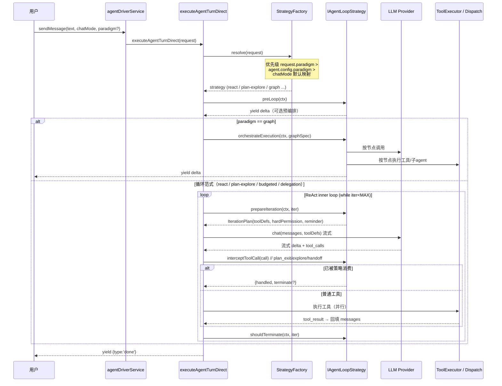
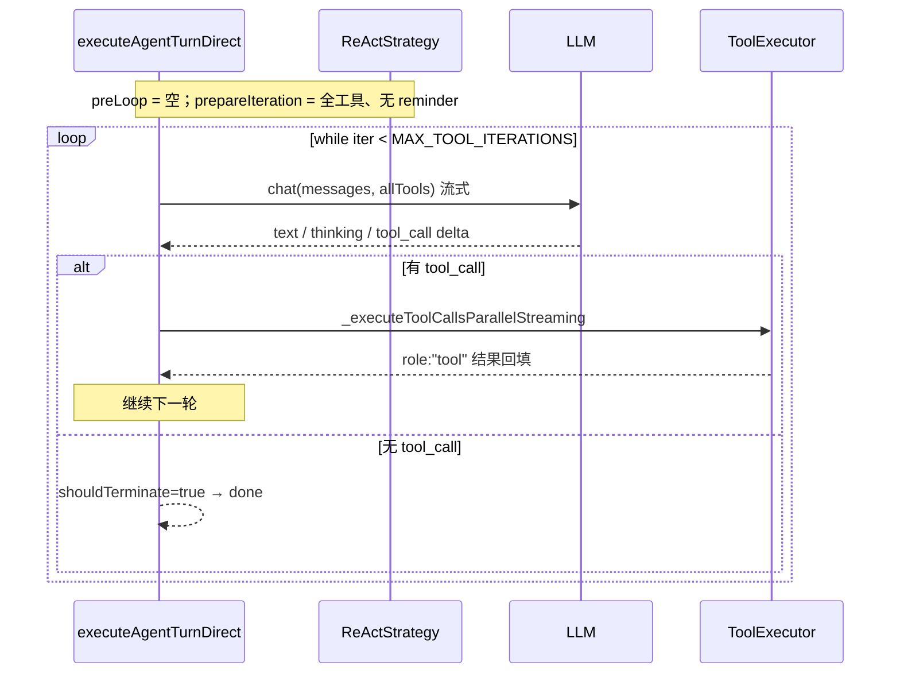
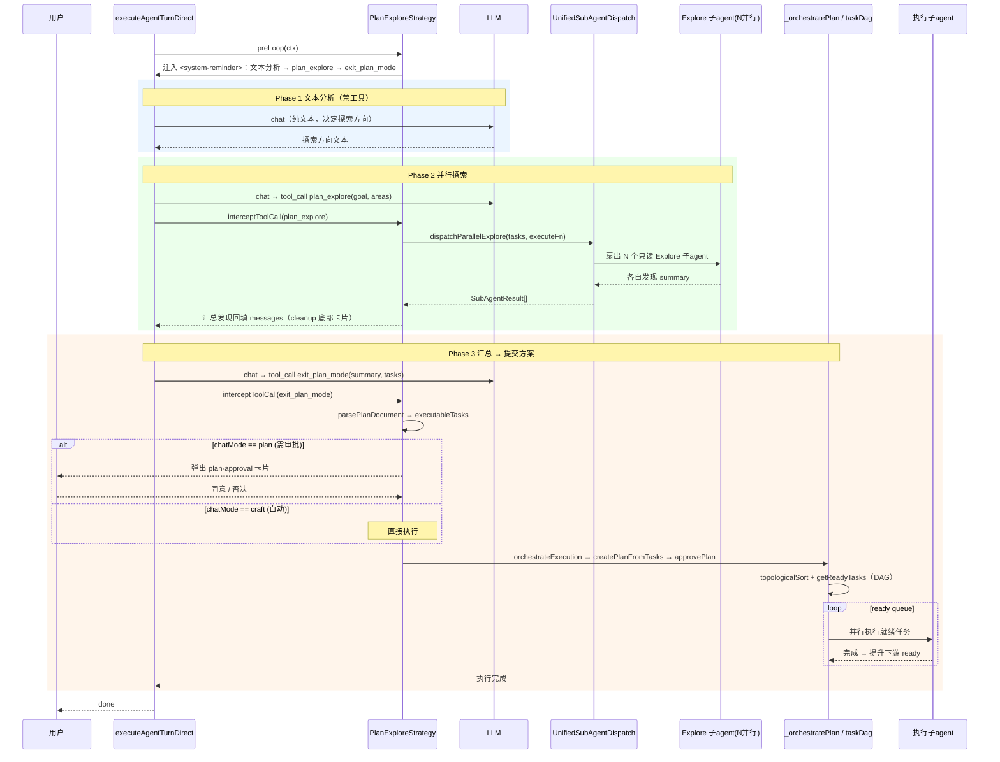
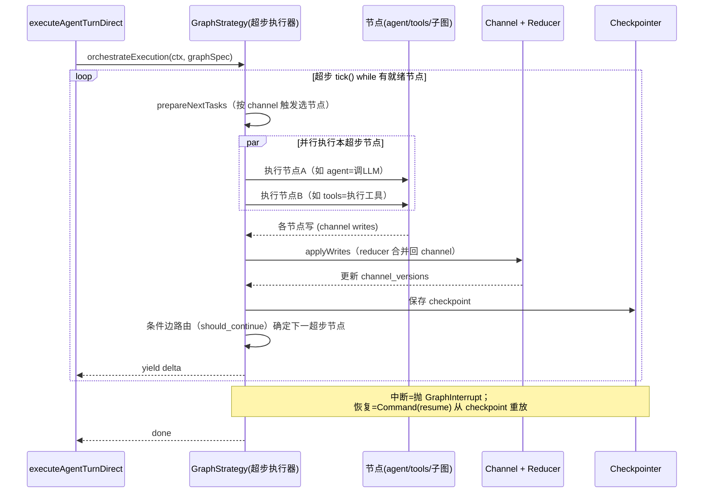
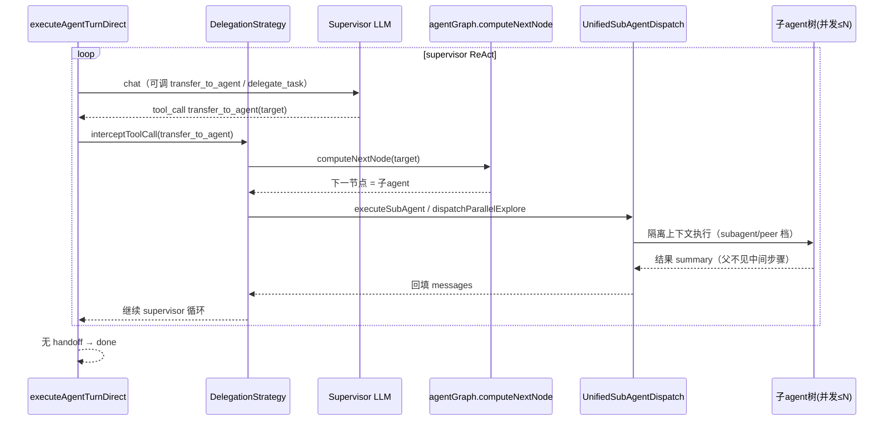

# AgentLoop 范式对比与「可自由切换范式」设计方案

> 对比对象：LangGraph / Hermes-Agent / void / continue，结合本项目 `sarosis-agents-client` 现状，设计可插拔、可自由切换的 AgentLoop 范式架构，并给出时序图。
>
> 分析日期：2026-07-21

---

## 一、四个参考项目的 AgentLoop 范式

### 1. LangGraph —— 图 / Pregel BSP 超步范式（Graph / Superstep）

- **核心引擎**：`libs/langgraph/langgraph/pregel/main.py` 的 `class Pregel` + `_loop.py` 的 `PregelLoop.tick() / after_tick()`。
- **范式本质**：借鉴 Google Pregel 的 **BSP（Bulk Synchronous Parallel）超步模型**。每一步 = 一个超步：
  1. `prepare_next_tasks()`：根据 channel 触发确定本超步要执行的节点集合；
  2. 并行执行这些节点；
  3. `apply_writes()`：把所有节点输出用 **reducer** 统一合并回 channel；
  4. 保存 checkpoint，检查中断。
- **状态传递**：状态拆成多个 **Channel**（每个 state key 一个），节点读写 channel，reducer（`BaseChannel.update`）在超步末统一合并，`channel_versions` 用于增量触发。
- **ReAct 只是特例**：`create_react_agent` = `agent`(调 LLM) 与 `tools`(执行工具) 两节点 + `should_continue` 条件边，在超步间反复轮转。v2 用 `Send` API 把每个 tool_call fan-out 成独立 tools 任务。
- **中断/恢复**：Checkpointer 持久化每超步；`interrupt_before/after` 与 `interrupt()` 抛 `GraphInterrupt`，`Command(resume=...)` 从 checkpoint 恢复。
- **关键词**：声明式有向图、超步并行、channel+reducer、checkpoint 可恢复、条件边路由。

### 2. Hermes-Agent —— ReAct 单循环 + 预算门控 + 委托编排（Budgeted ReAct + Delegation）

- **核心引擎**：`agent/conversation_loop.py::run_conversation`（~2900 行），工具分发在 `run_agent.py` + `agent/tool_executor.py`。
- **范式本质**：经典 **ReAct 单循环**（`while api_call_count < max_iterations`）：LLM 生成 → 检测 `tool_calls` → 执行工具 → `role:"tool"` 回填 → `continue`。
- **叠加层**：
  - **IterationBudget 预算门控**（`agent/iteration_budget.py`）+ 末次宽限 `_budget_grace_call`；
  - **多层自愈**：API 重试、截断续写（finish_reason=length）、幻觉工具名自纠错、思考预算检测；
  - **MoA（Mixture of Agents）**（`agent/moa_loop.py`）：参考模型并行 fan-out → 聚合器综合 → 作为上下文增强注入主循环；
  - **Toolset 分组 + 渐进式披露**：`toolsets.py`（`_HERMES_CORE_TOOLS` + `TOOLSETS` + `includes`）+ `tools/tool_search.py`（`tool_search`/`tool_describe`/`tool_call` 桥接、核心工具永不延迟、阈值门控）；
  - **子 agent 委托**（`tools/delegate_tool.py`）：`delegate_task` spawn 隔离子 agent，`ThreadPoolExecutor` 并发（默认 3），orchestrator 可嵌套，安全 blocklist，可中断。
- **关键词**：ReAct 骨架、预算门控、工程化自愈、MoA、toolset 治理、树状委托。

### 3. void —— 布尔标志驱动的 ReAct 单循环（Minimal ReAct）

- **核心引擎**：`src/vs/workbench/contrib/void/browser/chatThreadService.ts` 的 `ChatThreadService._runChatAgent()`。
- **范式本质**：最精简的 **ReAct `while` 循环**，由布尔标志 `shouldSendAnotherMessage` 驱动：
  ```ts
  while (shouldSendAnotherMessage) {
    shouldSendAnotherMessage = false;      // 每轮默认停
    // 组装 thread.messages → sendLLMMessage → onFinalMessage 拿 toolCall
    // 有 toolCall → _runToolCall → 成功则 shouldSendAnotherMessage = true
  }
  ```
- **上下文模型**：整个对话历史存于 `thread.messages` 数组（user/assistant/tool/checkpoint 混合），每轮整体重发。
- **审批**：`approvalTypeOfBuiltinToolName` 分 edits/terminal/MCP 三类 + `autoApprove` 开关；未自动批准则 `tool_request` 暂停循环，`approve` 后以 `preapproved:true` 重入。
- **无迭代硬上限**：仅靠 `shouldSendAnotherMessage` + LLM 错误重试 3 次。
- **模式**：`agent`（全工具自治）/ `gather`（仅只读无审批工具）/ `normal`（纯对话）。
- **关键词**：极简单循环、消息数组上下文、暂停-重入审批、模式裁剪工具面。

### 4. continue —— Redux 递归 thunk 流式 ReAct（Recursive Streaming ReAct）

- **核心引擎**：`gui/src/redux/thunks/streamNormalInput.ts`（核心）+ `streamResponseAfterToolCall.ts` + `callToolById.ts`。
- **范式本质**：**流式 ReAct**，无显式状态机类，靠 **Redux state + 递归 dispatch 同一 thunk（`depth+1`）** 推动循环（测试上限 depth=50）。
  1. `llmStreamChat` 流式生成，边 `streamUpdate` 边累积 tool 参数；
  2. 流结束后：`preprocessToolCalls`（校验）→ `evaluateToolPolicies`（权限）→ 执行；
  3. `Promise.all` 并发执行工具，`role:"tool"` 回填；
  4. `areAllToolsDoneStreaming` 为真时才递归 `streamNormalInput({depth+1})`。
- **权限**：三级 `disabled / allowedWithPermission / allowedWithoutPermission`，先静态后参数级动态评估，动态不可比静态更宽松。
- **模式**：`chat`（工具集空，退化对话）/ `plan`（只读工具，产计划）/ `agent`（全工具）/ `background` / `edit`（独立 `streamEditThunk`，非工具回路）。mode 只改「系统提示 + 工具集」，不改循环骨架。
- **关键词**：递归 thunk、流式解析、并发工具门控续流、三级权限、mode-gated 能力分层。

---

## 二、范式横向对比

| 维度 | LangGraph | Hermes-Agent | void | continue | **本项目 sarosis** |
|---|---|---|---|---|---|
| **控制流范式** | 声明式有向图 + BSP 超步 | ReAct while + 预算 | ReAct while（标志） | 递归 thunk 流式 ReAct | `async function*` + `while(iter<MAX)` |
| **实现形态** | 图引擎 + 节点/边 | 单大函数 + 分发器 | 单方法 `_runChatAgent` | Redux thunk 集群 | 单大函数 `executeAgentTurnDirect`（~2200 行） |
| **状态载体** | Channel + reducer | messages 数组 | `thread.messages` 数组 | Redux slice | messages 数组 + `runState`/`workState` reducer |
| **迭代控制** | 超步 + `remaining_steps` | `max_iterations` + budget | 无硬上限（标志） | 递归 `depth`（≤50） | `MAX_TOOL_ITERATIONS` + 多重安全网 |
| **并行工具** | `Send` fan-out | ThreadPool 并发 | 顺序 | `Promise.all` | `_executeToolCallsParallelStreaming` |
| **多 agent** | 原生（子图/Send） | 原生（delegate 树） | 无 | 无 | `UnifiedSubAgentDispatch`（Explore/General/Scout） |
| **计划/DAG** | 图即计划 | 无显式 DAG | 无 | plan 模式（只读，无 DAG 执行） | plan → `parsePlanDocument` → `taskDag` 拓扑 + ready queue |
| **中断/恢复** | Checkpoint 强 | 中断标志 | interruptor promise | AbortController + isStreaming | AbortSignal + `AgentRunState` snapshot |
| **工具治理** | 图边即路由 | toolset + tool_search | 模式裁剪 | 模式裁剪 + 权限 | toolset 分组 + 桥接按需加载 + 运行时硬拦 |
| **模式抽象** | 图形状即范式 | 单范式（配置叠加） | 3 态模式 | 5 态 mode | chatMode(4) × workMode(2) 正交 |
| **范式可切换性** | 换图 = 换范式 | 硬编码单范式 | 硬编码单范式 | mode 只裁剪不换骨架 | **分散在 if 分支，无统一抽象** |

### 关键结论
1. **两大范式家族**：
   - **图/超步范式（LangGraph）**：范式即数据（图结构），切换范式 = 换图，天然可插拔，但学习/构建成本高；
   - **循环范式（Hermes/void/continue/sarosis）**：ReAct while/递归为骨架，用「模式 + 分支」裁剪行为，简单直接但**范式硬编码**。
2. **本项目现状**：能力模块已齐（子 agent 调度、DAG、workMode reducer、preLoop 编排、toolset），但**「选哪种 loop 范式」的决策散落在 `executeAgentTurnDirect` 的一大坨 `if (chatMode===...) / if (workState.mode===...)` 中**，缺少统一的策略抽象。这是可自由切换范式的最大障碍，也是最佳改造切入点。

---

## 三、设计目标：可自由切换的 AgentLoop 范式架构

### 3.1 设计原则

1. **保留 ReAct inner loop 作为不变式**：所有范式共享「LLM 流式 → 拼装 tool_call → 执行 → 回填 → 续跑」的内核，避免重写主循环。
2. **把「范式差异」抽象为策略（Strategy）**：pre-loop 编排、每轮提醒注入、工具面/权限、终止判定、plan_exit 后行为，全部由策略对象提供。
3. **策略可组合、可运行时切换**：范式由 `chatMode` + 显式 `paradigm` 参数 + Agent 配置共同决定，可在会话中切换。
4. **向后兼容**：现有 craft/ask/plan/workflow 行为映射为内置策略，零行为回归。
5. **借鉴 LangGraph 的图能力**：新增一个 `GraphStrategy` 让高级用户用「节点+边」声明式定义范式（可选进阶）。

### 3.2 核心抽象：`IAgentLoopStrategy`

在 `common/` 新增 `agentLoopStrategy.ts`：

```ts
// common/agentLoopStrategy.ts
export type AgentParadigm =
  | 'react'          // 纯 ReAct 单循环（对齐 void/continue agent 模式）
  | 'plan-explore'   // 三阶段：文本分析 → plan_explore 并行 → exit_plan_mode → DAG（本项目 plan 范式）
  | 'budgeted-react' // ReAct + 预算门控 + MoA 可选（对齐 Hermes）
  | 'graph'          // 声明式图/超步（对齐 LangGraph）
  | 'delegation'     // 委托编排（supervisor + 子 agent 树）
  | 'readonly';      // 只读收集（对齐 void gather / continue chat）

/** 策略在主循环各切面被调用的钩子。全部为可选，未实现即用默认 ReAct 行为。 */
export interface IAgentLoopStrategy {
  readonly paradigm: AgentParadigm;

  /** 主循环开始前的编排（如 craft 的 pre-loop explore、plan 的三阶段 reminder 注入）。可 yield delta。 */
  preLoop?(ctx: LoopContext): AsyncGenerator<IChatStreamDelta, PreLoopResult | void>;

  /** 每轮 LLM 调用前，决定本轮工具面 / 权限 / 是否注入 system-reminder。 */
  prepareIteration?(ctx: LoopContext, iteration: number): IterationPlan;

  /** 拦截特定控制工具（plan_exit / plan_explore / transfer_to_agent 等），返回 handled 表示已消费。 */
  interceptToolCall?(ctx: LoopContext, call: ToolCall): AsyncGenerator<IChatStreamDelta, InterceptResult>;

  /** 判定是否终止主循环（默认：无 tool_call 且反思完成）。 */
  shouldTerminate?(ctx: LoopContext, iteration: number): boolean;

  /** plan_exit / 计划就绪后的执行范式（顺序 / DAG 并行 / 图超步）。 */
  orchestrateExecution?(ctx: LoopContext, plan: ParsedPlanDocument): AsyncGenerator<IChatStreamDelta, void>;
}

/** 主循环传给策略的运行时上下文（对现有 host 内部状态的只读+受控写视图）。 */
export interface LoopContext {
  readonly request: IAgentTurnRequest;
  readonly chatMode: AgentChatMode;
  workState: AgentWorkState;              // 可经 reduceWorkState 更新
  readonly messages: IChatMessage[];
  readonly dispatch: UnifiedSubAgentDispatch;
  readonly host: any;                     // 复用现有 host 能力（_orchestratePlan 等）
  readonly signal: AbortSignal;
}

export interface IterationPlan {
  readonly toolDefs?: IToolDefinition[];      // 覆盖本轮工具面
  readonly hardPermission?: (tool: string) => boolean;
  readonly reminderMessage?: string;          // 注入的 <system-reminder>
}
export interface InterceptResult { readonly handled: boolean; readonly terminate?: boolean; }
export interface PreLoopResult { readonly skipMainLoop?: boolean; }
```

### 3.3 策略注册与选择：`AgentLoopStrategyFactory`

```ts
// browser/agentLoopStrategyFactory.ts
export class AgentLoopStrategyFactory {
  private readonly _registry = new Map<AgentParadigm, () => IAgentLoopStrategy>();

  register(p: AgentParadigm, factory: () => IAgentLoopStrategy) { this._registry.set(p, factory); }

  /** 范式选择优先级：request.paradigm（显式）> agent.config.paradigm > chatMode 默认映射。 */
  resolve(request: IAgentTurnRequest): IAgentLoopStrategy {
    const explicit = request.paradigm;
    const fromAgent = request.agentConfig?.paradigm;
    const fromChatMode = DEFAULT_PARADIGM_BY_CHATMODE[request.chatMode || 'craft'];
    const paradigm = explicit ?? fromAgent ?? fromChatMode;
    return (this._registry.get(paradigm) ?? this._registry.get('react')!)();
  }
}

const DEFAULT_PARADIGM_BY_CHATMODE: Record<AgentChatMode, AgentParadigm> = {
  craft:    'plan-explore',   // craft 现状 = 预编排 + 顺序/ DAG
  plan:     'plan-explore',   // plan 现状 = 三阶段 + 审批 + DAG
  ask:      'readonly',
  workflow: 'graph',          // workflow 可映射为声明式图
};
```

### 3.4 内置策略与现有代码的映射

| 策略 | 复用的现有构件 | 对应参考项目 |
|---|---|---|
| `ReActStrategy` | 主循环内核不变，`prepareIteration` 全工具、无 reminder | void / continue agent |
| `ReadonlyStrategy` | `filterToolsByChatMode('ask')` 只读过滤 | void gather / continue chat |
| `PlanExploreStrategy` | `preLoop`＝`preLoopOrchestrator`＋plan reminder；`interceptToolCall` 处理 `plan_explore`/`plan_exit`；`orchestrateExecution`＝`host._orchestratePlan`（`taskDag` 拓扑 + ready queue） | 本项目 plan / MiMo |
| `BudgetedReActStrategy` | 加 `IterationBudget` + 可选 MoA 参考模型 fan-out（新增） | Hermes-Agent |
| `DelegationStrategy` | `interceptToolCall('transfer_to_agent')` + `agentGraph.computeNextNode` + `UnifiedSubAgentDispatch` | Hermes delegate / supervisor |
| `GraphStrategy` | 新增轻量超步执行器：节点=LLM/工具/子agent，边=条件路由，reducer 合并 messages | LangGraph |

### 3.5 主循环改造（最小侵入）

`executeAgentTurnDirect` 入口处把散落的 `if (chatMode===...)` 收敛为：

```ts
export async function* executeAgentTurnDirect(host, request) {
  const strategy = host.strategyFactory.resolve(request);
  const ctx = buildLoopContext(host, request);

  // ① 前置编排（策略化：craft 预探索 / plan 三阶段 reminder / graph 建图）
  if (strategy.preLoop) {
    const pre = yield* strategy.preLoop(ctx);
    if (pre?.skipMainLoop) { return; }
  }

  // ② 图范式：直接交给超步执行器，不进入 while ReAct
  if (strategy.paradigm === 'graph' && strategy.orchestrateExecution) {
    yield* strategy.orchestrateExecution(ctx, /* graphSpec */);
    return;
  }

  // ③ 通用 ReAct inner loop（所有循环范式共享）
  let iteration = 0;
  while (iteration < MAX_TOOL_ITERATIONS) {
    const plan = strategy.prepareIteration?.(ctx, iteration) ?? defaultIterationPlan(ctx);
    if (plan.reminderMessage) { appendReminder(ctx.messages, plan.reminderMessage); }

    const toolCalls = yield* streamLLMAndAssemble(ctx, plan.toolDefs); // LLM 流式 + 拼装

    // 控制工具拦截（plan_exit / plan_explore / transfer_to_agent）交给策略
    for (const call of toolCalls) {
      if (strategy.interceptToolCall) {
        const r = yield* strategy.interceptToolCall(ctx, call);
        if (r.handled) { if (r.terminate) { return; } continue; }
      }
    }

    yield* executeToolsAndAppend(ctx, toolCalls, plan.hardPermission); // 执行 + 回填

    if (strategy.shouldTerminate?.(ctx, iteration) ?? defaultTerminate(ctx, toolCalls)) {
      yield { type: 'done' }; break;
    }
    iteration++;
  }
}
```

> 关键点：**inner ReAct loop 保持唯一实现**，范式差异只体现在 `preLoop / prepareIteration / interceptToolCall / shouldTerminate / orchestrateExecution` 五个钩子。现有 plan/craft 的所有防御性逻辑（phantom 过滤、loop 检测、安全网）保留在 `streamLLMAndAssemble` / `executeToolsAndAppend` 内核里，与范式无关。

### 3.6 「自由切换」的落地方式

1. **配置级**：Agent 的 `config.md` / preset 增加 `paradigm: plan-explore | react | graph | ...` 字段。
2. **会话级**：聊天输入框在 chatMode 之外，可选显式 `paradigm`（默认由 chatMode 推导），持久化到 per-agent storage（复用现有 `saros:chatMode:{agentId}` 机制）。
3. **运行时切换**：切换只影响「下一次 turn」的 `strategyFactory.resolve`，当前 turn 用进入时快照的策略（对齐 void「循环内不改 chatMode」的做法，避免 tool-pair 错乱）。
4. **多 agent 混合**：supervisor 用 `DelegationStrategy`，子 agent 各自可用不同范式（Explore 子 agent 用 `readonly`，实现子 agent 用 `react`），由 `UnifiedSubAgentDispatch` 按 `SubAgentOptions.paradigm` 分配。

---

## 四、时序图

### 4.1 总体：范式选择与分派



### 4.2 ReAct 范式（对齐 void / continue agent 模式）



### 4.3 Plan-Explore 范式（本项目 plan / craft，含并行子 agent + DAG）



### 4.4 Graph 范式（对齐 LangGraph BSP 超步）



### 4.5 Delegation 范式（对齐 Hermes delegate / supervisor 编排）



---

## 五、实施路线（增量、零回归）

1. **阶段 0 — 抽象落地（不改行为）**：新增 `common/agentLoopStrategy.ts` 接口 + `browser/agentLoopStrategyFactory.ts`；把现有 craft/plan/ask 逻辑原样包成 `PlanExploreStrategy` / `ReadonlyStrategy`，`executeAgentTurnDirect` 入口改为 `strategyFactory.resolve` 后调用同样的分支（内部实现暂不动）。用 tsgo 校验 + 现有测试回归。
2. **阶段 1 — 钩子迁移**：把 `preLoop / prepareIteration / interceptToolCall / shouldTerminate / orchestrateExecution` 的实现从 `executeAgentTurnDirect` 大函数中逐个抽到策略类，主循环只留通用 inner ReAct。每抽一个跑一次回归。
3. **阶段 2 — 新范式**：实现 `ReActStrategy`（纯 ReAct）与 `BudgetedReActStrategy`（接入 `IterationBudget` + 可选 MoA）。
4. **阶段 3 — Graph 范式**：实现轻量超步执行器 `GraphStrategy`（节点=LLM/工具/子agent，channel+reducer 合并 messages，可选 checkpoint），把 workflow 映射为图。
5. **阶段 4 — 切换 UI 与持久化**：输入框 paradigm 选择器 + per-agent 持久化 + config.md `paradigm` 字段；子 agent 按 `SubAgentOptions.paradigm` 分配范式。

### 兼容与风险
- **prefix-cache 稳定性**：范式切换只在 turn 边界生效，turn 内快照，避免工具 schema 抖动（对齐 void）。
- **控制工具双消费**：`interceptToolCall` 消费的控制工具（plan_exit 等）不得再进普通 handler（保留现有 `controlToolNames` 机制）。
- **防御逻辑归属**：phantom/loop/重试等与范式无关的加固留在 inner loop 内核，策略不重复实现。

---

## 六、一句话总结

- **LangGraph = 图/超步声明式**，**Hermes/void/continue/本项目 = ReAct 循环命令式**；前者「换图即换范式」，后者「靠模式分支裁剪行为」。
- 本项目已有全部底层能力（子 agent 调度、DAG、workMode reducer、preLoop 编排、toolset），**唯一缺口是把范式决策从 `executeAgentTurnDirect` 的 `if` 分支收敛为统一的 `IAgentLoopStrategy` 策略层**。
- 引入 `IAgentLoopStrategy` + `AgentLoopStrategyFactory` 后，即可在 `react / plan-explore / budgeted-react / graph / delegation / readonly` 之间**按配置、按会话、按子 agent 自由切换范式**，且保持 ReAct inner loop 唯一实现、零行为回归。
