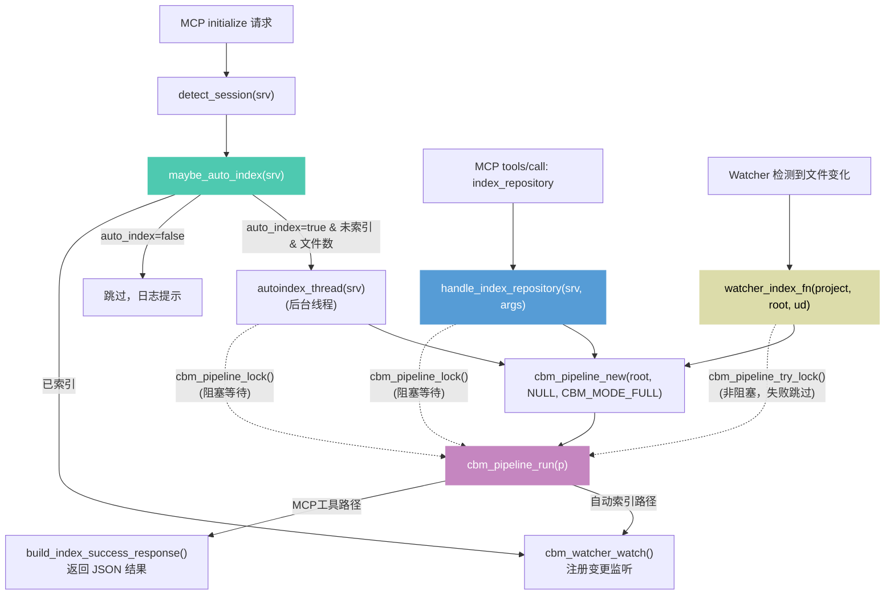
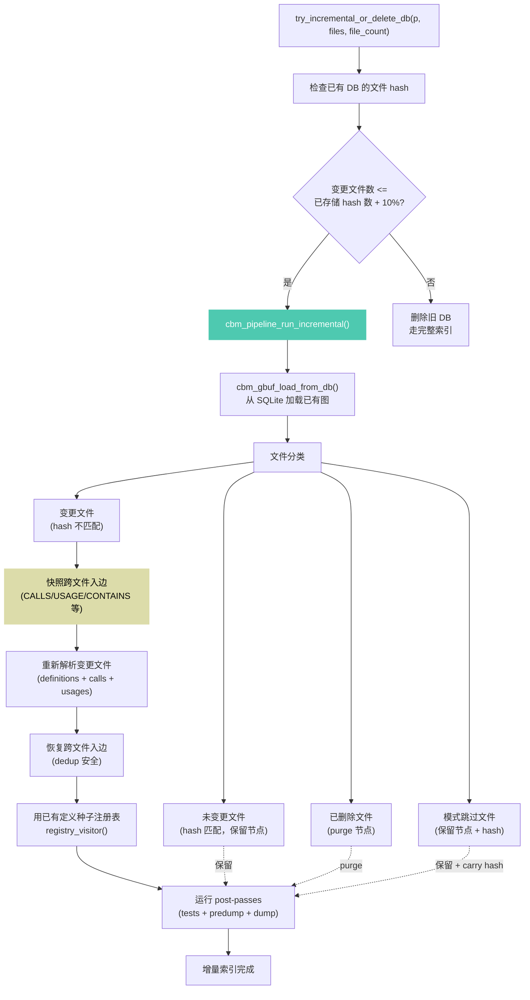

# codebase-memory-mcp 源码分析

> 源码路径：`G:\CustomWorkspaces\AIProjects\codebase-memory-mcp`
> 语言：纯 C（零依赖），使用 tree-sitter AST 分析 + 内存 SQLite + LZ4 压缩
> 158 种语言，14 个 MCP 工具，Linux 内核 28M LOC 3 分钟完成索引

---

## 一、什么时候构建 codebase 数据（索引触发时机）

codebase 数据的构建（索引）有 **三种触发路径**，最终都汇聚到 `cbm_pipeline_run()`：

### 路径 1：MCP 工具显式调用 `index_repository`

AI 或用户通过 MCP 协议调用 `index_repository` 工具。

- **入口**：`handle_index_repository()` (`src/mcp/mcp.c:2784`)
- **触发时机**：AI 主动调用工具（如用户说"Index this project"）
- **参数**：`repo_path`（必需）、`mode`（full/moderate/fast/cross-repo-intelligence）、`persistence`
- **流程**：解析参数 → 创建 pipeline → artifact bootstrap → 加锁 → `cbm_pipeline_run()` → 解锁 → 构建 JSON 响应

### 路径 2：自动索引（Auto-Index）

MCP 服务器初始化时自动检测并后台索引。

- **入口**：`maybe_auto_index()` (`src/mcp/mcp.c:4612`)
- **触发时机**：MCP `initialize` 请求时（`src/mcp/mcp.c:4814-4817`）
- **条件**：
  1. 已检测到 session root（项目根路径）
  2. config 中 `auto_index=true`
  3. 项目尚未索引（DB 文件不存在）
  4. 文件数不超过 `auto_index_limit`（默认 50000）
- **执行**：后台线程 `autoindex_thread()` (`mcp.c:4580`) → `cbm_pipeline_run()` → 完成后注册 watcher

### 路径 3：文件监视器重新索引（Watcher Reindex）

watcher 检测到文件变化时自动重新索引。

- **入口**：`watcher_index_fn()` (`src/main.c:152`)
- **触发时机**：watcher 轮询周期（5-60s）检测到文件变化
- **特性**：非阻塞——如果 pipeline 正在运行则跳过（`cbm_pipeline_try_lock()`），下次轮询重试
- **流程**：`cbm_pipeline_try_lock()` → `cbm_pipeline_new()` → `cbm_pipeline_run()` → `cbm_pipeline_unlock()`

### 增量索引

当已有索引 DB 时，`cbm_pipeline_run()` 会先尝试增量索引：

- **入口**：`try_incremental_or_delete_db()` (`pipeline.c:1075`)
- **条件**：已有 DB 且文件 hash 大部分匹配
- **执行**：`cbm_pipeline_run_incremental()` (`pipeline_incremental.c`) — 只重新解析变更文件，保留未变更文件的节点和边，快照并恢复跨文件入边
- **否则**：删除旧 DB，执行完整索引

---

## 二、函数调用图

### 2.1 索引触发总览



### 2.2 `cbm_pipeline_run()` 完整管道流程

```mermaid
graph TD
    RUN["cbm_pipeline_run(p)<br/>(pipeline.c:1025)"]

    %% Phase 0: 配置
    RUN --> P0["Phase 0: 配置加载"]
    P0 --> SET_MACRO["cbm_set_macro_extraction(mode==FULL)"]
    SET_MACRO --> USERCONFIG["cbm_userconfig_load(repo_path)<br/>用户扩展覆盖"]

    %% Phase 1: 发现
    USERCONFIG --> P1["Phase 1: 文件发现"]
    P1 --> DISCOVER["cbm_discover_ex(repo_path, &opts, &files, ...)<br/>扫描文件，排除 .git/node_modules 等"]
    DISCOVER --> TRY_INCR["try_incremental_or_delete_db(p, files, file_count)"]

    %% 增量分支
    TRY_INCR -->|"已有DB & hash匹配"| INCR["cbm_pipeline_run_incremental(p, db_path, files, ...)<br/>增量索引：只解析变更文件"]
    INCR --> DONE_INCR["return (增量完成)"]

    %% 完整索引分支
    TRY_INCR -->|"无DB 或 hash不匹配"| DEL_DB["删除旧 DB"]
    DEL_DB --> P2["Phase 2: 创建图缓冲区和注册表"]
    P2 --> GBUF_NEW["cbm_gbuf_new(project, repo_path)<br/>内存图缓冲区"]
    GBUF_NEW --> REG_NEW["cbm_registry_new()<br/>函数注册表"]
    REG_NEW --> ALIAS["cbm_load_path_aliases(repo_path)<br/>tsconfig/jsconfig 路径别名"]

    %% 提取阶段
    ALIAS --> EXTRACT_PHASE["run_extraction_phase(p, ctx, files, file_count)"]

    EXTRACT_PHASE --> PASS_STRUCT["Pass 1: pass_structure(p, files, ...)<br/>创建 Project/Folder/Package/File 节点"]

    PASS_STRUCT --> MODE_CHECK{"worker_count > 1<br/>且 file_count > 50?"}

    %% 并行路径
    MODE_CHECK -->|"是"| PARALLEL["run_parallel_pipeline(p, ctx, files, ...)<br/>(多线程提取)"]
    PARALLEL --> P_PKGMAP1["cbm_pkgmap_build_from_repo()<br/>包映射"]
    P_PKGMAP1 --> P_WORKERS["worker_pool 多线程提取定义<br/>(extract + write nodes + build registry)"]
    P_WORKERS --> P_LSP_CROSS1["cbm_pipeline_pass_lsp_cross()<br/>跨文件 LSP 类型解析"]
    P_LSP_CROSS1 --> P_K8S1["cbm_pipeline_pass_k8s()"]

    %% 顺序路径
    MODE_CHECK -->|"否"| SEQUENTIAL["run_sequential_pipeline(p, ctx, files, ...)<br/>(单线程提取)"]
    SEQUENTIAL --> S_PKGMAP["cbm_pkgmap_build_from_repo()"]
    S_PKGMAP --> S_DEFS["cbm_pipeline_pass_definitions()<br/>定义提取 + 注册表构建"]
    S_DEFS --> S_K8S["cbm_pipeline_pass_k8s()"]
    S_K8S --> S_LSP_CROSS["seq_pass_lsp_cross_dispatch()<br/>跨文件 LSP"]
    S_LSP_CROSS --> S_CALLS["cbm_pipeline_pass_calls()<br/>调用解析 (CALLS 边)"]
    S_CALLS --> S_USAGES["cbm_pipeline_pass_usages()<br/>使用解析 (USAGE 边)"]
    S_USAGES --> S_SEMANTIC["cbm_pipeline_pass_semantic()<br/>语义边 (INHERITS/IMPLEMENTS)"]

    %% 并行路径的 passes（与顺序路径相同的后续 passes）
    P_K8S1 --> P_CALLS["cbm_pipeline_pass_calls()"]
    P_CALLS --> P_USAGES["cbm_pipeline_pass_usages()"]
    P_USAGES --> P_SEMANTIC["cbm_pipeline_pass_semantic()"]

    %% 后提取阶段
    S_SEMANTIC --> POST_PHASE["run_post_extraction(p, ctx, files, ...)"]
    P_SEMANTIC --> POST_PHASE

    POST_PHASE --> TESTS_HIST["run_tests_and_history(p, ctx, files, ...)"]
    TESTS_HIST --> PASS_TESTS["cbm_pipeline_pass_tests()<br/>测试关联"]
    PASS_TESTS --> PASS_GH["run_githistory(p, ctx)<br/>Git 历史耦合分析<br/>(可并行线程)"]
    PASS_GH --> PREDUMP["run_predump_passes(p, ctx)<br/>(6 个 dump 前 passes)"]

    %% Predump passes
    PREDUMP --> PD_DECO["predump_deco: decorator_tags"]
    PD_DECO --> PD_CFG["predump_cfg: configlink"]
    PD_CFG --> PD_ROUTE["predump_route: route_match<br/>HTTP 路由节点"]
    PD_ROUTE -->|"mode != FAST"| PD_SIM["predump_sim: similarity<br/>(SIMILAR_TO 边)"]
    PD_SIM -->|"mode != FAST"| PD_SEM["predump_sem: semantic_edges<br/>(SEMANTICALLY_RELATED 边)"]
    PD_SEM --> PD_COMPLEX["predump_complexity: complexity<br/>圈复杂度"]
    PD_ROUTE -->|"mode == FAST"| PD_COMPLEX
    PD_COMPLEX --> DUMP["dump_and_persist_hashes()<br/>写入 SQLite + 文件 hash 持久化<br/>+ artifact 导出 (可选)"]

    DUMP --> CLEANUP["cleanup<br/>释放 gbuf/registry/pkgmap/files"]
    CLEANUP --> PIPELINE_DONE["管道完成"]

    style RUN fill:#c586c0,stroke:#c586c0,color:#fff,stroke-width:3px
    style INCR fill:#4ec9b0,stroke:#4ec9b0,color:#fff
    style PARALLEL fill:#569cd6,stroke:#569cd6,color:#fff
    style SEQUENTIAL fill:#dcdcaa,stroke:#dcdcaa,color:#000
    style DUMP fill:#f48771,stroke:#f48771,color:#fff
```



### 2.3 增量索引流程



---

## 三、管道阶段详解

### 索引模式

| 模式 | 说明 | SIMILAR_TO | SEMANTICALLY_RELATED | C/C++ 宏 |
|------|------|:----------:|:--------------------:|:--------:|
| `CBM_MODE_FULL` (0) | 完整索引，所有 pass | ✓ | ✓ | ✓ |
| `CBM_MODE_MODERATE` (1) | 中等，快速发现 | ✓ | ✓ | ✗ |
| `CBM_MODE_FAST` (2) | 快速，跳过非必要文件 | ✗ | ✗ | ✗ |

### 完整管道阶段（7 阶段）

| 阶段 | 函数 | 产出 | 文件 |
|:-----|:-----|:-----|:-----|
| **Phase 0** | `cbm_userconfig_load` | 用户扩展配置 | `pipeline.c` |
| **Phase 1** | `cbm_discover_ex` | 文件列表 + 排除目录 | `discover/` |
| **Phase 2** | `cbm_gbuf_new` + `cbm_registry_new` | 内存图缓冲区 + 函数注册表 | `pipeline.c` |
| **Phase 3** | `run_extraction_phase` | 结构节点 + 定义 + 调用 + 使用 + 语义边 | `pipeline.c` |
| **Phase 4** | `run_post_extraction` | 测试 + Git 历史 + predump passes | `pipeline.c` |
| **Phase 5** | `dump_and_persist_hashes` | SQLite 持久化 + 文件 hash | `pipeline.c` |
| **Cleanup** | 资源释放 | — | `pipeline.c` |

### 提取阶段 Pass 顺序

#### 并行路径（`file_count > 50` 且多核）

```
pass_structure → [worker_pool 多线程提取定义] → pass_lsp_cross → pass_k8s → pass_calls → pass_usages → pass_semantic
```

#### 顺序路径

```
pass_structure → pass_definitions → pass_k8s → pass_lsp_cross → pass_calls → pass_usages → pass_semantic
```

### Predump Pass 顺序（dump 前 6 个 pass）

```
decorator_tags → configlink → route_match → similarity[跳过FAST] → semantic_edges[跳过FAST] → complexity
```

### 各 Pass 产出

| Pass | 函数 | 节点/边类型 | 文件 |
|:-----|:-----|:------------|:-----|
| structure | `pass_structure` | Project, Folder, Package, File 节点 + CONTAINS 边 | `pipeline.c:316` |
| definitions | `cbm_pipeline_pass_definitions` | Function, Method, Class, Interface, Variable 节点 + DEFINES 边 | `pass_definitions.c` |
| k8s | `cbm_pipeline_pass_k8s` | Resource (K8s), Module (Kustomize) 节点 + IMPORTS 边 | `pass_k8s.c` |
| lsp_cross | `cbm_pipeline_pass_lsp_cross` | 类型解析的 CALLS 边（跨文件） | `pass_lsp_cross.c` |
| calls | `cbm_pipeline_pass_calls` | CALLS, HTTP_CALLS, ASYNC_CALLS 边 + Route 节点 | `pass_calls.c` |
| usages | `cbm_pipeline_pass_usages` | USAGE, TYPE_REF 边 | `pass_usages.c` |
| semantic | `cbm_pipeline_pass_semantic` | INHERITS, IMPLEMENTS, DECORATES 边 | `pass_semantic.c` |
| tests | `cbm_pipeline_pass_tests` | TESTS 边（测试→被测代码） | `pass_tests.c` |
| githistory | `cbm_pipeline_githistory_compute` | FILE_CHANGES_WITH 边（文件耦合） | `pass_githistory.c` |
| decorator_tags | `cbm_pipeline_pass_decorator_tags` | 装饰器标签属性 | `pass_enrichment.c` |
| configlink | `cbm_pipeline_pass_configlink` | CONFIG_LINKS 边 | `pass_configlink.c` |
| route_match | `cbm_pipeline_create_route_nodes` | Route 节点 + 路由匹配边 | `pass_route_nodes.c` |
| similarity | `cbm_pipeline_pass_similarity` | SIMILAR_TO 边 | `pass_similarity.c` |
| semantic_edges | `cbm_pipeline_pass_semantic_edges` | SEMANTICALLY_RELATED 边 | `pass_semantic_edges.c` |
| complexity | `cbm_pipeline_pass_complexity` | 圈复杂度属性 | `pass_complexity.c` |

---

## 四、MCP 工具与索引的关系

```mermaid
graph LR
    subgraph 索引工具
        IDX["index_repository<br/>触发索引"]
        STATUS["index_status<br/>查询索引状态"]
        DETECT["detect_changes<br/>检测变更影响"]
        DELETE["delete_project<br/>删除索引"]
        LIST["list_projects<br/>列出已索引项目"]
    end

    subgraph 查询工具（依赖索引）
        SEARCH["search_graph<br/>BM25 全文搜索"]
        QUERY["query_graph<br/>Cypher 查询"]
        TRACE["trace_path<br/>调用路径追踪"]
        SNIPPET["get_code_snippet<br/>代码片段"]
        SCHEMA["get_graph_schema<br/>图谱 Schema"]
        ARCH["get_architecture<br/>架构概览"]
        CODE["search_code<br/>代码搜索"]
    end

    subgraph 其他工具
        ADR["manage_adr<br/>架构决策记录"]
        TRACES["ingest_traces<br/>摄入 traces"]
    end

    IDX -->|"构建"| DB[("SQLite 知识图谱")]
    LIST -->|"读取"| DB
    STATUS -->|"读取"| DB
    DETECT -->|"读取 + diff"| DB

    SEARCH -->|"查询"| DB
    QUERY -->|"查询"| DB
    TRACE -->|"查询"| DB
    SNIPPET -->|"查询"| DB
    SCHEMA -->|"查询"| DB
    ARCH -->|"查询"| DB
    CODE -->|"查询"| DB

    style IDX fill:#c586c0,stroke:#c586c0,color:#fff,stroke-width:2px
    style DB fill:#569cd6,stroke:#569cd6,color:#fff
```

**关键依赖**：所有查询工具（search_graph, query_graph, trace_path 等）都依赖 `index_repository` 先构建知识图谱。未索引时返回错误提示 `"Call index_repository first."`

---

## 五、数据存储

- **知识图谱**：内存 SQLite（`cbm_store_open_memory()`），索引完成后 dump 到磁盘 `.db` 文件
- **持久化 artifact**：`.codebase-memory/graph.db.zst`（LZ4 压缩），可提交到 Git 与队友共享索引
- **文件 hash**：存储在 SQLite 中，用于增量索引时判断文件是否变更
- **索引锁**：全局锁 `cbm_pipeline_lock()`，防止并发 pipeline 写入同一 DB

---

## 六、需求调整说明

### 原方案（已废弃）
codebase-memory-mcp 工具调用信息显示在聊天框**系统提示栏**中，点击打开 Editor Pane 详情。

### 调整后方案
codebase-memory-mcp 工具调用**正常显示在聊天框**中（与其他 MCP 工具调用一样），不需要特殊的系统提示栏。

**这意味着**：
1. 只需实现**默认安装 + 自动启动** codebase-memory-mcp
2. 工具调用结果自然展示在聊天消息流中（现有工具调用展示机制已支持）
3. 不需要新增系统提示栏组件和 Editor Pane 详情视图
