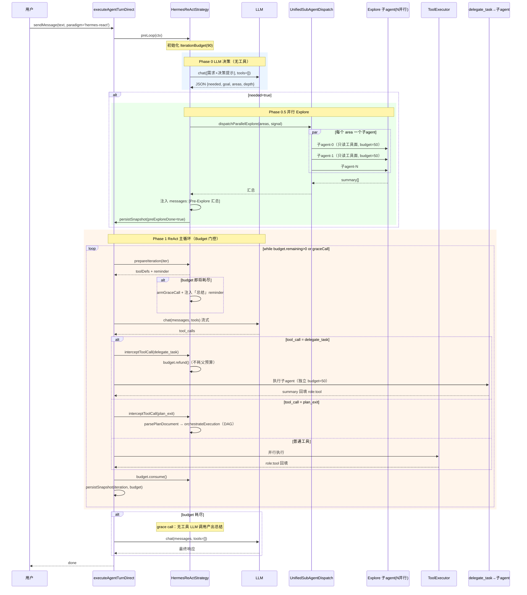
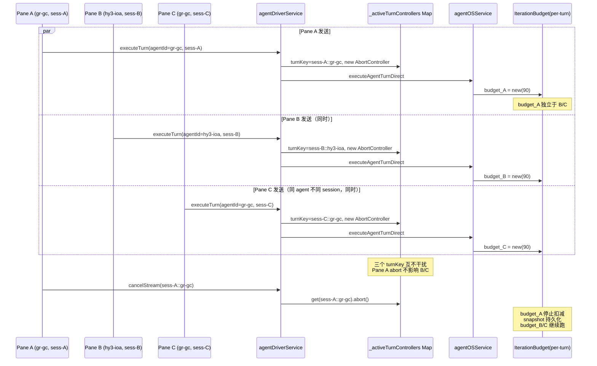
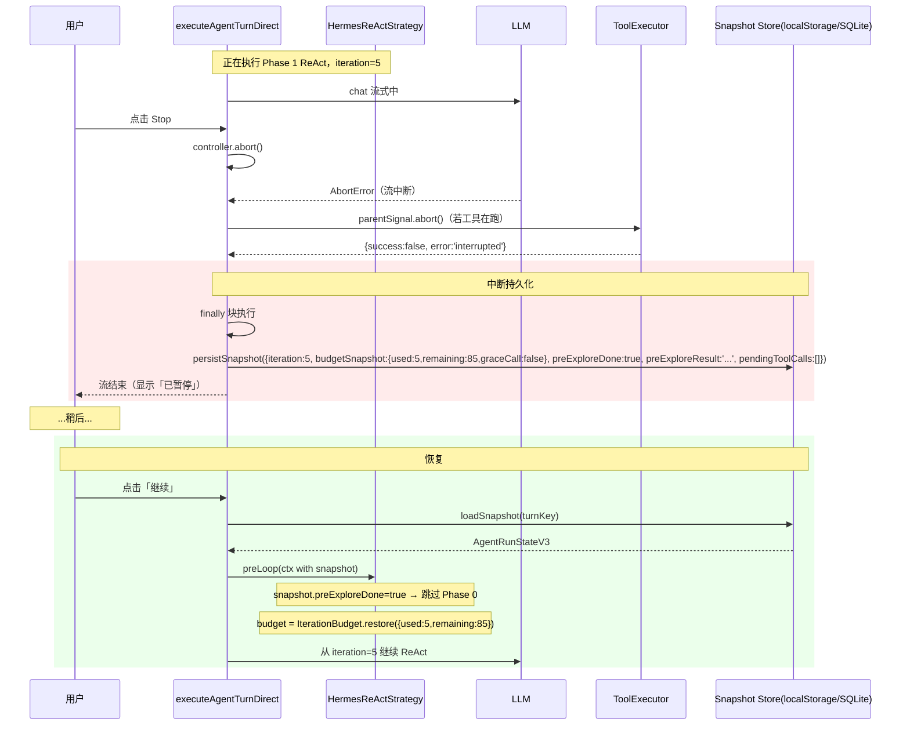
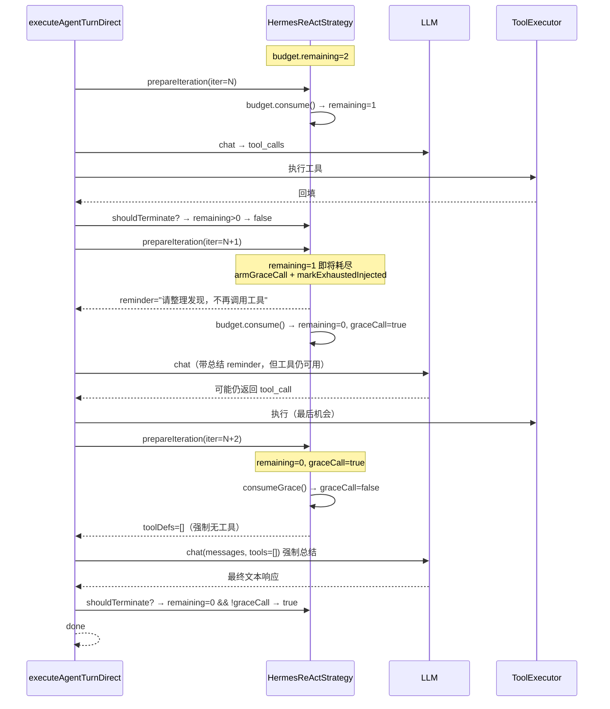
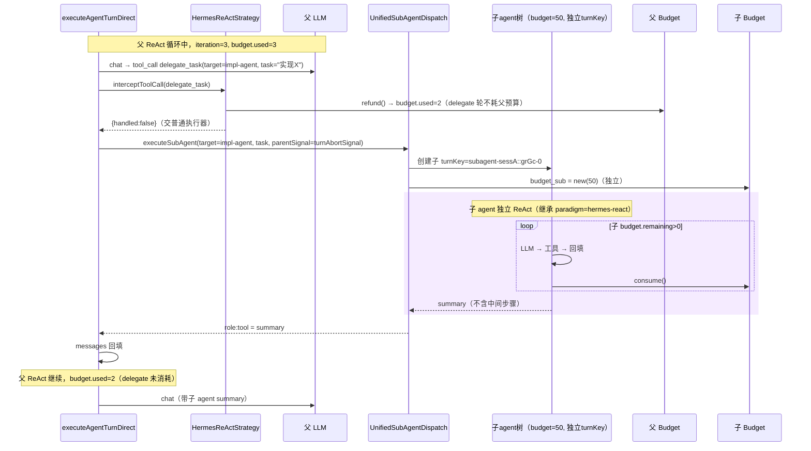

# 默认 Hermes 范式实现设计：LLM 决策 Pre-Explore + ReAct + 预算门控 + 委托编排

> 基于前期范式对比（`agentloop-paradigm-comparison-and-pluggable-design.md`），本设计把 **Hermes-Agent 范式**（ReAct + IterationBudget + delegation）定为默认，并在 ReAct 主循环**前**插入「LLM 动态决策是否并行 explore」阶段。重点保证**多聊天框/多 session 兼容**与**中断/恢复**。
>
> 日期：2026-07-21

---

## 一、范式定义与总体流

### 1.1 默认范式 `HermesReAct`

```
[turn 开始]
   │
   ▼
┌─────────────────────────────────────────────┐
│ Phase 0  Pre-Explore Decision（LLM 纯文本）  │  ← 新增：LLM 决策，非硬编码
│  输入：用户需求 + 历史                         │
│  输出：{ needed: bool, goal, areas[], depth } │
└─────────────────────────────────────────────┘
   │ needed?
   ├── 是 ──► Phase 0.5  并行 Explore 子agent（N 个只读）
   │            │  汇总 summary[] 注入 messages（role:user 元消息）
   │            ▼
   └── 否 ─────┐
                ▼
┌─────────────────────────────────────────────┐
│ Phase 1  ReAct 主循环（IterationBudget 门控）│
│  while budget.remaining>0 or graceCall:      │
│    LLM(messages, tools) → tool_calls         │
│    ├─ 控制工具（plan_exit/delegate_task）拦截 │
│    ├─ 普通工具并行执行 → role:tool 回填       │
│    └─ budget.consume()                       │
│  budget 耗尽 → grace call 无工具总结          │
└─────────────────────────────────────────────┘
   │
   ▼
[turn 结束 / snapshot 持久化]
```

### 1.2 与现有 plan_explore 三阶段的关系

| 现有（硬编码三阶段） | 本设计（LLM 决策） |
|---|---|
| craft/plan 模式**总是**走「文本分析 → plan_explore → exit_plan_mode」 | LLM 在 Phase 0 **自主判断**是否需要 explore；简单问题跳过 |
| `plan_explore` 是必经工具 | `plan_explore` 退化为「Phase 0 决策 needed=true 时的内部 dispatch」，LLM 不再显式调用 |
| `exit_plan_mode` 拦截 + DAG 执行 | 保留：作为 Phase 1 内的控制工具，plan 模式审批、craft 自动执行 |
| 三阶段 reminder 硬注入 | 改为 Phase 0 决策提示 + Phase 1 ReAct 提示，由 `HermesReActStrategy` 统一注入 |

> 向后兼容：老的 `plan_explore` 工具保留注册（作为 LLM 显式调用的兜底），但默认范式不再依赖 LLM 主动调用它。

---

## 二、核心构件

### 2.1 `IterationBudget`（移植 Hermes）

**新增文件** `common/iterationBudget.ts`：

```ts
/** 移植自 Hermes agent/iteration_budget.py。Per-turn 实例，非 per-agent（多 session 隔离）。 */
export class IterationBudget {
    private _used = 0;
    private _graceCall = false;
    private _exhaustedInjected = false;
    private readonly _maxTotal: number;

    constructor(maxTotal: number, opts?: { initialGrace?: boolean }) {
        this._maxTotal = Math.max(1, maxTotal);
        this._graceCall = opts?.initialGrace ?? false;
    }

    get maxTotal(): number { return this._maxTotal; }
    get used(): number { return this._used; }
    get remaining(): number { return Math.max(0, this._maxTotal - this._used); }
    get graceCall(): boolean { return this._graceCall; }
    get exhaustedInjected(): boolean { return this._exhaustedInjected; }

    /** 尝试扣减 1，返回是否允许。 */
    consume(): boolean {
        if (this._used >= this._maxTotal) { return false; }
        this._used++;
        return true;
    }

    /** 退还 1（execute_code 等不耗预算场景）。 */
    refund(): void {
        if (this._used > 0) { this._used--; }
    }

    /** 标记本次循环是 grace call（耗尽后允许再跑一次无工具总结）。 */
    consumeGrace(): void { this._graceCall = false; }

    /** 启用 grace call（预算耗尽时由主循环调用）。 */
    armGraceCall(): void { this._graceCall = true; }

    /** 标记已注入「max iterations 总结提示」，避免重复。 */
    markExhaustedInjected(): void { this._exhaustedInjected = true; }

    /** 快照用于持久化恢复。 */
    snapshot(): BudgetSnapshot {
        return { maxTotal: this._maxTotal, used: this._used, graceCall: this._graceCall, exhaustedInjected: this._exhaustedInjected };
    }

    static restore(s: BudgetSnapshot): IterationBudget {
        const b = new IterationBudget(s.maxTotal);
        b._used = s.used;
        b._graceCall = s.graceCall;
        b._exhaustedInjected = s.exhaustedInjected;
        return b;
    }
}

export interface BudgetSnapshot {
    readonly maxTotal: number;
    readonly used: number;
    readonly graceCall: boolean;
    readonly exhaustedInjected: boolean;
}
```

**预算来源（优先级）**：
1. `request.budgetMaxTotal`（显式）
2. `agent.config.budgetMaxTotal`（per-agent 配置，存 localStorage `saros:budget:{agentId}`）
3. 默认：主 agent 90，子 agent 50（对齐 Hermes）

### 2.2 `PreExploreDecision`（LLM 动态决策）

**新增** `common/preExploreDecision.ts`：

```ts
/** LLM 在 Phase 0 输出的决策结构。 */
export interface PreExploreDecision {
    readonly needed: boolean;          // 是否需要并行 explore
    readonly goal: string;             // 探索总目标
    readonly areas: readonly ExploreArea[];  // 探索方向（needed=true 时必填）
    readonly depth: 'shallow' | 'normal' | 'deep';  // 决定子 agent 数量与迭代
    readonly rationale: string;        // 决策理由（可观测性）
}

export interface ExploreArea {
    readonly title: string;            // 方向标题
    readonly query: string;            // 给子 agent 的具体任务
    readonly suggestedTools?: readonly string[];  // 限制子 agent 工具面（默认只读）
}

/** 让 LLM 输出结构化决策的提示模板。 */
export const PRE_EXPLORE_DECISION_PROMPT = `
你正在进入 Agent 主循环前的「Pre-Explore 决策」阶段。请基于用户需求与历史，判断是否需要派发并行 Explore 子 agent 预先收集信息。

输出严格的 JSON（仅 JSON，无其他文本）：
{
  "needed": true|false,
  "goal": "本次探索的总目标（needed=true 时必填）",
  "areas": [
    { "title": "方向1", "query": "给子agent的具体任务", "suggestedTools": ["read_file","search_code"] }
  ],
  "depth": "shallow"|"normal"|"deep",
  "rationale": "决策理由"
}

判断准则：
- needed=false：简单问答、单文件改动、用户已提供充足上下文、纯创作。
- needed=true：跨多模块改动、不熟悉的代码库、需求模糊需先勘察、涉及外部系统对接。
- depth=shallow（1-2 子agent，快扫）、normal（3-4，常规）、deep（5+，大范围）。
`;
```

**决策执行**（在 `HermesReActStrategy.preLoop`）：
- 用一次**无工具**的 LLM 调用获取 JSON（复用 `modelProvider.chat`，`tools: []`）
- 解析失败 → `needed=false`（降级，不阻塞）
- `needed=true` → 调 `UnifiedSubAgentDispatch.dispatchParallelExplore`，子 agent 数量 = `areas.length`，每个 area 一个 Explore 子 agent
- 子 agent 结果汇总为 `summary[]`，作为一条 `role:'user'` 元消息注入主 messages：`[Pre-Explore 汇总]\n\n1. 方向1：...\n2. 方向2：...`
- 子 agent 默认只读工具面（`filterToolsByChatMode('ask')`），budget 独立（默认 50），abort 链到父 turnController

### 2.3 `HermesReActStrategy`（默认策略实现）

**新增** `browser/strategies/hermesReActStrategy.ts`：

```ts
import type { IAgentLoopStrategy, AgentParadigm, LoopContext, IterationPlan, InterceptResult } from '../../common/agentLoopStrategy';
import { IterationBudget } from '../../common/iterationBudget';
import { PreExploreDecision, PRE_EXPLORE_DECISION_PROMPT, parseDecision } from '../../common/preExploreDecision';

export class HermesReActStrategy implements IAgentLoopStrategy {
    readonly paradigm: AgentParadigm = 'budgeted-react';
    private _budget?: IterationBudget;
    private _preExploreDone = false;

    async *preLoop(ctx: LoopContext): AsyncGenerator<IChatStreamDelta, PreLoopResult | void> {
        // 1. 初始化预算（per-turnKey，多 session 隔离）
        this._budget = ctx.budget ?? new IterationBudget(ctx.config.budgetMaxTotal ?? 90);

        // 2. 恢复场景：若 snapshot 表明 preExplore 已完成，跳过
        if (ctx.snapshot?.preExploreDone) {
            this._preExploreDone = true;
            return;
        }

        // 3. Phase 0：LLM 决策（无工具调用）
        const decision = await this._decidePreExplore(ctx);
        yield { type: 'meta', meta: { phase: 'pre-explore-decision', decision } };

        if (!decision.needed) { return; }  // 直接进 ReAct

        // 4. Phase 0.5：并行 explore（复用 UnifiedSubAgentDispatch）
        yield { type: 'meta', meta: { phase: 'pre-explore-dispatch', areas: decision.areas } };
        const summaries = await ctx.dispatch.dispatchParallelExplore(
            decision.areas.map(a => ({ type: 'Explore', priority: 'high', task: a.query, toolFilter: 'readonly' })),
            ctx.host._buildSubAgentExecuteFn(),
            ctx.signal,
        );
        ctx.dispatch.cleanup();  // 不在底部面板显示子agent卡片

        // 5. 汇总注入 messages
        const summaryText = this._formatSummaries(decision, summaries);
        ctx.messages.push({ role: 'user', content: `[Pre-Explore 汇总]\n${summaryText}` });
        this._preExploreDone = true;

        // 6. 快照持久化（支持中断恢复）
        ctx.host._persistTurnSnapshot(ctx, { preExploreDone: true, preExploreResult: summaryText });
    }

    prepareIteration(ctx: LoopContext, iteration: number): IterationPlan {
        const reminder = this._buildReActReminder(ctx, iteration);
        return {
            toolDefs: ctx.toolDefs,           // 全工具面（含 delegate_task）
            hardPermission: (tool) => this._hardPermission(ctx, tool),
            reminderMessage: reminder,
        };
    }

    async *interceptToolCall(ctx: LoopContext, call: ToolCall): AsyncGenerator<IChatStreamDelta, InterceptResult> {
        // plan_exit / plan_explore / delegate_task 等控制工具拦截
        if (call.name === 'plan_exit') {
            return yield* this._handlePlanExit(ctx, call);
        }
        if (call.name === 'delegate_task') {
            // delegate 由 UnifiedSubAgentDispatch 后端执行，此处只做 budget 记账
            // 子 agent 用独立 budget（默认 50），父不消耗
            this._budget?.refund();  // delegate 轮次不耗父预算（对齐 Hermes execute_code 退还）
            return { handled: false };  // 交给普通工具执行器
        }
        return { handled: false };
    }

    shouldTerminate(ctx: LoopContext, iteration: number): boolean {
        // budget 耗尽 + grace call 已用 → 强制终止
        if (this._budget && this._budget.remaining <= 0 && !this._budget.graceCall) {
            return true;
        }
        return false;  // 默认由 inner loop 判定（无 tool_call 即终止）
    }

    private async _decidePreExplore(ctx: LoopContext): Promise<PreExploreDecision> {
        const messages = [...ctx.messages, { role: 'user', content: PRE_EXPLORE_DECISION_PROMPT }];
        try {
            const resp = await ctx.host._callLLMNoTools(messages, ctx.signal);  // 无工具调用
            return parseDecision(resp.text);
        } catch (e) {
            return { needed: false, goal: '', areas: [], depth: 'normal', rationale: `decision failed: ${e}` };
        }
    }

    private _buildReActReminder(ctx: LoopContext, iter: number): string | undefined {
        if (this._budget && this._budget.remaining <= 1 && !this._budget.exhaustedInjected) {
            this._budget.armGraceCall();
            this._budget.markExhaustedInjected();
            return `<system-reminder>预算即将耗尽（剩余 ${this._budget.remaining} 次）。请整理已有发现，产出最终响应，不再调用工具。</system-reminder>`;
        }
        return undefined;
    }

    private _hardPermission(ctx: LoopContext, tool: string): boolean {
        // plan 模式：禁用写工具（对齐现有 plan 模式硬拦）
        if (ctx.workState.mode === 'plan') {
            return WRITE_TOOLS.includes(tool);
        }
        return false;
    }
}
```

### 2.4 `AgentRunState` 快照扩展

扩展现有 `snapshotRunState`/`restoreRunState`（在 `agentOSService.ts` 或 `common/agentRunState.ts`），新增字段：

```ts
export interface AgentRunStateV3 {  // 在 v2 基础上扩展
    // ... 现有字段
    readonly budgetSnapshot?: BudgetSnapshot;        // 新增：预算快照
    readonly preExploreDone?: boolean;               // 新增：pre-explore 是否已完成
    readonly preExploreResult?: string;              // 新增：pre-explore 汇总文本
    readonly iteration?: number;                     // 新增：当前迭代序号
    readonly pendingToolCalls?: ToolCall[];          // 新增：中断时未执行完的工具调用
}
```

恢复逻辑（`prepareResumeRunState`）：
- 重建 `IterationBudget.restore(snapshot.budgetSnapshot)`
- 若 `preExploreDone=true` → 跳过 Phase 0，直接进 ReAct，messages 已含 preExploreResult
- 若有 `pendingToolCalls` → 先执行完再继续循环

---

## 三、多聊天框 / 多 session 兼容性设计

### 3.1 隔离层级（自顶向下）

| 层级 | 隔离单位 | 隔离机制 | 现状 |
|---|---|---|---|
| **Editor Pane** | 每个 NativeChatEditorPane 实例 | 独立 `_paneId`、`_currentAgentId`、`_currentSessionId`、`_loadGeneration` | ✅ 已有 |
| **Turn** | turnKey = `${sessionId}::${agentId}` | `_activeTurnControllers: Map<turnKey, AbortController>` | ✅ 已有 |
| **Budget** | per-turnKey 实例 | `HermesReActStrategy._budget`（策略实例 per-turn） | 🆕 新增 |
| **Pre-Explore** | per-turnKey | `dispatch.dispatchParallelExplore` 的 subagent abort 链到父 turnController | 🆕 增强 |
| **Snapshot** | per-turnKey | `AgentRunStateV3` 存 per-sessionId（localStorage `saros:runState:{sessionId}:{agentId}`） | 🆕 新增 |
| **Config** | per-agentId | localStorage `saros:budget:{agentId}`、`saros:paradigm:{agentId}` | 🆕 新增 |

### 3.2 关键不变式

1. **策略实例 per-turn**：`AgentLoopStrategyFactory.resolve(request)` 每次返回**新实例**（不缓存），确保 budget/state 不跨 turn 串话。
2. **同一 agentId 不同 sessionId 可并发**：`_activeTurnControllers` Map 已按 turnKey 隔离，不同 session 的同一 agent 各自跑独立 turn。
3. **同一 sessionId 同一 agentId 不可并发**：`agentDriverService.executeTurn` 入口 `this.cancelTurn(turnId)` 先取消旧 turn（已有机制）。
4. **子 agent 的 turnKey 独立**：`dispatchParallelExplore` 内子 agent 用 `subagent-${parentId}-${idx}` 作为 agentId，独立 turnKey，父 abort 通过 `abortSignal` 链传播（不通过 turnKey 查找）。
5. **localStorage key 全部带 agentId/sessionId**：禁止全局 key。

### 3.3 多 session 场景验证

```
Pane A: agentId=gr-gc, sessionId=sess-A, paradigm=hermes-react
Pane B: agentId=hy3-ioa, sessionId=sess-B, paradigm=hermes-react
Pane C: agentId=gr-gc, sessionId=sess-C, paradigm=hermes-react  ← 同 agent 不同 session

→ 三个 turnKey：sess-A::gr-gc / sess-B::hy3-ioa / sess-C::gr-gc
→ 三个独立 AbortController、三个 IterationBudget、三个 preExplore 状态
→ Pane A 和 Pane C 同跑 gr-gc：各自 budget 独立，互不影响
→ Pane A abort 不影响 Pane B/C
→ 子 agent：A 派发的 Explore 子 agent 用 subagent-sess-A::gr-gc-0，abort 链到 A 的 controller
```

---

## 四、中断 / 恢复设计

### 4.1 中断类型与处理

| 中断类型 | 触发 | 处理 |
|---|---|---|
| **用户点击 Stop** | `cancelStream` → `controller.abort()` | 协作式取消：LLM 流 `AbortError` break；工具执行 `parentSignal.abort()`；generator `finally` 清理；**持久化 snapshot** |
| **用户切换 tab（不中断）** | pane 失焦 | turn 继续在后台跑（已有 `_loadGeneration` 防串话）；delta 仍写入对应 session 历史 |
| **窗口关闭/崩溃** | beforeunload / 进程退出 | snapshot 已在每轮末持久化；重启后从 snapshot 恢复 |
| **预算耗尽** | `budget.remaining <= 0` | armGraceCall → 跑一次无工具总结 → `shouldTerminate=true` → done |
| **subagent 超时** | `delegation.child_timeout_seconds` | 子 agent abort，返回 `{success:false, error:'timeout'}` summary 回填父，父继续 ReAct |

### 4.2 显式中断检查点（增强现有隐式 abort）

现状主循环无显式 `if (aborted) break`，靠 `AbortError` 隐式传播。本设计在关键点加显式检查，避免 budget 扣减错乱：

```ts
// executeAgentTurnDirect 主循环（改造后）
while (iteration < MAX_TOOL_ITERATIONS) {
    // ① 显式 abort 检查（每轮顶部）
    if (ctx.signal.aborted) {
        yield { type: 'meta', meta: { phase: 'aborted', iteration } };
        break;
    }

    const plan = strategy.prepareIteration?.(ctx, iteration) ?? defaultPlan(ctx);
    if (plan.reminderMessage) { appendReminder(ctx.messages, plan.reminderMessage); }

    // ② budget 检查（Hermes 范式核心）
    if (strategy instanceof HermesReActStrategy) {
        if (!strategy.budget!.consume() && !strategy.budget!.graceCall) {
            break;  // 预算耗尽且无 grace
        }
        if (strategy.budget!.graceCall) { strategy.budget!.consumeGrace(); }
    }

    const toolCalls = yield* streamLLMAndAssemble(ctx, plan.toolDefs);

    // ③ 中断时持久化 pendingToolCalls
    if (ctx.signal.aborted && toolCalls.length > 0) {
        ctx.host._persistTurnSnapshot(ctx, { pendingToolCalls: toolCalls, iteration, budgetSnapshot: strategy.budget!.snapshot() });
        break;
    }

    // ④ 控制工具拦截
    for (const call of toolCalls) {
        if (strategy.interceptToolCall) {
            const r = yield* strategy.interceptToolCall(ctx, call);
            if (r.handled) { if (r.terminate) { return; } continue; }
        }
    }

    yield* executeToolsAndAppend(ctx, toolCalls, plan.hardPermission);

    // ⑤ 每轮末持久化 snapshot
    ctx.host._persistTurnSnapshot(ctx, { iteration: iteration + 1, budgetSnapshot: strategy.budget?.snapshot() });

    if (strategy.shouldTerminate?.(ctx, iteration) ?? defaultTerminate(ctx, toolCalls)) { break; }
    iteration++;
}
```

### 4.3 恢复流程

```ts
// agentDriverService.resumeTurn(sessionId, agentId)
async *resumeTurn(sessionId: string, agentId: string): AsyncIterable<IChatStreamDelta> {
    const turnKey = `${sessionId}::${agentId}`;
    const snapshot = this._loadTurnSnapshot(turnKey);  // 从 localStorage/SQLite
    if (!snapshot) { throw new Error('No snapshot to resume'); }

    const request = this._reconstructRequest(snapshot);  // 重建 IAgentTurnRequest
    request.__resumeFrom = snapshot;  // 传递给 strategy

    yield* this.executeTurn(request);  // 走正常 turn，strategy.preLoop 检测 __resumeFrom 跳过已完成阶段
}
```

恢复时 `HermesReActStrategy.preLoop` 检查 `ctx.snapshot`：
- `preExploreDone=true` → 跳过 Phase 0/0.5
- `budgetSnapshot` → `IterationBudget.restore()`
- `pendingToolCalls` → 先执行完再进循环
- `iteration` → 从该序号继续

---

## 五、时序图

### 5.1 总体：LLM 决策 Pre-Explore + ReAct + Budget + Delegation



### 5.2 多 session 并发隔离



### 5.3 中断与恢复



### 5.4 Budget 耗尽 + Grace Call



### 5.5 Delegation 委托编排



---

## 六、实施步骤（增量、零回归）

### 阶段 1：抽象落地（不改行为）
- 新增 `common/agentLoopStrategy.ts`（接口）
- 新增 `common/iterationBudget.ts`（class + snapshot）
- 新增 `common/preExploreDecision.ts`（类型 + 提示模板 + `parseDecision`）
- 新增 `browser/agentLoopStrategyFactory.ts`（注册 + resolve）
- `executeAgentTurnDirect` 入口改为 `strategyFactory.resolve(request)`，内部实现暂不动（用现有 if 分支包成 `PlanExploreStrategy` 临时占位）
- **验收**：tsgo 零错误 + 现有 craft/plan/ask 行为完全不变

### 阶段 2：HermesReActStrategy 实现
- 新增 `browser/strategies/hermesReActStrategy.ts`
- 实现 `preLoop`（LLM 决策 + dispatchParallelExplore + 汇总注入）
- 实现 `prepareIteration`（budget 检查 + reminder 注入）
- 实现 `interceptToolCall`（plan_exit / delegate_task 处理）
- 实现 `shouldTerminate`（budget 耗尽判定）
- 修改 `executeAgentTurnDirect` 主循环：插入显式 abort 检查 + budget consume/graceCall
- **验收**：craft 模式默认走 HermesReAct，简单问题跳过 explore，复杂问题并行 explore；plan 模式仍审批

### 阶段 3：中断/恢复增强
- 扩展 `AgentRunState` → V3（budgetSnapshot / preExploreDone / preExploreResult / iteration / pendingToolCalls）
- `_persistTurnSnapshot` / `_loadTurnSnapshot` 实现（localStorage per-turnKey）
- `prepareResumeRunState` 重建 budget + 跳过已完成 preExplore + 执行 pendingToolCalls
- UI「继续」按钮接 `resumeTurn(sessionId, agentId)`
- **验收**：中断后点继续，从断点 iteration + budget 恢复；preExplore 不重跑

### 阶段 4：多 session 验证与配置
- localStorage key 全部 per-agentId/sessionId（`saros:budget:{agentId}`、`saros:paradigm:{agentId}`、`saros:runState:{sessionId}:{agentId}`）
- 多 pane 同跑测试：同 agent 不同 session、不同 agent 同 session
- Agent config.md 增加 `paradigm` + `budgetMaxTotal` 字段
- **验收**：三 pane 并发互不串话；切 tab 不中断后台 turn

### 阶段 5：Delegation 打磨
- `delegate_task` 工具接 `UnifiedSubAgentDispatch.executeSubAgent`（已有），确认子 agent 用独立 budget + 独立 turnKey
- 子 agent 默认继承父 paradigm（hermes-react），可通过 `SubAgentOptions.paradigm` 覆盖
- 子 agent abort 链到父 turnController（已有 abortSignal 透传）
- 子 agent timeout（`delegation.child_timeout_seconds`）配置
- **验收**：父 delegate 后阻塞等待子 summary；子超时返回错误 summary 不阻塞父

---

## 七、风险与兼容

| 风险 | 缓解 |
|---|---|
| Phase 0 LLM 决策失败/输出非 JSON | `parseDecision` 降级 `needed=false`；不阻塞主循环 |
| preExplore 子 agent 数过多拖慢首响应 | `depth` 控制：shallow≤2、normal≤4、deep≤6；子 agent budget=50 限制 |
| budget 默认 90 对小任务过大 | per-agent 配置 `budgetMaxTotal`；简单问答 needed=false 时 Phase 0 只多一次无工具 LLM 调用 |
| snapshot 持久化频繁影响性能 | 每轮末异步写 localStorage（不阻塞循环）；崩溃丢失≤1 轮 |
| 中断时工具正在写文件 | 工具级 abort 已有（`executeWithTimeout`）；回填 `{role:'tool', content:'[interrupted]'}` 让 LLM 下轮知晓 |
| 同 agent 多 session snapshot key 冲突 | key 带 sessionId：`saros:runState:{sessionId}:{agentId}` |
| 老的 `plan_explore` 工具仍被 LLM 显式调用 | 保留注册但策略 `interceptToolCall` 拦截：若 Phase 0 已 explore 则跳过，避免重复 |
| delegate_task 递归过深 | 子 agent budget=50 + 父 budget=90 自然限制；可加 `delegation.max_depth` 配置 |

---

## 八、一句话总结

**默认范式 = HermesReAct**：Phase 0 LLM 无工具决策是否并行 explore → Phase 0.5 `UnifiedSubAgentDispatch` 扇出只读子 agent 汇总注入 → Phase 1 ReAct 主循环配 `IterationBudget`（consume/refund/graceCall）+ `delegate_task` 委托编排（子 agent 独立 budget/turnKey）+ `plan_exit` DAG 执行。多 session 靠 per-turnKey（`${sessionId}::${agentId}`）的 AbortController/Budget/Snapshot 三重隔离；中断靠显式 abort 检查点 + `AgentRunStateV3` 快照（含 budget/preExplore/iteration/pendingToolCalls）+ `resumeTurn` 从断点恢复。
