# Hivemind 团队协作功能设计方案

> **文档版本**: v1.1
> **生成时间**: 2026-06-16
> **目标项目**: vssaros-agents-client（基于 VS Code 的 Agent Studio 平台）
> **参考项目**: hivemind（@deeplake/hivemind v0.7.94）

---

## 目录

1. [Hivemind 项目总览](#1-hivemind-项目总览)
2. [团队技能（Skill）实现分析](#2-团队技能skill实现分析)
3. [Agent 集成架构分析](#3-agent-集成架构分析)
4. [代码库（Codebase Graph）实现分析](#4-代码库codebase-graph实现分析)
5. [知识库（Memory/Knowledge）实现分析](#5-知识库memoryknowledge实现分析)
6. [团队协作功能差距分析](#6-团队协作功能差距分析)
7. [团队协作功能设计方案](#7-团队协作功能设计方案)
8. [实施路线图](#8-实施路线图)
9. [服务器部署 Web 查看与升级功能设计](#9-服务器部署-web-查看与升级功能设计)

---

## 1. Hivemind 项目总览

### 1.1 项目定位

Hivemind 是一个 **云端持久化共享记忆系统**，为多个 AI Agent 提供：
- **共享记忆存储**：基于 Deeplake 云端数据库的 org 级别记忆共享
- **技能挖掘与传播**：自动从会话中挖掘可复用技能，跨团队成员传播
- **代码图谱**：AST 级别的代码关系图（调用、导入、继承），支持跨文件解析
- **语义搜索**：基于本地 embedding daemon（nomic-embed-text-v1.5）的混合语义+词法搜索

### 1.2 核心架构

```
hivemind/
├── src/                    → 共享核心（API 客户端、认证、配置、SQL 工具）
│   ├── hooks/              → Claude Code / Codex / Cursor / Hermes / pi 钩子
│   ├── embeddings/         → nomic embed-daemon + 协议 + SQL 辅助
│   ├── mcp/                → MCP Server（供 Hermes 及未来 MCP 客户端使用）
│   ├── graph/              → 代码图谱（AST 提取、跨文件解析、快照管理）
│   ├── skillify/           → 技能挖掘、发布、拉取、自动优化
│   ├── rules/              → 组织级规则读写
│   ├── shell/              → Deeplake 虚拟文件系统（VFS）
│   ├── notifications/      → 会话通知框架
│   ├── commands/           → 认证与登录命令
│   └── cli/                → 统一 CLI 入口 + 每个Agent安装器
├── claude-code/            → Claude Code 插件源码
├── codex/                  → Codex 插件构建输出
├── cursor/                 → Cursor 插件构建输出
├── hermes/                 → Hermes 插件构建输出
├── openclaw/               → OpenClaw 插件源码+构建
└── pi/                     → pi 扩展源码
```

### 1.3 数据模型

Hivemind 使用 Deeplake（PostgreSQL 兼容）作为后端存储，定义了 7 张核心表：

| 表名 | 用途 | 核心字段 |
|------|------|---------|
| `memory` | Wiki 摘要 | path, summary, summary_embedding, author, project |
| `sessions` | 原始会话事件 | path, message(JSONB), message_embedding, author, agent |
| `skills` | 技能版本 | name, project, scope, author, body, trigger_text, version |
| `rules` | 组织级规则 | rule_id, text, scope, status, assigned_by, version |
| `goals` | 目标追踪 | goal_id, owner, status, content, version |
| `kpis` | KPI 指标 | goal_id, kpi_id, content, version |
| `codebase` | 代码图谱快照 | repo_slug, commit_sha, snapshot_jsonb, node_count, edge_count |

所有表遵循 **append-only + version-bump** 模式，避免 UPDATE 操作的并发问题。

---

## 2. 团队技能（Skill）实现分析

### 2.1 技能生命周期

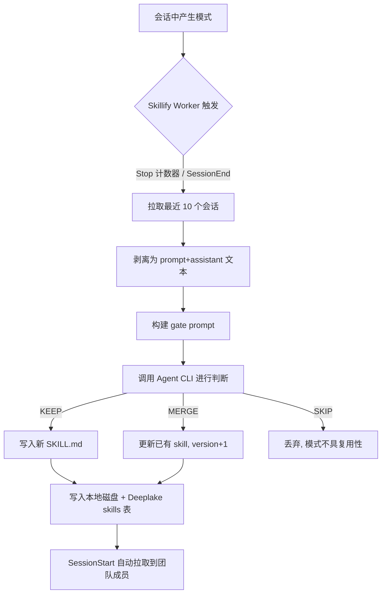

### 2.2 技能挖掘（Mining）机制

**触发时机**：
- **Stop 计数器**：每 `HIVEMIND_SKILLIFY_EVERY_N_TURNS`（默认 20）轮触发
- **SessionEnd**：会话结束时必定触发

**挖掘流程**：
1. Worker 从 `sessions` 表拉取最近 10 个在 scope 范围内的会话
2. 剥离为纯 prompt + assistant 文本（过滤 tool calls、thinking blocks）
3. 构建包含现有技能 + 新交换 + 决策规则的 gate prompt
4. 调用 Agent 自身 CLI（如 `claude -p haiku`），返回 JSON 判定：
   - `KEEP <name> <body>` → 新建技能
   - `MERGE <existing-name> <merged-body>` → 合并更新
   - `SKIP <reason>` → 丢弃

**Scope 控制**：
- `scope=me`：仅挖掘自己的会话
- `scope=team`：挖掘团队成员的会话（`author IN (<team>)`）
- 团队成员通过 `hivemind skillify team add/remove` 管理

### 2.3 技能共享（Pull/Unpull）机制

**Pull 流程**：
```bash
hivemind skillify pull                  # 全部作者，安装到全局
hivemind skillify pull --user alice     # 指定作者
hivemind skillify pull --to project     # 安装到项目级
```

磁盘布局：
```
~/.claude/skills/
├── deploy/SKILL.md              → 本地挖掘的技能（无后缀）
├── deploy--alice/SKILL.md       → 从 alice 拉取的技能（--author 后缀）
└── review--bob/SKILL.md         → 从 bob 拉取的技能
```

**Auto-pull**：每次 SessionStart 自动执行 `pull --all-users --to global`，5 秒超时，幂等写入（本地版本 >= 远程版本则跳过）。

**Symlink 扇出**：拉取的技能同时创建 symlink 到其他 Agent 的 skill 根目录（`~/.hermes/skills/`、`~/.pi/agent/skills/`）。

### 2.4 技能自动优化（SkillOpt）

SkillOpt 是事件驱动的技能优化系统：
- 技能被调用后，系统开始跟踪该技能的推回（pushback）计数
- 当推回计数达到阈值时，触发 `skillopt-worker` 进行改进
- `proposer` 模块分析技能缺陷并生成编辑建议
- 改进后的技能以新版本写入

---

## 3. Agent 集成架构分析

### 3.1 多 Agent 集成模型

| Agent | 集成方式 | 钩子/工具 |
|-------|---------|-----------|
| Claude Code | Marketplace 插件 | SessionStart → UserPromptSubmit → PreToolUse → PostToolUse → Stop → SubagentStop → SessionEnd |
| Codex | `~/.codex/hooks.json` | SessionStart → UserPromptSubmit → PreToolUse(Bash) → PostToolUse → Stop |
| OpenClaw | 原生扩展 | agent_end 捕获 → before_agent_start 回忆 + MCP 工具 |
| Cursor | `~/.cursor/hooks.json` | sessionStart → beforeSubmitPrompt → postToolUse → afterAgentResponse → stop → sessionEnd |
| Hermes | Skill | grep 回忆 `~/.deeplake/memory/` |
| pi | `AGENTS.md` + skill | grep 回忆 `~/.deeplake/memory/` |

### 3.2 MCP Server

Hivemind 暴露了 3 个 MCP 工具供任何 MCP 客户端使用：

| 工具 | 功能 | 输入 |
|------|------|------|
| `hivemind_search` | 关键词/短语搜索共享记忆 | query, limit |
| `hivemind_read` | 读取特定记忆路径的完整内容 | path |
| `hivemind_index` | 列出摘要条目 | prefix, limit |

传输协议：stdio。由消费方的 MCP 客户端作为子进程启动。

### 3.3 认证与权限模型

- **认证**：SSO 登录 → 设备流（Device Flow）→ 浏览器打开
- **组织结构**：Org → Workspace → Members
- **角色**：ADMIN / WRITE / READ
- **Workspace 隔离**：每个 Workspace 有独立的表命名空间
- **Token 自愈**：`healDriftedOrgToken` 检测并修复 org 切换后的 token 漂移

### 3.4 SessionStart 注入机制

SessionStart 钩子负责向 Agent 上下文注入关键信息：

```
1. 认证检查 → 无凭证则触发 Device Flow 登录
2. 自动更新检查 → autoUpdate
3. Deeplake 表确保 → ensureTable + ensureSessionsTable
4. 创建占位摘要 → createPlaceholder（会话占位）
5. 自动拉取技能 → autoPullSkills（5秒超时）
6. 渲染规则块 → renderContextBlock（组织级规则）
7. 代码图谱上下文 → graphContextLine（本地图谱元信息）
8. 组装 additionalContext → 注入到 Agent 上下文
```

---

## 4. 代码库（Codebase Graph）实现分析

### 4.1 图谱数据模型

采用 NetworkX node-link JSON 兼容格式：

```typescript
interface GraphSnapshot {
  directed: true;        // 有向图
  multigraph: true;      // 多边图
  graph: GraphMetadata;  // 稳定元数据（参与内容哈希）
  observation: GraphObservation; // 易失元数据（不参与哈希）
  nodes: GraphNode[];    // 按 id 排序
  links: GraphEdge[];    // 按 (source, target, relation, ord) 排序
}
```

**节点类型**：function, class, method, interface, type_alias, enum, const, variable, module
**边类型**：imports, calls, extends, implements, method_of
**语言支持**：TypeScript, JavaScript, Python, Go, Rust, Java, Ruby, C, C++

### 4.2 图谱构建流程

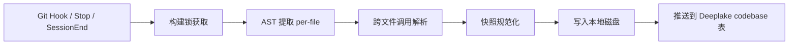

**Phase 1.5 增强**：
- `import_bindings`：记录文件级的导入绑定
- `raw_calls`：捕获未解析的调用点
- 跨文件解析器：匹配 `callee_name` 与 `import_bindings` 解析跨文件调用

### 4.3 图谱查询接口

通过 VFS（虚拟文件系统）挂载在 `~/.deeplake/memory/graph/` 下：

| 路径 | 功能 |
|------|------|
| `graph/query/<pattern>` | 搜索 + 1-hop 展开（调用者、被调用者、导入） |
| `graph/find/<pattern>` | 子串搜索符号 |
| `graph/show/<handle>` | 节点 + 1-hop 邻居 |
| `graph/neighborhood/<file>` | 文件内符号 + 跨文件链接 |
| `graph/index.md` | 索引 |
| `graph/layers` | 层级视图 |
| `graph/tour` | 导览 |
| `graph/path/<from>/<to>` | 路径查询 |

### 4.4 云端同步

- **Push**：SELECT-before-INSERT + 漂移检测
  - 同 commit 同 sha256 → 幂等跳过
  - 同 commit 不同 sha256 → 漂移警告（不覆盖）
  - 无行 → INSERT
- **Pull**：SessionStart 时异步拉取，更新本地快照

---

## 5. 知识库（Memory/Knowledge）实现分析

### 5.1 三层记忆架构

| 层级 | 路径 | 大小 | 用途 |
|------|------|------|------|
| **Index** | `~/.deeplake/memory/index.md` | ~5 KB | 最近 50 条摘要索引，含 Created/Last Updated/Project/Description |
| **Summaries** | `~/.deeplake/memory/summaries/<user>/<sessionId>.md` | ~3 KB/条 | AI 生成的会话摘要（wiki 风格） |
| **Sessions** | `~/.deeplake/memory/sessions/<user>/<user>_<org>_<ws>_<sessionId>.jsonl` | ~5 KB/条 | 原始对话 JSONL |

### 5.2 摘要生成（Wiki Worker）

**触发时机**：
- **Final**：会话结束时（Stop / SessionEnd / session_shutdown）
- **Periodic**：消息数 ≥ `HIVEMIND_SUMMARY_EVERY_N_MSGS`（默认 50）或 时间 ≥ `HIVEMIND_SUMMARY_EVERY_HOURS`（默认 2h）

**生成流程**：
1. 从 `sessions` 表查询该会话的所有事件
2. 构建结构化 prompt，要求提取实体、决策、修改文件、开放问题等
3. 调用 Agent CLI 生成 markdown
4. 上传到 `memory` 表，附带 768 维 embedding

**并发控制**：per-session 锁文件防止同一会话的并发 worker。

### 5.3 语义搜索

- **Embedding 模型**：nomic-embed-text-v1.5（768 维），本地 daemon
- **安装大小**：~600 MB（含 onnxruntime-node + sharp）
- **混合搜索**：语义 + 词法（BM25/ILIKE），语义优先
- **降级策略**：无 embedding 依赖时自动退化为纯词法搜索

### 5.4 VFS 虚拟文件系统

DeeplakeFs 将 Deeplake 表映射为文件系统：
- 支持 `cat`、`ls`、`grep`、`mkdir`、`rm`、`cp` 等操作
- 通过 `just-bash` IFileSystem 接口集成
- 写入操作 debounced（200ms），批量提交
- 支持目标（Goals）和 KPI 的路径约定：`/goal/<owner>/<status>/<goal_id>.md`

---

## 6. 团队协作功能差距分析

### 6.1 现有能力的边界

| 维度 | Hivemind 已有 | Saros 已有 | 差距 |
|------|-------------|-------------|------|
| **技能共享** | Org 级自动 pull/push | 本地 SkillRegistry（4级优先级） | 缺少云端同步和跨组织传播 |
| **Agent 管理** | 6+ Agent 集成，钩子式 | Agent Studio 多员工管理 | 缺少 Agent 间实时协作 |
| **代码图谱** | AST 级跨文件图谱 + 云端 | 无 | 完全缺失 |
| **知识库** | 三层记忆 + 语义搜索 | TDB-AM L0-L3 四层 | 缺少跨 workspace/跨组织知识发现 |
| **会话共享** | 组织内共享 sessions | 本地 JSONL | 缺少实时会话可见性 |
| **任务协调** | Goals + KPI（VFS 路径约定） | TaskBoard（UI 可视化） | 缺少跨 Agent 任务委派 |
| **规则管理** | Org 级规则表 + 自动注入 | 无 | 完全缺失 |
| **通知系统** | 会话级通知框架 | 无 | 完全缺失 |

### 6.2 核心差距总结

1. **无跨组织协作**：Hivemind 的共享边界是 Org → Workspace，无跨 Org 机制
2. **无实时协作**：所有共享都是异步的（SessionStart 拉取、SessionEnd 推送）
3. **无多人同时编辑**：VFS 写入是 debounced 批量，无 OT/CRDT
4. **无角色细粒度控制**：仅 ADMIN/WRITE/READ 三级，无资源级权限
5. **无工作流编排**：缺少跨 Agent 的任务流、审批流、条件触发
6. **无冲突解决**：技能/规则的并发写入仅靠 append-only + version-bump，无合并策略

---

## 7. 团队协作功能设计方案

### 7.1 总体架构

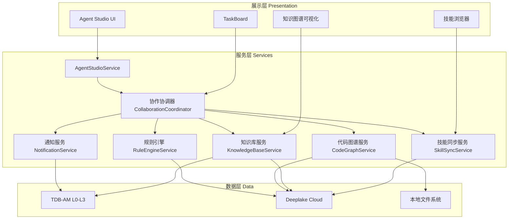

### 7.2 功能模块设计

---

#### 7.2.1 团队技能协作系统

##### 设计目标
- 支持技能在 **团队 → 组织 → 跨组织** 三级传播
- 技能评审与发布工作流
- 技能版本管理与冲突解决
- 技能使用统计与推荐

##### 数据模型扩展

```typescript
// 技能可见性层级
type SkillVisibility = 'private' | 'team' | 'org' | 'public';

// 技能评审状态
type SkillReviewStatus = 'draft' | 'pending_review' | 'approved' | 'rejected' | 'deprecated';

// 扩展技能表
interface SkillRecord {
  id: string;
  name: string;
  project: string;
  project_key: string;
  local_path: string;
  install: 'project' | 'global';
  source_sessions: string;
  source_agent: string;
  scope: SkillVisibility;
  author: string;
  contributors: string[];
  description: string;
  trigger_text: string;
  body: string;
  version: bigint;
  review_status: SkillReviewStatus;
  reviewer: string;
  review_comment: string;
  tags: string[];           // 新增：标签
  category: string;         // 新增：分类
  usage_count: number;      // 新增：使用计数
  rating: number;           // 新增：评分
  parent_skill_id: string;  // 新增：Fork 来源
  created_at: string;
  updated_at: string;
}
```

##### 核心流程

**技能发布工作流**：
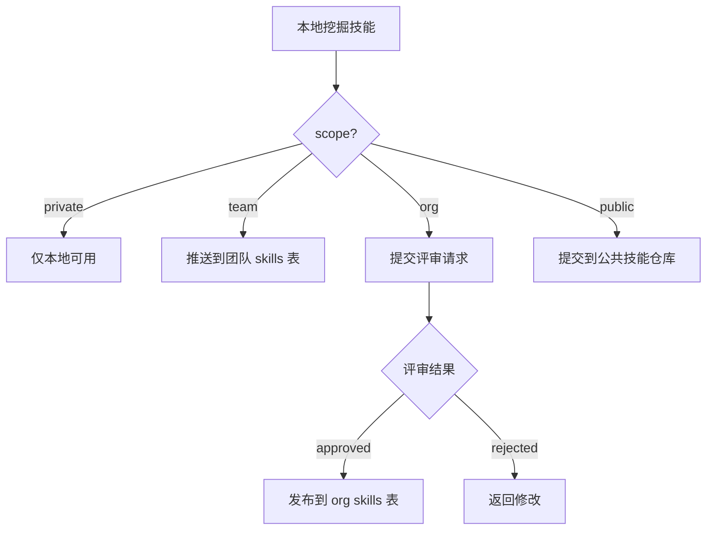

**技能冲突解决**：
- 同名技能按 `visibility` 优先级加载：`private > team > org > public`
- Fork 机制：拉取他人技能后本地修改，生成新 `parent_skill_id` 链
- 版本合并：当上游技能更新时，提示用户选择 `merge` / `keep-local` / `diff-view`

##### API 设计

```typescript
interface ISkillCollaborationService {
  // 发布技能到指定可见性层级
  publishSkill(skillId: string, visibility: SkillVisibility): Promise<void>;
  // 请求技能评审
  requestReview(skillId: string, reviewers: string[]): Promise<void>;
  // 审批技能
  reviewSkill(skillId: string, approved: boolean, comment: string): Promise<void>;
  // Fork 技能到本地
  forkSkill(skillId: string): Promise<string>;
  // 搜索技能（跨层级）
  searchSkills(query: string, filters: SkillSearchFilters): Promise<SkillRecord[]>;
  // 获取技能推荐
  getRecommendedSkills(context: ProjectContext): Promise<SkillRecord[]>;
  // 技能使用统计
  trackSkillUsage(skillId: string): Promise<void>;
}
```

---

#### 7.2.2 多 Agent 实时协作系统

##### 设计目标
- Agent 间实时消息传递
- 任务委派与状态追踪
- Agent 能力发现与匹配
- 协作会话管理

##### 协作模式

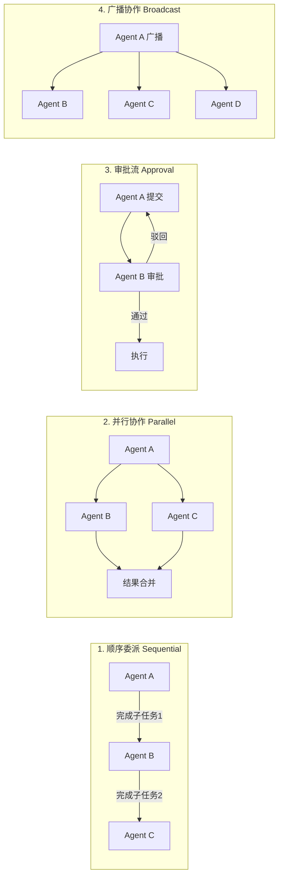

##### 数据模型

```typescript
// 协作会话
interface CollaborationSession {
  id: string;
  title: string;
  type: 'sequential' | 'parallel' | 'approval' | 'broadcast';
  status: 'active' | 'paused' | 'completed' | 'cancelled';
  participants: CollaborationParticipant[];
  tasks: CollaborationTask[];
  created_by: string;
  created_at: string;
  updated_at: string;
}

interface CollaborationParticipant {
  agent_id: string;
  role: 'coordinator' | 'worker' | 'reviewer' | 'observer';
  status: 'invited' | 'accepted' | 'declined' | 'busy';
  capabilities: string[];    // Agent 能力标签
  current_task?: string;     // 当前分配的任务ID
}

interface CollaborationTask {
  id: string;
  session_id: string;
  parent_task_id?: string;
  assignee: string;
  status: 'pending' | 'in_progress' | 'review' | 'completed' | 'failed';
  input: string;             // 任务输入描述
  output?: string;           // 任务输出
  dependencies: string[];    // 依赖的其他任务ID
  deadline?: string;
  priority: 'low' | 'medium' | 'high' | 'critical';
}
```

##### Agent 能力发现

```typescript
interface IAgentDiscoveryService {
  // 注册 Agent 能力
  registerCapabilities(agentId: string, capabilities: AgentCapability[]): Promise<void>;
  // 发现具备指定能力的 Agent
  discoverAgents(requiredCapabilities: string[]): Promise<AgentProfile[]>;
  // 查询 Agent 当前状态
  getAgentStatus(agentId: string): Promise<AgentStatus>;
  // 查询 Agent 负载
  getAgentLoad(agentId: string): Promise<AgentLoadInfo>;
}

interface AgentCapability {
  name: string;              // e.g., "code-review", "test-generation", "refactoring"
  proficiency: 'beginner' | 'intermediate' | 'expert';
  languages: string[];       // 支持的编程语言
  frameworks: string[];      // 支持的框架
}
```

##### 任务委派协议

```typescript
interface ITaskDelegationService {
  // 委派任务
  delegateTask(task: CollaborationTask, targetAgentId: string): Promise<DelegationResult>;
  // 接受任务
  acceptTask(taskId: string): Promise<void>;
  // 拒绝任务
  rejectTask(taskId: string, reason: string): Promise<void>;
  // 更新任务进度
  updateTaskProgress(taskId: string, progress: TaskProgress): Promise<void>;
  // 完成任务
  completeTask(taskId: string, output: string): Promise<void>;
  // 请求协助
  requestAssistance(taskId: string, description: string): Promise<void>;
}
```

---

#### 7.2.3 代码图谱协作系统

##### 设计目标
- 多仓库代码图谱聚合
- 跨仓库依赖分析
- 团队代码图谱共享与查询
- 变更影响分析

##### 图谱聚合模型

```typescript
// 聚合图谱：将多个仓库的图谱合并
interface AggregatedGraph {
  id: string;
  name: string;
  repos: RepoGraphRef[];
  cross_repo_edges: CrossRepoEdge[];
  metadata: AggregationMetadata;
}

interface RepoGraphRef {
  repo_key: string;
  repo_name: string;
  commit_sha: string;
  snapshot_sha256: string;
  node_count: number;
  edge_count: number;
}

// 跨仓库边
interface CrossRepoEdge {
  source: string;           // repo_key:symbol_id
  target: string;           // repo_key:symbol_id
  relation: 'imports' | 'calls' | 'extends' | 'implements';
  confidence: 'EXTRACTED' | 'INFERRED' | 'AMBIGUOUS';
  evidence: string;         // 证据（如 import 语句）
}

// 变更影响分析
interface ImpactAnalysis {
  changed_symbols: string[];
  affected_symbols: string[];     // 直接受影响的符号
  cascade_affected: string[];     // 级联受影响的符号
  affected_repos: string[];       // 受影响的仓库
  risk_level: 'low' | 'medium' | 'high';
  suggested_reviewers: string[];  // 建议的审查人（基于代码所有权）
}
```

##### API 设计

```typescript
interface ICodeGraphCollaborationService {
  // 聚合多仓库图谱
  aggregateGraphs(repoKeys: string[]): Promise<AggregatedGraph>;
  // 跨仓库依赖查询
  queryCrossRepoDeps(symbol: string, direction: 'upstream' | 'downstream'): Promise<CrossRepoEdge[]>;
  // 变更影响分析
  analyzeImpact(repoKey: string, changedFiles: string[]): Promise<ImpactAnalysis>;
  // 共享图谱快照到团队
  shareGraphSnapshot(repoKey: string, teamId: string): Promise<void>;
  // 订阅图谱变更通知
  subscribeGraphChanges(repoKey: string, callback: GraphChangeCallback): Promise<void>;
}
```

---

#### 7.2.4 知识库协作系统

##### 设计目标
- 跨 Workspace/跨 Org 知识发现
- 知识贡献与评审
- 知识图谱（实体-关系网络）
- 上下文感知的知识推荐

##### 知识层级模型

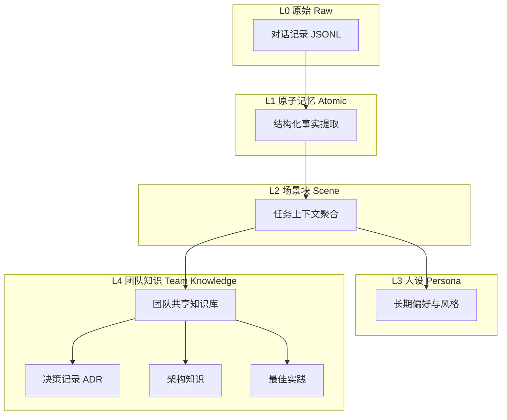

##### 知识贡献与发现

```typescript
interface IKnowledgeCollaborationService {
  // 发布知识到团队知识库
  publishKnowledge(entry: KnowledgeEntry, visibility: KnowledgeVisibility): Promise<void>;
  // 搜索跨层级知识
  searchKnowledge(query: string, options: KnowledgeSearchOptions): Promise<KnowledgeSearchResult[]>;
  // 获取项目上下文知识
  getProjectKnowledge(projectKey: string): Promise<ProjectKnowledgeSummary>;
  // 订阅知识变更
  subscribeKnowledgeUpdates(filter: KnowledgeFilter, callback: KnowledgeUpdateCallback): Promise<void>;
  // 知识推荐（基于当前任务上下文）
  recommendKnowledge(context: TaskContext): Promise<KnowledgeEntry[]>;
  // 知识关联发现
  discoverRelations(entryId: string): Promise<KnowledgeRelation[]>;
}

type KnowledgeVisibility = 'private' | 'team' | 'org' | 'public';

interface KnowledgeEntry {
  id: string;
  title: string;
  content: string;
  type: 'decision' | 'pattern' | 'antipattern' | 'architecture' | 'howto' | 'reference';
  tags: string[];
  entities: Entity[];         // 关联实体（项目、文件、符号）
  relations: KnowledgeRelation[];
  author: string;
  contributors: string[];
  visibility: KnowledgeVisibility;
  review_status: 'draft' | 'reviewed' | 'verified';
  embedding: number[];        // 768维语义向量
  created_at: string;
  updated_at: string;
}
```

##### 知识图谱构建

基于 Hivemind 的代码图谱和会话摘要，构建知识实体-关系网络：

```typescript
interface KnowledgeGraph {
  nodes: KnowledgeNode[];
  edges: KnowledgeEdge[];
}

interface KnowledgeNode {
  id: string;
  type: 'concept' | 'project' | 'file' | 'function' | 'person' | 'team' | 'decision';
  label: string;
  properties: Record<string, unknown>;
}

interface KnowledgeEdge {
  source: string;
  target: string;
  relation: 'belongs_to' | 'depends_on' | 'implements' | 'authored_by' | 'related_to' | 'supersedes';
  weight: number;           // 关联强度
  evidence: string[];       // 证据来源
}
```

---

#### 7.2.5 组织级规则引擎

##### 设计目标
- 多层级规则管理（个人 → 团队 → 组织）
- 规则自动注入与执行
- 规则冲突检测与解决
- 规则变更审计

##### 数据模型扩展

```typescript
interface RuleRecord {
  id: string;
  rule_id: string;
  text: string;
  scope: 'personal' | 'team' | 'org';
  status: 'active' | 'paused' | 'deprecated';
  assigned_by: string;
  target_agents: string[];   // 适用哪些 Agent
  target_projects: string[]; // 适用哪些项目
  priority: number;          // 优先级（高优先级规则覆盖低优先级）
  conditions: RuleCondition[]; // 生效条件
  version: bigint;
  created_at: string;
  updated_at: string;
}

interface RuleCondition {
  type: 'project_match' | 'file_pattern' | 'language' | 'time_range' | 'agent_type';
  value: string;
  operator: 'equals' | 'contains' | 'matches' | 'in';
}
```

##### 规则冲突解决

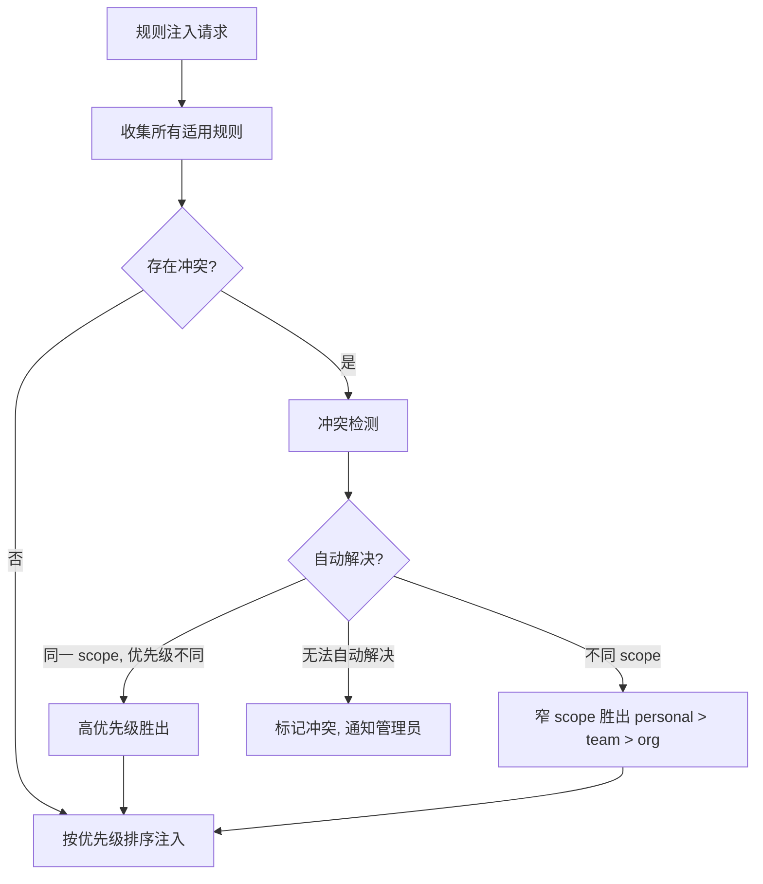

---

#### 7.2.6 实时通知与事件系统

##### 设计目标
- Agent 间实时事件通知
- 订阅/发布模式
- 事件过滤与路由
- 通知优先级与批量

```typescript
interface ICollaborationEventService {
  // 发布事件
  publishEvent(event: CollaborationEvent): Promise<void>;
  // 订阅事件
  subscribe(filter: EventFilter, handler: EventHandler): Promise<string>;
  // 取消订阅
  unsubscribe(subscriptionId: string): Promise<void>;
  // 查询事件历史
  queryEvents(filter: EventFilter, options: QueryOptions): Promise<CollaborationEvent[]>;
}

type CollaborationEventType =
  | 'skill.published'
  | 'skill.updated'
  | 'task.assigned'
  | 'task.completed'
  | 'task.failed'
  | 'knowledge.published'
  | 'knowledge.mentioned'
  | 'rule.created'
  | 'rule.updated'
  | 'graph.changed'
  | 'agent.online'
  | 'agent.offline'
  | 'review.requested'
  | 'review.completed';

interface CollaborationEvent {
  id: string;
  type: CollaborationEventType;
  source: string;            // 事件源 Agent ID
  payload: Record<string, unknown>;
  timestamp: string;
  priority: 'info' | 'warning' | 'urgent';
}
```

---

#### 7.2.7 权限与安全系统

##### 设计目标
- 资源级细粒度权限控制
- 跨组织安全共享
- 审计日志
- 数据脱敏

```typescript
// 资源级权限
type Permission = 'read' | 'write' | 'admin' | 'share' | 'delete';

interface ResourcePermission {
  resource_type: 'skill' | 'knowledge' | 'rule' | 'graph' | 'task';
  resource_id: string;
  principal_type: 'user' | 'team' | 'org' | 'public';
  principal_id: string;
  permissions: Permission[];
  granted_by: string;
  granted_at: string;
  expires_at?: string;
}

// 数据脱敏规则
interface DataMaskingRule {
  field: string;
  pattern: RegExp;
  replacement: string;
  scope: 'always' | 'cross_org' | 'public';
}
```

---

### 7.3 通信协议设计

#### 7.3.1 Agent 间通信协议

```typescript
// Agent 间消息协议
interface AgentMessage {
  id: string;
  protocol_version: 1;
  from: AgentEndpoint;
  to: AgentEndpoint | 'broadcast';
  type: MessageType;
  payload: unknown;
  correlation_id?: string;     // 请求-响应关联
  timestamp: string;
  ttl?: number;                // 消息存活时间(ms)
}

type MessageType =
  | 'request'                  // 请求
  | 'response'                 // 响应
  | 'notification'             // 通知
  | 'delegation'               // 委派
  | 'approval_request'         // 审批请求
  | 'approval_response'        // 审批响应
  | 'heartbeat'                // 心跳
  | 'capability_query'         // 能力查询
  | 'capability_response';     // 能力响应

interface AgentEndpoint {
  agent_id: string;
  org_id: string;
  workspace_id: string;
}
```

#### 7.3.2 状态同步协议

参考 Hivemind 的 append-only + version-bump 模式，但增加实时同步能力：

```
┌─────────────────────────────────────────────────────────┐
│                   状态同步协议                            │
├─────────────────────────────────────────────────────────┤
│ 1. 实时层：WebSocket/SSE                                 │
│    - Agent 在线状态                                       │
│    - 任务状态变更                                         │
│    - 事件通知                                             │
│                                                         │
│ 2. 最终一致层：Deeplake Cloud                             │
│    - 技能/规则/知识的版本化存储                              │
│    - 代码图谱快照                                         │
│    - 会话摘要                                             │
│                                                         │
│ 3. 本地缓存层：SQLite + 文件系统                           │
│    - VFS 挂载点（~/.deeplake/memory/）                    │
│    - 本地技能文件                                          │
│    - 图谱快照                                              │
│                                                         │
│ 冲突解决策略：                                             │
│   - 自动：version-bump + last-write-wins（同 scope）      │
│   - 手动：diff-view + 三方合并（跨 scope）                  │
│   - 隔离：per-workspace 命名空间（跨组织）                   │
└─────────────────────────────────────────────────────────┘
```

---

### 7.4 集成到 Saros Agent Studio 的设计

#### 7.4.1 UI 层集成

```
┌─────────────────────────────────────────────────────────┐
│ Agent Studio                                             │
├──────────┬──────────────────────────────────────────────┤
│ Sidebar  │  Editor Area                                  │
│          │                                               │
│ [Agent   │  ┌─────────────────────────────────────────┐ │
│  List]   │  │ Chat / TaskBoard / Canvas               │ │
│          │  │                                          │ │
│ [Team    │  │  + 新增 Tab:                              │ │
│  View]   │  │    - 技能浏览器 (Skill Browser)            │ │
│          │  │    - 知识库 (Knowledge Base)               │ │
│ [Skill   │  │    - 代码图谱 (Code Graph)                 │ │
│  Tree]   │  │    - 协作面板 (Collaboration)              │ │
│          │  │                                          │ │
│ [Graph   │  └─────────────────────────────────────────┘ │
│  View]   │                                               │
│          │                                               │
│ [Know    │                                               │
│  Base]   │                                               │
└──────────┴──────────────────────────────────────────────┘
```

#### 7.4.2 服务层集成

在现有 `AgentStudioService` 基础上扩展：

```typescript
// 新增服务注册到 workbench
registerSingleton(ICollaborationCoordinator, CollaborationCoordinator, InstantiationType.Delayed);
registerSingleton(ISkillCollaborationService, SkillCollaborationService, InstantiationType.Delayed);
registerSingleton(IKnowledgeCollaborationService, KnowledgeCollaborationService, InstantiationType.Delayed);
registerSingleton(ICodeGraphCollaborationService, CodeGraphCollaborationService, InstantiationType.Delayed);
registerSingleton(IAgentDiscoveryService, AgentDiscoveryService, InstantiationType.Delayed);
registerSingleton(ITaskDelegationService, TaskDelegationService, InstantiationType.Delayed);
registerSingleton(ICollaborationEventService, CollaborationEventService, InstantiationType.Delayed);
registerSingleton(IRuleEngineService, RuleEngineService, InstantiationType.Delayed);
```

#### 7.4.3 MCP 工具扩展

在现有 MCP 服务基础上新增协作相关工具：

| 工具名 | 功能 |
|--------|------|
| `vssaros_delegate_task` | 委派任务给其他 Agent |
| `vssaros_query_agents` | 查询可用 Agent 及其能力 |
| `vssaros_share_skill` | 共享技能到团队/组织 |
| `vssaros_search_knowledge` | 搜索跨层级知识 |
| `vssaros_analyze_impact` | 变更影响分析 |
| `vssaros_publish_rule` | 发布组织规则 |
| `vssaros_subscribe_events` | 订阅协作事件 |

---

## 8. 实施路线图

### Phase 1：基础协作能力（4-6 周）

| 优先级 | 功能 | 依赖 |
|--------|------|------|
| P0 | 技能云端同步（SkillSyncService） | Deeplake 认证集成 |
| P0 | Agent 能力发现（AgentDiscoveryService） | Agent 注册表 |
| P0 | 任务委派协议（TaskDelegationService） | Agent 间通信协议 |
| P1 | 组织级规则引擎基础版 | Rules 表 |

### Phase 2：知识协作与图谱（6-8 周）

| 优先级 | 功能 | 依赖 |
|--------|------|------|
| P0 | 知识库协作服务（KnowledgeCollaborationService） | TDB-AM L1/L2 |
| P0 | 代码图谱服务（CodeGraphService） | Tree-sitter 集成 |
| P1 | 跨仓库图谱聚合 | Phase 2 代码图谱 |
| P1 | 变更影响分析 | Phase 2 图谱聚合 |
| P1 | 知识图谱可视化 | Phase 2 知识库 |

### Phase 3：高级协作能力（6-8 周）

| 优先级 | 功能 | 依赖 |
|--------|------|------|
| P0 | 实时事件通知（CollaborationEventService） | WebSocket/SSE |
| P1 | 协作会话管理（CollaborationCoordinator） | Phase 1 任务委派 |
| P1 | 技能评审工作流 | Phase 1 技能同步 |
| P2 | 权限与安全系统 | 组织模型 |
| P2 | 审计日志 | 权限系统 |

### Phase 4：生态与优化（持续）

| 优先级 | 功能 | 依赖 |
|--------|------|------|
| P1 | 公共技能仓库 | Phase 3 评审工作流 |
| P1 | 跨组织知识发现 | Phase 3 权限系统 |
| P2 | 智能推荐引擎 | 使用统计数据 |
| P2 | 协作分析与报表 | 事件系统 |

---

## 9. 服务器部署 Web 查看与升级功能设计

### 9.1 需求概述

在服务器端部署一个 Web 应用，允许用户通过浏览器访问查看已提交的（包含内置的）技能、Agent、知识库、Workflow、MCP 等模块的详细信息。当服务器中模块的版本高于本地版本时，允许用户进行升级操作。

#### 9.1.1 核心需求

| 编号 | 需求 | 优先级 | 说明 |
|------|------|--------|------|
| N1 | 模块信息展示 | P0 | 以列表/详情形式展示技能、Agent、知识库、Workflow、MCP 等模块 |
| N2 | 版本比较 | P0 | 对比服务器版本与本地版本，标识差异 |
| N3 | 一键升级 | P0 | 当服务器版本高于本地版本时，支持一键升级 |
| N4 | 多维度筛选 | P1 | 按模块类型、状态、来源、标签等筛选 |
| N5 | 搜索功能 | P1 | 关键词搜索、语义搜索 |
| N6 | 升级历史 | P2 | 记录升级操作历史，支持回滚 |
| N7 | 批量升级 | P2 | 支持选择多个模块进行批量升级 |

---

### 9.2 总体架构

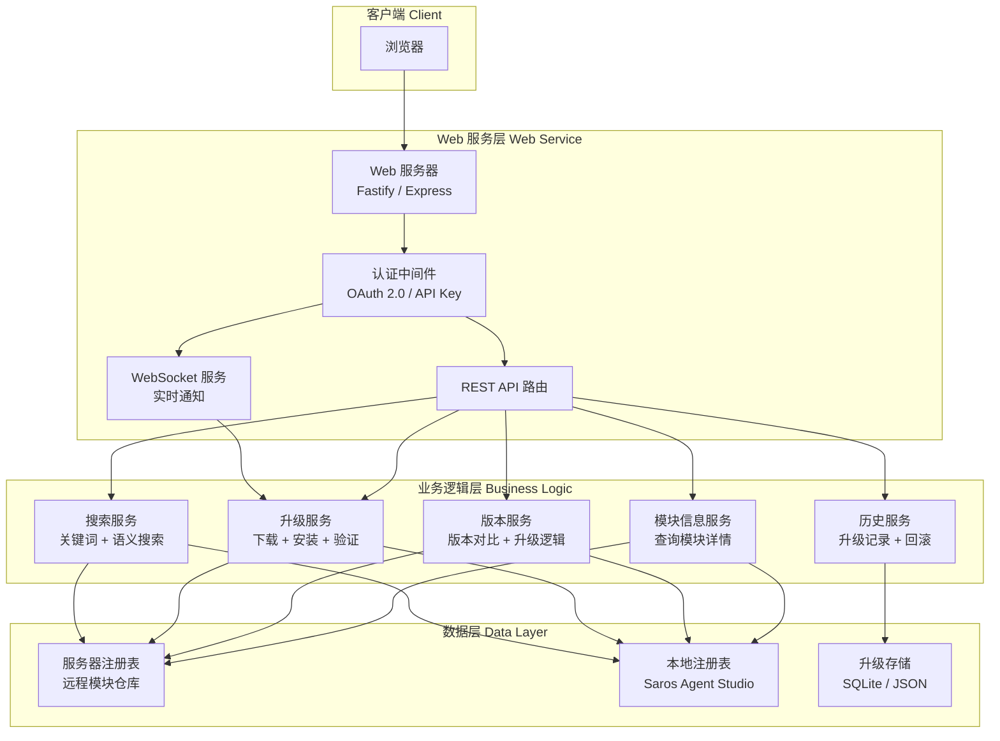

#### 9.2.1 技术选型

| 层级 | 技术 | 说明 |
|------|------|------|
| Web 框架 | Fastify | 高性能 Node.js Web 框架，适合 API 服务 |
| 前端渲染 | React + Vite | 现代 SPA 框架，支持 SSR（可选） |
| 认证 | OAuth 2.0 / API Key | 支持多种认证方式，灵活配置 |
| 实时通信 | WebSocket (socket.io) | 升级进度推送、版本变更通知 |
| 数据存储 | SQLite (better-sqlite3) | 轻量级，无需外部数据库依赖 |
| 语义搜索 | 本地 Embedding (nomic-embed-text-v1.5) | 复用 Hivemind 的 embedding daemon |

---

### 9.3 数据模型设计

#### 9.3.1 模块注册表（Module Registry）

用于存储服务器端所有可用模块的信息：

```typescript
/// 模块类型
type ModuleType = 'skill' | 'agent' | 'knowledge' | 'workflow' | 'mcp';

/// 模块来源
type ModuleSource = 'builtin' | 'user' | 'gallery' | 'hivemind';

/// 模块状态
type ModuleStatus = 'active' | 'deprecated' | 'draft' | 'review';

/// 模块可见性
type ModuleVisibility = 'private' | 'team' | 'org' | 'public';

/// 模块注册条目
interface ModuleRegistryEntry {
    id: string;                       // 唯一标识：{type}:{name}
    type: ModuleType;                 // 模块类型
    name: string;                     // 模块名称
    displayName: string;              // 显示名称
    description?: string;             // 描述
    version: string;                  // 语义化版本号 (semver)
    source: ModuleSource;             // 来源
    visibility: ModuleVisibility;     // 可见性
    status: ModuleStatus;             // 状态
    author: string;                   // 作者
    tags: string[];                   // 标签
    category?: string;                // 分类
    icon?: string;                    // 图标 URL 或 codicon 名
    dependencies?: string[];          // 依赖的其他模块 ID
    createdAt: string;                // 创建时间 (ISO 8601)
    updatedAt: string;                // 更新时间 (ISO 8601)

    // 服务器特有字段
    serverUrl?: string;               // 服务器托管地址
    downloadUrl?: string;             // 下载地址
    fileSize?: number;                // 文件大小 (bytes)
    sha256?: string;                  // 文件校验和
    changelog?: string;               // 更新日志 (markdown)
    readmeUrl?: string;               // README 地址
    screenshotUrls?: string[];        // 截图 URL 列表

    // 版本信息
    versions: ModuleVersionInfo[];     // 所有可用版本
}

/// 模块版本信息
interface ModuleVersionInfo {
    version: string;                  // 版本号
    releaseDate: string;              // 发布日期
    changelog: string;                // 更新日志
    downloadUrl: string;              // 下载地址
    sha256: string;                   // 校验和
    isLatest: boolean;               // 是否最新版本
    isPrerelease: boolean;           // 是否预发布
}
```

#### 9.3.2 本地模块状态（Local Module State）

存储本地已安装模块的状态，用于版本对比：

```typescript
/// 本地模块状态
interface LocalModuleState {
    id: string;                       // 模块 ID (与 ModuleRegistryEntry.id 对应)
    type: ModuleType;                 // 模块类型
    name: string;                     // 模块名称
    installedVersion: string;         // 已安装版本
    installedAt: string;              // 安装时间
    installedFrom?: string;           // 安装来源 (服务器 URL 或本地路径)
    installPath?: string;             // 本地安装路径
    enabled: boolean;                 // 是否启用
    autoUpdate: boolean;              // 是否自动更新 (默认 false)
    lastUpgradeAt?: string;           // 上次升级时间
    lastUpgradeFrom?: string;         // 上次升级来源版本
}
```

#### 9.3.3 升级历史记录（Upgrade History）

记录每次升级操作的详细信息：

```typescript
/// 升级操作状态
type UpgradeStatus =
    | 'pending'                       // 等待中
    | 'downloading'                   // 下载中
    | 'installing'                    // 安装中
    | 'verifying'                     // 验证中
    | 'completed'                     // 已完成
    | 'failed'                        // 失败
    | 'rolled_back';                  // 已回滚

/// 升级历史记录
interface UpgradeHistoryEntry {
    id: string;                       // 升级操作 ID (UUID)
    moduleId: string;                 // 模块 ID
    moduleName: string;               // 模块名称
    moduleType: ModuleType;           // 模块类型
    fromVersion: string;              // 原版本
    toVersion: string;                // 目标版本
    status: UpgradeStatus;            // 升级状态
    startedAt: string;                // 开始时间
    completedAt?: string;             // 完成时间
    performedBy: string;              // 操作人
    error?: string;                   // 错误信息
    rollbackAvailable: boolean;       // 是否可回滚
    rollbackId?: string;              // 回滚操作 ID
    metadata?: Record<string, unknown>; // 额外元数据
}
```

#### 9.3.4 数据库表设计

```sql
-- 模块注册表
CREATE TABLE module_registry (
    id TEXT PRIMARY KEY,              -- {type}:{name}
    type TEXT NOT NULL,               -- skill/agent/knowledge/workflow/mcp
    name TEXT NOT NULL,
    display_name TEXT NOT NULL,
    description TEXT,
    version TEXT NOT NULL,            -- semver
    source TEXT NOT NULL,             -- builtin/user/gallery/hivemind
    visibility TEXT NOT NULL DEFAULT 'public',
    status TEXT NOT NULL DEFAULT 'active',
    author TEXT NOT NULL,
    tags TEXT DEFAULT '[]',           -- JSON array
    category TEXT,
    icon TEXT,
    dependencies TEXT DEFAULT '[]',   -- JSON array
    created_at TEXT NOT NULL,
    updated_at TEXT NOT NULL,
    server_url TEXT,
    download_url TEXT,
    file_size INTEGER,
    sha256 TEXT,
    changelog TEXT,
    readme_url TEXT,
    screenshot_urls TEXT DEFAULT '[]' -- JSON array
);

-- 模块版本信息
CREATE TABLE module_versions (
    module_id TEXT NOT NULL,          -- FK → module_registry.id
    version TEXT NOT NULL,
    release_date TEXT NOT NULL,
    changelog TEXT NOT NULL,
    download_url TEXT NOT NULL,
    sha256 TEXT NOT NULL,
    is_latest INTEGER NOT NULL DEFAULT 0,
    is_prerelease INTEGER NOT NULL DEFAULT 0,
    PRIMARY KEY (module_id, version)
);

-- 本地模块状态
CREATE TABLE local_module_state (
    id TEXT PRIMARY KEY,              -- {type}:{name}
    type TEXT NOT NULL,
    name TEXT NOT NULL,
    installed_version TEXT NOT NULL,
    installed_at TEXT NOT NULL,
    installed_from TEXT,
    install_path TEXT,
    enabled INTEGER NOT NULL DEFAULT 1,
    auto_update INTEGER NOT NULL DEFAULT 0,
    last_upgrade_at TEXT,
    last_upgrade_from TEXT
);

-- 升级历史
CREATE TABLE upgrade_history (
    id TEXT PRIMARY KEY,              -- UUID
    module_id TEXT NOT NULL,          -- FK → module_registry.id
    module_name TEXT NOT NULL,
    module_type TEXT NOT NULL,
    from_version TEXT NOT NULL,
    to_version TEXT NOT NULL,
    status TEXT NOT NULL DEFAULT 'pending',
    started_at TEXT NOT NULL,
    completed_at TEXT,
    performed_by TEXT NOT NULL,
    error TEXT,
    rollback_available INTEGER NOT NULL DEFAULT 0,
    rollback_id TEXT,
    metadata TEXT DEFAULT '{}',       -- JSON object
    FOREIGN KEY (module_id) REFERENCES module_registry(id)
);

-- 索引
CREATE INDEX idx_module_registry_type ON module_registry(type);
CREATE INDEX idx_module_registry_name ON module_registry(name);
CREATE INDEX idx_module_registry_status ON module_registry(status);
CREATE INDEX idx_module_versions_latest ON module_versions(module_id, is_latest);
CREATE INDEX idx_local_module_state_type ON local_module_state(type);
CREATE INDEX idx_upgrade_history_module ON upgrade_history(module_id);
CREATE INDEX idx_upgrade_history_status ON upgrade_history(status);
CREATE INDEX idx_upgrade_history_performed ON upgrade_history(performed_by);
```

---

### 9.4 API 设计

#### 9.4.1 REST API 路由

##### 模块信息 API

| 方法 | 路径 | 说明 | 请求参数 | 响应 |
|------|------|------|---------|------|
| `GET` | `/api/modules` | 列出所有模块 | `?type=skill&status=active&search=xxx&page=1&pageSize=20` | `{ items: ModuleRegistryEntry[], total: number, page: number }` |
| `GET` | `/api/modules/:id` | 获取模块详情 | 路径参数 `id` | `ModuleRegistryEntry` |
| `GET` | `/api/modules/:id/versions` | 获取模块所有版本 | 路径参数 `id` | `ModuleVersionInfo[]` |
| `GET` | `/api/modules/:id/readme` | 获取模块 README | 路径参数 `id` | `{ content: string }` |
| `GET` | `/api/modules/:id/changelog` | 获取模块更新日志 | 路径参数 `id`, `?version=1.2.3` | `{ content: string }` |

##### 版本对比 API

| 方法 | 路径 | 说明 | 请求参数 | 响应 |
|------|------|------|---------|------|
| `GET` | `/api/modules/:id/version-check` | 检查版本差异 | 路径参数 `id` | `VersionComparison` |
| `GET` | `/api/local/state` | 获取本地模块状态列表 | `?type=skill` | `LocalModuleState[]` |
| `GET` | `/api/local/state/:id` | 获取本地单个模块状态 | 路径参数 `id` | `LocalModuleState` |

##### 升级 API

| 方法 | 路径 | 说明 | 请求参数 | 响应 |
|------|------|------|---------|------|
| `POST` | `/api/upgrade` | 执行升级 | `{ moduleId: string, targetVersion?: string }` | `{ upgradeId: string }` + WebSocket 推送进度 |
| `POST` | `/api/upgrade/batch` | 批量升级 | `{ moduleIds: string[] }` | `{ upgradeIds: string[] }` |
| `GET` | `/api/upgrade/:upgradeId/status` | 查询升级状态 | 路径参数 `upgradeId` | `UpgradeHistoryEntry` |
| `POST` | `/api/upgrade/:upgradeId/rollback` | 回滚升级 | 路径参数 `upgradeId` | `{ rollbackId: string }` |
| `GET` | `/api/upgrade/history` | 升级历史 | `?moduleId=xxx&status=completed&page=1` | `{ items: UpgradeHistoryEntry[], total: number }` |

##### 搜索 API

| 方法 | 路径 | 说明 | 请求参数 | 响应 |
|------|------|------|---------|------|
| `GET` | `/api/search` | 关键词搜索 | `?q=xxx&type=skill&sort=relevance` | `{ items: ModuleRegistryEntry[], total: number }` |
| `POST` | `/api/search/semantic` | 语义搜索 | `{ query: string, filters?: object, topK?: number }` | `{ items: SearchResult[], total: number }` |

##### 认证 API

| 方法 | 路径 | 说明 | 请求参数 | 响应 |
|------|------|------|---------|------|
| `POST` | `/api/auth/login` | 登录 | `{ username, password }` | `{ token: string, refreshToken: string }` |
| `POST` | `/api/auth/refresh` | 刷新 Token | `{ refreshToken }` | `{ token: string }` |
| `GET` | `/api/auth/me` | 当前用户信息 | - | `{ username, roles, permissions }` |

#### 9.4.2 版本比较数据结构

```typescript
/// 版本比较结果
interface VersionComparison {
    moduleId: string;
    moduleName: string;
    moduleType: ModuleType;
    localVersion: string | null;        // null 表示本地未安装
    serverVersion: string;              // 服务器最新版本
    needsUpdate: boolean;               // 是否需要更新 (serverVersion > localVersion)
    isPrerelease: boolean;              // 服务器最新版本是否预发布
    changelog?: string;                 // 更新日志摘要
    severity: 'major' | 'minor' | 'patch' | 'none';  // 更新级别
}

/// 批量版本比较结果
interface BatchVersionComparison {
    totalModules: number;               // 服务器总模块数
    upToDate: number;                   // 本地已是最新
    needsUpdate: number;                // 可更新
    notInstalled: number;               // 本地未安装
    deprecated: number;                 // 服务器已废弃
    items: VersionComparison[];         // 详细列表
}
```

#### 9.4.3 WebSocket 事件

```typescript
/// WebSocket 事件类型
type WsEventType =
    | 'upgrade.progress'                // 升级进度更新
    | 'upgrade.completed'               // 升级完成
    | 'upgrade.failed'                  // 升级失败
    | 'module.updated'                  // 模块信息更新
    | 'module.new'                      // 新模块发布
    | 'module.deprecated'               // 模块废弃通知
    | 'version.changed';                // 版本变更通知

/// WebSocket 事件
interface WsEvent {
    type: WsEventType;
    payload: unknown;
    timestamp: string;
}

/// 升级进度事件
interface UpgradeProgressEvent {
    upgradeId: string;
    moduleId: string;
    moduleName: string;
    phase: 'downloading' | 'installing' | 'verifying';
    progress: number;                   // 0.0 - 1.0
    message?: string;
}
```

---

### 9.5 版本比较与升级逻辑

#### 9.5.1 版本比较算法

使用语义化版本 (semver) 进行比较：

```typescript
import semver from 'semver';

/**
 * 比较服务器版本与本地版本
 * @returns 'major' | 'minor' | 'patch' | 'none'
 */
function compareVersions(
    localVersion: string | null,
    serverVersion: string
): { needsUpdate: boolean; severity: 'major' | 'minor' | 'patch' | 'none' } {
    if (!localVersion) {
        // 本地未安装，视为需要安装
        return { needsUpdate: true, severity: 'major' };
    }

    if (semver.gt(serverVersion, localVersion)) {
        // 服务器版本更高
        const diff = semver.diff(localVersion, serverVersion);
        let severity: 'major' | 'minor' | 'patch' | 'none';

        switch (diff) {
            case 'major':
                severity = 'major';
                break;
            case 'minor':
                severity = 'minor';
                break;
            case 'patch':
                severity = 'patch';
                break;
            default:
                severity = 'none';
        }

        return { needsUpdate: true, severity };
    }

    return { needsUpdate: false, severity: 'none' };
}
```

#### 9.5.2 升级流程

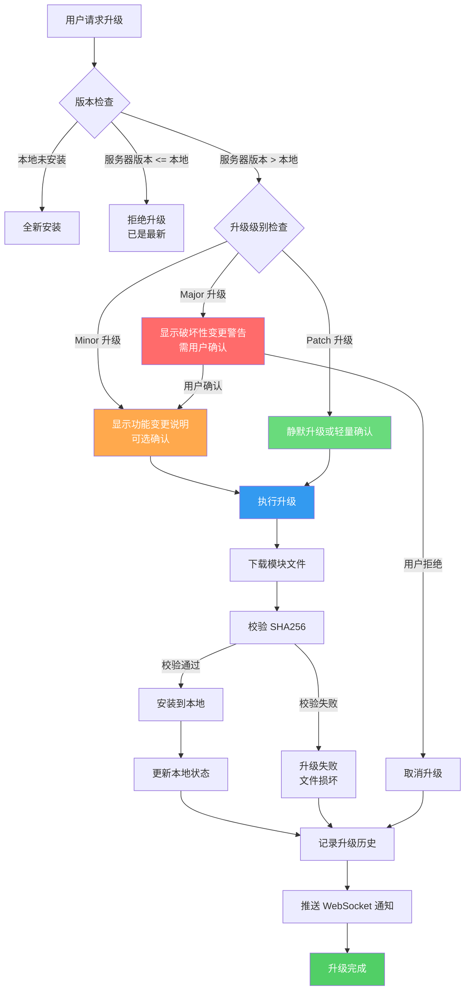

#### 9.5.3 升级安装策略

不同模块类型的升级安装策略：

| 模块类型 | 安装方式 | 安装位置 | 回滚策略 |
|---------|---------|---------|---------|
| **Skill** | 下载 `SKILL.md` 文件到对应目录 | `~/.claude/skills/` 或 `.sarosworkspace/agents/{agentDir}/skills/` | 删除新文件，恢复旧文件 |
| **Agent** | 更新 `Employee` 配置 + `SKILL.md` | `AgentStudioService` 数据文件 | 恢复旧配置 |
| **Knowledge** | 通过 `Hivemind skillify pull` 拉取记忆 | `~/.deeplake/memory/` | 删除拉取的记忆文件 |
| **Workflow** | 更新工作流存储 | `.sarosworkspace/workflows/` | 恢复旧工作流 |
| **MCP** | 通过 `McpManagementService.install()` 安装 | MCP 配置文件 (settings.json) | 通过 `McpManagementService.uninstall()` 卸载 |

##### Skill 安装详细流程

```typescript
/// Skill 升级安装流程
async function installSkillUpgrade(
    moduleId: string,
    serverEntry: ModuleRegistryEntry,
    localState: LocalModuleState | null,
    historyEntry: UpgradeHistoryEntry,
): Promise<void> {
    // 1. 下载 SKILL.md 文件
    const skillContent = await downloadFile(serverEntry.downloadUrl!);

    // 2. 校验 SHA256
    const hash = computeSha256(skillContent);
    if (hash !== serverEntry.sha256) {
        throw new Error(`SHA256 mismatch: expected ${serverEntry.sha256}, got ${hash}`);
    }

    // 3. 确定安装路径
    const installDir = localState?.installPath
        ?? getDefaultSkillInstallPath(serverEntry);

    // 4. 备份旧版本（用于回滚）
    let backupPath: string | undefined;
    if (localState) {
        backupPath = `${installDir}.backup.${Date.now()}`;
        await backupFile(installDir, backupPath);
    }

    // 5. 写入新文件
    await writeSkillFile(installDir, skillContent);

    // 6. 更新本地状态
    await updateLocalModuleState({
        id: moduleId,
        installedVersion: serverEntry.version,
        installedAt: new Date().toISOString(),
        installedFrom: serverEntry.serverUrl,
        installPath: installDir,
        lastUpgradeAt: new Date().toISOString(),
        lastUpgradeFrom: localState?.installedVersion ?? 'none',
    });

    // 7. 更新升级历史
    historyEntry.status = 'completed';
    historyEntry.completedAt = new Date().toISOString();
    historyEntry.rollbackAvailable = backupPath !== undefined;
    await saveUpgradeHistory(historyEntry);
}
```

##### MCP 安装详细流程

```typescript
/// MCP 升级安装流程
async function installMcpUpgrade(
    moduleId: string,
    serverEntry: ModuleRegistryEntry,
    localState: LocalModuleState | null,
    historyEntry: UpgradeHistoryEntry,
): Promise<void> {
    // 1. 构建 IGalleryMcpServer 对象
    const galleryServer: IGalleryMcpServer = {
        name: serverEntry.name,
        displayName: serverEntry.displayName,
        description: serverEntry.description ?? '',
        version: serverEntry.version,
        isLatest: true,
        status: GalleryMcpServerStatus.Active,
        id: serverEntry.id,
        galleryUrl: serverEntry.serverUrl,
        configuration: await fetchMcpConfiguration(serverEntry.downloadUrl!),
        publisher: serverEntry.author,
        publisherDisplayName: serverEntry.author,
    };

    // 2. 调用 McpManagementService 安装
    const mcpManagementService = getMcpManagementService();
    const installedServer = await mcpManagementService.installFromGallery(
        galleryServer,
        {
            packageType: serverEntry.dependencies?.includes('npm')
                ? RegistryType.NODE
                : RegistryType.PYTHON,
            mcpResource: getUserMcpResource(),
        }
    );

    // 3. 更新本地状态
    await updateLocalModuleState({
        id: moduleId,
        installedVersion: serverEntry.version,
        installedAt: new Date().toISOString(),
        installedFrom: serverEntry.serverUrl,
        lastUpgradeAt: new Date().toISOString(),
        lastUpgradeFrom: localState?.installedVersion ?? 'none',
    });

    // 4. 更新升级历史
    historyEntry.status = 'completed';
    historyEntry.completedAt = new Date().toISOString();
    await saveUpgradeHistory(historyEntry);
}
```

#### 9.5.4 回滚机制

```typescript
/// 回滚升级操作
async function rollbackUpgrade(
    historyEntry: UpgradeHistoryEntry
): Promise<void> {
    if (!historyEntry.rollbackAvailable) {
        throw new Error('Rollback not available for this upgrade');
    }

    // 1. 创建回滚记录
    const rollbackEntry: UpgradeHistoryEntry = {
        id: uuidv4(),
        moduleId: historyEntry.moduleId,
        moduleName: historyEntry.moduleName,
        moduleType: historyEntry.moduleType,
        fromVersion: historyEntry.toVersion,      // 回滚方向反转
        toVersion: historyEntry.fromVersion,
        status: 'pending',
        startedAt: new Date().toISOString(),
        performedBy: getCurrentUser(),
        rollbackAvailable: false,
    };
    await saveUpgradeHistory(rollbackEntry);

    try {
        // 2. 根据模块类型执行回滚
        switch (historyEntry.moduleType) {
            case 'skill':
                // 恢复备份的 SKILL.md
                await restoreSkillBackup(historyEntry);
                break;
            case 'mcp':
                // 卸载新版本 MCP Server，重新安装旧版本
                await reinstallPreviousMcpVersion(historyEntry);
                break;
            case 'agent':
                // 恢复旧的 Agent 配置
                await restoreAgentConfig(historyEntry);
                break;
            case 'knowledge':
                // 删除新拉取的记忆文件
                await removeNewlyInstalledKnowledge(historyEntry);
                break;
            case 'workflow':
                // 恢复旧的工作流文件
                await restoreWorkflowBackup(historyEntry);
                break;
        }

        // 3. 更新回滚记录状态
        rollbackEntry.status = 'completed';
        rollbackEntry.completedAt = new Date().toISOString();
        await saveUpgradeHistory(rollbackEntry);

        // 4. 更新本地模块状态
        await updateLocalModuleState({
            id: historyEntry.moduleId,
            installedVersion: historyEntry.fromVersion,
            lastUpgradeAt: new Date().toISOString(),
        });
    } catch (error) {
        rollbackEntry.status = 'failed';
        rollbackEntry.error = String(error);
        await saveUpgradeHistory(rollbackEntry);
        throw error;
    }
}
```

---

### 9.6 前端 UI 设计

#### 9.6.1 页面布局

```
┌──────────────────────────────────────────────────────────────────────────┐
│ 🏠 Saros Module Hub          [🔍 搜索框...]  [🔔 通知]  [👤 用户] │
├──────────────────────────────────────────────────────────────────────────┤
│                                                                        │
│  ┌─ 筛选栏 ──────────────────────────────────────────────────────────┐  │
│  │ [全部▼] [状态▼: 全部/可更新/最新/未安装] [来源▼] [排序▼: 名称↓]  │  │
│  └───────────────────────────────────────────────────────────────────┘  │
│                                                                        │
│  ┌─ 模块列表 ──────────────────────────────────────────────────────┐   │
│  │                                                                  │   │
│  │  ┌───────────────────────────────────────────────────────────┐  │   │
│  │  │ 🎯 Code Review                       Skill    [v2.1.0]   │  │   │
│  │  │ 对当前 diff/文件进行快速代码评审                              │  │   │
│  │  │ 来源: builtin | 标签: code, review | 👤 alice              │  │   │
│  │  │ 本地: v2.0.0 → 服务器: v2.1.0    [🟢 可升级] [⬆️ 升级]   │  │   │
│  │  └───────────────────────────────────────────────────────────┘  │   │
│  │                                                                  │   │
│  │  ┌───────────────────────────────────────────────────────────┐  │   │
│  │  │ 🤖 CodeBuddy-Reviewer                Agent    [v1.3.0]   │  │   │
│  │  │ 自动代码审查 Agent                                         │  │   │
│  │  │ 来源: gallery | 标签: review, automation | 👤 bob          │  │   │
│  │  │ 本地: v1.2.0 → 服务器: v1.3.0    [🟡 Minor更新] [⬆️ 升级] │  │   │
│  │  └───────────────────────────────────────────────────────────┘  │   │
│  │                                                                  │   │
│  │  ┌───────────────────────────────────────────────────────────┐  │   │
│  │  │ 📦 filesystem-mcp                    MCP     [v3.0.0]    │  │   │
│  │  │ 文件系统访问 MCP Server                                    │  │   │
│  │  │ 来源: gallery | 标签: filesystem, tools | 👤 charlie      │  │   │
│  │  │ 本地: v3.0.0 → 服务器: v3.0.0    [✅ 已是最新]            │  │   │
│  │  └───────────────────────────────────────────────────────────┘  │   │
│  │                                                                  │   │
│  │  ┌───────────────────────────────────────────────────────────┐  │   │
│  │  │ 📚 项目架构知识                      Knowledge [v1.0.0]  │  │   │
│  │  │ 记录项目架构决策和实践                                      │  │   │
│  │  │ 来源: hivemind | 标签: architecture, ADR | 👤 team       │  │   │
│  │  │ 本地: 未安装 → 服务器: v1.0.0    [🔴 未安装] [⬇️ 安装]   │  │   │
│  │  └───────────────────────────────────────────────────────────┘  │   │
│  │                                                                  │   │
│  └──────────────────────────────────────────────────────────────────┘  │
│                                                                        │
│  ┌─ 底部操作栏 ─────────────────────────────────────────────────────┐  │
│  │ 已选 3 项    [⬆️ 批量升级所选]    [🔄 检查更新]                  │  │
│  └───────────────────────────────────────────────────────────────────┘  │
│                                                                        │
│  显示 1-4 / 共 42 项    ◀ 1 2 3 ... 11 ▶                             │
└──────────────────────────────────────────────────────────────────────────┘
```

#### 9.6.2 模块详情页

点击模块卡片后展开详情视图：

```
┌─ 模块详情 ──────────────────────────────────────────────────────┐
│                                                                │
│  🎯 Code Review                                 Skill          │
│                                                                │
│  ┌─ 基本信息 ─────────────────────────────────────────────────┐ │
│  │ 名称: code-review                                         │ │
│  │ 版本: v2.1.0 (最新)                                       │ │
│  │ 作者: alice                                                │ │
│  │ 来源: builtin                                              │ │
│  │ 状态: Active                                               │ │
│  │ 可见性: public                                             │ │
│  │ 分类: code                                                 │ │
│  │ 标签: code, review, 评审, 审查代码                          │ │
│  │ 创建时间: 2026-01-15                                      │ │
│  │ 更新时间: 2026-06-01                                      │ │
│  └────────────────────────────────────────────────────────────┘ │
│                                                                │
│  ┌─ 版本信息 ─────────────────────────────────────────────────┐ │
│  │ 当前版本: v2.1.0                                           │ │
│  │ 本地安装: v2.0.0                                           │ │
│  │ 🟡 可升级 (Minor 更新)                                     │ │
│  │                                                            │ │
│  │ v2.1.0 更新日志:                                           │ │
│  │ - 新增对 Rust 代码的评审支持                                │ │
│  │ - 优化评审提示模板                                          │ │
│  │ - 修复边界情况下的误报                                      │ │
│  │                                                            │ │
│  │ 全部版本: v2.1.0 | v2.0.0 | v1.1.0 | v1.0.0             │ │
│  └────────────────────────────────────────────────────────────┘ │
│                                                                │
│  ┌─ 依赖关系 ─────────────────────────────────────────────────┐ │
│  │ 该技能依赖: 无                                              │ │
│  │ 依赖该技能: custom-review (skill)                           │ │
│  └────────────────────────────────────────────────────────────┘ │
│                                                                │
│  ┌─ README 预览 ──────────────────────────────────────────────┐ │
│  │ # Code Review Skill                                        │ │
│  │                                                            │ │
│  │ 对当前 diff 或指定文件进行快速代码评审...                     │ │
│  │                                                            │ │
│  │ ## 使用方法                                                 │ │
│  │ 在聊天中输入 `/skill code-review` 或关键词触发...             │ │
│  └────────────────────────────────────────────────────────────┘ │
│                                                                │
│           [⬆️ 升级到 v2.1.0]    [📋 复制安装命令]             │
└────────────────────────────────────────────────────────────────┘
```

#### 9.6.3 升级进度对话框

```
┌─ 升级中 ───────────────────────────────────────────────────────┐
│                                                                │
│  🎯 Code Review (skill)                                       │
│  v2.0.0 → v2.1.0                                              │
│                                                                │
│  █████████████████████████████░░░░░░░░  75%                    │
│                                                                │
│  📥 正在验证文件完整性...                                       │
│                                                                │
│  步骤:                                                         │
│  ✅ 下载模块文件                                               │
│  ✅ 校验 SHA256                                                │
│  ✅ 备份旧版本                                                 │
│  ✅ 写入新文件                                                 │
│  ⏳ 更新本地状态                                               │
│  ⏸️ 记录升级历史                                               │
│  ⏸️ 推送通知                                                   │
│                                                                │
│                                          [取消]               │
└────────────────────────────────────────────────────────────────┘
```

#### 9.6.4 Major 升级确认对话框

```
┌─ ⚠️ 重大更新确认 ──────────────────────────────────────────────┐
│                                                                │
│  您正在将 Code Review 从 v1.2.0 升级到 v2.0.0                 │
│                                                                │
│  ⚠️ 这是一个 MAJOR 版本更新，可能包含破坏性变更：              │
│                                                                │
│  变更内容:                                                     │
│  • 技能激活方式从关键词匹配改为正则表达式                       │
│  • 输出格式从纯文本改为结构化 JSON                              │
│  • 最低要求模型从 haiku 提升为 sonnet                          │
│                                                                │
│  升级后，使用该技能的 Agent 可能需要调整提示词。                │
│                                                                │
│  是否继续升级？                                                │
│                                                                │
│          [查看完整更新日志]    [取消]    [确认升级]             │
└────────────────────────────────────────────────────────────────┘
```

---

### 9.7 与现有系统集成

#### 9.7.1 与 Hivemind 集成

Web 查看与升级功能需要与 Hivemind 的现有组件协作：

| Hivemind 组件 | 集成方式 | 说明 |
|--------------|---------|------|
| **Deeplake Cloud** | 数据同步 | 服务器模块注册表数据从 Deeplake 的 `skills`、`rules`、`codebase` 等表读取 |
| **Skillify Worker** | 技能发布 | 新挖掘的技能通过 Skillify Worker 发布后，自动更新服务器注册表 |
| **MCP Server** | 工具暴露 | 将模块查询、版本对比、升级操作暴露为 MCP 工具 |
| **Embedding Daemon** | 语义搜索 | 复用 `nomic-embed-text-v1.5` daemon 进行模块语义搜索 |
| **VFS (DeeplakeFs)** | 文件访问 | 通过 VFS 接口访问 Deeplake 中的模块数据 |

#### 9.7.2 与 Agent Studio 集成

Web 服务器的模块信息需要与本地 Agent Studio 的注册表同步：

```typescript
/// 从 Agent Studio 同步本地模块状态
async function syncLocalModuleStates(): Promise<LocalModuleState[]> {
    const states: LocalModuleState[] = [];

    // 1. 同步技能 (Skill) 状态
    const skillRegistry = getAgentStudioService().getSkillRegistry();
    const allSkills = skillRegistry.getAll();
    for (const skill of allSkills) {
        states.push({
            id: `skill:${skill.id}`,
            type: 'skill',
            name: skill.name,
            installedVersion: skill.version.toString(),
            installedAt: skill.createdAt,
            installPath: skill.localPath,
            enabled: skill.enabled,
            autoUpdate: false,
        });
    }

    // 2. 同步 Agent 状态
    const agents = getAgentStudioService().getEmployees();
    for (const agent of agents) {
        states.push({
            id: `agent:${agent.id}`,
            type: 'agent',
            name: agent.name,
            installedVersion: '1.0.0',
            installedAt: agent.createdAt,
            enabled: true,
            autoUpdate: false,
        });
    }

    // 3. 同步 MCP Server 状态
    const mcpManagement = getMcpManagementService();
    const installedMcpServers = await mcpManagement.getInstalled();
    for (const server of installedMcpServers) {
        states.push({
            id: `mcp:${server.name}`,
            type: 'mcp',
            name: server.name,
            installedVersion: server.version ?? '0.0.0',
            installedAt: new Date().toISOString(),
            enabled: true,
            autoUpdate: false,
        });
    }

    return states;
}
```

#### 9.7.3 MCP 工具暴露

将 Web 查看与升级功能的核心能力暴露为 MCP 工具：

| 工具名 | 功能 | 输入参数 |
|--------|------|---------|
| `vssaros_list_modules` | 列出可用模块 | `{ type?: string, status?: string, search?: string }` |
| `vssaros_get_module` | 获取模块详情 | `{ moduleId: string }` |
| `vssaros_check_updates` | 检查可用更新 | `{ moduleId?: string }` |
| `vssaros_upgrade_module` | 升级模块 | `{ moduleId: string, targetVersion?: string, confirmBreaking?: boolean }` |
| `vssaros_rollback_upgrade` | 回滚升级 | `{ upgradeId: string }` |
| `vssaros_upgrade_history` | 查询升级历史 | `{ moduleId?: string, limit?: number }` |

---

### 9.8 安全设计

#### 9.8.1 认证与授权

```typescript
/// 权限级别
type PermissionLevel = 'read' | 'upgrade' | 'admin';

/// 角色权限映射
const ROLE_PERMISSIONS: Record<string, PermissionLevel[]> = {
    'viewer': ['read'],
    'developer': ['read', 'upgrade'],
    'admin': ['read', 'upgrade', 'admin'],
};
```

| 功能 | viewer | developer | admin |
|------|--------|-----------|-------|
| 查看模块信息 | ✅ | ✅ | ✅ |
| 查看版本详情 | ✅ | ✅ | ✅ |
| 执行升级 | ❌ | ✅ | ✅ |
| 批量升级 | ❌ | ✅ | ✅ |
| 回滚升级 | ❌ | ❌ | ✅ |
| 管理用户 | ❌ | ❌ | ✅ |
| 配置服务器 | ❌ | ❌ | ✅ |

#### 9.8.2 升级安全策略

1. **文件校验**：升级前必须校验 SHA256，防止文件损坏或篡改
2. **备份机制**：升级前自动备份旧版本，确保可回滚
3. **操作审计**：所有升级操作记录到历史，便于追溯
4. **权限控制**：只有 `developer` 及以上角色才能执行升级
5. **破坏性变更确认**：Major 升级必须用户明确确认
6. **并发控制**：同一模块不允许同时进行多次升级

---

### 9.9 部署方案

#### 9.9.1 服务器部署架构

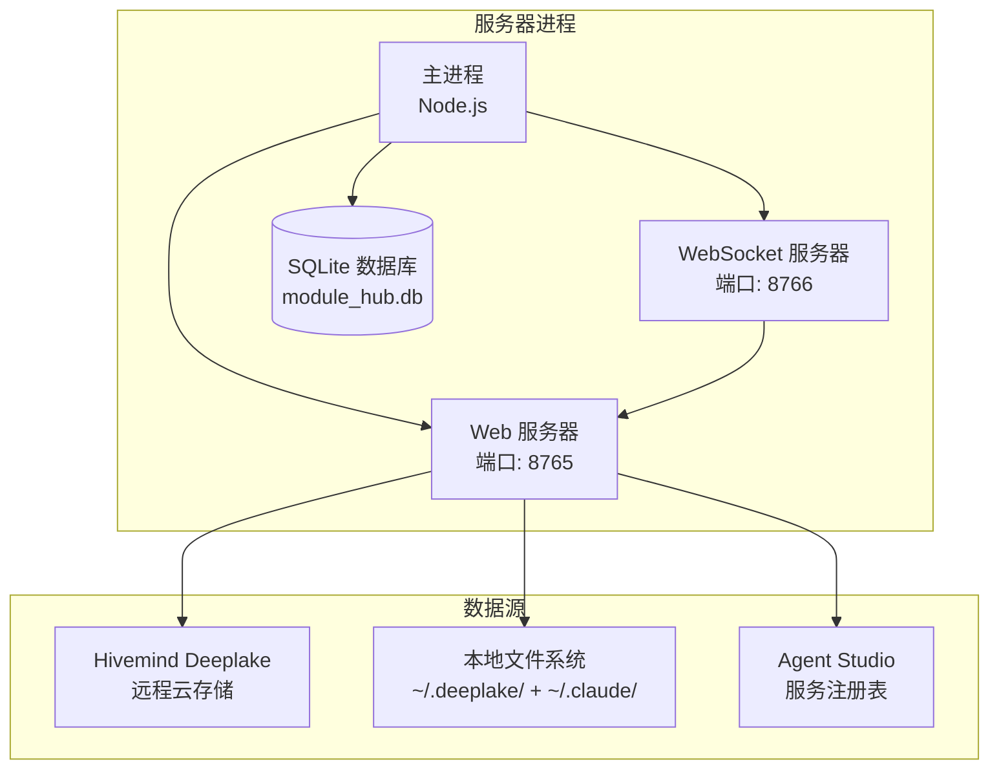

#### 9.9.2 启动配置

Web 服务器作为 Agent Studio 的可选组件启动：

```typescript
/// Web Hub 服务器配置
interface WebHubConfig {
    /// 是否启用 (默认: false)
    enabled: boolean;
    /// HTTP 端口 (默认: 8765)
    httpPort: number;
    /// WebSocket 端口 (默认: 8766)
    wsPort: number;
    /// 认证方式 (默认: 'apikey')
    authType: 'apikey' | 'oauth2' | 'none';
    /// API Key (当 authType = 'apikey' 时使用)
    apiKey?: string;
    /// OAuth2 配置 (当 authType = 'oauth2' 时使用)
    oauth2?: {
        clientId: string;
        clientSecret: string;
        authorizationUrl: string;
        tokenUrl: string;
    };
    /// 数据库路径 (默认: ~/.vssaros/module_hub.db)
    dbPath: string;
    /// 是否自动同步 Hivemind (默认: true)
    autoSyncHivemind: boolean;
    /// 同步间隔 (分钟, 默认: 60)
    syncIntervalMinutes: number;
}
```

**配置方式**：在 VS Code settings.json 中添加：

```json
{
    "vssaros.moduleHub.enabled": true,
    "vssaros.moduleHub.httpPort": 8765,
    "vssaros.moduleHub.authType": "apikey",
    "vssaros.moduleHub.apiKey": "your-api-key-here"
}
```

#### 9.9.3 启动与关闭流程

```typescript
/// Web Hub 服务生命周期
class ModuleHubServer extends Disposable {
    private webServer?: FastifyInstance;
    private wsServer?: Server;
    private syncTimer?: NodeJS.Timer;

    async start(config: WebHubConfig): Promise<void> {
        // 1. 初始化数据库
        await this.initDatabase(config.dbPath);

        // 2. 同步本地模块状态
        await this.syncLocalModules();

        // 3. 同步 Hivemind 远程数据
        if (config.autoSyncHivemind) {
            await this.syncHivemindModules();
            this.syncTimer = setInterval(
                () => this.syncHivemindModules(),
                config.syncIntervalMinutes * 60 * 1000
            );
        }

        // 4. 启动 HTTP 服务器
        this.webServer = fastify({ logger: true });
        this.registerRoutes(this.webServer);
        this.registerAuth(this.webServer, config);
        await this.webServer.listen({ port: config.httpPort, host: '0.0.0.0' });

        // 5. 启动 WebSocket 服务器
        this.wsServer = createWebSocketServer(config.wsPort);

        // 6. 注册为 MCP Server (供外部 Agent 使用)
        await this.registerAsMcpServer();
    }

    async stop(): Promise<void> {
        // 1. 停止同步定时器
        if (this.syncTimer) clearInterval(this.syncTimer);

        // 2. 关闭 WebSocket 服务器
        this.wsServer?.close();

        // 3. 关闭 HTTP 服务器
        await this.webServer?.close();

        // 4. 关闭数据库连接
        await this.closeDatabase();
    }
}
```

---

### 9.10 测试策略

#### 9.10.1 单元测试

| 测试模块 | 测试内容 | 优先级 |
|---------|---------|--------|
| 版本比较 | semver 比较、Major/Minor/Patch 判定 | P0 |
| 数据模型 | 序列化/反序列化、校验 | P0 |
| API 路由 | 各接口的请求/响应处理 | P0 |
| 升级逻辑 | 下载、校验、安装、回滚 | P0 |
| 权限控制 | 认证、授权、访问控制 | P1 |
| 搜索 | 关键词搜索、语义搜索 | P1 |

#### 9.10.2 集成测试

| 测试场景 | 测试内容 | 优先级 |
|---------|---------|--------|
| 端到端升级流程 | 从版本检查到升级完成的完整流程 | P0 |
| 多模块批量升级 | 同时升级多个模块，验证隔离性 | P0 |
| 升级后回滚 | 升级完成后回滚到旧版本 | P0 |
| 并发升级 | 同一模块同时请求升级的处理 | P1 |
| 网络异常 | 下载过程中断网、超时处理 | P1 |
| WebSocket 通知 | 升级进度推送的实时性 | P1 |

#### 9.10.3 性能测试

| 测试项 | 指标 | 目标 |
|--------|------|------|
| 模块列表加载 | 首次加载时间 | < 500ms (100 模块) |
| 版本检查 | 单模块版本对比 | < 100ms |
| 升级操作 | 单模块升级耗时 | < 5s (不含下载) |
| 批量升级 | 10 模块并发升级 | < 30s |
| WebSocket 延迟 | 进度推送延迟 | < 200ms |
| 语义搜索 | 搜索响应时间 | < 1s |

---

### 9.11 实施计划

#### 9.11.1 分阶段实施

| 阶段 | 时间 | 主要任务 | 交付物 |
|------|------|---------|--------|
| **Phase 1: 基础框架** | 2-3 周 | Web 服务器搭建、数据库设计、基础 API | 可运行的 Web 服务，支持模块列表查看 |
| **Phase 2: 版本与升级** | 2-3 周 | 版本对比、升级流程、回滚机制 | 版本检查和一键升级功能 |
| **Phase 3: 增强功能** | 2 周 | 语义搜索、批量升级、WebSocket 通知 | 完整功能的 Web Hub |
| **Phase 4: 安全与集成** | 2 周 | 认证授权、MCP 工具暴露、性能优化 | 生产就绪的 Web Hub |
| **Phase 5: 测试与发布** | 1-2 周 | 测试、文档、部署 | 正式发布 |

总计约 **9-12 周**。

#### 9.11.2 依赖关系

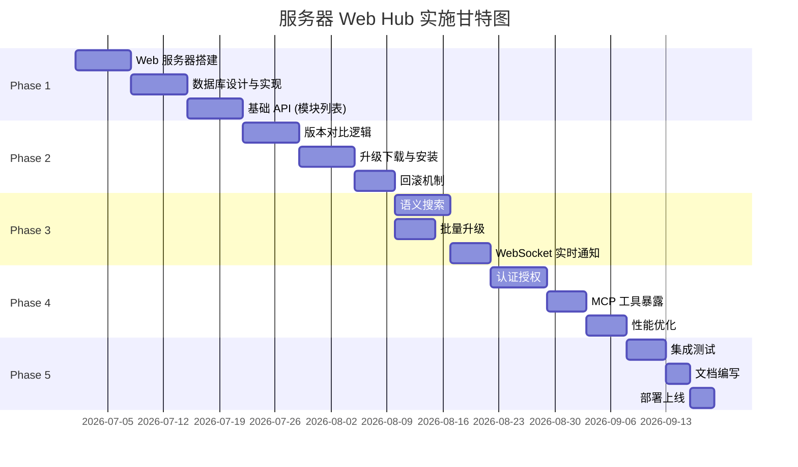

---

### 9.12 关键技术决策记录

| 决策编号 | 决策内容 | 选项 | 决定 | 理由 |
|---------|---------|------|------|------|
| D1 | Web 框架 | Express / Fastify / Koa | **Fastify** | 性能最优，内置 JSON Schema 校验，插件生态丰富 |
| D2 | 数据库 | SQLite / PostgreSQL / MongoDB | **SQLite** | 轻量级，零配置，适合单服务器部署 |
| D3 | 前端框架 | React / Vue / Svelte | **React** | 与 Agent Studio WebView 保持一致，组件复用 |
| D4 | 版本比较 | 字符串比较 / semver 库 | **semver 库** | 标准化，支持 pre-release、build metadata |
| D5 | 实时通信 | SSE / WebSocket / Long Polling | **WebSocket** | 双向通信，适合进度推送和状态同步 |
| D6 | 认证方式 | Session / JWT / API Key / OAuth 2.0 | **API Key + OAuth 2.0 可选** | 简单场景用 API Key，企业场景用 OAuth 2.0 |
| D7 | 语义搜索 | 外部 API / 本地 Embedding | **本地 Embedding** | 复用 Hivemind 的 nomic-embed-text-v1.5 daemon |

---

### 9.13 附录：模块类型详细字段映射

#### 9.13.1 Skill 模块字段映射

| ModuleRegistryEntry 字段 | SkillRecord (Hivemind) 字段 | 说明 |
|--------------------------|-----------------------------|------|
| `id` | `skill:id` → `skill:{name}` | 格式化生成 |
| `name` | `name` | 直接映射 |
| `displayName` | `name` (格式化) | 首字母大写 |
| `description` | `description` | 直接映射 |
| `version` | `version` | 直接映射 |
| `source` | 根据 `author` 和 `scope` 判定 | `scope=me` → `user`, `scope=team` → `gallery` |
| `author` | `author` | 直接映射 |
| `tags` | `tags` | 直接映射 |
| `category` | `category` | 直接映射 |
| `dependencies` | `parent_skill_id` | Fork 来源 |
| `sha256` | 从 `SKILL.md` 文件内容计算 | 动态计算 |
| `downloadUrl` | `{serverUrl}/skills/{name}/SKILL.md` | 拼接生成 |

#### 9.13.2 MCP 模块字段映射

| ModuleRegistryEntry 字段 | IGalleryMcpServer 字段 | 说明 |
|--------------------------|------------------------|------|
| `id` | `mcp:{name}` | 格式化生成 |
| `name` | `name` | 直接映射 |
| `displayName` | `displayName` | 直接映射 |
| `description` | `description` | 直接映射 |
| `version` | `version` | 直接映射 |
| `source` | `gallery` | MCP 模块均来自 Gallery |
| `author` | `publisher` | 直接映射 |
| `icon` | `icon` | 直接映射 |
| `downloadUrl` | `galleryUrl` | 下载链接 |
| `readmeUrl` | `readmeUrl` | 直接映射 |
| `sha256` | 从 `configuration.manifest` 计算 | 动态计算 |

#### 9.13.3 Agent 模块字段映射

| ModuleRegistryEntry 字段 | Employee 字段 | 说明 |
|--------------------------|---------------|------|
| `id` | `agent:{id}` | 格式化生成 |
| `name` | `name` | 直接映射 |
| `displayName` | `name` (格式化) | 首字母大写 |
| `description` | `role` | 用角色作为描述 |
| `version` | `1.0.0` | Agent 暂无版本概念，默认 1.0.0 |
| `source` | 根据 `presetId` 判定 | 内置预设 → `builtin`，自定义 → `user` |
| `author` | 创建者 | 直接映射 |
| `tags` | 从 `skills` 提取 | 提取技能名作为标签 |
| `category` | `role` | 直接映射 |
| `icon` | `avatar` | 直接映射 |

---

## 附录 A：Hivemind 关键源码参考

| 模块 | 核心文件 | 说明 |
|------|---------|------|
| 技能挖掘 | `src/skillify/skillify-worker.ts` | Skillify Worker 主流程 |
| 技能提议 | `src/skillify/skill-proposer.ts` | 技能改进提议生成 |
| 技能发布 | `src/skillify/skill-org-publish.ts` | 技能发布到组织 |
| 技能拉取 | `src/skillify/pull.ts` | 技能拉取核心逻辑 |
| 自动拉取 | `src/skillify/auto-pull.ts` | SessionStart 自动拉取 |
| 技能优化 | `src/skillify/skillopt-improve.ts` | SkillOpt 改进逻辑 |
| MCP Server | `src/mcp/server.ts` | MCP 工具暴露 |
| 代码图谱类型 | `src/graph/types.ts` | 图谱数据模型定义 |
| 图谱推送 | `src/graph/deeplake-push.ts` | 图谱云端同步 |
| 图谱VFS | `src/graph/vfs-handler.ts` | 图谱虚拟文件系统 |
| 会话启动 | `src/hooks/session-start.ts` | SessionStart 钩子 |
| 数据模型 | `src/deeplake-schema.ts` | 7 张核心表定义 |
| 虚拟文件系统 | `src/shell/deeplake-fs.ts` | Deeplake VFS 实现 |
| 认证 | `src/commands/auth.ts` | SSO 认证流程 |
| 通知 | `src/notifications/index.ts` | 通知框架 |
| 规则 | `src/rules/write.ts` | 规则读写 |

## 附录 B：Saros 对应模块参考

| 模块 | 核心路径 | 说明 |
|------|---------|------|
| Skill 注册 | `src/vs/sessions/contrib/agentStudio/browser/skillRegistryService.ts` | 四级优先级技能加载 |
| Agent Studio | `src/vs/workbench/contrib/remoteCodingAgents/` | 远程 Agent 管理 |
| MCP 集成 | `src/vs/workbench/contrib/mcp/` | MCP 服务端集成 |
| Chat 系统 | `src/vs/workbench/contrib/chat/` | 对话界面 |
| 记忆策略 | `doc/Memory-Strategy.md` | TDB-AM 四层记忆 |
| 会话欢迎 | `src/vs/workbench/contrib/welcomeAgentSessions/` | Agent 会话欢迎页 |
