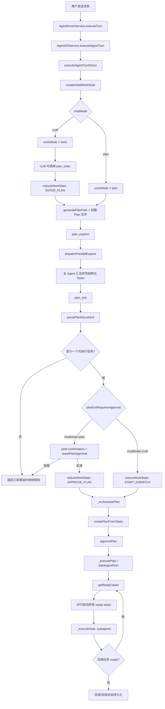

# Plan 模式优化方案 + 测试用例设计

> 2026-07-19 | 基于 MiMo-Code 源码对比分析

## 一、现状问题总结

### 1.1 已发现的 Bug

| # | 问题 | 位置 | 影响 |
|---|------|------|------|
| B1 | `chatMode=undefined` 未从 localStorage 恢复 | `nativeChatEditorPane.ts:99` `_currentChatMode = undefined`；仅 `setItem` 无 `getItem` | plan 模式选择刷新后丢失，sendMessage 带 undefined → 回退 craft |
| B2 | 多 folder 工作区只索引 `folders[0]` | `codebaseMemoryMcpService.ts:211/306` `rootUri = folders[0].uri` | UE5 引擎源码（第 2 个 folder）不在代码索引中 → search_graph 查不到 |
| B3 | `filterToolsByChatMode` + `applyHardPermission` 双重过滤冗余 | `chatModeConfig.ts:114-115` + `toolPermission.ts:44-52` | plan 模式工具列表先被 filter 砍到 ~25，再被 hardPermission 砍（已无剩余）→ 两次过滤浪费 |
| B4 | plan 提示词仅注入 system prompt（一次性） | `agentDriverService.ts:509-511` | 长对话中 plan 工作流指令被上下文压缩/淹没 → LLM 遗忘 exit_plan_mode |
| B5 | `PLAN_MODE_TOOL_ENFORCEMENT` 与 `PLAN_MODE_SYSTEM_PROMPT_FULL` 内容重叠 | `agentOSService.ts:286-306` + `chatModeConfig.ts:287-376` | 两个 plan 强制指令拼接 → 提示词膨胀且语义冲突 |

### 1.2 与 MiMo 的架构差距

| 维度 | MiMo | Saros | 差距等级 |
|------|------|---------|----------|
| 工具 schema 稳定性 | 始终不变（permission 运行时拦截） | filterToolsByChatMode 移除 → cache 失效 | 🔴 P1 |
| 权限拦截时机 | 运行时 `ctx.ask({permission:"edit"})` | schema 层 `applyHardPermission` 剥离 | 🟡 P2 |
| Plan 指令可见性 | `<system-reminder>` 每轮注入 user 消息 | system prompt 一次性 | 🔴 P0 |
| Plan 产物持久化 | `.mimocode/plans/*.md` 文件 | `exit_plan_mode` JSON 参数 → OrchestrationPlan | 🟡 P1 |
| Plan→Exec 切换 | agent 身份切换（plan→build）+ BUILD_SWITCH 提醒 | chatMode 参数切换，无切换提醒 | 🟡 P2 |
| 指令语气 | 命令式 DO/DON'T + "supersedes any other instructions" | 描述式 "You are in..." | 🟡 P1 |

---

## 二、优化方案设计

### Phase 1（P0）：修复阻断性 Bug

#### 1.1 修复 chatMode 不恢复（B1）

**文件**: `nativeChatEditorPane.ts`

```typescript
// 当前（L99）:
private _currentChatMode: ChatMode | undefined = undefined;

// 改为:
private _currentChatMode: ChatMode | undefined = (() => {
    try {
        const saved = localStorage.getItem('agentChatMode');
        return (saved === 'craft' || saved === 'ask' || saved === 'plan' || saved === 'workflow')
            ? saved : undefined;
    } catch { return undefined; }
})();
```

同时在 `setAgent` / `_selectAndLoadAgent` 中同步 panel 的 `setChatMode(this._currentChatMode ?? 'craft')`，确保 UI 显示与内部状态一致。

#### 1.2 修复多 folder 索引（B2）

**文件**: `codebaseMemoryMcpService.ts`

```typescript
// 当前（L306）:
baseWsUri = folders[0].uri;
wsPath = baseWsUri.fsPath;

// 改为遍历所有 folder 分别索引:
for (const folder of folders) {
    const folderPath = folder.uri.fsPath;
    // 跳过不存在的 folder
    try { await this.fileService.stat(folder.uri); } catch { continue; }
    await this.graphService.indexWorkspace(folderPath, graphConfig, token);
}
```

**注意**: 引擎目录巨大，需限制索引范围（仅 `Engine/Source/Runtime`）或用 fast 模式。可通过 `.code-workspace` 的 `codebase-memory.subPaths` 配置控制。

---

### Phase 2（P1）：Plan 模式架构优化

#### 2.1 消除 filterToolsByChatMode 双重过滤（B3）

**目标**: plan 模式不再从 schema 移除工具，改为运行时 hardPermission 拦截（对齐 MiMo "工具不变 + permission backstop"）。

**文件**: `chatModeConfig.ts` + `agentDriverService.ts`

```typescript
// chatModeConfig.ts — filterToolsByChatMode plan 分支改为不过滤
export function filterToolsByChatMode(
    tools: readonly IToolDefinition[],
    chatMode: ChatMode,
): IToolDefinition[] {
    switch (chatMode) {
        case 'craft':
        case 'workflow':
        case 'plan':  // ← 改：plan 不再 filter，由 hardPermission 兜底
            return [...tools];
        case 'ask':
            return tools.filter(t => isToolAllowedInAskMode(t));
        default:
            return [...tools];
    }
}
```

**保留** `applyHardPermission` 作为唯一剥离层（已有），但改为**运行时拦截**而非 schema 剥离：

```typescript
// toolPermission.ts — 新增运行时拦截函数
export function isToolCallDeniedByHardPermission(
    toolName: string,
    policy: IHardPermissionPolicy | undefined,
): { denied: boolean; reason?: string } {
    if (isToolHardDenied(toolName, policy)) {
        return { denied: true, reason: policy?.reason ?? 'denied by hard permission' };
    }
    return { denied: false };
}
```

```typescript
// agentTurnExecutor.ts — 工具执行前拦截
const hardPerm = host._resolveHardPermission(request);
if (hardPerm) {
    const denial = isToolCallDeniedByHardPermission(tc.name, hardPerm);
    if (denial.denied) {
        // 不执行，返回错误结果让 LLM 知道
        toolResults.push({
            toolCallId: tc.id,
            content: { error: `Tool "${tc.name}" is blocked: ${denial.reason}` },
            success: false,
        });
        yield { type: 'tool_result', content: `Blocked: ${denial.reason}`, toolCallId: tc.id };
        yield { type: 'tool_end', toolCallId: tc.id, success: false };
        continue;  // 跳过实际执行
    }
}
```

**收益**: 工具 schema 在 plan/craft 间不变 → prefix-cache 命中 → 省 token + 降延迟。

#### 2.2 `<system-reminder>` 每轮注入（B4）

**文件**: `agentTurnExecutor.ts`

```typescript
// 在 plan 模式下，每轮 user message 末尾追加 <system-reminder>
if (request.chatMode === 'plan') {
    const reminder = buildPlanSystemReminder(request);
    messages = messages.map(msg => {
        if (msg.role === 'user' && msg === messages[messages.length - 1]) {
            return {
                ...msg,
                content: typeof msg.content === 'string'
                    ? msg.content + '\n\n' + reminder
                    : msg.content,
            };
        }
        return msg;
    });
}
```

```typescript
// chatModeConfig.ts — 新增构建函数
export function buildPlanSystemReminder(request: IAgentTurnRequest): string {
    return `<system-reminder>
Plan mode is active. The user wants you to research and design, NOT to execute yet.
This supersedes any other instructions you have received.

## What you MUST do
- Phase 1: Analyze the requirement in text only (NO tools). Decide 2-5 exploration areas.
- Phase 2: Call plan_explore(goal, areas) to launch PARALLEL read-only sub-agents.
- Phase 3: Synthesize findings into structured tasks, then call exit_plan_mode.

## What you MUST NOT do
- Do NOT edit, create, or delete any files (blocked by hard permission).
- Do NOT run terminal/build/test commands (blocked by hard permission).
- Do NOT manually loop search_code — use plan_explore instead.
- Do NOT output the plan as text — use exit_plan_mode tool call ONLY.

Your turn MUST end with either plan_explore or exit_plan_mode. No exceptions.
</system-reminder>`;
}
```

#### 2.3 合并重复的 plan 强制指令（B5）

**文件**: `agentOSService.ts` + `agentTurnExecutor.ts`

删除 `PLAN_MODE_TOOL_ENFORCEMENT` 常量（L286-306），其语义已由 `<system-reminder>` 覆盖。`agentTurnExecutor.ts:166-169` 的追加逻辑一并移除。

#### 2.4 Plan 文件持久化（对齐 MiMo）

**新增文件**: `common/planFile.ts`

```typescript
import * as path from 'path';

/** 生成 plan 文件路径: ~/.vssaros/saros/plans/<timestamp>-<slug>.md */
export function generatePlanPath(
    sarosRoot: string,
    userMessage: string,
    timestamp: number = Date.now(),
): string {
    const slug = slugify(userMessage.slice(0, 60));
    const ts = new Date(timestamp).toISOString().replace(/[:.]/g, '-').slice(0, 19);
    return path.join(sarosRoot, 'plans', `${ts}-${slug}.md`);
}

function slugify(text: string): string {
    return text
        .toLowerCase()
        .replace(/[^\w\u4e00-\u9fff]+/g, '-')
        .replace(/^-+|-+$/g, '')
        .slice(0, 40) || 'plan';
}

/** Plan 文件的允许写入路径模式（hardPermission 例外） */
export const PLAN_FILE_GLOB = 'plans/*.md';
```

**修改** `toolPermission.ts` — plan 模式 hardPermission 允许写 plan 文件：

```typescript
export function planModeHardPermission(): IHardPermissionPolicy {
    return {
        deniedToolPatterns: [
            'write', 'write_to_file', 'apply_diff', 'create_file', 'edit_file',
            'edit', 'rename_file', 'delete_file', 'file_write', 'file_edit',
            'terminal_cmd',
        ],
        // 新增: 允许写入 plan 文件的例外（运行时拦截时检查路径）
        allowedPathPatterns: ['plans/*.md'],
        reason: 'plan mode: write/execute tools are locked (except plan files)',
    };
}
```

**修改** `exit_plan_mode` 工具 — 简化为无参数（plan 内容已写入文件）：

```typescript
// compatibilityTools.ts — exit_plan_mode 简化
ctx.register({
    definition: {
        name: 'exit_plan_mode',
        description: 'Exit plan mode after writing your plan to the plan file. ' +
            'No parameters needed — the plan file content will be parsed automatically.',
        inputSchema: {
            type: 'object',
            properties: {
                plan_file: { type: 'string', description: 'Path to the plan file (optional, auto-detected).' },
            },
        },
    },
    handler: async (args) => {
        // 读取 plan 文件 → 解析 tasks → 发射 confirmation
        // ...
    },
});
```

---

### Phase 3（P2）：Plan→Exec 切换优化

#### 3.1 BUILD_SWITCH 提醒

**文件**: `agentTurnExecutor.ts`

当 `exit_plan_mode` 审批通过后，在下一轮 craft 消息中注入 BUILD_SWITCH：

```typescript
// chatModeConfig.ts — 新增
export const BUILD_SWITCH_REMINDER = `<system-reminder>
Your operational mode has changed from plan to craft.
You are no longer in read-only mode.
A plan file exists — you should execute on the plan defined within it.
</system-reminder>`;
```

```typescript
// agentTurnExecutor.ts — 检测 plan→craft 切换
if (request.chatMode === 'craft' && previousChatMode === 'plan') {
    const lastUserMsg = messages[messages.length - 1];
    if (lastUserMsg?.role === 'user') {
        messages[messages.length - 1] = {
            ...lastUserMsg,
            content: lastUserMsg.content + '\n\n' + BUILD_SWITCH_REMINDER,
        };
    }
}
```

#### 3.2 指令语气改写（命令式）

将 `PLAN_MODE_SYSTEM_PROMPT` 从描述式改为 MiMo 风格命令式：

```typescript
// 改写后（节选）
export const PLAN_MODE_SYSTEM_PROMPT = [
    '',
    '## PLAN MODE — Research & Design Only',
    '',
    'Plan mode is active. This supersedes any other instructions you have received.',
    'You research and design — you do NOT execute.',
    '',
    '## What you MUST do',
    '- Phase 1: Analyze the requirement in text only (NO tools).',
    '- Phase 2: Call plan_explore(goal, areas) — this is your PRIMARY action.',
    '- Phase 3: Synthesize findings, then call exit_plan_mode.',
    '',
    '## What you MUST NOT do',
    '- Do NOT edit/create/delete files (blocked by hard permission).',
    '- Do NOT run terminal/build/test commands (blocked by hard permission).',
    '- Do NOT manually loop search_code — use plan_explore instead.',
    '- Do NOT output the plan as text — use exit_plan_mode ONLY.',
    '',
    'Your turn MUST end with either plan_explore or exit_plan_mode.',
    'If you respond with text only and no exit_plan_mode, you have FAILED.',
].join('\n');
```

---

## 三、测试用例设计

### 3.1 单元测试（纯逻辑，esbuild+mocha）

**文件**: `test/common/plan-mode-optimization.test.ts`

#### Suite 1: chatMode 恢复逻辑

```typescript
suite('chatMode localStorage 恢复', () => {
    test('从 localStorage 恢复有效 chatMode', () => {
        localStorage.setItem('agentChatMode', 'plan');
        const restored = restoreChatMode();
        assert.strictEqual(restored, 'plan');
    });

    test('无效值回退 undefined', () => {
        localStorage.setItem('agentChatMode', 'invalid');
        const restored = restoreChatMode();
        assert.strictEqual(restored, undefined);
    });

    test('无存储值返回 undefined', () => {
        localStorage.removeItem('agentChatMode');
        const restored = restoreChatMode();
        assert.strictEqual(restored, undefined);
    });

    test('仅接受 craft/ask/plan/workflow', () => {
        for (const mode of ['craft', 'ask', 'plan', 'workflow']) {
            localStorage.setItem('agentChatMode', mode);
            assert.strictEqual(restoreChatMode(), mode);
        }
    });
});
```

#### Suite 2: filterToolsByChatMode plan 不再过滤

```typescript
suite('filterToolsByChatMode — plan 不移除工具', () => {
    const allTools = [
        { name: 'file_read', securityLevel: ToolSecurityLevel.Safe },
        { name: 'file_write', securityLevel: ToolSecurityLevel.Dangerous },
        { name: 'terminal', securityLevel: ToolSecurityLevel.Dangerous },
        { name: 'search_graph', securityLevel: ToolSecurityLevel.Safe },
        { name: 'exit_plan_mode', securityLevel: ToolSecurityLevel.Safe },
    ];

    test('plan 模式返回全部工具（不过滤）', () => {
        const result = filterToolsByChatMode(allTools, 'plan');
        assert.strictEqual(result.length, allTools.length);
        assert.ok(result.some(t => t.name === 'file_write'));  // 写入工具仍在
    });

    test('craft 模式返回全部工具', () => {
        const result = filterToolsByChatMode(allTools, 'craft');
        assert.strictEqual(result.length, allTools.length);
    });

    test('ask 模式仍过滤危险工具', () => {
        const result = filterToolsByChatMode(allTools, 'ask');
        assert.ok(!result.some(t => t.name === 'file_write'));
        assert.ok(!result.some(t => t.name === 'terminal'));
        assert.ok(result.some(t => t.name === 'file_read'));
    });
});
```

#### Suite 3: 运行时 hardPermission 拦截

```typescript
suite('hardPermission 运行时拦截', () => {
    const policy = planModeHardPermission();

    test('file_write 被拦截', () => {
        const result = isToolCallDeniedByHardPermission('file_write', policy);
        assert.strictEqual(result.denied, true);
        assert.ok(result.reason?.includes('plan mode'));
    });

    test('terminal 被拦截', () => {
        const result = isToolCallDeniedByHardPermission('terminal', policy);
        // terminal 不在 deniedToolPatterns（只有 terminal_cmd）→ 不拦截
        // 需要更新 planModeHardPermission 包含 'terminal'
        assert.strictEqual(result.denied, true);
    });

    test('file_read 不被拦截', () => {
        const result = isToolCallDeniedByHardPermission('file_read', policy);
        assert.strictEqual(result.denied, false);
    });

    test('search_graph 不被拦截', () => {
        const result = isToolCallDeniedByHardPermission('search_graph', policy);
        assert.strictEqual(result.denied, false);
    });

    test('exit_plan_mode 不被拦截', () => {
        const result = isToolCallDeniedByHardPermission('exit_plan_mode', policy);
        assert.strictEqual(result.denied, false);
    });

    test('无 policy 时不拦截', () => {
        const result = isToolCallDeniedByHardPermission('file_write', undefined);
        assert.strictEqual(result.denied, false);
    });
});
```

#### Suite 4: plan 文件路径生成

```typescript
suite('plan 文件路径生成', () => {
    test('生成合法路径', () => {
        const path = generatePlanPath('/home/.vssaros', '分析 GC 性能瓶颈', 1721376000000);
        assert.ok(path.includes('plans/'));
        assert.ok(path.endsWith('.md'));
        assert.ok(path.includes('2026-07-19'));  // timestamp
    });

    test('slug 中文保留', () => {
        const path = generatePlanPath('/root', '分析GC性能', 1721376000000);
        assert.ok(path.includes('分析gc性能') || path.includes('分析GC性能'));
    });

    test('空消息回退 plan', () => {
        const path = generatePlanPath('/root', '', 1721376000000);
        assert.ok(path.includes('-plan.md'));
    });

    test('长消息截断', () => {
        const longMsg = 'a'.repeat(200);
        const path = generatePlanPath('/root', longMsg, 1721376000000);
        const slug = path.split('-').slice(3).join('-').replace('.md', '');
        assert.ok(slug.length <= 40);
    });
});
```

#### Suite 5: system-reminder 构建

```typescript
suite('buildPlanSystemReminder', () => {
    test('包含关键指令', () => {
        const reminder = buildPlanSystemReminder({} as any);
        assert.ok(reminder.includes('<system-reminder>'));
        assert.ok(reminder.includes('Plan mode is active'));
        assert.ok(reminder.includes('plan_explore'));
        assert.ok(reminder.includes('exit_plan_mode'));
        assert.ok(reminder.includes('MUST NOT'));
    });

    test('包含 "supersedes any other instructions"', () => {
        const reminder = buildPlanSystemReminder({} as any);
        assert.ok(reminder.includes('supersedes any other instructions'));
    });

    test('以 </system-reminder> 结尾', () => {
        const reminder = buildPlanSystemReminder({} as any);
        assert.ok(reminder.trim().endsWith('</system-reminder>'));
    });
});
```

#### Suite 6: BUILD_SWITCH 检测

```typescript
suite('plan→craft 切换检测', () => {
    test('plan→craft 触发 BUILD_SWITCH', () => {
        const shouldInject = shouldInjectBuildSwitch('craft', 'plan');
        assert.strictEqual(shouldInject, true);
    });

    test('craft→craft 不触发', () => {
        const shouldInject = shouldInjectBuildSwitch('craft', 'craft');
        assert.strictEqual(shouldInject, false);
    });

    test('plan→plan 不触发', () => {
        const shouldInject = shouldInjectBuildSwitch('plan', 'plan');
        assert.strictEqual(shouldInject, false);
    });

    test('undefined→craft 不触发', () => {
        const shouldInject = shouldInjectBuildSwitch('craft', undefined);
        assert.strictEqual(shouldInject, false);
    });
});
```

### 3.2 集成测试（测试场景描述）

#### 场景 1: plan 模式完整流程（E2E）

```
前置: 工作区已索引，chatMode=plan
步骤:
  1. 用户发送 "重构认证模块"
  2. 验证 system prompt 包含 PLAN_MODE_SYSTEM_PROMPT
  3. 验证 user message 末尾包含 <system-reminder>
  4. 验证工具列表包含全部 80 工具（未被 filter 移除）
  5. LLM 调用 plan_explore → 验证 subagent 派发
  6. LLM 调用 exit_plan_mode → 验证审批卡片弹出
  7. 用户 Approve → 验证 OrchestrationPlan 创建 + subagent 派发
  8. 验证下一轮 chatMode 切换为 craft + BUILD_SWITCH 注入
预期:
  - 工具 schema 在 plan/craft 间不变（prefix-cache 命中）
  - plan 工作流指令每轮可见
  - exit_plan_mode 后自动派发 subagent
```

#### 场景 2: plan 模式工具调用被拦截

```
前置: chatMode=plan
步骤:
  1. LLM 尝试调用 file_write("/test.txt", "content")
  2. 验证工具执行被 hardPermission 拦截
  3. 验证返回错误结果: "Tool file_write is blocked: plan mode"
  4. 验证 tool_end success=false
  5. 验证文件未实际创建
预期:
  - 工具在 schema 中可见（LLM 能尝试调用）
  - 运行时被拦截，文件不创建
  - LLM 收到明确错误消息
```

#### 场景 3: plan 文件写入例外

```
前置: chatMode=plan
步骤:
  1. LLM 调用 file_write("~/.vssaros/plans/2026-07-19-refactor-auth.md", "# Plan\n...")
  2. 验证工具执行未被拦截（路径匹配 plans/*.md）
  3. 验证文件实际创建
  4. LLM 调用 exit_plan_mode → 验证 plan 文件被读取
预期:
  - plan 文件路径是 hardPermission 的唯一例外
  - 其他路径写入仍被拦截
```

#### 场景 4: chatMode 刷新恢复

```
步骤:
  1. 用户选择 plan 模式
  2. 验证 localStorage.setItem('agentChatMode', 'plan') 被调用
  3. 刷新页面
  4. 验证 _currentChatMode 从 localStorage 恢复为 'plan'
  5. 验证 panel UI 显示 Plan 模式
  6. 发送消息 → 验证 sendMessage options.chatMode='plan'
预期:
  - 刷新后模式不丢失
  - sendMessage 正确传递 chatMode
```

#### 场景 5: 多 folder 索引

```
前置: 工作区含 S1Game + UE5EA 两个 folder
步骤:
  1. 调用 index_repository
  2. 验证两个 folder 都被索引（graph 含两个 project）
  3. search_graph("GC::ProcessAsync") → 验证返回引擎代码节点
  4. search_graph("S1GameClass") → 验证返回游戏代码节点
预期:
  - 两个 folder 的代码都在索引中
  - 跨 folder 搜索正常工作
```

#### 场景 6: prefix-cache 命中验证

```
步骤:
  1. craft 模式发送消息 → 记录工具列表 hash
  2. 切换到 plan 模式发送消息
  3. 验证工具列表 hash 不变（未被 filter 改变）
  4. 验证 LLM 请求的 prompt cache 命中率提升
预期:
  - plan/craft 工具列表完全一致
  - cache hit 增加（通过 usage.cached 观察）
```

---

## 四、实施优先级与风险

### 4.1 实施顺序

| 阶段 | 任务 | 风险 | 预计改动量 |
|------|------|------|-----------|
| **P0-1** | chatMode localStorage 恢复 | 低 | ~10 行 |
| **P0-2** | 多 folder 索引 | 中（引擎巨大可能 OOM） | ~30 行 + 配置 |
| **P1-1** | filterToolsByChatMode plan 不过滤 | 低 | ~5 行 |
| **P1-2** | 运行时 hardPermission 拦截 | 中（需改工具执行路径） | ~40 行 |
| **P1-3** | `<system-reminder>` 每轮注入 | 低 | ~20 行 |
| **P1-4** | 合并重复 plan 强制指令 | 低 | 删除 ~20 行 |
| **P1-5** | plan 文件持久化 | 中（需改 exit_plan_mode） | ~80 行 |
| **P2-1** | BUILD_SWITCH 提醒 | 低 | ~15 行 |
| **P2-2** | 指令语气改写 | 低 | ~30 行重写 |

### 4.2 风险与缓解

| 风险 | 缓解措施 |
|------|----------|
| plan 模式工具不剥离 → LLM 频繁尝试写文件被拒 | 在 `<system-reminder>` 中明确告知"blocked by hard permission"，LLM 会快速学会不调用 |
| 多 folder 索引引擎目录导致 OOM（4GB 堆） | 默认仅索引 `Engine/Source/Runtime`，或用 SQLite 后端（Phase 2e 已就绪） |
| plan 文件路径例外被滥用 | 严格匹配 `plans/*.md` glob，不允许 `../` 路径穿越 |
| `<system-reminder>` 注入增加 token | 提醒精简到 ~200 token，远小于 165K 上下文 |

### 4.3 回退方案

所有改动可通过配置开关回退：
- `saros.planMode.toolFilterEnabled`（默认 false）→ true 时恢复旧 filterToolsByChatMode 行为
- `saros.planMode.systemReminderPerTurn`（默认 true）→ false 时恢复 system prompt 一次性注入
- `saros.planMode.planFilePersistence`（默认 true）→ false 时恢复 exit_plan_mode JSON 参数模式

---

## 五、验收标准

1. **chatMode 恢复**: 刷新页面后 plan 模式保持 → `sendMessage` 日志显示 `chatMode=plan`
2. **工具 schema 稳定**: plan→craft 切换后工具列表 hash 不变 → `cached` token 数增加
3. **运行时拦截**: plan 模式下 `file_write` 调用返回错误，文件不创建
4. **system-reminder 可见**: 每轮 user message 末尾包含 `<system-reminder>`（日志可验证）
5. **plan 文件持久化**: `exit_plan_mode` 后 `~/.vssaros/plans/*.md` 文件存在
6. **多 folder 索引**: `search_graph("GC::ProcessAsync")` 返回引擎代码节点（total > 5）
7. **单测全绿**: `node test/common/run-plan-mode-optimization-tests.mjs` 全部 passing
8. **类型检查**: `npm run compile-check-ts-native` EXIT=0

---

## 六、2026-07-20 V2：ChatMode / WorkMode 分离（当前实现）

> 本节覆盖前文中的旧 `exit_plan_mode`、`plan→craft` 描述；当前控制工具统一为 `plan_enter` / `plan_exit`。

### 6.1 语义边界

| 状态 | 取值 | 责任 | 是否在 loop 内变化 |
|---|---|---|---|
| `chatMode` | `plan/craft/ask/workflow` | 用户交互策略；其中 Plan 表示执行前必须审批，Craft 表示自治执行 | 否 |
| `workMode` | `plan/work` | AgentLoop 当前工作阶段；Plan 只读规划，Work 可写入/执行 | 是 |

唯一策略差异：

- `chatMode=plan`：`plan_exit` → interrupt/confirmation → 用户批准 → `workMode=work` → DAG 并行派发。
- `chatMode=craft`：`plan_exit` → 自动批准 → `workMode=work` → DAG 并行派发。
- 两条路径均不修改 ChatMode 下拉框。

### 6.2 参考项目取舍

- **MiMo-Code**：保留稳定 agent/chat 策略、Plan 文件、运行时 hard permission、BUILD_SWITCH 和显式审批边界；本项目按产品要求只对 Plan ChatMode审批，Craft 自动通过。
- **LangGraph**：采用 JSON 可序列化 state + reducer；审批表示为可观测的 `pending/approved/rejected` 状态；Plan 任务解析为 DAG，由 ready queue 按依赖 fan-out，失败任务可独立重试。
- **Saros 既有能力复用**：`TaskOrchestrationService.createPlanFromTasks → approvePlan → _executePlan → getReadyTasks → _executeTask` 已具备 DAG、并发上限、任务板、重试和动态推进，因此不在 `agentTurnExecutor` 重造并行执行器。

### 6.3 函数执行图



### 6.4 核心调用链

```text
AgentDriverService.executeTurn
  → AgentOSService.executeAgentTurn
    → executeAgentTurnDirect
      → createInitialWorkState(chatMode, request.workMode)
      → plan_enter
        → reduceWorkState(ENTER_PLAN)
        → generatePlanPath(...)
        → reduceRunState(WORK_EVENT/SET_PLAN_FILE)
      → plan_exit
        → parsePlanDocument(markdown)
        → planExitRequiresApproval(chatMode)
        → [Plan only] _awaitPlanApproval(confirmationId)
        → reduceWorkState(APPROVE_PLAN | START_DISPATCH)
        → AgentOSService._orchestratePlan(...tasks)
          → TaskOrchestrationService.createPlanFromTasks
          → TaskOrchestrationService.approvePlan
          → TaskOrchestrationService._executePlan
          → getReadyTasks(DAG, maxConcurrency)
          → TaskOrchestrationService._executeTask × N
```

### 6.5 测试矩阵

| 层级 | 场景 | 预期 |
|---|---|---|
| 单元 | Plan ChatMode 初态 | `workMode=plan` |
| 单元 | Craft ChatMode 初态 | `workMode=work` |
| 单元 | 审批策略 | 仅 `chatMode=plan` 返回 true |
| 单元 | Craft `ENTER_PLAN → START_DISPATCH` | `plan → work`，ChatMode 不参与 reducer |
| 单元 | Plan 审批拒绝 | 保持 `workMode=plan`，approval=`rejected` |
| 单元 | 结构化 Plan 解析 | 提取 title/description/files/dependencies/role/complexity |
| 单元 | checklist 回退解析 | 生成独立任务 |
| 集成 | Plan ChatMode `plan_exit` | 发 confirmation；批准前不创建 OrchestrationPlan |
| 集成 | Craft ChatMode `plan_exit` | 不发 confirmation；直接创建并批准 OrchestrationPlan |
| 集成 | 无结构化任务 | 阻止退出，不派发 subagent |
| 集成 | DAG 并行 | 无依赖任务同批启动；依赖任务等待前置 Done |
| 集成 | 部分失败 | 成功兄弟任务不回滚；失败任务独立进入 Error/Retry |
| 恢复 | WorkState 快照 | mode/planFile/approval/execution 状态可序列化恢复 |
| 安全 | planning 权限 | Craft 进入 planning 后同样阻止写入/执行；plan_explore 子 Agent 继承 `parentWorkMode=plan` |

---

## 七、2026-07-20 AgentLoop 兼容性审计：MiMo + LangGraph

### 7.1 结论

当前实现适合描述为“借鉴 MiMo UX/权限模型，并铺设 LangGraph reducer/checkpoint 地基”，尚不能称为完整兼容两种框架。

合理部分：

1. ChatMode 与 WorkMode 分离方向正确，避免 UI 策略与运行期权限互相污染。
2. Plan 文件、稳定工具 schema、运行时 hard permission、BUILD_SWITCH 对齐 MiMo 的核心思路。
3. `AgentRunState` 使用纯 JSON、版本化 snapshot 和 reducer，便于后续实现 durable execution。
4. Plan Task 已使用 DAG、ready queue 和并发上限；探索 subagent 使用 `Promise.allSettled`，具备基础故障隔离。

尚未成立的兼容语义：

- `AgentRunState` 不是 AgentLoop 的唯一状态源；messages、iteration、WorkState 仍以局部变量为主。
- approval 是内存 Promise，不是 LangGraph `interrupt + checkpoint + Command(resume)`。
- AgentGraph 的 `goto: string[]` 只执行第一个目标，不是真正 fan-out/fan-in。
- checkpoint 只覆盖图节点边界，不覆盖单 Agent turn、Plan 审批和 TaskOrchestration。
- Plan DAG 执行没有 lease、幂等键、原子事务和启动恢复扫描。

### 7.2 缺陷清单

| 优先级 | 缺陷 | 后果 |
|---|---|---|
| P0 | `_readPlans → 修改 → _writePlans` 不在同一事务；write lock 只锁最终写入 | 并行任务完成时互相覆盖状态和结果 |
| P0 | Task 先 fire-and-forget 执行，最后才持久化 Running | 快速完成时 `completeTask` 读到 Pending，结果丢失并永久悬挂 |
| P0 | timeout/cancel 只改状态，未中断真实 `sendMessage`/subagent | 已取消任务继续修改文件，晚到结果污染终态 |
| P0 | WorkMode、planFile、pending approval 未跨 turn/session 持久化 | 下一轮或重启后丢失 planning 状态；审批无法恢复 |
| P0 | failed dependency 的下游保持 Pending；完成门只接受全终态 | Plan 永久 Executing，无法收敛为 partial/error |
| P0 | Graph checkpoint 到 END 后未清除；恢复时 END 不属于 `graph.nodes` | 已完成图下一 turn 回退 entry，可能重复副作用 |
| P1 | AgentGraph fan-out 取 `targets[0]` | `goto:[A,B]` 静默丢弃 B，不符合 LangGraph Send/superstep |
| P1 | 节点 checkpoint 保存输入线程，不保存真实输出线程 | 恢复时丢失节点观察结果，handoff 上下文不完整 |
| P1 | `_awaitPlanApproval` 只存在内存 Map | 窗口/进程重启后卡片和等待方失联 |
| P1 | `_orchestratePlan` 在 `approvePlan` 返回 Error Plan 时仍可能报告 executing | UI/主聊天显示与真实状态不一致 |
| P1 | UnifiedSubAgentDispatch 对 Completion Gate 的 partial/failed 仍设置 `success:true`；stall timeout 也可能 success | 汇总把未完成结果当成功 |
| P1 | subagent timeout 使用 `Promise.race`，没有 abort 底层执行；重试覆盖面过宽 | 超时后仍有副作用；权限/参数错误也浪费重试 |
| P1 | 主 Plan Task 走 `agentChatService.sendMessage`，而非统一 dispatch | 无统一父子取消、token budget、result contract 和生命周期事件 |
| P1 | 最终 Plan 汇总依赖 `_streamEventCallback`，且未绑定原 planner session | 无 WebView callback 时不产出汇总；可能写入错误会话 |
| P2 | 探索汇总只保留成功 output，失败项被静默丢弃 | 主 Agent 无法判断覆盖缺口和风险 |
| P2 | `plan_exit` 缺少 execution idempotency key | 重放/恢复可能创建重复 OrchestrationPlan |
| P2 | plans JSON 非临时文件+rename，损坏时 `_readPlans` 静默返回空数组 | 崩溃可能表现为“所有计划消失” |

### 7.3 关键竞态

#### 竞态 A：并行完成丢更新

```text
Task A completeTask: read plans(version=10)
Task B completeTask: read plans(version=10)
Task A: set A=Done → write version 11
Task B: set B=Done on stale copy → write version 11
结果：A 又变回 Running
```

#### 竞态 B：先执行后提交 Running

```text
_executePlan: in-memory task.status=Running
_executeTask starts immediately
agent returns quickly
completeTask reads disk: task.status=Pending → throws
_executePlan then writes Running
结果：任务永久 Running，真实结果丢失
```

#### 竞态 C：取消后的晚到完成

```text
UI cancel → persisted task=Cancelled
底层 sendMessage 未 abort，继续编辑文件并返回
completeTask sees Cancelled → throws，或其他旧快照覆盖 Cancelled
结果：副作用已发生，状态与现实不一致
```

### 7.4 优化方案

#### P0：先保证 Task DAG 正确性

1. **事务化 PlanStore**
   - 提供 `mutatePlan(planId, expectedVersion, fn)`，在同一 mutex/SQLite transaction 内完成 read-modify-write。
   - Plan/Task 增加单调 `version`，更新使用 CAS；冲突重读重试。
   - 文件后端至少采用 temp file + fsync + atomic rename。

2. **Task claim/lease**
   - Task 增加 `executionId/attempt/leaseOwner/leaseUntil/heartbeatAt/idempotencyKey`。
   - 先原子 claim 并持久化 Running，再启动外部 Agent。
   - completion/cancel/timeout 必须携带相同 executionId；晚到旧 attempt 直接丢弃。

3. **真实取消传播**
   - 每个 task 持有 AbortController；signal 透传 `sendMessage → AgentOS → tools → UnifiedSubAgentDispatch`。
   - timeout 流程：先 abort，等待 bounded grace period，再 CAS 标 Error/Retry。
   - pause/cancel 不只是修改枚举状态。

4. **失败传播与收敛**
   - 新增 `Blocked/Skipped` 终态和 `blockedBy`。
   - dependency Error/Cancelled 时，按策略 fail-fast 或将后继标 Blocked。
   - Plan 终态支持 `Completed/Partial/Error/Cancelled`，任何路径必须最终收敛。

5. **结果真相**
   - `SubAgentResult.success = structured.status === 'success'`；partial/blocked/failed 不得标成功。
   - timeout/interrupted/error 统一结构化返回，禁止仅依赖错误字符串。
   - 汇总必须包含成功、失败、取消、超时、缺失输出，不能过滤失败项。

#### P1：实现 durable interrupt/resume

1. Session 级 `DurableRunState` 成为唯一真相：messages、iteration、WorkState、planFile、tool starts/ends、approval interrupt、task execution refs。
2. 审批流程改为：checkpoint → 持久化 interrupt record → 结束当前 runner → `resume({interruptId, decision})` 重启。
3. `work_mode_changed` 不只发 delta；Driver/SessionStore 必须持久化，下一 turn 注入 `request.workMode`。
4. graph/plan 完成后清除或标记 terminal checkpoint；恢复 terminal 状态直接返回，不得回到 entry。
5. 每个副作用节点使用 idempotency key，实现 at-least-once 调度下的 effectively-once side effect。

#### P2：补齐 LangGraph superstep

1. `currentNodeId` 改为 `frontier: TaskInstance[]`；`goto[]` 全部形成下一 superstep。
2. 同一 superstep 并行执行，结果通过 channel reducer 在 barrier 合并。
3. checkpoint 保存 `pendingWrites`；恢复时不重跑已成功 sibling，只重试失败/未完成 task。
4. Node 定义增加 `RetryPolicy`：错误分类、最大次数、backoff、jitter；interrupt/cancel/permission/validation 不可重试。
5. 保存真实 node output thread，而不是输入 `nodeMessages`。

#### P3：统一 Plan Task 与 Subagent runtime

1. Plan Task 主执行也使用统一 dispatch/runtime，而不是直接裸调 `agentChatService.sendMessage`。
2. 统一事件：spawned/progress/tool/completed/failed/interrupted/retried。
3. 统一预算：token、iteration、timeout、concurrency、worktree、permission ceiling。
4. 最终聚合写入原 planner session，独立于 WebView callback；callback 只负责 UI 广播。
5. 对每个结果保存完整 artifact，聊天仅显示有界摘要和 artifact 引用。

### 7.5 测试设计

#### A. durable interrupt / resume

| ID | 场景 | 注入点 | 关键断言 |
|---|---|---|---|
| IR-01 | Plan 审批前进程退出 | confirmation 已持久化后 kill runner | 重启仍显示 pending；未创建 Plan；批准后只创建一次 |
| IR-02 | 审批通过写 checkpoint 后退出 | resume command 已记录、编排未开始 | 恢复进入 work；同一 idempotencyKey；不重复确认 |
| IR-03 | 用户拒绝后恢复 | reject 持久化后退出 | 仍为 plan WorkMode；原 planFile 保留；零执行任务 |
| IR-04 | tool_start 后中断 | tool_start 已落盘、tool_end 未写 | 恢复时对账孤儿；幂等工具不重复；非幂等工具进入人工确认 |
| IR-05 | Graph 完成后重启 | terminal checkpoint | 直接返回 completed；entry 节点执行次数仍为 1 |
| IR-06 | checkpoint 损坏/高版本 | 截断 JSON/未知 version | 显式 recovery error；不静默创建空运行并重复副作用 |

#### B. Task claim、崩溃与恢复

| ID | 场景 | 注入点 | 关键断言 |
|---|---|---|---|
| TR-01 | claim 后、sendMessage 前崩溃 | Running 已提交 | lease 过期后 requeue；attempt+1；旧 executionId 失效 |
| TR-02 | Agent 完成副作用后、completeTask 前崩溃 | response 已持久化 | 恢复读取 result artifact；不重复执行 Agent |
| TR-03 | 快速完成竞态 | sendMessage 同步/1ms 返回 | completeTask 必须看到 Running；最终 Done，不悬挂 |
| TR-04 | 两个 root task 同时完成 | Promise barrier 同时释放 | A/B 均 Done，结果均保留，plan version 单调增加 |
| TR-05 | 服务启动恢复 Executing Plan | 构造服务时已有 Running/Pending | 重建 busy map；过期 lease requeue；ready task 自动启动 |
| TR-06 | 重放 `plan_exit` | 相同 session+plan hash+toolCallId | 返回已有 planId；不重复创建任务/Agent/TaskBoard item |

#### C. 取消、超时与异常中断

| ID | 场景 | 关键断言 |
|---|---|---|
| CA-01 | 用户取消 Running task | AbortSignal 到达 model、tools、所有层级 subagent；状态 Cancelled；晚到结果被 executionId 拒绝 |
| CA-02 | 父 turn abort | isolation=subagent 全部递归取消；peer 不受影响 |
| CA-03 | subagent hard timeout | 底层执行被 abort；无后续工具副作用；结果 success=false/exitReason=timeout |
| CA-04 | stall watchdog | stall 触发取消而非 success=true；不进入 postStop/taskGate |
| CA-05 | retryable 网络错误 | 只重试 429/5xx/ECONNRESET；backoff 可控；最终仅一个 Completed 事件 |
| CA-06 | 不可重试错误 | permission/validation/invalid args/abort 不重试 |
| CA-07 | cancel 与 complete 同时发生 | CAS 仅一个终态获胜；若 Cancelled 获胜，late completion 不能覆盖 |
| CA-08 | timeout monitor 与正常完成同时发生 | 相同 executionId CAS；不得同时 Done 和 Retry |

#### D. Subagent 结果汇总

| ID | 场景 | 关键断言 |
|---|---|---|
| AG-01 | 全成功，完成顺序乱序 | 聚合按任务定义顺序稳定；包含每个 output/status/token/toolTrace |
| AG-02 | 1 成功 + 1 异常 + 1 超时 | 三项全部出现；总体 Partial/Error；失败项不被 filter 掉 |
| AG-03 | Completion Gate 返回 partial/failed | `SubAgentResult.success=false`；父 Agent 不把它当已完成 |
| AG-04 | summarizer 自身失败 | 使用确定性 fallback；仍保留原始结果和错误元数据 |
| AG-05 | summarizer 返回空字符串 | 视为失败并 fallback，不把空 context 当成功摘要 |
| AG-06 | 超大结果 | 聊天摘要有界；完整输出存 artifact；可按 id 查询 |
| AG-07 | 重试成功 | 最终结果包含 attempt history；只发一次 terminal event；仍执行 Completion Gate |
| AG-08 | 重试再次失败 | 保留首次和二次错误；exitReason=error；无伪 success |

#### E. DAG / superstep

| ID | 场景 | 关键断言 |
|---|---|---|
| DG-01 | diamond A→B,C→D | B/C 同 superstep 并行；D 在 barrier 后仅执行一次 |
| DG-02 | A 失败，B 依赖 A | B=Blocked；Plan=Error/Partial；不得永久 Pending/Executing |
| DG-03 | `goto:[A,B,C]` | 三节点均执行；结果 reducer 合并；不能只运行 A |
| DG-04 | superstep 中 A 成功、B 崩溃 | checkpoint 保存 A pending write；恢复只重跑 B |
| DG-05 | reducer 冲突 | 使用声明的 channel reducer；无 reducer 的冲突写显式报错 |
| DG-06 | cycle/step limit | 创建时拒绝静态环；动态 goto 环在限额后持久化 Error |

#### F. 持久化和汇总一致性

| ID | 场景 | 关键断言 |
|---|---|---|
| PS-01 | 写 plans 时进程退出 | 原文件或新文件至少一个完整有效；不得读取为空数组 |
| PS-02 | 无 WebView callback | planner 原 session 仍收到最终汇总 |
| PS-03 | summary 重试/重复事件 | summaryId 幂等，聊天只出现一条终态汇总 |
| PS-04 | TaskBoard 同步失败 | PlanStore 真相不回滚；后台 reconcile 最终一致 |
| PS-05 | 100 个并发状态更新 | 无丢更新；version/CAS 冲突可观测且自动重试 |

### 7.6 推荐实施顺序

1. **先做 P0 数据正确性**：事务 PlanStore、先 claim 后执行、executionId/lease、真实 abort、Blocked 终态。
2. **再做结果正确性**：SubAgent success contract、失败汇总、planner session 终态消息。
3. **再做 durable approval/run state**：interrupt record、WorkMode 跨 turn、terminal checkpoint 清理。
4. **最后做完整 superstep**：frontier、pending writes、fan-out/fan-in、Node RetryPolicy。

在 P0/P1 完成前，建议产品文档使用“MiMo/LangGraph-inspired”，不要宣称“兼容 LangGraph runtime”。


