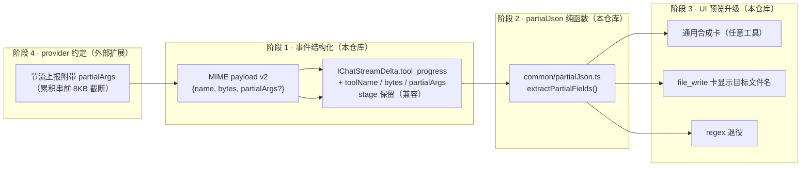

# 工具参数流式生成 — 结构化预览优化方案

> 2026-09-05 设计。对齐 Claude Code / assistant-ui / Vercel AI SDK 的「参数内容预览」能力，
> 保留 VsSaros 已有的看门狗续命优势（业界少有），不引入「中途可解析即执行」风险（Vercel issue #12052）。

## 1. 背景与现状链路

```
provider 扩展（外部）
  │ tool_calls arguments 流式期间，1s 节流上报 DataPart
  │ MIME = application/vnd.saros.tool-call-progress+json
  │ payload = { name, bytes }          ← 只有摘要，无参数内容
  ▼
languageModelsBridge.ts:843
  │ JSON.parse → 拼文案 `正在生成工具调用参数{name}… 已 N KB`
  │ yield { type:'tool_progress', content: 文案 }
  ▼
adaptModelDelta（agentModelAccess.ts）→ IChatStreamDelta(tool_progress).stage
  ▼
nativeChatEditorPane.ts:3289
  │ activityText = stage
  │ regex /正在生成工具调用参数\s+(\S+)/ 反抠工具名   ← 脆弱耦合
  │ file_write 专用合成占位卡（_tp_fw_*）
  ▼
agentChatPanel.messages.ts _ensurePhaseIndicator → 阶段指示器渲染 activityText
```

## 2. 问题清单

| # | 问题 | 影响 |
|---|------|------|
| P1 | payload 无参数内容，UI 只有 KB 计数（黑盒） | 大参数（file_write 万级 tokens，数分钟）期间用户看不到目标文件名/参数走向，感知差 |
| P2 | UI regex 从中文文案反抠工具名 | 文案改动即断；非中文环境不健壮；多工具并行无法区分 |
| P3 | 合成卡仅 file_write 硬编码 | 其他大参数工具（patch、delegate_task 等）无占位卡 |
| P4 | progress 文案在 bridge 拼好、在 UI 又解析 | 两端职责混杂，结构化信息在管道中丢失 |

**保持不变（不变式）**：
- 完成判定唯一来源 = `tool_start`（禁止用 partial JSON 可解析性做任何执行/完成判定）。
- 看门狗续命（`yieldedContent = true` 语义）、P4 重试、超时逻辑零改动。
- `activityText` 不参与持久化的现状不变。

## 3. 设计总览（三阶段）



阶段 1/2/3 全在本仓库，可独立合入——provider 未升级 v2 前行为与现状完全一致（字段缺省即降级）。

## 4. 详细设计

### 4.1 阶段 1：progress 事件结构化

**MIME payload v2**（与 provider 扩展的约定，向后兼容）：

```jsonc
// v1（现状，必须继续支持）
{ "name": "file_write", "bytes": 12288 }
// v2
{ "name": "file_write", "bytes": 12288, "partialArgs": "{\"path\":\"src/vs/…\",\"content\":\"…" }
```

`partialArgs` = arguments 累积串的**前 8KB**截断（顶层关键标量字段——如 path、command——都在 JSON 头部；大 content 在尾部，由 bytes 表达即可）。

**`src/vs/sessions/common/agentStudioService.ts`** — `IChatStreamDelta` 的 tool_progress 变体增加可选字段：

```ts
export interface IToolProgressDelta {
	readonly type: 'tool_progress';
	/** v1 兼容：已拼好的展示文案。v2 消费方应优先用结构化字段。 */
	readonly stage?: string;
	readonly toolName?: string;
	readonly bytes?: number;
	/** arguments 累积串前缀（≤8KB），v2 provider 才有 */
	readonly partialArgs?: string;
}
```

**`languageModelsBridge.ts`**（843-854）：解析 payload 后结构化透传，文案仍拼（旧消费者不变）：

```ts
yield {
	type: 'tool_progress',
	content: _tpStage,
	...(typeof _tp?.name === 'string' && _tp.name ? { toolName: _tp.name } : {}),
	...(Number.isFinite(_tp?.bytes) ? { bytes: Number(_tp.bytes) } : {}),
	...(typeof _tp?.partialArgs === 'string' && _tp.partialArgs ? { partialArgs: _tp.partialArgs } : {}),
};
```

`adaptModelDelta` 增加三个字段的透传（现有测试 `tool_progress → tool_progress（stage 透传）` 继续通过）。

### 4.2 阶段 2：`common/partialJson.ts` — partial JSON 字段提取器

**选型：自研轻量扫描器（~150 行），不引第三方库。**
理由：VS Code 代码库不引运行时 npm 依赖的惯例；`partial-json` 类库的语义是「尽力解析出 JS 值」，我们只需要「补全闭合 → 提取顶层标量字段」，自研更小更可控。

**API**：

```ts
export interface IPartialJsonFields {
	/** 顶层标量字段（string/number/boolean），长值截断到 200 字符 */
	fields: Record<string, string>;
	/** 值被截断的字段名集合 */
	truncated: Set<string>;
	/** partialArgs 本身是否为完整合法 JSON（仅参考，不得用作完成判定） */
	complete: boolean;
}
export function extractPartialFields(partial: string): IPartialJsonFields;
```

**算法（单趟状态机 + 补全闭合）**：

1. 状态机扫描：`normal` / `in_string` / `in_escape` / 深度计数（`{[` 入、`}]` 出），记录当前顶层 key。
2. 仅当深度 = 1（顶层）且值类型为标量时记录字段值；嵌套 object/array 值跳过（预览不需要）。
3. 扫描结束后按栈序补全闭合：未闭合字符串补 `"`，未闭合的 `{[` 按开栈逆序补 `}` `]`。
4. 补全后 `JSON.parse` 一次拿字段（解析失败静默返回空 fields——预览容错，绝不抛错）。
5. Unicode 代理对在截断处裂开时回退一个 code unit 再闭合。

**性能**：O(n) 全量重扫，n ≤ 8KB + 1s 节流 → 每秒一次 8KB 扫描可忽略；无需增量游标。

**单测**（`partialJson.test.ts`，纯函数全覆盖）：
- 正常完整对象 / 中途截断于字符串内 / 截断于转义符后
- 截断于嵌套对象值中（该字段跳过、后续字段不误报）
- 值含转义引号 `\"` / 截断处代理对裂开 / 空 partialArgs
- 深层嵌套（>2 层）只取顶层

### 4.3 阶段 3：UI 预览升级（`nativeChatEditorPane.ts` case 'tool_progress'）

1. **regex 退役**：`delta.toolName` 直接可用；无 toolName 时回退现状文案（老 provider）。
2. **通用合成卡**：`toolName` 已知且无同名 running 真实卡 → 建合成卡（`_tp_synth_${Date.now()}`），
   不再 file_write 硬编码。合成卡统一挂 `renderType: 'generic_pending'` 占位样式。
3. **file_write 增强预览**：`extractPartialFields(partialArgs).fields.path` 存在时，
   卡 `displayName` 从「写入文件」升级为「写入文件 <path 短名>」；content 字段不预览（bytes 已表达）。
4. **指示器文案结构化渲染**：`正在生成参数 <tool>… 已 N KB`，由结构化字段拼装；`stage` 仅作兜底。
5. **tool_start 衔接验证点**：真实 `tool_start` 到达后合成卡移除逻辑需覆盖「通用工具」路径
   （现实现只处理 file_write 的 `_tpFileWriteId`）——统一为：任何 `_tp_synth_*` id 的卡在真实同名 running 卡出现时删除。

### 4.4 阶段 4：provider 扩展约定（外部，非本仓库）

- arguments 增量累积处（已有 bytes 统计）附带 `partialArgs: accumulated.slice(0, 8 * 1024)`。
- 节流 1s 不变；payload 加字段对 v1 桥完全兼容。

## 5. 风险与对策

| 风险 | 对策 |
|------|------|
| 误用 partialArgs 可解析性作为完成/执行信号（Vercel #12052） | `complete` 字段仅注释「仅供参考」；代码评审红线：执行路径只认 `tool_start` |
| partialArgs 泄漏敏感内容到持久化 | activityText/partialArgs 均不进 chat history（现状已不持久化 activityText，补断言） |
| 老 provider 无新字段 | 所有新字段 optional，缺省即现状行为 |
| 合成卡与真实卡竞态（tool_start 与 progress 交错） | 现有 `hasRealFwCard` 判定推广为按 name 查 running 真实卡；synth id 前缀统一 `_tp_synth_` |

## 6. 实施清单与验证

| 步骤 | 文件 | 验证 |
|------|------|------|
| 1. delta 类型 + bridge/adaptModelDelta 透传 | `common/agentStudioService.ts`、`browser/languageModelsBridge.ts`、`browser/agentModelAccess.ts` | 既有 tool_progress 测试不回归 |
| 2. partialJson + 单测 | `common/partialJson.ts`、`test/common/partialJson.test.ts` | 单测全绿 |
| 3. UI 升级 | `nativeChatEditorPane.ts`（case tool_progress / tool_start）、`agentChatPanel.messages.ts`（指示器） | `npm run compile-check-ts-native` + `npm run transpile-client` |
| 4. provider v2 | 外部扩展 | 抓包确认 partialArgs；file_write 大文件场景手动验证：参数生成 1s 内即显示目标文件名 |

> 构建链提示：本方案改动全在 `src/vs` workbench renderer 侧，走 tsgo 检查 + `transpile-client`；
> **不涉及** AgentStudio webview esbuild bundle（`webview/`），无需 `cd webview && npm run build`。
