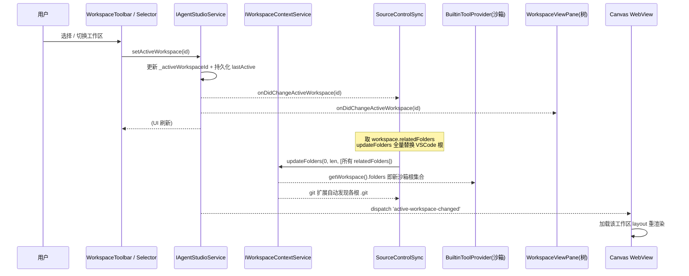

# 工作区多代码仓库管理 — 重构设计方案

> 目标：将"工作区"从**单文件夹容器**重构为**「工作区主目录 + N 个关联代码仓库」**的多根容器，并打通沙箱、SCM、ActivityBar UI 与画布切换四条链路。
>
> 适用代码库：`sarosis-agents-client`（VS Code fork，sessions 层 Agent Studio）

---

## 0. 现状诊断（基于真实代码）

当前"工作区"是 Agent Studio 自定义概念（**非** VS Code 原生 multi-root workspace），核心数据模型为单根：

```ts
// src/vs/sessions/common/agentStudioTypes.ts:581
export interface Workspace {
	readonly id: string;
	name: string;
	description?: string;
	path?: string;            // ⚠️ 单一根路径，这是所有问题的根因
	employees: string[];
	connections: Connection[];
	layout?: WorkspaceLayout;
	createdAt: string;
	updatedAt: string;
	rootInfo?: WorkspaceRootInfo;
	worktreePath?: string;
	worktreeBranch?: string;
	worktreeStatus?: 'none' | 'pending' | 'ready' | 'failed';
}
```

| 子系统 | 关键文件 / 行号 | 当前行为 | 缺口 |
|--------|----------------|----------|------|
| 数据模型 | `agentStudioTypes.ts:581` | `path?: string` 单根 | 无关联仓库数组 |
| 创建工作区 | `agentStudioWorkspaceToolbar.ts:499 _submitCreate()` | 文件夹**可选**，名称必填 | 不强制空目录、不能加多仓库 |
| 沙箱边界 | `builtinToolProvider.ts:115 _resolveAndCheckWorkspacePath()` | allowedRoots = VSCode folders + `workspace.path` + `employee.worktreePath` | 不包含关联仓库 |
| SCM 同步 | `sourceControl.contribution.ts:257 _syncWorkspaceFolder()` | `updateFolders(0, len, [单个folder])` | 只能挂 1 个 git 仓库 |
| ActivityBar 树 | `workspaceView.ts:242` | 把**所有** workspace 平铺成多根 | 无选择器、不按激活过滤、不联动画布 |
| 服务接口 | `agentStudioService.ts:52-59` | CRUD + `set/getLastActiveWorkspaceId` | 无"激活工作区"语义事件 |

---

## 1. 总体设计

### 1.1 新数据模型

引入 `relatedFolders`（关联代码仓库列表），`path` 升级为「工作区主目录（必须为空目录）」：

```ts
// agentStudioTypes.ts —— 新增类型
export interface RelatedFolder {
	/** 关联文件夹绝对路径 */
	readonly path: string;
	/** 展示名（默认取目录名） */
	name?: string;
	/** 加入时间 */
	addedAt: string;
	/** 是否为 git 仓库（运行时探测填充，不持久化也可） */
	isGitRepo?: boolean;
}

export interface Workspace {
	readonly id: string;
	name: string;
	description?: string;

	/**
	 * 工作区主目录 —— 创建时【必须】指定一个空目录。
	 * 用于存放 .sarosisworkspace 元数据、agent 产物、worktree 等。
	 */
	path: string;                         // ⬅️ 由 path? 改为必填

	/**
	 * 关联的代码仓库列表（多本地仓库管理的核心）。
	 * 每个条目对应 SCM 中的一个 git 根、沙箱中的一个允许根、
	 * ActivityBar 树中的一个文件夹根。
	 */
	relatedFolders: RelatedFolder[];      // ⬅️ 新增

	employees: string[];
	connections: Connection[];
	layout?: WorkspaceLayout;
	createdAt: string;
	updatedAt: string;
	rootInfo?: WorkspaceRootInfo;
	worktreePath?: string;
	worktreeBranch?: string;
	worktreeStatus?: 'none' | 'pending' | 'ready' | 'failed';
}
```

> **兼容旧数据**：迁移时若 `relatedFolders` 缺失，初始化为 `[]`；若旧 `path` 指向真实代码仓库（非空），把它转成首个 `relatedFolder`，并为工作区另建一个空主目录（或保留 path 作主目录但允许 relatedFolders 为空，见 §6 迁移）。

### 1.2 服务接口扩展

```ts
// agentStudioService.ts —— IAgentStudioService 新增
export interface IAgentStudioService {
	// ...existing...

	/** 关联一个代码仓库到工作区 */
	addRelatedFolder(workspaceId: string, folderPath: string): Promise<Workspace>;
	/** 解除关联 */
	removeRelatedFolder(workspaceId: string, folderPath: string): Promise<Workspace>;

	/** 当前激活工作区（运行时状态，区别于持久化的 lastActive） */
	readonly onDidChangeActiveWorkspace: Event<string | undefined>;
	getActiveWorkspaceId(): string | undefined;
	setActiveWorkspace(workspaceId: string): Promise<void>;
}
```

`setActiveWorkspace` 是整个联动的中枢：它一次性驱动 ①沙箱根集合 ②SCM 文件夹同步 ③ActivityBar 树过滤 ④画布切换。

### 1.3 联动数据流（核心时序）



**关键洞察**：沙箱（`builtinToolProvider.ts:120`）和 SCM（`sourceControl.contribution.ts:279`）都已经依赖 `IWorkspaceContextService.getWorkspace().folders`。因此只要 **`setActiveWorkspace` 把激活工作区的 `[主目录, ...relatedFolders]` 全量写入 VSCode workspace folders**，沙箱多根与 SCM 多仓库会**自动生效**，无需各自单独改造发现逻辑。这是本方案最省力的支点。

---

## 2. 需求①：创建工作区强制空目录 + 支持添加关联仓库

### 2.1 创建流程改造（`agentStudioWorkspaceToolbar.ts`）

`_submitCreate()` 当前文件夹可选。改为：

```ts
private async _submitCreate(name: string): Promise<void> {
	const trimmed = name.trim();
	if (!trimmed) { /* 提示名称必填 */ return; }

	// ① 主目录必填
	if (!this._selectedFolderUri) {
		this._showError('请选择工作区主目录（必须为空文件夹）');
		return;
	}

	// ② 校验为空目录
	const isEmpty = await this._checkFolderEmpty(this._selectedFolderUri);
	if (!isEmpty) {
		const confirmed = await this._confirmNonEmpty(); // 弹确认：非空目录可能混入已有文件
		if (!confirmed) { return; }
	}

	const createData: Partial<Workspace> = {
		name: trimmed,
		path: this._selectedFolderUri.fsPath,
		relatedFolders: [],          // 初始无关联仓库
	};
	const ws = await this._agentStudioService!.createWorkspace(createData);
	await this._agentStudioService!.setActiveWorkspace(ws.id);
	// ...
}

private async _checkFolderEmpty(uri: URI): Promise<boolean> {
	try {
		const stat = await this._fileService!.resolve(uri);
		return !stat.children || stat.children.length === 0;
	} catch { return true; /* 不存在视为可创建 */ }
}
```

> 需要给 toolbar 注入 `IFileService`（目前只注入了 `IFileDialogService`）。

### 2.2 "添加文件夹到工作区"入口

两处入口，复用同一服务方法 `addRelatedFolder`：

1. **工作区选择器下拉**：每个工作区项右侧加 `+` 关联仓库按钮；选中工作区下方展开已关联仓库列表，每行带移除按钮。
2. **ActivityBar 树标题栏**：在 WorkspaceView 的 ViewTitle 菜单注册命令 `agentStudio.workspace.addRelatedFolder`（图标 `Codicon.add`）。

```ts
// 服务实现 addRelatedFolder 核心逻辑
async addRelatedFolder(workspaceId: string, folderPath: string): Promise<Workspace> {
	const ws = await this.getWorkspace(workspaceId);
	if (!ws) throw new Error('workspace not found');
	const norm = folderPath.replace(/[\\/]+$/, '');
	if (ws.relatedFolders.some(f => f.path.replace(/[\\/]+$/, '') === norm)) {
		return ws; // 去重
	}
	const updated = await this.updateWorkspace(workspaceId, {
		relatedFolders: [
			...ws.relatedFolders,
			{ path: folderPath, name: basename(folderPath), addedAt: new Date().toISOString() },
		],
	});
	// 若是当前激活工作区，立即重同步 VSCode folders（驱动沙箱+SCM）
	if (this.getActiveWorkspaceId() === workspaceId) {
		this._onDidChangeActiveWorkspace.fire(workspaceId);
	}
	return updated;
}
```

---

## 3. 需求②：SourceControl 显示关联仓库的 git 信息

改造 `_syncWorkspaceFolder()`（`sourceControl.contribution.ts:257`），由单文件夹改为**多根全量同步**：

```ts
private async _syncWorkspaceFolder(workspaceId: string): Promise<void> {
	const workspace = await this.agentStudioService.getWorkspace(workspaceId);
	if (!workspace) { this._hasGitRepoKey.set(false); return; }

	// 构造目标根集合：主目录(可选) + 所有关联仓库 + worktree
	const targets: { uri: URI; name: string }[] = [];

	// 主目录（存放元数据，通常不含 git，但保留为首根以便 agent 产物落地）
	if (workspace.path) {
		targets.push({ uri: URI.file(workspace.path), name: workspace.name });
	}
	// 关联代码仓库 —— SCM 会在每个根下自动发现 .git
	for (const rf of workspace.relatedFolders ?? []) {
		targets.push({
			uri: URI.file(rf.path),
			name: rf.name || this.uriIdentityService.extUri.basenameOrAuthority(URI.file(rf.path)),
		});
	}
	// worktree（如有）
	if (workspace.worktreePath) {
		targets.push({ uri: URI.file(workspace.worktreePath), name: workspace.worktreeBranch || 'worktree' });
	}

	if (targets.length === 0) { this._hasGitRepoKey.set(false); return; }

	// 全量替换 VSCode workspace folders
	const current = this.workspaceContextService.getWorkspace().folders;
	try {
		if (current.length === 0) {
			await this.workspaceEditingService.addFolders(targets, true);
		} else {
			await this.workspaceEditingService.updateFolders(0, current.length, targets, true);
		}
	} catch (err) {
		console.warn('[SourceControlWorkspaceSync] sync failed:', err);
	}

	await this._updateGitContextKey();   // 已支持遍历多 folder 检测 .git，无需改
}
```

> `_updateGitContextKey()`（:306）已经是遍历 `folders` 检测 `.git`，天然支持多仓库。VS Code 内置 git 扩展会为每个 workspace folder 注册独立 SCM provider，Changes / Graph 视图随之显示多仓库分组。

监听切换：把 `_initialSync` 里写死 `workspaces[0]` 改为监听 `onDidChangeActiveWorkspace`：

```ts
this._register(this.agentStudioService.onDidChangeActiveWorkspace(id => {
	this._activeWorkspaceId = id;
	if (id) { this._syncWorkspaceFolder(id); }
	else { this._hasGitRepoKey.set(false); }
}));
```

---

## 4. 需求③：文件沙箱包含主目录 + 关联仓库

改造 `_resolveAndCheckWorkspacePath()`（`builtinToolProvider.ts:115`）的 allowedRoots 收集：

```ts
private async _resolveAndCheckWorkspacePath(agentId: string | undefined, requestedPath: string): Promise<string> {
	const allowedRoots: string[] = [];

	// 1. VS Code 工作区文件夹（已是激活工作区同步后的多根，天然覆盖）
	for (const folder of this.workspaceService.getWorkspace().folders) {
		allowedRoots.push(folder.uri.fsPath.replace(/[\\/]+$/, ''));
	}

	// 2. Sarosis Agent 工作区：主目录 + 关联仓库 + worktree
	if (agentId) {
		try {
			const employee = await this.studioService.getEmployee(agentId);
			if (employee?.workspaceId) {
				const ws = await this.studioService.getWorkspace(employee.workspaceId);
				if (ws?.path) {
					allowedRoots.push(ws.path.replace(/[\\/]+$/, ''));
				}
				// ⬇️ 新增：关联仓库全部纳入沙箱
				for (const rf of ws?.relatedFolders ?? []) {
					allowedRoots.push(rf.path.replace(/[\\/]+$/, ''));
				}
			}
			if (employee?.worktreePath) {
				allowedRoots.push(employee.worktreePath.replace(/[\\/]+$/, ''));
			}
		} catch (err) {
			this.logService.warn(`[BuiltinTools] resolve workspace failed for ${agentId}:`, err);
		}
	}

	const uniqueRoots = [...new Set(allowedRoots)];
	// ...后续路径解析与 isAllowed 判定逻辑不变（已支持多根）...
}
```

> 由于 §3 已将激活工作区的全部根写入 VSCode folders，第 1 步实际上已覆盖关联仓库；第 2 步是 agent 维度的兜底（agent 可能属于非激活工作区，如并发编排场景）。两层叠加确保隔离正确。

---

## 5. 需求④：ActivityBar 工作区 UI 重构

### 5.1 目标布局（对照截图）

```
┌─────────────────────────────┐
│ ⌂ [WORKSPACE2        ▼] [+] │  ← 顶部：工作区选择器 + 创建按钮
├─────────────────────────────┤
│ ▼ WORKSPACE2 (主目录)        │  ← 仅显示【选中】工作区
│   ▸ .sarosisworkspace        │
│   ▸ doc                      │
│ ▼ 关联仓库 repo-A  [git ⎇]   │  ← relatedFolders 分组展示
│   ▸ src                      │
│ ▼ 关联仓库 repo-B  [git ⎇]   │
│   ▸ ...                      │
└─────────────────────────────┘
```

与当前 `workspaceView.ts:242`「平铺所有工作区」的最大区别：**只渲染激活工作区的根集合**（主目录 + relatedFolders），切换工作区时整棵树替换。

### 5.2 顶部选择器组件

复用已有的 `AgentStudioWorkspaceToolbar`（`agentStudioWorkspaceToolbar.ts`，已具备选择器下拉 + 创建表单 + worktree 徽章），把它从「editor group 上方」也实例化一份到 **WorkspaceViewPane 的标题区 / body 顶部**：

- 选择器 label 显示当前激活工作区名
- `[+]` 创建按钮 → 复用 `_showCreateInput()`（已改造为强制空目录）
- 下拉项点击 → 调用 `setActiveWorkspace(id)`（替换原来仅 `_fireWorkspaceChanged` 的 DOM 事件，改走服务统一事件）

### 5.3 树数据源改造

`_loadWorkspaceRoots()`（:219）改为只取激活工作区，构造「主目录根 + 每个关联仓库根」：

```ts
private async _loadActiveWorkspaceRoots(): Promise<void> {
	const activeId = this.agentStudioService.getActiveWorkspaceId();
	if (!activeId) { this._showEmpty(); return; }
	const ws = await this.agentStudioService.getWorkspace(activeId);
	if (!ws) { this._showEmpty(); return; }

	const roots: IWorkspaceExplorerElement[] = [];

	// 主目录根
	if (ws.path && await this._dirExists(ws.path)) {
		roots.push({ resource: URI.file(ws.path), name: ws.name, isDirectory: true, isWorkspaceRoot: true, workspaceId: ws.id });
	}
	// 关联仓库根（带 git 标记，可在 renderer 里加 ⎇ 徽章）
	for (const rf of ws.relatedFolders ?? []) {
		if (await this._dirExists(rf.path)) {
			roots.push({
				resource: URI.file(rf.path),
				name: rf.name || basename(rf.path),
				isDirectory: true,
				isWorkspaceRoot: true,
				workspaceId: ws.id,
				isRelatedRepo: true,         // 新增标记，renderer 用于显示 git 徽章
			});
		}
	}
	// setInput(virtualRoot{children: roots}) ...
}
```

订阅从 `onDidChangeWorkspace` 增补为同时监听 `onDidChangeActiveWorkspace`：

```ts
this._register(this.agentStudioService.onDidChangeActiveWorkspace(() => this._loadActiveWorkspaceRoots()));
this._register(this.agentStudioService.onDidChangeWorkspace(() => this._loadActiveWorkspaceRoots()));
```

### 5.4 画布切换联动

画布切换链路**已存在**（`agentStudioWorkspaceToolbar.ts:545` dispatch `'agent-studio:active-workspace-changed'`，WebView 监听后加载 `workspace.layout`）。重构后统一改为：`setActiveWorkspace()` 内部既 `fire(onDidChangeActiveWorkspace)` 又 dispatch DOM 事件，确保 native 视图（树/SCM）与 WebView（画布）同源切换。

---

## 6. 数据迁移

`.sarosisworkspace/workspace.json` 中旧记录无 `relatedFolders`。在工作区加载服务（`workspaceLifecycle` / 持久化读取处）加一次性迁移：

```ts
function migrateWorkspace(raw: any): Workspace {
	if (!Array.isArray(raw.relatedFolders)) {
		raw.relatedFolders = [];
		// 可选策略：若旧 path 是代码仓库（含 .git），把它转为首个关联仓库，
		// 主目录另指向 .sarosisworkspace 上级或保持原 path。
	}
	if (!raw.path) {
		// 旧的"虚拟工作区"（无 path）：保持 path 为空，UI 显示空态并提示绑定主目录
	}
	return raw as Workspace;
}
```

> 迁移保持**向后兼容、不破坏**：无 path 的虚拟工作区仍可加载，仅提示用户补绑主目录。

---

## 7. 分阶段实施计划

| 阶段 | 内容 | 涉及文件 | 风险 |
|------|------|----------|------|
| **P1 数据层** | 加 `RelatedFolder`、`Workspace.relatedFolders`、迁移函数、`addRelatedFolder/removeRelatedFolder/setActiveWorkspace/onDidChangeActiveWorkspace` 服务接口与实现 | `agentStudioTypes.ts`、`agentStudioService.ts`、服务实现、`agentWorkspace.ts(IWorkspaceConfig)` | 低，纯增量 |
| **P2 沙箱** | `_resolveAndCheckWorkspacePath` 纳入 relatedFolders | `builtinToolProvider.ts` | 低 |
| **P3 SCM** | `_syncWorkspaceFolder` 多根全量同步 + 监听 active 事件 | `sourceControl.contribution.ts` | 中（folder 全量替换需测试 git 扩展刷新） |
| **P4 创建流程** | 强制空目录校验 + 注入 IFileService | `agentStudioWorkspaceToolbar.ts` | 低 |
| **P5 ActivityBar UI** | 顶部选择器 + 仅渲染激活工作区多根 + 关联仓库分组 + ViewTitle 加"添加关联仓库"命令 | `workspaceView.ts`、`workspaceExplorerViewer.ts`、`*.contribution.ts` | 中（树重构） |
| **P6 画布联动** | `setActiveWorkspace` 统一 fire 事件 + dispatch DOM 事件 | 服务实现、WebView 监听 | 低 |
| **P7 迁移&回归** | 旧数据迁移、多仓库 git 显示、沙箱越界拒绝、切换画布回归测试 | — | 中 |

### 建议落地顺序
P1 → P2 → P3 → P4 → P5 → P6 → P7。其中 P1 是地基；P2/P3/P4 互相独立可并行；P5 依赖 P1 的 active 事件；P6 收尾。

---

## 8. 关键代码位置速查

| 用途 | 路径:行 |
|------|---------|
| Workspace 类型 | `src/vs/sessions/common/agentStudioTypes.ts:581` |
| Service 接口 | `src/vs/sessions/common/agentStudioService.ts:37-59` |
| IWorkspaceConfig（注册表） | `src/vs/sessions/contrib/agentStudio/common/agentWorkspace.ts:67` |
| 创建/选择器 UI | `src/vs/sessions/contrib/agentStudio/browser/agentStudioWorkspaceToolbar.ts:499,545` |
| ActivityBar 树 | `src/vs/sessions/contrib/agentStudio/browser/views/workspaceView.ts:219,242` |
| 树 renderer/datasource | `src/vs/sessions/contrib/agentStudio/browser/views/workspaceExplorerViewer.ts` |
| 沙箱路径检查 | `src/vs/sessions/contrib/agentStudio/browser/providers/tool/builtinToolProvider.ts:115` |
| SCM 工作区同步 | `src/vs/sessions/contrib/sourceControl/browser/sourceControl.contribution.ts:257,306` |

---

*生成时间：2026-06-02 · 适用 commit：当前工作树主干（非 .worktree 副本）*
