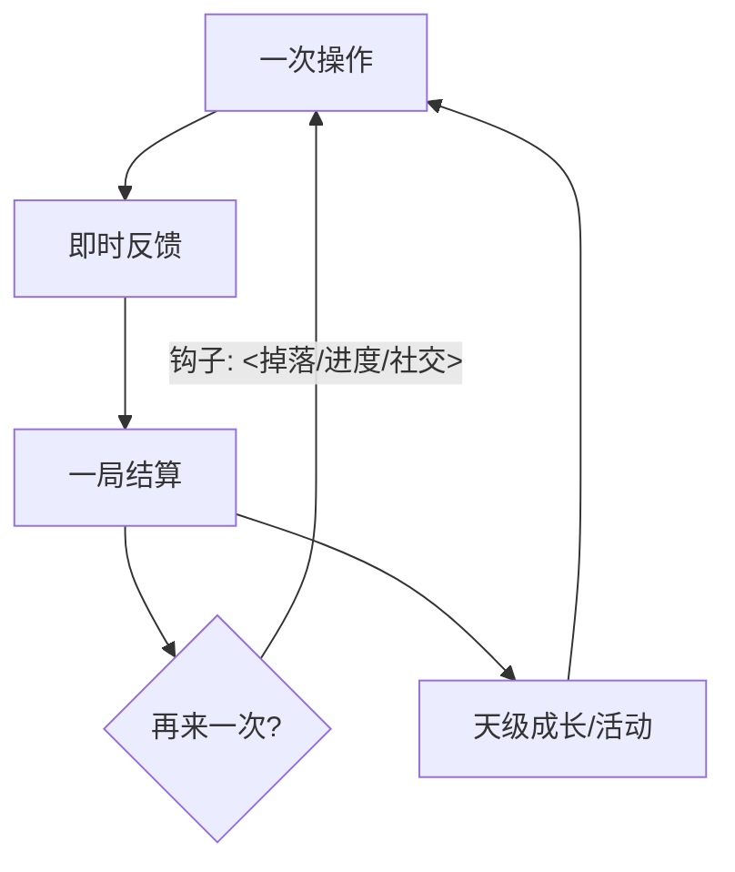
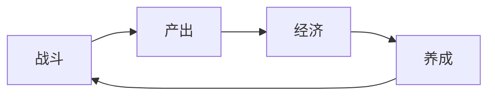

# 游戏拆解报告骨架（按需填充，删掉用不上的小节）

> 用法：把 `<…>` 换成真实内容；**没有证据的小节不要删掉标题**，改写为
> 「素材不足 —— 需要 <具体素材> 才能补」。证据标记见文末说明。
>
> ⚠ 这份骨架填完是**素材文件**（落 `库/raw/`）：**不要加 frontmatter**（`type/title/sources/status`
> 由构建管线在生成笔记时写入），首行标题 + 一行 `> 来源…` 元信息即可。
> 帧图引用用相对路径 `assets/<游戏名>/frame-01.png`。

```markdown
# <游戏名> 拆解报告

> 来源：<视频链接 / "游戏名 + 检索"> · 拆解时间：<YYYY-MM-DD> · 素材：<字幕(字数) / 帧 N 张 / 封面 / 用户口述>

## 结论速览（≤5 行）
- 它是什么：<品类 + 一句话核心体验> [来源]
- 靠什么留住玩家：<L2 的时间钩子> [来源]
- 最值得借鉴的一点：<L7 第 1 条> [来源]
- 最大的不确定性：<待验证项里最关键的一条>

## L1 定位与市场

| 维度 | 结论 | 依据 |
|---|---|---|
| 品类 / 子品类 | | [字幕/简介/搜索:<来源>] |
| 题材与世界 | | |
| 玩法标签（3–6） | | |
| 目标用户 | | |
| 平台 / 发行 / 商业模式 | | |

## L2 核心循环



| 循环 | 闭环 | 钩子 | 退出点（玩家可能流失的地方） |
|---|---|---|---|
| 分钟级 | | | |
| 小时级 | | | |
| 天/周级 | | | |

## L3 系统拆解

| 系统 | 输入 | 处理 | 输出 | 耦合系统 |
|---|---|---|---|---|
| 战斗 | | | | |
| 养成 | | | | |
| 经济 | | | | |
| 关卡 | | | | |
| 社交 | | | | |



## L4 数值与经济

| 资源 | 类型（软/硬/体力/时间） | 产出方式 | 消耗去处 | 是否卡点 |
|---|---|---|---|---|

- 主要卡点：<时间墙 / 付费墙 / 运气墙> [来源]
- 成长曲线形状：<线性 / 阶跃 / 指数> `[待验证]`

## L5 内容与节奏

- 首 10 分钟（FTUE）：<做了什么、按什么顺序投信息> [来源]
- 内容产出管道：<关卡/赛季/活动频率> [来源]
- 难度与心流：<哪一段最陡，可能在哪流失> [来源]

## L6 表现与体验

- 美术风格：<抽帧后可说的> [帧 00:45]
- UI 信息层级：<主界面第一屏放了什么> [帧 01:20]
- 关键反馈：素材不足 —— 需要 <特定时段的抽帧或录屏> 才能补

（帧图引用示例：``）

## L7 借鉴与风险

1. **借鉴点**：<具体做法> ｜ 前提：<什么条件下成立> ｜ 风险：<翻车点>
2. …

## 证据与缺口

| 待验证项 | 现状 | 需要什么素材才能验证 |
|---|---|---|
| | [推断/待验证] | <字幕 / 截图 / 官方资料 / 商店页> |

### 本次素材盘点
- 素材来源：<导入链接 / 抽帧 / 游戏名+搜索 / 用户口述>
- 拿到：<字幕(字数) / 简介 / 视频帧(N 张，区间 mm:ss–mm:ss) / 封面 / 正文>
- 没拿到：<字幕（该平台无字幕） / 抽帧失败原因 / 官方数据> —— 以及各自「需要什么才能补」
```

## 证据标记说明

| 标记 | 含义 |
|---|---|
| `[字幕 12:34]` | 视频字幕第 12 分 34 秒处提到（最硬的口播证据） |
| `[帧 00:45]` | 用 `vision_analyze` 看过 `extract_video_frames` 抽出的这一帧（画面结论的唯一合法标记） |
| `[简介]` | 视频/页面简介（作者自述） |
| `[封面]` | 仅封面图可观察到（信息量最小，**不得**据此推断实机 UI） |
| `[搜索:<来源名>]` | 外部资料（注明来源名与年份） |
| `[用户口述]` | 用户自己说的（未经交叉验证） |
| `[推断]` | 你的推测（**必须紧跟一句依据**） |
| `[待验证]` | 目前无法核验，进「证据与缺口」表 |

## 落盘后

素材写完即交接构建（本技能第五步）：请用户到知识库视图点「批量构建库」，
或右键该文件 →「构建为笔记」，由技能 `kb-build` 把素材归纳成 `笔记/` 下的知识体系。
