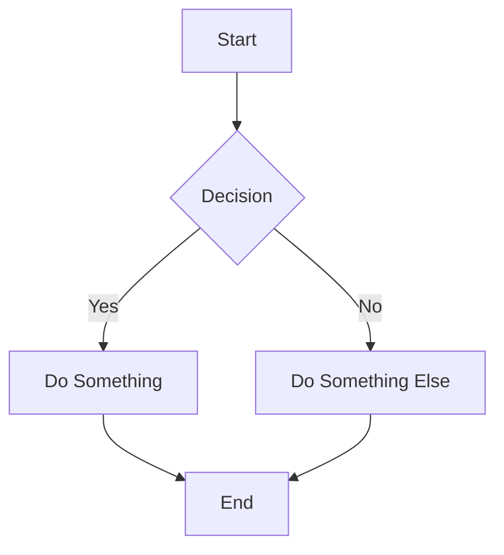
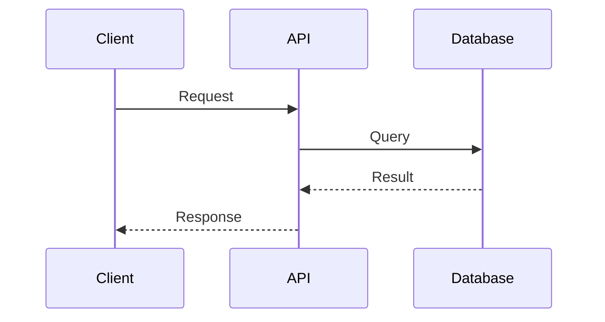
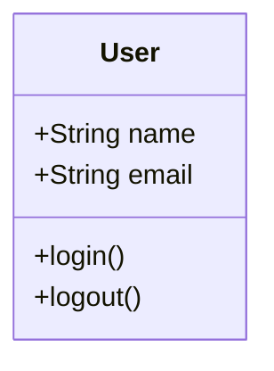

# Mermaid Diagram Skill

Generate diagrams using Mermaid.js syntax. Mermaid is a text-based diagramming language that renders as SVG — no drawing tools needed. Write the diagram in a Markdown code block with `mermaid` language tag.

## Supported Diagram Types

| Type | Use For |
|------|---------|
| `flowchart` | Process flows, decision trees, algorithms |
| `sequenceDiagram` | API interactions, message flows, event sequences |
| `classDiagram` | OOP class hierarchies, UML |
| `erDiagram` | Database schemas, entity relationships |
| `gantt` | Project timelines, roadmaps |
| `mindmap` | Brainstorming, topic hierarchies |
| `stateDiagram` | State machines, lifecycle models |
| `pie` | Data distribution, percentages |
| `graph` | General directed/undirected graphs |

## Quick Examples

### Flowchart


### Sequence Diagram


### Class Diagram


## Workflow

1. Write the Mermaid diagram as a markdown code block with `mermaid` language tag
2. Save as a `.md` or `.html` file
3. To render as an HTML page, wrap the mermaid code in:
```html
<!DOCTYPE html><html><head>
<script src="https://cdn.jsdelivr.net/npm/mermaid@11/dist/mermaid.min.js"></script>
<script>mermaid.initialize({startOnLoad:true, theme:'default'});</script>
</head><body>
<pre class="mermaid">
<!-- paste your mermaid code here -->
</pre>
</body></html>
```
4. Call `html_preview("/absolute/path/to/file.html")` to preview

## Tips

- Use `flowchart TD` for top-down, `LR` for left-right
- Mermaid auto-layouts — you only define nodes and connections
- For complex diagrams, create the HTML wrapper with Mermaid CDN for guaranteed rendering
